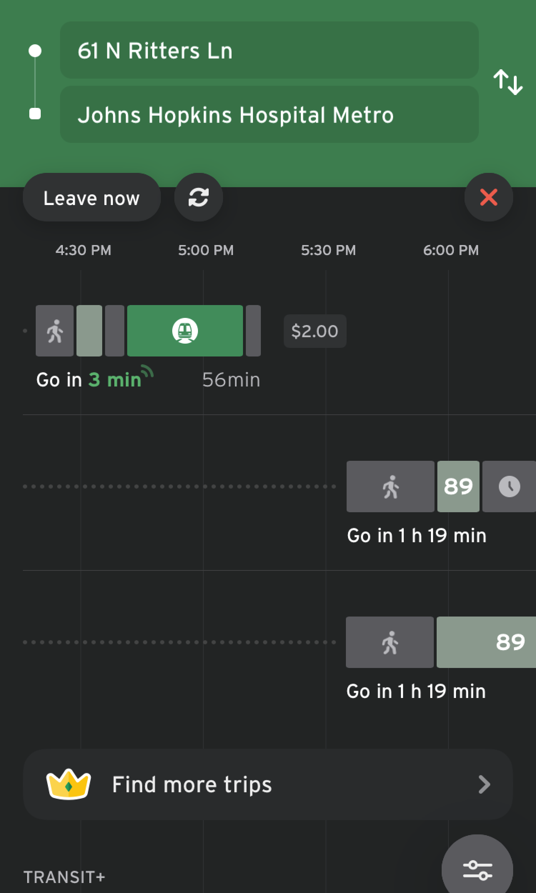

# Fares v2

Fares v2 is a GTFS extension project that aims to address the limitations of Fares v1. This extension project is being adopted in iterations. The below examples outline how to model basic concepts, including fare products and how riders can use their fare for transfers. See more information about [the Fares v2 extension project here](../../../../community/extensions/fares-v2).

In the interim, producers may implement Fares v2 alongside the implementation of Fares v1 in the same dataset as there is no technical conflict between the two. Consumers will have the choice of which implementation to consume independently from the other. 
With adoption and sufficient endorsement of Fares v2, Fares v1 may be deprecated in the future.
In the interim, producers may implement Fares v2 alongside the implementation of Fares v1 in the same dataset as there exists no technical conflict between the two. Consumers will have the choice of which implementation to consume independently from the other. 

The below examples outline how to model data using Fares v2 and it can be completed with experimental features outlined in the full [proposal document](https://share.mobilitydata.org/gtfs-fares-v2). 

## Fares v2 training and free resources

To get started with GTFS Fares-v2, you can watch these four video tutorials and follow along with [this written resource](https://share.mobilitydata.org/Fares-v2-written-resource-guide-for-videos).</a>

- [Video 1](https://share.mobilitydata.org/faresv2-intro): GTFS Fares-v2: An introduction
- [Video 2](https://share.mobilitydata.org/faresv2-setting-up-google-sheets): GTFS Fares v2: Setting up Google Sheets
- [Video 3](https://share.mobilitydata.org/faresv2-creating-and-maintaining-data): GTFS Fares v2: Creating and Maintaining Data
- [Video 4](https://share.mobilitydata.org/faresv2-exporting-and-publishing): Exporting and Publishing GTFS Fares v2

They have been created for transit agencies to understand the purpose of GTFS-Fares v2, as well as how to use Google Sheets to create, edit, and upload GTFS-Fares v2 data. 

This [Fares v2 template](https://share.mobilitydata.org/faresv2-template) can be used for creating the necessary fares files from scratch.

## Fares v2 data modelling examples

### Define a transit fare

There are several ways to pay fares to use the Maryland Transit Administration system. <a href="https://www.mta.maryland.gov/regular-fares" target="_blank">There are four types of regular full price fare options:</a>

- One-way ticket that costs $2.00 USD
- Day pass that costs $4.60 USD
- Weekly pass that costs $22 USD
- A monthly pass that costs $77 USD

Transit tickets or fares are referred to as fare products in GTFS. They can be described using the [fare_products.txt](../../reference/#fare_productstxt) file. Each entry corresponds to a specific fare.

[**fare_products.txt**](../../reference/#fare_productstxt)

| fare_product_id  | fare_product_name  | amount  | currency  |
|------------------------|--------------------|---|---|
| core_local_oneway_fare | One Way Full Fare |  2.00 | USD  |
| core_local_1_day_fare  | 1-Day Pass - Core Service  | 4.60  | USD   |
| core_local_31_day_fare | 31-Day Pass - Core Service  | 77.00  | USD  |
| core_local_7_day_fare  | 7-Day Pass - Core Service |  22.00 | USD  |

[Download the Maryland Transit Administration local bus GTFS feed](https://feeds.mta.maryland.gov/gtfs/local-bus)

### Create rules for single leg journeys

In GTFS, a fare leg corresponds to a trip that a rider makes without transferring between different modes, routes, networks, or agencies. In the Maryland Transit Administration's feed, a single fare allows riders to travel within any pair of stops and subway stations within the `core` network of BaltimoreLink buses, Light RailLink and Metro SubwayLink routes.

Leg groups define trips within a network from an origin to a destination (or a set of origins to a set of destinations if the area IDs correspond to grouped stops). The file below describes rules to travel anywhere within the Maryland Transit Administration’s core network. Each rule corresponds to one of the regular fare products in the [Define a transit fare example](#define-a-transit-fare).

[**fare_leg_rules.txt**](../../reference/#fare_leg_rulestxt)

|  leg_group_id |  network_id | fare_product_id  |
|---|---|---|
| core_local_one_way_trip | core  |  core_local_oneway_fare |
| core_local_one_way_trip | core  |  core_local_1_day_fare |
| core_local_one_way_trip | core  |  core_local_31_day_fare |
| core_local_one_way_trip | core  |  core_local_7_day_fare |

[Download the Maryland Transit Administration local bus GTFS feed](https://feeds.mta.maryland.gov/gtfs/local-bus)

### Create rules for transfers

There is a 90 minute transfer for riders who purchase a one-way fare to ride BaltimoreLink local buses, Metro SubwayLink, or Light RailLink. This means that they can transfer an unlimited number of times between the local buses, subway, and light rail within the 90 minute timeframe.

[**fare_transfer_rules.txt**](../../reference/#fare_transfer_rulestxt)

| from_leg_group_id       | to_leg_group_id  | duration_limit | duration_limit_type | fare_transfer_type | transfer_count |
|-------------------------|---|----------------|-------------------|---------------------|----------------|
| core_local_one_way_trip | core_local_one_way_trip  | 5400           | 1                 | 0                   | -1             |

The file above represents this in GTFS with the following fields:

- A transfer is possible to and from legs that are a one way trip (`core_local_one_way_trip`)
- The `transfer_count` is set to `-1` since there is no limit on the number of transfers permitted
- The `duration_limit` is set to `5400` seconds,  which is equivalent to 90 minutes
- The `duration_limit_type` is set to `1` since the transfer time starts when the rider departs on any route in the `core_local_one_way_trip` fare leg and ends when they depart on a different fare leg. 
- The `fare_transfer_type` is set to `0` since riders only pay for the first fare. There is no transfer fee or a second fare for transferring within the 90 minute window. Hence, the cost can be modeled as the sum of the first fare and the sum of the transfer fees.
- The `transfer_count` is set to `-1` as the rider can transfer an unlimited number of times within the 90 minute `duration_limit` window.

After defining the fare, creating the appropriate `fare_leg_rule`, and defining the `fare_transfer_rule`,  you can see the $2.00 USD `core_local_oneway_fare` appear in trip planners. Here is an example from Transit:

    

[Download the Maryland Transit Administration local bus GTFS feed](https://feeds.mta.maryland.gov/gtfs/local-bus)

### Describe service locations in the same fare zone

Some transit agencies operate a zone-based fare structure. Fare zones are divided geographic areas associated with different fare prices. In Bay Area’s BART system, fares are different depending on the origin and destination <a href="https://www.bart.gov/sites/default/files/docs/BART%20Clipper%20Fares%20Triangle%20Chart%20July%202022.pdf" target="_blank">(BART fare differences)</a>, and transit riders will need to know the right fare. Fare areas can be described using the [stops_areas.txt](../../reference/#stop_areastxt) file, which assigns stops from [stops.txt](../../reference/#stopstxt) to [areas.txt](../../reference/#areastxt).

First, identify the area in [areas.txt](../../reference/#areastxt) . It is acceptable to leave `area_name` blank if there is no area name. In the table below, there are three `area_id` - `ASHB`, `GLEN`, and `OAKL`.

[**areas.txt**](../../reference/#areastxt) 

| area_id | area_name |
|---------|-----------|
| ASHB    |           |
| GLEN    |           | 
| OAKL    |           | 

Afterwards, using `stop_id` from the [stops.txt](../../reference/#stopstxt) file, group stops together to its respective identified area (fare zone). 

Next, group `stop_id` to each `area_id`. In the BART example, each area contains only 1 `stop_id`. For instance, only stop `ASHB` (Ashby Station) is included in the area `ASHB` However, if an area includes multiple stops, multiple `stop_id` should be listed.

[**stops_areas.txt**](../../reference/#stop_areastxt)

| area_id | stop_id |
|---------|---------|
| ASHB    | ASHB    |
| GLEN    | GLEN    | 
| OAKL    | OAKL    | 

In `fare_leg_rules.txt`, different fare products can be identified based on different departure and arrival areas. For example, the first entry shows:

* Departure area is `ASHB` 
* Arrival area is `GLEN`
* The fare product for the departure/arrival area is `BA:matrix:ASHB-GLEN`

[**fare_leg_rules.txt**](../../reference/#fare_leg_rulestxt)

| leg_group_id | from_area_id|to_area_id|fare_product_id|
|--------------|-----------|------------|---------------|
|   BA    |  ASHB   | GLEN | BA:matrix:ASHB-GLEN |
|     BA         |  ASKB   | OAKL | BA:matrix:ASHB-OAKL |

The fare is identified in `fare_products.txt`. 

[**fare_products.txt**](../../reference/#fare_productstxt)

| fare_product_id     | fare_product_name| amount | currency |
|---------------------|-----------|--------|----------|
| BA:matrix:ASHB-GLEN |  generated  | 4.75   | USD      |
| BA:matrix:ASHB-OAKL  |  generated  | 9.45   | USD       |

<a href="https://511.org/open-data/transit" target="_blank">See the San Francisco Bay Area Regional feed</a>

### Describe what fare media is accepted

San Francisco Muni riders can use several different types of fare media to pay for their trip and validate their fare:

- Use a <a href="https://www.clippercard.com/ClipperWeb/" target="_blank">Clipper card</a>, the Bay Area’s transit card
- Use the <a href="https://www.sfmta.com/getting-around/muni/fares/munimobile" target="_blank">Munimobile app</a>
- Pay for the fare in cash

These validation methods are referred to as `fare_media` in GTFS-Fares v2 and can be described using `fare_media.txt`.

Below is an example snippet from the <a href="https://511.org/open-data/transit" target="_blank">San Francisco Bay Area Regional Feed</a> that can be accessed with the 511 SF Bay API.

`Clipper` is described as a physical transit card with `fare_media_type=2`. `SFMTA Munimobile` is described as a mobile app with `fare_media_type=2`. `Cash` has no fare media, since it is given directly to the driver without a ticket. As a result, `Cash` is `fare_media_type=0`.

[**fare_media.txt**](../../reference/#fare_mediatxt)

| fare_media_id | fare_media_name  | fare_media_type |
|---------------|------------------|-----------------|
| clipper       | Clipper          | 2               |
| munimobile    | SFMTA MuniMobile | 4               |
| cash           | Cash             | 0               |

<a href="https://511.org/open-data/transit" target="_blank">See the San Francisco Bay Area Regional feed</a>

Additionally, producers who want to describe a physical ticket as a fare media can use `fare_media_type=1`.

The <a href="https://www.mbta.com" target="_blank">Massachusetts Bay Transportation Authority (MBTA)</a> allows users to pay for trips and passes using a physical paper ticket called CharlieTicket. To reflect this, there is a `charlieticket` fare media in MBTA’s feed with a `fare_media_type=1`.

[**fare_media.txt**](../../reference/#fare_mediatxt)

| fare_media_id | fare_media_name  | fare_media_type |
|---------------|------------------|-----------------|
|cash           |Cash              |0                |
|charlieticket  |CharlieTicket     |1                |
|mticket        |m Ticket app      |4                |

<a href="https://www.mbta.com/developers/gtfs" target="_blank">See the Massachusetts Bay Transportation Authority feed</a>

### Define price differences based on fare media

Muni's fare price is different based on the fare media the rider uses. This example will cover how the adult local fare price changes when using cash or Clipper card. An adult local fare paid for with cash costs $3 USD and the same fare paid for with the Clipper card costs $2.50, 50 cents less.

Each entry below describes a fare media.

[**fare_media.txt**](../../reference/#fare_mediatxt)

| fare_media_id | fare_media_name  | fare_media_type |
|---------------|------------------|-----------------|
| clipper       | Clipper          | 2               |
| cash           | Cash             | 0               |

The `fare_products.txt` file snippet below shows how the amount of the `Muni single local fare` product varies depending on the fare media that the rider uses.

[**fare_products.txt**](../../reference/#fare_productstxt)

| fare_product_id | fare_product_name  | amount | currency | fare_media_id |
|---------------|------------------|-------|--- |---------------|
| SF:local:single | Muni single local fare | 3     | USD | cash |
| SF:local:single | Muni single local fare  | 2.5   |USD | clipper |

In Apple Maps, riders can see how their fare price changes. You can compare fare prices under the "Board the Muni J Church train" instruction:

    
    

<a href="https://511.org/open-data/transit" target="_blank">See the San Francisco Bay Area Regional feed</a>

### Describe a contactless fare media option

<a href="https://vimeo.com/539436401" target="_blank">The Clean Air Express in Northern Santa Barbara County accepts contactless payment</a> by credit card, Google Pay and Apple Pay.

In the Clean Air Express feed, there is a `tap_to_ride` fare media with a  `fare_media_type=3`, since it’s a cEMV (contactless Europay, Mastercard and Visa) option.

| fare_media_id | fare_media_name | fare_media_type |
|---------------|-----------------|-----------------|
| tap_to_ride   | Tap to Ride   | 3  |

The single ride fare product shown below has both `cash` and `tap-to-ride` fare media options. When the single ride is paid for with the `tap-to-ride` fare media, it is one USD dollar cheaper.

[**fare_products.txt**](../../reference/#fare_productstxt)

| fare_product_id | fare_product_name  | fare_media_id | amount | currency |
|---------------|------------------|---------------|--------|----------|
| single-ride | Single Ride | tap_to_ride       | 6      | USD      |
| single-ride | Single Ride |       | 7      | USD      |

<a href="https://gtfs.calitp.org/production/CleanAirExpressFaresv2.zip" target="_blank">Download the Clean Air Express feed</a>

### Define price differences based on time and day of trip

Certain transit agencies vary their fares based on the time and/or day of the week. This means that fares are associated with a time period where the trip is made, such as peak, off-peak hours, or weekends. 

Washington DC’s Metrorail fares vary based on multiple factors, including the day and time of the trip. Variable time fares in GTFS can be defined using `timeframes.txt`, in which it is possible to designate specific time periods that then can be associated in `fare_leg_rules.txt` to assign the applicable fare product that corresponds to the time when the trip is made. The following is a fictional example, based on WMATA's fares as of spring 2023. 

First, service days are defined using `calendar.txt`.

[**calendar.txt**](../../reference/#calendartxt)

| service_id       | monday | tuesday | wednesday | thursday | friday | saturday | sunday | start_date | end_date |
|------------------|--------|---------|-----------|----------|--------|----------|--------|------------|----------|
| weekday_service  | 1      | 1       | 1         | 1        | 1      | 0        | 0      | 20220708   | 20221231 |
| saturday_service | 0      | 0       | 0         | 0        | 0      | 1        | 0      | 20220708   | 20221231 |
| sunday_service   | 0      | 0       | 0         | 0        | 0      | 0        | 1      | 20220708   | 20221231 |

Afterwards, the desired timeframes are defined in `timeframes.txt`, providing an id, the applicable days via a reference to `calendar.service_id`, and if applicable, the start time and end time for each time period.

[**timeframes.txt**](../../reference/#timeframestxt)

| timeframe_group_id | start_time | end_time | service_id       |
|--------------------|------------|----------|------------------|
| weekday_peak       | 5:00:00    | 9:30:00  | weekday_service  |
| weekday_offpeak    | 9:30:00    | 15:00:00 | weekday_service  |
| weekday_peak       | 15:00:00   | 19:00:00 | weekday_service  |
| weekday_offpeak    | 19:00:00   | 21:30:00 | weekday_service  |
| weekday_late_night | 21:30:00   | 24:00:00 | weekday_service  |
| weekday_late_night | 00:00:00   | 5:00:00  | weekday_service  |
| weekend            |            |          | saturday_service |
| weekend            |            |          | sunday_service   |

Next, the corresponding time specific fares in `fare_products.txt` are created (e.g. Peak fare)

[**fare_products.txt**](../../reference/#fare_productstxt)

| fare_product_id | fare_product_name                             | amount | currency |
|-----------------|-----------------------------------------------|--------|----------|
| peak_fare       | Peak fare                                     | 5      | USD      |
| regular_fare    | Off-peak fare                                 | 3      | USD      |
| weekend_fare    | Weekend Metrorail one-way fare                | 2      | USD      |
| late_night_fare | Late Night flat fare (Mon - Fri after 9:30pm) | 2      | USD      |

Lastly, timeframes are associated with fare products in `fare_leg_rules.txt` using the fields `from_timeframe_group_id` and `to_timeframe_group_id`. These fields determine whether a fare applies solely to the start of the leg or both the start and end of the leg.
For this example, based on WMATA fares, the fare depends only on the leg's departure timeframe, so `to_timeframe_group_id` is left blank. 

[**fare_leg_rules.txt**](../../reference/#fare_leg_rulestxt)

| network_id | fare_product_id | from_timeframe_group_id | to_timeframe_group_id |
|------------|-----------------|-------------------------|-----------------------|
| 1          | weekend_fare    | weekend                 |                       |
| 1          | late_night_fare | weekday_late_night      |                       |
| 1          | peak_fare       | weekday_peak            |                       |
| 1          | regular_fare    | weekday_offpeak         |                       |

Note that `network_id` references the foreign ID `networks.network_id` or `routes.network_id`, and that the selection of the correct fare product for each trip will be a combination of arrival and departure times from `stop_times.txt` along with the times defined in `timeframes.txt`. 

In this case, a user paying for a trip that departs at  7:30 AM would have to pay 5.00 USD (Peak fare) while another user departing at 11:30 AM would only have to pay a 3.00 USD fare (Off-peak fare).

### Define time-variable fares along with zone based fares

In New York's MTA Metro-North railroad network, fares vary based on both the time of the day of the trip, as well as the trip’s origin and destination areas. The following example illustrates the fare rules applicable to a trip from Grand Central Station to Cold Spring (NY, USA).

This example is based on a <a href="https://docs.google.com/spreadsheets/d/1-cD-R2OH5xAQAbNWNlrXD7WOw594lVdW-bomuLo6bI8/edit?usp=sharing" target="_blank">dataset</a> produced by <a href="https://www.itoworld.com/" target="_blank">ITO World</a>, featuring a trip that uses ten stops distributed in six different areas.

[**stops.txt**](../../reference/#stopstxt)

| stop_id | stop_name           | stop_lat  | stop_lon   |
|---------|---------------------|-----------|------------|
| ITO1669 | Peekskill           | 41.285103 | -73.930916 |
| ITO1777 | Beacon              | 41.505814 | -73.984474 |
| ITO1789 | New Hamburg         |  41.58691 | -73.947624 |
| ITO1804 | Croton-Harmon       | 41.190002 | -73.882393 |
| ITO1824 | Cortlandt           | 41.246258 | -73.921783 |
| ITO1856 | Garrison            | 41.381126 | -73.947334 |
| ITO1887 | Harlem-125th Street | 40.805256 | -73.939148 |
| ITO1897 | Cold Spring         | 41.415382 | -73.958092 |
| ITO2096 | Poughkeepsie        | 41.707058 |  -73.93792 |
| ITO2383 | Grand Central       | 40.752823 | -73.977196 |

[**stop_areas.txt**](../../reference/#stop_areastxt)

| area_id   | stop_id |
|-----------|---------|
| mnr_1     | ITO1887 |
| mnr_1     | ITO2383 |
| mnr_HUD-5 | ITO1804 |
| mnr_HUD-6 | ITO1669 |
| mnr_HUD-6 | ITO1824 |
| mnr_HUD-7 | ITO1856 |
| mnr_HUD-7 | ITO1897 |
| mnr_HUD-8 | ITO1777 |
| mnr_HUD-8 | ITO1789 |
| mnr_HUD-9 | ITO2096 |

[**route_networks.txt**](../../reference/#route_networkstxt)

| network_id | route_id |
|------------|----------|
| mnr_hudson | 669      |

[**networks.txt**](../../reference/#networkstxt)

| network_id | network_name    |
|------------|-----------------|
| mnr_hudson | MNR Hudson Line |

Service days for train services 3 and 13 are defined using `calendar.txt`. Notably, other records with generic days (i.e. weekdays, weekends, and anyday) that aren't associated with any trips are defined, and these will be associated with timeframes in order to model `time-variable fares`.

[**calendar.txt**](../../reference/#calendartxt)

| service_id | monday | tuesday | wednesday | thursday | friday | saturday | sunday | start_date | end_date |
|------------|--------|---------|-----------|----------|--------|----------|--------|------------|----------|
| 13         | 1      | 1       | 1         | 1        | 1      | 0        | 0      | 20230612   | 20231006 |
| 3          | 1      | 1       | 1         | 1        | 1      | 0        | 0      | 20230609   | 20231006 |
| weekdays   | 1      | 1       | 1         | 1        | 1      | 0        | 0      | 20220101   | 20240101 |
| weekends   | 0      | 0       | 0         | 0        | 0      | 1        | 1      | 20220101   | 20240101 |
| anyday     | 1      | 1       | 1         | 1        | 1      | 1        | 1      | 20220101   | 20240101 |

Records are created in `timeframes.txt`, including cases where the time covers the 24-hour range period (`anytime`, `weekdays` and `weekends`), and peak and off-peak periods:

* AM Peak: from 6 am to 10 am on weekdays
* AM2PM Peak: from 6 AM to 9 AM and from 4 pm to 8 pm on weekdays
* Not AM Peak: weekday time not included in AM Peak
* Not AM2PM Peak: weekday time not included in AM2PM Peak

[**timeframes.txt**](../../reference/#timeframestxt)

| timeframe_group_id | start_time | end_time | service_id |
|:------------------:|:----------:|:--------:|:----------:|
|       anytime      |  00:00:00  | 24:00:00 |   anyday   |
|      weekdays      |  00:00:00  | 24:00:00 |  weekdays  |
|      weekends      |  00:00:00  | 24:00:00 |  weekends  |
|     mnr_ampeak     |  06:00:00  | 10:00:00 |  weekdays  |
|    mnr_notampeak   |  00:00:00  | 06:00:00 |  weekdays  |
|    mnr_notampeak   |  10:00:00  | 24:00:00 |  weekdays  |
|    mnr_am2pmpeak   |  06:00:00  | 09:00:00 |  weekdays  |
|    mnr_am2pmpeak   |  16:00:00  | 20:00:00 |  weekdays  |
|  mnr_notam2pmpeak  |  00:00:00  | 06:00:00 |  weekdays  |
| mnr_notam2pmpeak   | 09:00:00   | 16:00:00 | weekdays   |
| mnr_notam2pmpeak   | 20:00:00   | 24:00:00 | weekdays   |

Each individual fare product is defined in `fare_products.txt`. Since Cold Spring is located in zone 7, this example only lists trips between zone 1 and 7. The full dataset would include a record for each price defined by a time and zone combination. Additionally, the example only displays one fare media (`paper`), but additional combinations could be created if prices would also vary based on the fare media.

[**fare_products.txt**](../../reference/#fare_productstxt)

| fare_product_id        | fare_product_name                  | fare_media_id | amount | currency |
|------------------------|------------------------------------|---------------|--------|----------|
| mnr_1:HUD-7_adult_peak | Outbound Adult Peak Zonal Fare     | paper         | 20.00  | USD      |
| mnr_1:HUD-7_adult      | Outbound Adult Off Peak Zonal Fare | paper         | 15.00  | USD      |
| mnr_HUD-7:1_adult_peak | Inbound Adult Peak Zonal Fare      | paper         | 20.00  | USD      |
| mnr_HUD-7:1_adult      | Inbound Adult Off Peak Zonal Fare  | paper         | 15.00  | USD      |

Lastly, the combinations of origin and destination areas, along with their respective timeframes are associated with the corresponding fare product in `fare_leg_rules.txt`. Here, trips starting or arriving in Zone 1 (i.e. `area_id=mnr_1`) during peak times are subject to a specific peak fare corresponding to the arrival and departure zones of the trip (i.e. `fare_product_id=mnr_1:HUD-7_adult_peak`).

[**fare_leg_rules.txt**](../../reference/#fare_leg_rulestxt)

| network_id | from_area_id | to_area_id | fare_product_id        | from_timeframe_group_id | to_timeframe_group_id |
|------------|--------------|------------|------------------------|-------------------------|-----------------------|
| mnr_hudson | mnr_1        | mnr_HUD-7  | mnr_1:HUD-7_adult      | mnr_notam2pmpeak        | anytime               |
| mnr_hudson | mnr_1        | mnr_HUD-7  | mnr_1:HUD-7_adult      | weekends                | anytime               |
| mnr_hudson | mnr_1        | mnr_HUD-7  | mnr_1:HUD-7_adult_peak | mnr_am2pmpeak           | anytime               |
| mnr_hudson | mnr_HUD-7    | mnr_1      | mnr_HUD-7:1_adult      | weekdays                | mnr_notampeak         |
| mnr_hudson | mnr_HUD-7    | mnr_1      | mnr_HUD-7:1_adult      | weekends                | anytime               |
| mnr_hudson | mnr_HUD-7    | mnr_1      | mnr_HUD-7:1_adult_peak | weekdays                | mnr_ampeak            |

Using this dataset, a user boarding train #869 (`service_id=3`) scheduled to depart from Grand Central (zone `mnr_1`) at 6:45 pm would have to pay an Outbound Adult Peak Zonal Fare of 20.00 USD, since the trip is originated in the `mnr_am2pmpeak` period and from `zone mnr_1`.

Alternatively, a user traveling in train #883 (`service_id=13`) would pay an Outbound Adult Off Peak Zonal Fare of only 15.00 USD, as this train is scheduled to depart Grand Central (zone `mnr_1`) at 9:04 pm.

In <a href="https://apple.com/maps" target="_blank">Apple Maps</a>, riders can see how their fare price changes and compare fare prices next to the train scheduled departure:

    
    

