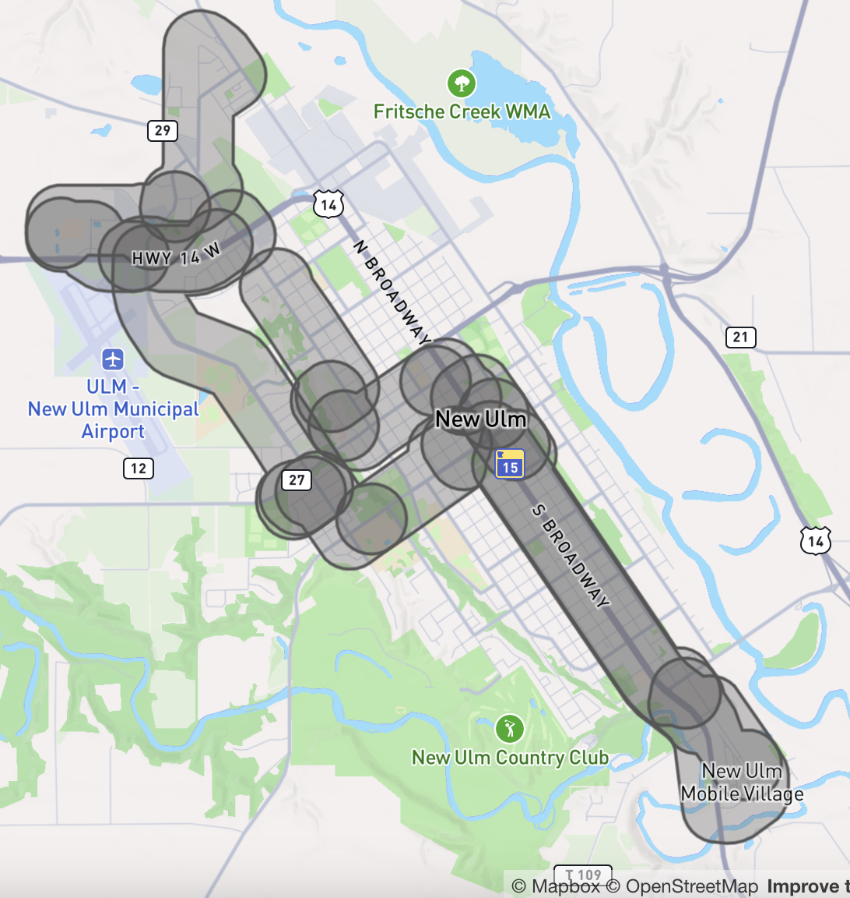

# Demand responsive services

GTFS Flex is a GTFS extension project which was adopted officially into the GTFS specification in March 2024, its aims to facilitate the discoverability of demand-responsive transportation (DRT) Services.
Note that different terms exist for demand-responsive services based on the region of the world. See the [Glossary](#glossary) for more.

The following example demonstrates how to model different demand-responsive service use cases using Flex. **Please note that the following examples are not necessarily an accurate or complete representation of the agencies’ services.**

## On-demand services within a single zone

Demand-responsive services can operate within a specific zone, allowing riders to book pickups at any point A within the zone and drop-offs at any point B within the same zone. An example of this is the [Heartland Express Transit](https://www.co.brown.mn.us/heartland-express-transit?view=category&id=56) service in Minnesota, USA.

<sup>[Download Heartland Express example dataset](../../../assets/on-demand_services_within_a_single_zone.zip)</sup>

### Define trips

Heartland Express service hours are as follow:

- Weekdays:
  - 8:00 AM - 5:00 PM
  - 6:15 AM – 5:45 PM (New Ulm zone only)
- Sunday: 8:00 AM - Noon (New Ulm zone only)

The New Ulm city zone is contained within the Brown County zone. To avoid the ["zone overlap constraint"](#zone-overlap-constraint) issue, Heartland Express can be defined with four trips:

- Service in New Ulm zone from 6:15 AM to 8:00 AM on weekdays.
- County-wide service from 8:00 AM to 5:00 PM on weekdays.
- Service in New Ulm zone from 5:00 PM to 5:45 PM on weekdays.
- Service in New Ulm zone from 8:00 AM to 12:00 PM on Sundays.
  
[**trips.txt**](../../reference/#tripstxt)

route_id | service_id | trip_id
-- | -- | -- 
74362 | c_67295_b_77497_d_31 | t_5374945_b_77497_tn_0
74362 | c_67295_b_77497_d_31 | t_5374946_b_77497_tn_0
74362 | c_67295_b_77497_d_31 | t_5374944_b_77497_tn_0
74362 | c_67295_b_77497_d_64 | t_5374947_b_77497_tn_0

`service_id = c_67295_b_77497_d_31` refers to weekdays, `service_id = c_67295_b_77497_d_64` refers to Sunday.

### Define zone (GeoJSON locations)

Using [locations.geojson](../../reference/#locationsgeojson) to define the operational zone of Heartland Express service, separate zones must be defined for Brown County and New Ulm City. Below is a simplified GeoJSON defining the zone of Brown County:
```json
{
  "type": "FeatureCollection",
  "features": [
    {
      "id": "area_708",
      "type": "Feature",
      "geometry": {
        "type": "Polygon",
        # Simplified, only presenting 3 coordinates here.
        "coordinates": [
          [
            [
              -94.7805702,
              44.4560958
            ],
            [
              -94.7805608,
              44.4559928
            ],
            [
              -94.7805218,
              44.4559649
            ]
          ]
        ]
      },
      "properties": {}
    }
  ]
```

### Define booking rules

Here are booking rules that apply to all Heartland Express services:

- Ride requests should be made between 8 AM and 3 PM weekdays. 
- Rides must be requested one business day prior to day of the ride. 
- Ride requests can be made up to 14 days in advance.

Using `booking_type = 2` indicates that the service requires up to prior day(s) booking. `prior_notice_last_day = 1` and `prior_notice_start_day = 14` indicate that the service can be booked as early as 14 days in advance and as late as the day before.

[**booking_rules.txt**](../../reference/#booking_rulestxt)

booking_rule_id | booking_type | prior_notice_start_day | prior_notice_start_time | prior_notice_last_day | prior_notice_last_time | message | phone_number | info_url
-- | -- | -- | -- | -- | -- | -- | -- | --
booking_route_74362 | 2 | 14 | 8:00:00 | 1 | 15:00:00 | Brown County Heartland Express provides door-to-door on-demand transportation. To request a ride, call 1-507-359-2717 or 1-800-707-2717 by 3pm at least one business day ahead of your trip. | (507) 359-2717 | https://www.co.brown.mn.us/heartland-express-transit

### Define stop times

The operating hours are defined using the `start_pickup_drop_off_window` and `end_pickup_drop_off_window` fields. Travel within the same zone requires two records in stop_times.txt with the same `location_id`.

- The first record with `pickup_type = 2` and `drop_off_type = 1` indicates that booking pickup is allowed in the zone.
- The second record with `pickup_type = 1` and `drop_off_type = 2` indicates that booking drop-off is allowed in the zone.
 
[**stop_times.txt**](../../reference/#stop_timestxt)

trip_id | location_id | stop_sequence | start_pickup_drop_off_window | end_pickup_drop_off_window | pickup_type | drop_off_type | pickup_booking_rule_id | drop_off_booking_rule_id
-- | -- | -- | -- | -- | -- | -- | -- | --
t_5374944_b_77497_tn_0 | area_715 | 1 | 06:15:00 | 08:00:00 | 2 | 1 | booking_route_74362 | booking_route_74362
t_5374944_b_77497_tn_0 | area_715 | 2 | 06:15:00 | 08:00:00 | 1 | 2 | booking_route_74362 | booking_route_74362
t_5374945_b_77497_tn_0 | area_708 | 1 | 08:00:00 | 17:00:00 | 2 | 1 | booking_route_74362 | booking_route_74362
t_5374945_b_77497_tn_0 | area_708 | 2 | 08:00:00 | 17:00:00 | 1 | 2 | booking_route_74362 | booking_route_74362
t_5374946_b_77497_tn_0 | area_715 | 1 | 17:00:00 | 17:45:00 | 2 | 1 | booking_route_74362 | booking_route_74362
t_5374946_b_77497_tn_0 | area_715 | 2 | 17:00:00 | 17:45:00 | 1 | 2 | booking_route_74362 | booking_route_74362
t_5374947_b_77497_tn_0 | area_715 | 1 | 08:00:00 | 12:00:00 | 2 | 1 | booking_route_74362 | booking_route_74362
t_5374947_b_77497_tn_0 | area_715 | 2 | 08:00:00 | 12:45:00 | 1 | 2 | booking_route_74362 | booking_route_74362

`area_715` refers to New Ulm City zone, `area_708` refers to Brown County zone. 

## On-demand services across multiple zones

Some demand-responsive services operate across multiple distinct zones, where riders can book pickups at any location A within one area and drop-offs at any location within another area. For example, [Minnesota River Valley Transit](https://www.saintpetermn.gov/330/Dial-a-Ride) offers on-demand services between Saint Peter and Kasota cities:

<sup>[Download River Valley Transit example dataset](../../../assets/on-demand_services_between_multiple_zones(r).zip)</sup>

### Define trips

Similar to the previous example, because service hours vary on different days, it's necessary to define trips separately for weekdays and Saturdays. 

[**trips.txt**](../../reference/#tripstxt)

route_id | service_id | trip_id 
-- | -- | -- 
74375 | weekdays | t_5298036_b_77503_tn_0 
74375 | saturdays | t_5298041_b_77503_tn_0 

(Define booking rules and zones using [booking_rules.txt](../../reference/#booking_rulestxt) and [locations.geojson](../../reference/#locationsgeojson) in the same way as the previous example)

### Define stop times

The following data indicates that pickup is only allowed in one zone and drop-off is only allowed in another zone. Pickup and drop-off in the same zone are not allowed.

[**stop_times.txt**](../../reference/#stop_timestxt)

trip_id | location_id | stop_sequence | start_pickup_drop_off_window | end_pickup_drop_off_window | pickup_type | drop_off_type | pickup_booking_rule_id | drop_off_booking_rule_id
-- | -- | -- | -- | -- | -- | -- | -- | --
t_5298036_b_77503_tn_0 | area_713 | 1 | 06:30:00 | 20:00:00 | 2 | 1 | booking_route_74375 | booking_route_74375
t_5298036_b_77503_tn_0 | area_714 | 2 | 06:30:00 | 20:00:00 | 1 | 2 | booking_route_74375 | booking_route_74375
t_5298041_b_77503_tn_0 | area_713 | 1 | 09:00:00 | 19:00:00 | 2 | 1 | booking_route_74375 | booking_route_74375
t_5298041_b_77503_tn_0 | area_714 | 2 | 09:00:00 | 19:00:00 | 1 | 2 | booking_route_74375 | booking_route_74375

## On-demand services where riders must be picked up and dropped off at specific locations

In certain demand-responsive services, riders are unable to specify pickup and drop-off at any location within a zone. Instead, riders can only book to be picked up and dropped off at specific designated stops(collection points/ virtual stops). An example of this is the [RufBus service](https://uvg-online.com/rufbus-angermuende/) in Angermünde and Gartz, Germany:

### Define trips

Route 476 offers on-demand services between each stop in the Angermünde region. They operate two services (one for weekdays and the other for weekends), with each one having a single trip_id associated. 

[**trips.txt**](../../reference/#tripstxt)

route_id | service_id | trip_id 
-- | -- | -- 
476 | on_demand_weekdays | 476_weekdays 
476 | on_demand_weekends | 476_weekends 

### Define location groups

As riders can book services between each stop, to avoid defining all stop-to-stop combinations in stop_times.txt, the appropriate approach is to define these stops as a location group using location_groups.txt and location_group_stops.txt.

[**location_groups.txt**](../../reference/#location_groupstxt)

location_group_id | location_group_name 
-- | -- 
476_stops | durch den RufBus 476 bedientes Gebiet im Raum Angermünde

[**location_group_stops.txt**](../../reference/#location_group_stopstxt)

location_group_id | stop_id 
-- | -- 
476_stops | de:12073:900340004::1
476_stops | de:12073:900340004::2
476_stops | de:12073:900340004::3
476_stops | de:12073:900340004::4
476_stops | de:12073:900340100::1
476_stops | de:12073:900340100::2
476_stops | ...

### Define booking rules

The 476 route service requires booking at least one hour in advance. Using `booking_type = 1` indicates that the service requires up to same-day booking with advance notice. The `prior_notice_duration_min = 60` indicates a requirement for booking at least 60 minutes in advance. 

There are slight differences between weekday and weekend bookings, so separate booking rules can be defined for weekday and holiday services. More details can be provided in the `message` field. Information and booking page links can be provided in the `info_url` and `booking_url` fields.

[**booking_rules.txt**](../../reference/#booking_rulestxt)

booking_rule_id | booking_type | prior_notice_duration_min | message | phone_number | info_url | booking_url
-- | -- | -- | -- | -- | -- | --
flächenrufbus_angermünde_weekdays | 1 | 60 | Anmeldung mind. 60min vorher erforderlich, per Anruf zwischen 08:00 und 24:00 möglich, oder online rund um die Uhr | +49 3332 442 755 | https://uvg-online.com/rufbus-angermuende/ | https://uvg.tdimo.net/bapp/#/astBuchungenView
flächenrufbus_angermünde_weekends | 1 | 60 | 1€ Komfortzuschlag pro Person; Anmeldung mind. 60min vorher erforderlich, per Anruf zwischen 08:00 und 24:00 möglich, oder online rund um die Uhr | +49 3332 442 755 | https://uvg-online.com/rufbus-angermuende/ | https://uvg.tdimo.net/bapp/#/astBuchungenView

### Define stop times

The 476 route operates from 5:30 PM to 10:00 PM on weekdays and from 8:00 AM to 10:00 PM on weekends. The operating hours are defined using the `start_pickup_drop_off_window` and `end_pickup_drop_off_window` fields. Travel within the same location group requires two records in stop_times.txt with the same `location_group_id`.

  - The first record with `pickup_type = 2` and `drop_off_type = 1` indicates that booking pickup is allowed at the location group.
  - The second record with `pickup_type = 1` and `drop_off_type = 2` indicates that booking drop-off is allowed at the location group.

[**stop_times.txt**](../../reference/#stop_timestxt)

trip_id | location_group_id | stop_sequence | start_pickup_drop_off_window | end_pickup_drop_off_window | pickup_type | drop_off_type | pickup_booking_rule_id | drop_off_booking_rule_id
-- | -- | -- | -- | -- | -- | -- | -- | --
476_weekdays | 476_stops | 1 | 17:30:00 | 22:00:00 | 2 | 1 | flächenrufbus_angermünde_weekdays | flächenrufbus_angermünde_weekdays
476_weekdays | 476_stops | 2 | 17:30:00 | 22:00:00 | 1 | 2 | flächenrufbus_angermünde_weekdays | flächenrufbus_angermünde_weekdays
476_weekends | 476_stops | 1 | 08:00:00 | 22:00:00 | 2 | 1 | flächenrufbus-angermünde_weekdays | flächenrufbus_angermünde_weekends
476_weekends | 476_stops | 2 | 08:00:00 | 22:00:00 | 1 | 2 | flächenrufbus-angermünde_weekdays | flächenrufbus-angermünde_weekends

## Deviated route

"Route deviation" refers to services where the vehicle follows a fixed route with a set sequence of stops but has the flexibility to deviate from this route to pick up or drop off riders between stops. Typically, deviations are limited to maintain service punctuality, and prior booking is required for deviated pickups and drop-offs. 

In this example, the [Hermann Express](https://www.newulmmn.gov/553/Hermann-Express-City-Bus-Service) service in New Ulm City allows users to be picked up only at fixed stops and to be dropped off at any point within a specific deviation area between these stops.

**The example below has been simplified, download the [Hermann Express example dataset](../../../assets/deviated _drop-off _route.zip) for more details.**

### Define trips

Since this type of service still involves a series of fixed stops and a fixed schedule, defining trips is similar to normal fixed-route bus services. It requires defining the trips served by each route throughout all relevant service periods.

[**trips.txt**](../../reference/#tripstxt)

route_id | service_id | trip_id | share_id
-- | -- | -- | -- 
74513 | c_67295_b_77497_d_31 | t_5374704_b_77497_tn_0 | p_1426044
74513 | c_67295_b_77497_d_31 | t_5374699_b_77497_tn_0 | p_1426044
74513 | c_67295_b_77497_d_31 | t_5374698_b_77497_tn_0 | p_1426044
74513 | c_67295_b_77497_d_31 | t_5374697_b_77497_tn_0 | p_1426044
... | ... | ... | ...

### Define zones (GeoJSON location)

Using [locations.geojson](../../reference/#locationsgeojson) to define zones for deviated route. Typically, deviations are limited to keep the service on schedule. Therefore, as the vehicle travels, the deviation area between each fixed stop may vary accordingly. The area for route deviation may look like the image below:

<div class="flex-photos">
    
</div>

### Define stop times

For fixed stops, define fields such as `arrival_time`, `departure_time`, and `stop_id` in a manner similar to normal bus routes. Between fixed stops, define the zones where deviation is allowed. `pickup_type = 1` and `drop_off_type = 3` indicates that deviated pickup is not allowed (limiting pickup to fixed stops only), and that riders must coordinate with the driver to be dropped off in the deviation zone.

[**stop_times.txt**](../../reference/#stop_timestxt)

trip_id | arrival_time | departure_time | stop_id | location_id | stop_sequence | start_pickup_drop_off_window | end_pickup_drop_off_window | pickup_type | drop_off_type | shape_dist_traveled | pickup_booking_rule_id | drop_off_booking_rule_id
-- | -- | -- | -- | -- | -- | -- | -- | -- | -- | -- | -- | --
t_5374696_b_77497_tn_0 | 08:00:00 | 08:00:00 | 4149546 | | 1 | | | | | 0 | | 
t_5374696_b_77497_tn_0 | | | | radius_300_s_4149546_s_4149547 | 2 | 08:00:00 | 8:02:22 | 1 | 3 | | booking_route_74513 | booking_route_74513
t_5374696_b_77497_tn_0 | 08:02:22 | 08:02:22 | 4149547 | | 3 | | | | | 1221.627114 | | 
t_5374696_b_77497_tn_0 | | | | radius_300_s_4149546_s_4149548 | 4 | 08:02:22 | 8:03:00 | 1 | 3 | | booking_route_74513 | booking_route_74513
t_5374696_b_77497_tn_0 | 08:03:22 | 08:03:22 | 4149548 | | 5 | | | | | 1548.216356 | | 
t_5374696_b_77497_tn_0 | | | | radius_300_s_4149546_s_4149549 | 6 | 08:03:22 | 8:05:00 | 1 | 3 | | booking_route_74513 | booking_route_74513
... | ... | ... | ... | ... | ... | ... | ... | ... | ... | ... | ... | ...
t_5374696_b_77497_tn_0 | 08:50:00 | 08:50:00 | 4210601 | | 35 | | | | | 23429.19558 | | 
t_5374696_b_77497_tn_0 | 08:56:00 | 08:56:00 | 4149564 | | 36 | | | | | 25320.8471 | | 

## Routing behavior

### Ignoring intermediate stop times records with pickup/drop-off Windows

When providing routing or travel time between the origin and destination, data consumers should ignore intermediate stop_times.txt records that have `start_pickup_drop_off_window` and `end_pickup_drop_off_window` defined. For example:

trip_id | location_id | stop_sequence | pickup_type | drop_off_type | start_pickup_drop_off_window | end_pickup_drop_off_window
-- | -- | -- | -- | -- | -- | --
tripA | Zone1 | 1 | 2 | 1 | 08:00:00 | 18:00:00
tripA | Zone2 | 2 | 1 | 2 | 08:00:00 | 14:00:00
tripA | Zone3 | 3 | 1 | 2 | 10:00:00 | 18:00:00

Consumers should not take Zone2 into consideration when providing routing or travel time for a trip from Zone1 to Zone3.

### Zone overlap constraint

Simultaneous overlap of locations.geojson `id` geometry, `start/end_pickup_drop_off_window` time, and `pickup_type` or `drop_off_type` between two or more stop_times.txt records with the same `trip_id` is forbidden.

For example:
(Where `northportland` refers to a zone within `portland`)

**Forbidden**

[**stop_times.txt**](../../reference/#stop_timestxt)

trip_id | location_id | stop_sequence | pickup_type | drop_off_type | start_pickup_drop_off_window | end_pickup_drop_off_window
-- | -- | -- | -- | -- | -- | --
tripA | portland | 1 | 2 | 1 | 08:00:00 | 12:00:00
tripA | northportland | 2 | 2 | 1 | 10:00:00 | 14:00:00
tripA | vancouver | 3 | 1 | 2 | 10:00:00 | 14:00:00

**Allowed**

[**stop_times.txt**](../../reference/#stop_timestxt)

trip_id | location_id | stop_sequence | pickup_type | drop_off_type | start_pickup_drop_off_window | end_pickup_drop_off_window
-- | -- | -- | -- | -- | -- | --
tripA | portland | 1 | 2 | 1 | 08:00:00 | 12:00:00
tripA | northportland | 2 | 2 | 1 | 12:00:00 | 14:00:00
tripA | vancouver | 3 | 1 | 2 | 10:00:00 | 14:00:00

or

[**stop_times.txt**](../../reference/#stop_timestxt)

trip_id | location_id | stop_sequence | pickup_type | drop_off_type | start_pickup_drop_off_window | end_pickup_drop_off_window
-- | -- | -- | -- | -- | -- | --
tripA | portland | 1 | 2 | 1 | 08:00:00 | 12:00:00
tripA | northportland | 2 | 1 | 2 | 10:00:00 | 14:00:00
tripA | vancouver | 3 | 1 | 2 | 10:00:00 | 14:00:00

or

[**stop_times.txt**](../../reference/#stop_timestxt)

trip_id | location_id | stop_sequence | pickup_type | drop_off_type | start_pickup_drop_off_window | end_pickup_drop_off_window
-- | -- | -- | -- | -- | -- | --
tripA | portland | 1 | 2 | 1 | 08:00:00 | 12:00:00
tripA | gresham | 2 | 2 | 1 | 10:00:00 | 14:00:00
tripA | vancouver | 3 | 1 | 2 | 10:00:00 | 14:00:00

## Glossary

📲 Dial-a-ride is a variation of multiple terms used across Europe. 

🇨🇭 In Switzerland, it would fall under the term Rufbus / On-call bus. There's also the availability of the [PubliCar system by PostAuto](https://www.postauto.ch/en/timetable-and-network/publicar). Under this proposal, the PubliCar App and service would be discoverable in the user’s preferred trip planner app. 

🇦🇹 In Austria, dial-a-ride would also be Rufbus and under the bigger umbrella of Bedarfsverkehr (Demand Responsive Transport) and Mikro-ÖV (Microtransit).
    
- [bedarfsverkehr.at](https://www.bedarfsverkehr.at/)
- [Wiener Linien](https://www.wienerlinien.at/documents/843721/4770179/Anleitung_Rufbus_359531.pdf/df430b95-9dd4-0d13-ffdf-bdace15932a8?t=1614165175643)
- Rufbus (english: dial-a-bus, formerly Anruf-Sammel-Taxi or ASTAX call-collect-taxi)
- Current GTFS implementation [as an year-long service alert](https://www.google.com/maps/dir/S%C3%BC%C3%9Fenbrunner+Pl.,+1220+Wien,+Austria/2201+Gerasdorf,+Austria/@48.2867283,16.4429959,13z/am=t/data=!4m15!4m14!1m5!1m1!1s0x476d0393b15bc6d9:0x517f69839511fb31!2m2!1d16.4958186!2d48.2772635!1m5!1m1!1s0x476d0488292e6f61:0xeee80d3d2bb6b1f5!2m2!1d16.4690073!2d48.2962096!3e3!5i1?entry=ttu )

🇩🇰 In Denmark, it can be referred to NT / midttrafik / sydtrafik / FYNBUS / movia (https://flextur.dk/)
    
- flextur (english: flex trip)
- formerly flextrafik (english: flex transit)

🇫🇷 ⚠️ In France the terms TDA (Transport à la Demande) and PMR (Personnes à Mobilité Réduite) for Paratransit services

- [Reseau Mistral](https://www.reseaumistral.com/services/service-appel-bus) 
- Appel bus (english: call bus)

🇩🇪 In Germany they refer to it as On-Demand-Angebot, Flexible Fahrt and AST
   
- [BVG](https://www.bvg.de/de/verbindungen/bvg-muva/flexible-fahrt)
- Brand: Muva
- On-Demand-Angebot (english: on-demand-service)
- Flexible Fahrt (english: flexible trip)
- Other areas
- Anruf-sammel-taxi or AST (english: call-collect-taxi)

🇬🇧 In the United Kingdom, there is the following service:

- [go2 Sevenoaks](https://www.go-coach.co.uk/go2/ )
- On-demand service

The terminology varies across borders but in general we can assume that dial-a-ride is any demand responsive service that requires some form of contact by the rider to the operator. 
<hr>
