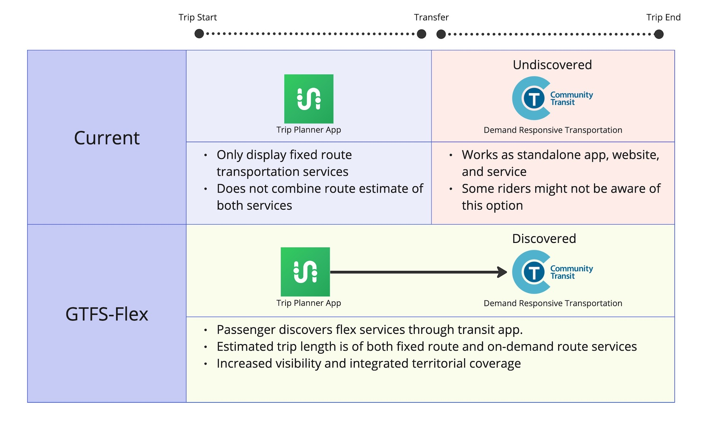

# GTFS-Flex 

GTFS Flex es un proyecto de extensión del GTFS Schedule que tiene como objetivo facilitar la visibilidad de los servicios de transporte sensibles a la demanda. 

En su mayor parte, se adoptó en GTFS en marzo de 2024. Se pueden encontrar algunos ejemplos en [esta página](../../../documentation/schedule/examples/flex) que muestran lo que se puede modelarse utilizando la parte adoptada oficialmente de GTFS Flex. 

🤔 Servicios como dial-a-ride suelen ser ignorados por los usuarios, que a veces ni siquiera tienen idea de su existencia. Esta falta de accesibilidad es un problema para las agencias de transporte, los planificadores de viajes y los pasajeros. Imagine un grupo de turistas que llegan a su aeropuerto local y desean llegar a una zona rural que solo ofrece un servicio de autobús bajo demanda. Los turistas consultan su aplicación de planificación de viajes preferida y no encuentran una opción viable de transporte público. Terminan alquilando un coche. Al ser turistas, extrañan todos los folletos impresos colocados en el pasillo que anuncian el servicio a pedido. Su servicio no sólo está infrautilizado, sino que carece de la capacidad de descubrimiento para satisfacer la demanda actual y futura de los usuarios. Aquí es donde entra en juego GTFS-Flex. GTFS-Flex ayuda a los pasajeros a descubrir su servicio, para que disfruten de los servicios que usted trabajó arduamente para promover. 
 
 
 
🔮 MobilityData espera que GTFS-Flex abra la puerta a una estandarización más profunda del transporte sensible a la demanda, incluida la expansión a componentes transaccionales y en tiempo real utilizando GTFS-OnDemand. Estamos preparando una estrategia sugerida para manejar mejor el creciente número de modos de transporte y la complejidad de conceptos en esta área. 
 
[Ver la propuesta completa](https://github.com/MobilityData/gtfs-flex){ .md-button.md-button--primary } 
 
## Última Pull request 
Esta La extensión describe servicios que operan según un horario, pero que también incluyen una o más funciones flexibles, como: 

- **Servicio Dial-a-ride**: el vehículo sirve a una zona donde se permiten recogidas y devoluciones durante ciertos horarios de servicio. 
- **Servicios de desviación de ruta**: el vehículo sirve una ruta fija y un conjunto ordenado de paradas, pudiendo desviarse para recoger o dejar a un pasajero entre paradas. 
- **Servicio punto-a-zona**: el pasajero puede abordar en una parada fija, como una estación de tren, y luego descender en cualquier lugar dentro de un área, o viceversa. Las salidas desde algunas localidades están programadas o cronometradas con otros servicios. 
- **Punto de desviación o servicio checkpoint**: el pasajero puede abordar en una parada fija y luego descender en cualquier lugar entre una lista desordenada de paradas, o viceversa. El conductor sólo atiende las paradas en las que se le solicita. 

Para obtener más información, consulte [propuesta original](https://github.com/MobilityData/gtfs-flex/blob/master/spec/reference.md) y [issue#382](https://github.com/google/transit/issues/382) (cerrado desde que cambiamos el alcance). 

En la reunión de trabajo del 28 de junio, hubo un acuerdo entre la comunidad del grupo para realizar una iteración que cubra todos los campos actualmente producidos y consumidos. Por lo tanto, todos los campos que aparecen como "**en discusión**" en el [rastreador de adopción](#rastreador-de-adopcion) se incluyen en este PR. 

Los cambios en este PR son: 

- Modificar archivo: 
    - Modificar `stop_areas.txt` para permitir la agrupación de ubicaciones GeoJSON y/o paradas que permiten especificar grupos predeterminados de estas funciones en filas individuales de `stop_times.txt`. 
    - Modificar `stop_times.txt` para aclarar elementos de la especificación actual necesarios para informar a los consumidores de datos sobre cómo interpretar los archivos y campos agregados y extendidos
- Ampliar archivo: 
    - Ampliar `stop_times.txt` con `start_pickup_drop_off_window` y `end_pickup_drop_off_window` para definir el momento en que el servicio de transporte sensible a la demanda está disponible/finaliza en una ubicación GeoJSON, área de parada o parada. 
    - Ampliar `stop_times.txt` con `pickup_booking_rule_id` y `drop_off_booking_rule_id` para definir enlaces a reglas de reserva
- Agregar nuevo archivo: 
    - `locations.geojson`, para definir zonas (`Polygon` o `Multipolygon`) donde los pasajeros pueden solicitar que los recojan o los dejen. 
    - `booking_rules.txt`, para definir las reglas de reserva que brindan a los pasajeros información sobre cómo solicitar el servicio. 

Aquí hay un [ejemplo de datos](https://docs.google.com/spreadsheets/d/1w5EHuHfxvejqApJFHA1Z0K2KytD9zahwbf8zyRlP_Ls/edit#gid=1451132209) para [RufBus](https://uvg-online.com/rufbus-angermuende/) en Angermünde y Gartzer, Alemania. La siguiente imagen es un ejemplo que ilustra cómo se podrían presentar los datos en un planificador de viaje: 

 

Visite la página Pull Request para leer la publicación completa y contribuir a la conversación. 

[Ver la Pull request](https://github.com/google/transit/pull/388){ .md-button .md-button--primary } 

[Únase a #gtfs-flex en Slack](https://share.mobilitydata.org/slack){ .md-button .md-button--primary } 
 
## Implementaciones tempranas

A continuación, se muestran algunos ejemplos de implementaciones iniciales de GTFS-Flex. Para consultar las implementaciones actuales, visite la [Mobility Database](https://mobilitydatabase.org/).

- [Proyecto piloto MNDoT Flex: Trillium, IBI, Transit, MNDoT, Cambridge Systematics y Token Transit](https://blog.transitapp.com/case-study/mndot-gtfs-flex-bringing-rural-riders-into-the-fold/) 
- [Open Trip Planner](https://www.opentripplanner.org/) 
- [Mobility on Demand Sandbox en Vermont](https://www.connectingcommuters.org/) 
- [Tulare County Area Transit](https://gotcrta.org/)
- [Alianza de tránsito del noroeste de Oregón (NW Connector)](https://nwconnector.org/other-services/) 
- [Aplicación Vamos Mobility](https://vamosmobileapp.com/) 
- [RTD Denver Flexride](https://www.rtd-denver.com/services/flexride) 
- [Proyecto OTP DRT de transporte público de Nebraska: Trillium, Olsson, Cambridge Systematics y TransitPlus](https://trips.nebraskatransit.com/#/)
- [Proyecto One-Call/One-Click: Planificador de viajes Find a Ride](https://www.findaride.org/tripplanner) 
 
Contáctenos para agregar su implementación GTFS-Flex a esta página 

<a class="md-button md-button--primary" href=mailto:specification@mobilitydata.org >Contáctenos</a> 
 
## Rastreador de adopción

### Actual 
 
<iframe class="airtable-embed" src="https://airtable.com/embed/appopXWyO2ne6THIw/shrUPyCZWOWrvO2mX?backgroundColor=purple" frameborder="0" onmousewheel="" width="100%" height="533" style="background: transparent; border: 1px solid #ccc;"></iframe>

[Solicitar un cambio](https://airtable.com/shrcac1fXUrMxfoDV){ .md-button .md-button--primary } 
[Agregue su organización (consumidores)](https://airtable.com/shrgnVR5Su9tkHvUv){ .md-button .md-button--primary } 
[Agregue su organización (productores)](https://airtable.com/shrsU4idBtcLuRuwZ){ .md-button .md-button--primary } 
 
## Historia

- **2013**: Propuesta original escrita por Brian Ferris (Google) 
- **2016**: <a href="https://github.com/MobilityData/gtfs-flex/tree/master" target="_blank">Comienzan las discusiones sobre GTFS-Flex GitHub</a> 
- **2017* *: <a href="https://www.oregon.gov/odot/RPTD/RPTD%20Document%20Library/GTFS-Flex-N-CATT.pdf" target="_blank">Programa sandbox Mobility on Demand (MOD) (FTA, Vermont DOT, OTP)</a> 
- **2018**: MobilityData se convierte en administrador de GTFS-Flex y propone GTFS-Flex v2
- **Noviembre de 2020**: Repositorio La versión actualizada de GTFS-Flex y OTP2 incorpora datos de GTFS-Flex v2
- **Mayo de 2022**: inicio del piloto MnDoT (Cambridge Systematics, MNDoT, Token Transit, Transit, Trillium (OptiBus). 
- **Mayo de 2023**: <a href="https://github.com/google/transit/issues/382" target="_blank">Trabajo en GTFS-Flex: Comienza el descubrimiento de servicios</a> 
- **Junio ​​de 2023**: <a href="https://mobilitydata.org/recap-mobilitydata-working-meeting-gtfs-flex-service-discovery/" target="_blank">Reunión de trabajo conceptual celebrada sobre GTFS-Flex</a> 
- **Julio de 2023**: <a href="https://github.com/google/transit/pull/388" target="_blank">Pull request publicada n.º 388</a> 
- **Agosto y septiembre de 2023**: <a href="https://github.com/google/transit/pull/388" target="_blank">Se celebraron debates sobre "¿GeoJSON en GTFS?"</a> 
- **Marzo de 2024**: <a href="https://github.com/google/transit/pull/433" target="_blank">Se adoptó oficialmente GTFS Flex</a> 
