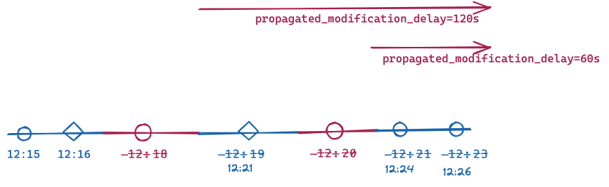

# Referencia GTFS Realtime  
 
 Un feed GTFS Realtime permite a las agencias de transporte brindar a los consumidores información en tiempo real sobre interrupciones en su servicio (estaciones cerradas, líneas no operativas, retrasos importantes, etc.), la ubicación de sus vehículos y los tiempos de llegada esperados. 
 
 La versión 2.0 de la especificación del feed se analiza y documenta en este sitio. Las versiones válidas son "2.0", "1.0". 
 
## Definiciones de términos

### Obligatorio 
 
 En GTFS-realtime v2.0 y superior, la columna *Obligatorio* describe qué campos debe proporcionar un productor para que los datos de tránsito ser válido y tener sentido para una aplicación consumidora. 
 
 Los siguientes valores se utilizan en el campo *Obligatorio*: 
 
 * **Obligatorio**: este campo debe ser proporcionado por un productor de feeds GTFS en tiempo real. 
 * **Requerido condicionalmente**: Este campo es obligatorio bajo ciertas condiciones, que se describen en el campo *Descripción*. Fuera de estas condiciones, el campo es opcional. 
 * **Opcional**: Este campo es opcional y no es necesario que lo implementen los productores. Sin embargo, si los datos están disponibles en los sistemas automáticos de localización de vehículos subyacentes (por ejemplo, VehiclePosition `timestamp`), se recomienda que los productores proporcionen estos campos opcionales cuando sea posible. 
 
 *Tenga en cuenta que los requisitos semánticos no se definieron en GTFS-realtime versión 1.0 y, por lo tanto, los feeds con `gtfs_realtime_version` de `1` pueden no cumplir con estos requisitos (consulte [la propuesta de requisitos semánticos](https://github.com/google/transit/pull/64) para más detalles).* 
 
### Cardinalidad 
 
 *Cardinalidad* representa el número de elementos que se pueden proporcionar para un campo en particular, con los siguientes valores: 
 
 * **Uno**: se puede proporcionar un único elemento para este campo. Esto se asigna a las [cardinalidades del búfer de protocolo *obligatorio* y *opcional*](https://developers.google.com/protocol-buffers/docs/proto#simple). 
 * **Muchos**: se pueden proporcionar muchos elementos (0, 1 o más) para este campo. Esto se asigna a la [cardinalidad *repetida* del búfer de protocolo](https://developers.google.com/protocol-buffers/docs/proto#simple). 
 
 Siempre haga referencia a los campos *Obligatorio* y *Descripción* para ver cuándo un campo es obligatorio, condicionalmente obligatorio u opcional. Consulte [`gtfs-realtime.proto`](https://github.com/google/transit/blob/master/gtfs-realtime/proto/gtfs-realtime.proto) para conocer la cardinalidad del búfer de protocolo. 
 
### Tipos de datos del búfer de protocolo 
 
 Los siguientes tipos de datos del búfer de protocolo se utilizan para describir elementos del feed: 
 
 * **message**: Tipo complejo 
 * **enum**: Lista de valores fijos
 
### Campos experimentales 
 
 Los campos etiquetados como **experimentales** están sujetos a cambios y aún no se han adoptado formalmente en la especificación. Es posible que en el futuro se adopte formalmente un campo **experimental**. 
 
## Índice de elementos 
 
*   [FeedMessage](#message-feedmessage)
    *   [FeedHeader](#message-feedheader)
        *   [Incrementality](#enum-incrementality)
    *   [FeedEntity](#message-feedentity)
        *   [TripUpdate](#message-tripupdate)
            *   [TripDescriptor](#message-tripdescriptor)
                *   [ScheduleRelationship](#enum-schedulerelationship_1)
            *   [VehicleDescriptor](#message-vehicledescriptor)
                *   [WheelchairAccessible](#enum-wheelchairaccessible)
            *   [StopTimeUpdate](#message-stoptimeupdate)
                *   [StopTimeEvent](#message-stoptimeevent)
                *   [ScheduleRelationship](#enum-schedulerelationship)
                *   [StopTimeProperties](#message-stoptimeproperties)
            *   [TripProperties](#message-tripproperties)
        *   [VehiclePosition](#message-vehicleposition)
            *   [TripDescriptor](#message-tripdescriptor)
                *   [ScheduleRelationship](#enum-schedulerelationship_1)
            *   [VehicleDescriptor](#message-vehicledescriptor)
                *   [WheelchairAccessible](#enum-wheelchairaccessible)
            *   [Position](#message-position)
            *   [VehicleStopStatus](#enum-vehiclestopstatus)
            *   [CongestionLevel](#enum-congestionlevel)
            *   [OccupancyStatus](#enum-occupancystatus)
            *   [CarriageDetails](#message-carriagedetails)
        *   [Alert](#message-alert)
            *   [TimeRange](#message-timerange)
            *   [EntitySelector](#message-entityselector)
                *   [TripDescriptor](#message-tripdescriptor)
                    *   [ScheduleRelationship](#enum-schedulerelationship_1)
            *   [Cause](#enum-cause)
            *   [Effect](#enum-effect)
            *   [TranslatedString](#message-translatedstring)
                *   [Translation](#message-translation)
            *   [SeverityLevel](#enum-severitylevel)
        *   [Shape](#message-shape)
        *   [Stop](#message-stop)
            *   [WheelchairBoarding](#enum-wheelchairboarding)
        *   [TripModifications](#message-tripmodifications)
            *   [Modification](#message-modification)
            *   [ReplacementStop](#message-replacementstop)
 
 
## Elementos 

### _message_ FeedMessage 
 
 El contenido de un message de feed. Cada message de la secuencia se obtiene como respuesta a una solicitud HTTP GET adecuada. Un feed en tiempo real siempre se define en relación con un feed GTFS existente. Todos los identificadores de entidad se resuelven con respecto al feed GTFS. 
 
 **Campos** 
 
 | _**Nombre de campo**_ | _**Tipo**_ | _**Obligatorio**_ | _**Cardenalidad**_ | _**Descripción**_ | 
 |------------------|------------|----------------|-------------------|-------------------| 
 | **header** | [FeedHeader](#message-feedheader) | Obligatorio | Uno | Metadatos sobre este feed y message del feed. | 
 | **entity** | [FeedEntity](#message-feedentity) | Requerido condicionalmente | Muchos | Contenido del feed. Si hay información en tiempo real disponible para el sistema de tránsito, se debe proporcionar este campo. Si este campo está vacío, los consumidores deben asumir que no hay información en tiempo real disponible para el sistema. | 
 
### _message_ FeedHeader 
 
 Metadatos sobre un feed, incluidos en los mensajes del feed. 
 
 **Campos** 
 
 | _**Nombre de campo**_ | _**Tipo**_ | _**Obligatorio**_ | _**Cardenalidad**_ | _**Descripción**_ | 
 |------------------|------------|----------------|-------------------|-------------------| 
 | **gtfs_realtime_version** | [string](https://protobuf.dev/programming-guides/proto2/#scalar) | Obligatorio | Uno | Versión de la especificación del feed. La versión actual es 2.0. | 
 | **incrementality** | [Incrementality](#enum-incrementality) | Obligatorio | Uno | 
 | **timestamp** | [uint64](https://protobuf.dev/programming-guides/proto2/#scalar) | Obligatorio | Uno | Esta marca de tiempo identifica el momento en que se creó el contenido de este feed (en hora del servidor). En hora POSIX (es decir, número de segundos desde el 1 de enero de 1970 a las 00:00:00 UTC). Para evitar el desfase temporal entre los sistemas que producen y consumen información en tiempo real, se recomienda encarecidamente derivar la marca de tiempo de un servidor de tiempo. Es completamente aceptable utilizar servidores de estrato 3 o incluso de estratos inferiores, ya que las diferencias horarias de hasta un par de segundos son tolerables. | 
 
### _enum_ Incrementality 
 
 Determina si la recuperación actual es incremental. 
 
 * **FULL_DATASET**: esta actualización del feed sobrescribirá toda la información anterior en tiempo real del feed. Por lo tanto, se espera que esta actualización proporcione una instantánea completa de toda la información conocida en tiempo real. 
 * **DIFFERENTIAL**: actualmente, este modo **no es compatible** y el comportamiento **no está especificado** para los feeds que usan este modo. Hay discusiones en la [lista de correo GTFS Realtime](http://groups.google.com/group/gtfs-realtime) sobre la especificación completa del comportamiento del modo DIFERENCIAL y la documentación se actualizará cuando finalicen esas discusiones. 
 
 **Valores** 
 
 | _**Valor**_ | 
 |-------------| 
 | **FULL_DATASET** | 
 | **DIFFERENTIAL** | 
 
### _message_ FeedEntity 
 
 Una definición (o actualización) de una entidad en el feed de tránsito. Si la entidad no se elimina, se debe completar exactamente uno de los campos ’trip_update’, ’vehicle’, ’alert’ y ’shape’. 
 
 **Campos** 
 
 | _**Nombre de campo**_ | _**Tipo**_ | _**Obligatorio**_ | _**Cardenalidad**_ | _**Descripción**_ | 
 |------------------|------------|----------------|-------------------|-------------------| 
 | **id** | [string](https://protobuf.dev/programming-guides/proto2/#scalar) | Obligatorio | Uno | Identificador único de feed para esta entidad. Los identificadores se utilizan únicamente para proporcionar soporte de incrementalidad. Las entidades reales a las que hace referencia el feed deben especificarse mediante selectores explícitos (consulte EntitySelector a continuación para obtener más información). | 
 | **is_deleted** | [bool](https://protobuf.dev/programming-guides/proto2/#scalar) | Opcional | Uno | Si esta entidad se va a eliminar. Debe proporcionarse solo para feeds con Incrementality de DIFFERENTIAL; este campo NO debe proporcionarse para feeds con Incrementality de FULL_DATASET. | 
 | **trip_update** | [TripUpdate](#message-tripupdate) | Requerido condicionalmente | Uno | Datos sobre los retrasos en las salidas de un viaje en tiempo real. Se debe proporcionar al menos uno de los campos trip_update, vehículo, alerta o forma; todos estos campos no pueden estar vacíos. | 
 | **vehicle** | [VehiclePosition](#message-vehicleposition) | Requerido condicionalmente | Uno | Datos sobre la posición en tiempo real de un vehículo. Se debe proporcionar al menos uno de los campos trip_update, vehículo, alerta o forma; todos estos campos no pueden estar vacíos. | 
 | **alert** | [Alert](#message-alert) | Requerido condicionalmente | Uno | Datos sobre la alerta en tiempo real. Se debe proporcionar al menos uno de los campos trip_update, vehículo, alerta o forma; todos estos campos no pueden estar vacíos. | 
 | **shape** | [Shape](#message-shape) | Requerido condicionalmente | Uno | Datos sobre las formas agregadas en tiempo real, como por ejemplo un desvío. Se debe proporcionar al menos uno de los campos trip_update, vehículo, alerta o forma; todos estos campos no pueden estar vacíos.   **Precaución:**este campo aún es **experimental** y está sujeto a cambios. Es posible que se adopte formalmente en el futuro. | 
 
 
### _message_ TripUpdate 
 
 Actualización en tiempo real del progreso de un vehículo a lo largo de un viaje. Consulte también la discusión general sobre las [entidades de actualizaciones de viajes](../../../documentation/realtime/feed_entities/trip-updates). 
 upd 
 Dependiendo del valor de ScheduleRelationship, TripUpdate puede especificar: 
 
 * Un viaje que se desarrolla según el cronograma. 
 * Un viaje que transcurre a lo largo de una ruta pero no tiene un horario fijo. 
 * Un viaje que ha sido agregado o eliminado con respecto al cronograma. 
 * Un nuevo viaje que es una copia de un viaje existente en GTFS estático. Se ejecutará en la date y hora del servicio especificadas en TripProperties. 
 
 Las actualizaciones pueden ser para eventos futuros de llegada/salida previstos o para eventos pasados ​​que ya ocurrieron. En la mayoría de los casos, la información sobre eventos pasados ​​es un valor medido, por lo que se recomienda que su valor de incertidumbre sea 0\. Aunque podría haber casos en los que esto no se cumpla, se permite tener un valor de incertidumbre diferente de 0 para eventos pasados. Si la incertidumbre de una actualización no es 0, o la actualización es una predicción aproximada para un viaje que no se ha completado o la medición no es precisa o la actualización fue una predicción para el pasado que no se ha verificado después de que ocurrió el evento. 
 
 Si un vehículo realiza múltiples viajes dentro del mismo bloque (para obtener más información sobre viajes y bloques, consulte [GTFS trips.txt](../../schedule/reference/#tripstxt)):

* el feed debe incluir una TripUpdate para el viaje que actualmente realiza el vehículo. Se anima a los productores a incluir TripUpdates para uno o más viajes después del viaje actual en el bloque de este vehículo si el productor confía en la calidad de las predicciones para estos viajes futuros. Incluir múltiples TripUpdates para el mismo vehículo evita la predicción "pop-in" para los pasajeros a medida que el vehículo pasa de un viaje a otro y también les avisa con anticipación sobre los retrasos que afectan los viajes posteriores (por ejemplo, cuando el retraso conocido excede los tiempos de escala planificados entre viajes). 
* No es necesario agregar las respectivas entidades TripUpdate al feed en el mismo orden en que están programadas en el bloque. Por ejemplo, si hay viajes con `trip_ids` 1, 2 y 3 que pertenecen todos a un bloque, y el vehículo recorre el viaje 1, luego el viaje 2 y luego el viaje 3, las entidades `trip_update` pueden aparecer en cualquier orden. - por ejemplo, se permite agregar el viaje 2, luego el viaje 1 y luego el viaje 3. 
 
 Tenga en cuenta que la actualización puede describir un viaje que ya se ha completado. Para ello, basta con proporcionar una actualización para la última parada del viaje. Si la hora de llegada a la última parada está en el pasado, el cliente concluirá que todo el viaje está en el pasado (es posible, aunque intrascendente, proporcionar también actualizaciones para las paradas anteriores). Esta opción es más relevante para un viaje que se completó antes de lo previsto, pero según el cronograma, el viaje aún continúa en el momento actual. Eliminar las actualizaciones de este viaje podría hacer que el cliente asuma que el viaje aún continúa. Tenga en cuenta que el proveedor de feeds puede, pero no es obligatorio, eliminar actualizaciones pasadas; este es un caso en el que esto sería prácticamente útil. 
 
 **Campos** 
 
 | _**Nombre de campo**_ | _**Tipo**_ | _**Obligatorio**_ | _**Cardenalidad**_ | _**Descripción**_ | 
 |------------------|------------|----------------|-------------------|-------------------| 
 | **trip** | [TripDescriptor](#message-tripdescriptor) | Obligatorio | Uno | El viaje al que se aplica este message. Puede haber como máximo una entidad TripUpdate para cada instancia de viaje real. Si no hay ninguno, significa que no hay información de predicción disponible. *No* significa que el viaje avanza según lo previsto. | 
 | **vehicle** | [VehicleDescriptor](#message-vehicledescriptor) | Opcional | Uno | Información adicional sobre el vehículo que realiza este viaje. | 
 | **stop_time_update** | [StopTimeUpdate](#message-stoptimeupdate) | Requerido condicionalmente | Muchos | Actualizaciones de StopTimes del viaje (tanto futuras, es decir, predicciones, como en algunos casos, pasadas, es decir, las que ya sucedieron). Las actualizaciones deben ordenarse por stop_sequence y aplicarse a todas las siguientes paradas del viaje hasta la siguiente stop_time_update especificada. Se debe proporcionar al menos un stop_time_update para el viaje a menos que trip.schedule_relationship esté CANCELADO, ELIMINADO o DUPLICADO. Si el viaje se cancela o elimina, no es necesario proporcionar stop_time_updates. Si se proporcionan stop_time_updates para un viaje cancelado o eliminado, trip.schedule_relationship tiene prioridad sobre cualquier stop_time_updates y su relación de programación asociada. Si el viaje está duplicado, se pueden proporcionar stop_time_updates para indicar información en tiempo real para el nuevo viaje. | 
 | **timestamp** | [uint64](https://protobuf.dev/programming-guides/proto2/#scalar) | Opcional | Uno | El momento más reciente en el que se midió el progreso del vehículo en tiempo real para estimar los tiempos de parada en el futuro. Cuando se proporcionan StopTimes en el pasado, los horarios de llegada/salida pueden ser anteriores a este valor. En hora POSIX (es decir, el número de segundos desde el 1 de enero de 1970 a las 00:00:00 UTC). | 
 | **delay** | [int32](https://protobuf.dev/programming-guides/proto2/#scalar) | Opcional | Uno | La desviación del horario actual para el viaje. El retraso solo debe especificarse cuando la predicción se proporciona en relación con algún cronograma existente en GTFS.  El retraso (en segundos) puede ser positivo (lo que significa que el vehículo llega tarde) o negativo (lo que significa que el vehículo está adelantado). Un retraso de 0 significa que el vehículo llega exactamente a tiempo.  La información de retraso en StopTimeUpdates tiene prioridad sobre la información de retraso a nivel de viaje, de modo que el retraso a nivel de viaje solo se propaga hasta la siguiente parada del viaje con un valor de retraso de StopTimeUpdate especificado.  Se recomienda encarecidamente a los proveedores de feeds que proporcionen un valor TripUpdate.timestamp que indique cuándo se actualizó por última vez el valor de retraso, para evaluar la actualización de los datos.   **Precaución:**este campo aún es **experimental** y está sujeto a cambios. Es posible que se adopte formalmente en el futuro.| 
 | **trip_properties** | [TripProperties](#message-tripproperties) | Opcional | Uno | Proporciona las propiedades actualizadas para el viaje.   **Precaución:**este message aún es **experimental** y está sujeto a cambios. Es posible que se adopte formalmente en el futuro. | 
 
### _message_ StopTimeEvent 
 
 Información de tiempo para un único evento previsto (ya sea llegada o salida). El tiempo consiste en retraso y/o tiempo estimado e incertidumbre. 
 
 * el retraso debe usarse cuando la predicción se da en relación con algún cronograma existente en GTFS. 
 * Se debe dar tiempo independientemente de que exista un horario previsto o no. Si se especifican tanto la hora como el retraso, el tiempo tendrá prioridad (aunque normalmente, si se proporciona el tiempo para un viaje programado, debe ser igual al tiempo programado en GTFS + retraso). 
 
 La incertidumbre se aplica tanto al tiempo como al retraso. La incertidumbre especifica aproximadamente el error esperado en el retraso real (pero tenga en cuenta que aún no definimos su significado estadístico preciso). Es posible que la incertidumbre sea 0, por ejemplo, para trenes que circulan bajo control de sincronización por computadora. 
 
 **Campos** 
 
 | _**Nombre de campo**_ | _**Tipo**_ | _**Obligatorio**_ | _**Cardenalidad**_ | _**Descripción**_ | 
 |------------------|------------|----------------|-------------------|-------------------| 
 | **delay** | [int32](https://protobuf.dev/programming-guides/proto2/#scalar) | Requerido condicionalmente | Uno | El retraso (en segundos) puede ser positivo (lo que significa que el vehículo llega tarde) o negativo (lo que significa que el vehículo está adelantado). Un retraso de 0 significa que el vehículo llega exactamente a tiempo. Se debe proporcionar el retraso o la hora dentro de un StopTimeEvent ; ambos campos no pueden estar vacíos. | 
 | **time** | [int64](https://protobuf.dev/programming-guides/proto2/#scalar) | Requerido condicionalmente | Uno | Evento como tiempo absoluto. En hora POSIX (es decir, número de segundos desde el 1 de enero de 1970 a las 00:00:00 UTC). Se debe proporcionar el retraso o la hora dentro de un StopTimeEvent ; ambos campos no pueden estar vacíos. | 
 | **uncertainty** | [int32](https://protobuf.dev/programming-guides/proto2/#scalar) | Opcional | Uno | Si se omite la incertidumbre, se interpreta como desconocida. Para especificar una predicción completamente segura, establezca su incertidumbre en 0. | 
 
### _message_ StopTimeUpdate 
 
 Actualización en tiempo real de eventos de llegada y/o salida para una parada determinada de un viaje. Consulte también la discusión general sobre las actualizaciones de la hora de parada en la documentación [TripDescriptor](#message-tripdescriptor) y [entidades de actualizaciones de viaje](../../../documentation/realtime/feed_entities/trip-updates). 
 
 Se pueden proporcionar actualizaciones para eventos pasados ​​y futuros. Al productor se le permite, aunque no es obligatorio, descartar eventos pasados. 
 La actualización está vinculada a una parada específica ya sea a través de stop_sequence o stop_id, por lo que necesariamente se debe configurar uno de estos campos. Si se visita el mismo stop_id más de una vez en un viaje, entonces se debe proporcionar stop_sequence en todas las StopTimeUpdates para ese stop_id en ese viaje. 
 
 **Campos** 
 
 | _**Nombre de campo**_ | _**Tipo**_ | _**Obligatorio**_ | _**Cardenalidad**_ | _**Descripción**_ | 
 |------------------|------------|----------------|-------------------|-------------------| 
 | **stop_sequence** | [uint32](https://protobuf.dev/programming-guides/proto2/#scalar) | Requerido condicionalmente | Uno | Debe ser el mismo que en stop_times.txt en el feed GTFS correspondiente. Se debe proporcionar stop_sequence o stop_id dentro de StopTimeUpdate ; ambos campos no pueden estar vacíos.stop_sequence es necesario para viajes que visitan el mismo stop_id más de una vez (por ejemplo, un bucle) para eliminar la ambigüedad de para qué parada es la predicción. Si se completa "`StopTimeProperties.assigned_stop_id`", entonces se debe completar "`stop_sequence`". | 
 | **stop_id** | [string](https://protobuf.dev/programming-guides/proto2/#scalar) | Requerido condicionalmente | Uno | Debe ser el mismo que el del stops.txt del feed GTFS correspondiente. Se debe proporcionar stop_sequence o stop_id dentro de StopTimeUpdate ; ambos campos no pueden estar vacíos. Si se completa `StopTimeProperties.assigned_stop_id`, se prefiere omitir `stop_id` y usar solo `stop_sequence`. Si se completan `StopTimeProperties.assigned_stop_id` y `stop_id`, `stop_id` debe coincidir con `assigned_stop_id`. | 
 | **arrival** | [StopTimeEvent](#message-stoptimeevent) | Requerido condicionalmente | Uno | Si Schedule_relationship está vacío o SCHEDULED, se debe proporcionar la llegada o la salida dentro de StopTimeUpdate ; ambos campos no pueden estar vacíos.la llegada y la salida pueden estar vacías cuando se SALTA la relación_programa. Si la relación_programa es NO_DATA, la llegada y la salida deben estar vacías. | 
 | **departure** | [StopTimeEvent](#message-stoptimeevent) | Requerido condicionalmente | Uno | Si Schedule_relationship está vacío o SCHEDULED, se debe proporcionar la llegada o la salida dentro de StopTimeUpdate ; ambos campos no pueden estar vacíos.la llegada y la salida pueden estar vacías cuando se SALTA la relación_programa. Si la relación_programa es NO_DATA, la llegada y la salida deben estar vacías. | 
 | **departure_occupancy_status** | [OccupancyStatus](#enum-occupancystatus) | Opcional | Uno | El estado previsto de ocupación de pasajeros del vehículo inmediatamente después de la salida de la parada determinada. Si se proporciona, se debe proporcionar stop_sequence. Para proporcionar return_occupancy_status sin proporcionar predicciones de llegada o salida en tiempo real, complete este campo y establezca StopTimeUpdate.schedule_relationship = NO_DATA.   **Precaución:**este campo aún es **experimental** y está sujeto a cambios. Es posible que se adopte formalmente en el futuro. | 
 | **schedule_relationship** | [ScheduleRelationship](#enum-schedulerelationship) | Opcional | Uno | La relación predeterminada es PROGRAMADA. | 
 | **stop_time_properties** | [StopTimeProperties](#message-stoptimeproperties) | Opcional | Uno | Actualizaciones en tiempo real para ciertas propiedades definidas en GTFS stop_times.txt   **Precaución:**este campo aún es **experimental** y está sujeto a cambios. Es posible que se adopte formalmente en el futuro. | 
 
### _enum_ ScheduleRelationship 
 
 La relación entre este StopTime y el horario estático. 
 
 **Valores** 
 
 | _**Valor**_ | _**Comentario**_ | 
 |-------------|---------------| 
 | **SCHEDULED** | El vehículo avanza según su programa estático de paradas, aunque no necesariamente según los horarios del programa. Este es el comportamiento predeterminado. Se debe proporcionar al menos uno de llegada y salida. Los viajes basados ​​en frecuencia (GTFS frequencies.txt con exactitud_times = 0) no deben tener un valor SCHEDULED y en su lugar deben usar UNSCHEDULED. | 
 | **SKIPPED** | La parada se salta, es decir, el vehículo no se detendrá en esta parada. La llegada y salida son opcionales. Cuando se establece "`SKIPPED`" no se propaga a paradas posteriores en el mismo viaje (es decir, el vehículo se detendrá en paradas posteriores del viaje a menos que esas paradas también tengan un `stop_time_update` con `schedule_relationship: SKIPPED`). El retraso de una parada anterior en el viaje *se* propaga sobre la parada "`SKIPPED`". En otras palabras, si una `stop_time_update` con una predicción de `arrival` o `departure` no está configurada para una parada después de la parada `SKIPPED`, la predicción en sentido ascendente de la parada `SKIPPED` se propagará a la parada después de ` Parada `SKIPPED` y paradas posteriores en el viaje hasta que se proporcione una `stop_time_update` para una parada posterior. | 
 | **NO_DATA** | No se facilitan datos de esta parada. Indica que no hay información de cronometraje en tiempo real disponible. Cuando se establece NO_DATA se propaga a través de paradas posteriores, por lo que esta es la forma recomendada de especificar de qué parada no tiene información de tiempo en tiempo real. Cuando se establece NO_DATA, no se debe proporcionar ni la llegada ni la salida. | 
 | **UNSCHEDULED** | El vehículo está realizando un viaje basado en frecuencia (GTFS frequencies.txt con exact_times = 0). Este valor no debe usarse para viajes que no están definidos en GTFS frequencies.txt, o viajes en GTFS frequencies.txt con exact_times = 1. Los Viajes que contienen `stop_time_updates` con `schedule_relationship: UNSCHEDULED` también deben configurar el TripDescriptor `schedule_relationship: UNSCHEDULED`   **Precaución:**este campo aún es **experimental** y está sujeto a cambios. Es posible que se adopte formalmente en el futuro. 
 
### _message_ StopTimeProperties 
 
 Actualización en tiempo real para ciertas propiedades definidas en GTFS stop_times.txt. 
 
 **Precaución:**este message aún es **experimental** y está sujeto a cambios. Es posible que se adopte formalmente en el futuro.  
 
 **Campos** 
 
 | _**Nombre de campo**_ | _**Tipo**_ | _**Obligatorio**_ | _**Cardenalidad**_ | _**Descripción**_ | 
 |------------------|------------|----------------|-------------------|-------------------| 
 | **assigned_stop_id** | [string](https://protobuf.dev/programming-guides/proto2/#scalar) | Opcional | Uno | Admite asignaciones de paradas en tiempo real. Se refiere a un `stop_id` definido en el `stops.txt` de GTFS.  El nuevo `assigned_stop_id` no debería resultar en una experiencia de viaje significativamente diferente para el usuario final que el `stop_id` definido en GTFS `stop_times.txt`. En otras palabras, el usuario final no debe ver este nuevo `stop_id` como un "cambio inusual" si la nueva parada se presentó dentro de una aplicación sin ningún contexto adicional. Por ejemplo, este campo está pensado para ser utilizado para asignaciones de plataformas mediante el uso de un `stop_id` que pertenece a la misma estación que la parada definida originalmente en GTFS `stop_times.txt`.  Para asignar una parada sin proporcionar predicciones de llegada o salida en tiempo real, complete este campo y establezca `StopTimeUpdate.schedule_relationship = NO_DATA`.  Si este campo está completo, se debe completar "`StopTimeUpdate.stop_sequence`" y no se debe completar "`StopTimeUpdate.stop_id`". Las asignaciones de paradas también deben reflejarse en otros campos GTFS en tiempo real (por ejemplo, `VehiclePosition.stop_id`).   **Precaución:**este campo aún es **experimental** y está sujeto a cambios. Es posible que se adopte formalmente en el futuro. | 
 
### _message_ TripProperties 
 
 Define propiedades actualizadas del viaje 
 
 **Precaución:**este message aún es **experimental** y está sujeto a cambios. Es posible que se adopte formalmente en el futuro. . 
 
 **Campos** 
 
 | _**Nombre de campo**_ | _**Tipo**_ | _**Obligatorio**_ | _**Cardenalidad**_ | _**Descripción**_ | 
 |------------------|------------|----------------|-------------------|-------------------| 
 | **trip_id** | [string](https://protobuf.dev/programming-guides/proto2/#scalar) | Requerido condicionalmente | Uno | Define el identificador de un nuevo viaje que es un duplicado de un viaje existente definido en (CSV) GTFS trips.txt pero que comenzará en una date y/u hora de servicio diferente (definida usando `TripProperties.start_date` y `TripProperties.start_time`). Consulte la definición de `trips.trip_id` en (CSV) GTFS. Su valor debe ser diferente a los utilizados en el GTFS (CSV). Este campo es obligatorio si `schedule_relationship` es `DUPLICATED`; de lo contrario, este campo no debe completarse y los consumidores lo ignorarán.   **Precaución:**este campo aún es **experimental** y está sujeto a cambios. Es posible que se adopte formalmente en el futuro. | 
 | **start_date** | [string](https://protobuf.dev/programming-guides/proto2/#scalar) | Requerido condicionalmente | Uno | date de servicio en la que se realizará el viaje duplicado. Debe proporcionarse en formato AAAAMMDD. Este campo es obligatorio si `schedule_relationship` es `DUPLICATED`; de lo contrario, este campo no debe completarse y los consumidores lo ignorarán.   **Precaución:**este campo aún es **experimental** y está sujeto a cambios. Es posible que se adopte formalmente en el futuro. | 
 | **start_time** | [string](https://protobuf.dev/programming-guides/proto2/#scalar) | Requerido condicionalmente | Uno | Define la hora de inicio de salida del viaje cuando está duplicado. Consulte la definición de `stop_times.departure_time` en (CSV) GTFS. Los horarios de llegada y salida programados para el viaje duplicado se calculan en función del desfase entre el viaje original `departure_time` y este campo. Por ejemplo, si un viaje GTFS tiene una parada A con una `departure_time` de `10:00:00` y una parada B con una `departure_time` de `10:01:00`, y este campo se completa con el valor de `10:30:00`, la parada B en el viaje duplicado tendrá una `departure_time` programada de `10:31:00`. Los valores de "`delay`" de predicción en tiempo real se aplican a este tiempo de programación calculado para determinar el tiempo previsto. Por ejemplo, si se proporciona un "`delay`" de salida de "`30`" para la parada B, entonces la hora de salida prevista es "`10:31:30`". A los valores de "`time`" de predicción en tiempo real no se les aplica ningún desplazamiento e indican el tiempo previsto según lo previsto. Por ejemplo, si se proporciona una `time` de salida que representa las 10:31:30 para la parada B, entonces la hora de salida prevista es `10:31:30`. Este campo es obligatorio si `schedule_relationship` es `DUPLICATED`; de lo contrario, este El campo no debe completarse y los consumidores lo ignorarán.   **Precaución:** este campo sigue siendo **experimental** y está sujeto a cambios. Es posible que se adopte formalmente en el futuro. | 
 | **shape_id** | [string](https://protobuf.dev/programming-guides/proto2/#scalar) | Opcional | Uno | Especifica la forma de la ruta de viaje del vehículo para este viaje cuando difiere de la original. Se refiere a una forma definida en GTFS (CSV) o una nueva entidad de forma en un feed en tiempo real. Consulte la definición de `trips.shape_id` en (CSV) GTFS.   **Precaución:**este campo aún es **experimental** y está sujeto a cambios. Es posible que se adopte formalmente en el futuro. | 
 
### _message_ VehiclePosition 
 
 Información de posicionamiento en tiempo real para un vehículo determinado. 
 
 **Campos** 
 
 | _**Nombre de campo**_ | _**Tipo**_ | _**Obligatorio**_ | _**Cardenalidad**_ | _**Descripción**_ | 
 |------------------|------------|----------------|-------------------|-------------------| 
 | **trip** | [TripDescriptor](#message-tripdescriptor) | Opcional | Uno | El viaje que realiza este vehículo. Puede estar vacío o parcial si el vehículo no puede identificarse con una determinada instancia de viaje. | 
 | **vehicle** | [VehicleDescriptor](#message-vehicledescriptor) | Opcional | Uno | Información adicional sobre el vehículo que realiza este viaje. Cada entrada debe tener una identificación de vehículo **única**. | 
 | **position** | [Position](#message-position) | Opcional | Uno | Posición actual de este vehículo. | 
 | **current_stop_sequence** | [uint32](https://protobuf.dev/programming-guides/proto2/#scalar) | Opcional | Uno | El índice de secuencia de parada de la parada actual. El significado de current_stop_sequence (es decir, la parada a la que hace referencia) está determinado por current_status. Si falta current_status, se supone IN_TRANSIT_TO. | 
 | **stop_id** | [string](https://protobuf.dev/programming-guides/proto2/#scalar) | Opcional | Uno | Identifica la parada actual. El valor debe ser el mismo que el del archivo stops.txt del feed GTFS correspondiente. Si se usa `StopTimeProperties.assigned_stop_id` para asignar un `stop_id`, este campo también debe reflejar el cambio en `stop_id`. | 
 | **current_status** | [VehicleStopStatus](#enum-vehiclestopstatus) | Opcional | Uno | El estado exacto del vehículo respecto a la parada actual. Se ignora si falta current_stop_sequence. | 
 | **timestamp** | [uint64](https://protobuf.dev/programming-guides/proto2/#scalar) | Opcional | Uno | Momento en el que se midió la posición del vehículo. En hora POSIX (es decir, número de segundos desde el 1 de enero de 1970 a las 00:00:00 UTC). | 
 | **congestion_level** | [CongestionLevel](#enum-congestionlevel) | Opcional | Uno | 
 | **occupancy_status** | [OccupancyStatus](#enum-occupancystatus) | _Opcional_ | Uno | El estado de ocupación de pasajeros del vehículo o vagón. Si multi_carriage_details se completa con OccupancyStatus por vagón, entonces este campo debe describir el vehículo completo con todos los vagones que aceptan pasajeros considerados.   **Precaución:**este campo aún es **experimental** y está sujeto a cambios. Es posible que se adopte formalmente en el futuro.| 
 | **occupancy_percentage** | [uint32](https://protobuf.dev/programming-guides/proto2/#scalar) | Opcional | Uno | Un valor porcentual que indica el grado de ocupación de pasajeros en el vehículo. El valor 100 debe representar la ocupación máxima total para la que fue diseñado el vehículo, incluida la capacidad de asientos y de pie, y que lo permitan las normas de funcionamiento vigentes. El valor podrá exceder 100 si hay más pasajeros que la capacidad máxima diseñada. La precisión del porcentaje de ocupación debe ser lo suficientemente baja como para que no se pueda rastrear a los pasajeros individuales subiendo o bajando del vehículo. Si multi_carriage_details se completa con porcentaje de ocupación por vagón, entonces este campo debe describir el vehículo completo con todos los vagones que aceptan pasajeros considerados.   **Precaución:**este campo aún es **experimental** y está sujeto a cambios. Es posible que se adopte formalmente en el futuro. | 
 | **multi_carriage_details** | [CarriageDetails](#message-carriagedetails) | Opcional | Muchos | Detalles de los múltiples vagones de este vehículo determinado. La primera aparición representa el primer transporte del vehículo, **dada la dirección de viaje actual**. El número de apariciones del campo multi_carriage_details representa el número de vagones del vehículo. También incluye vagones no abordables, como motores, vagones de mantenimiento, etc… ya que proporcionan información valiosa a los pasajeros sobre dónde situarse en un andén.   **Precaución:**este campo aún es **experimental** y está sujeto a cambios. Es posible que se adopte formalmente en el futuro. | 
 
 
### _enum_ VehicleStopStatus 
 
 **Valores** 
 
 | _**Valor**_ | _**Comentario**_ | 
 |-------------|---------------| 
 | **INCOMING_AT** | El vehículo está a punto de llegar a la parada (en una indicación de parada, el símbolo del vehículo suele parpadear). | 
 | **STOPPED_AT** | El vehículo está parado en la parada. | 
 | **IN_TRANSIT_TO** | El vehículo ha salido de la parada anterior y está en tránsito. | 
 
### _enum_ CongestionLevel 
 
 Nivel de congestión que está afectando a este vehículo. 
 
 **Valores** 
 
 | _**Valor**_ | 
 |-------------| 
 | **UNKNOWN_CONGESTION_LEVEL** | 
 | **RUNNING_SMOOTHLY** | 
 | **STOP_AND_GO** | 
 | **CONGESTION** | 
 | **SEVERE_CONGESTION** | 
 
### _enum OccupancyStatus_ 
 
 El estado de ocupación de pasajeros del vehículo o vagón. 
 
 Los productores individuales no pueden publicar todos los valores de OccupancyStatus. Por lo tanto, los consumidores no deben asumir que los valores de OccupancyStatus siguen una escala lineal. Los consumidores deben representar los valores de OccupancyStatus como el estado indicado y previsto por el productor. Asimismo, los productores deben utilizar valores de OccupancyStatus que correspondan a los estados reales de ocupación del vehículo. 
 
 Para describir los niveles de ocupación de pasajeros en una escala lineal, consulte "`occupancy_percentage`". 
 
 **Precaución:**este campo aún es **experimental** y está sujeto a cambios. Es posible que se adopte formalmente en el futuro. 
 
 ***Valores*** 
 
 | _**Valor**_ | _**Comentario**_ | 
 |-------------|---------------| 
 | _**EMPTY**_ | _El vehículo se considera vacío según la mayoría de las medidas y tiene pocos o ningún pasajero a bordo, pero aún acepta pasajeros._ | 
 | _**MANY_SEATS_AVAILABLE**_ | _El vehículo o carruaje dispone de un gran número de plazas disponibles. La cantidad de asientos libres del total de asientos disponibles para considerarse lo suficientemente grande como para entrar en esta categoría se determina a discreción del productor._ | 
 | _**FEW_SEATS_AVAILABLE**_ | _El vehículo o carruaje tiene un número reducido de plazas disponibles. La cantidad de asientos libres del total de asientos disponibles para que se considere lo suficientemente pequeña como para entrar en esta categoría se determina a discreción del productor._ | 
 | _**STANDING_ROOM_ONLY**_ | _El vehículo o vagón actualmente sólo puede alojar a pasajeros de pie._ | 
 | _**CRUSHED_STANDING_ROOM_ONLY**_ | _El vehículo o vagón actualmente sólo puede alojar a pasajeros de pie y tiene un espacio limitado para ellos._ | 
 | _**FULL**_ | _El vehículo se considera lleno según la mayoría de las medidas, pero es posible que aún permita el embarque de pasajeros._ | 
 | _**NOT_ACCEPTING_PASSENGERS**_ | _El vehículo o carruaje no acepta pasajeros. El vehículo o vagón suele aceptar pasajeros para el embarque._ | 
 | _**NO_DATA_AVAILABLE**_ | _El vehículo o vagón no tiene datos de ocupación disponibles en ese momento._ | 
 | _**NOT_BOARDABLE**_ | _El vehículo o carruaje no es abordable y nunca acepta pasajeros. Útil para vehículos o carros especiales (motor, carro de mantenimiento, etc…)._ | 
 
 
### _message_ CarriageDetails 
 
 Detalles específicos del vagón, utilizados para vehículos compuestos por varios vagones. 
 
 **Precaución:**este message aún es **experimental** y está sujeto a cambios. Es posible que se adopte formalmente en el futuro. 
 
 **Campos** 
 
 | _**Nombre de campo**_ | _**Tipo**_ | _**Obligatorio**_ | _**Cardenalidad**_ | _**Descripción**_ | 
 |------------------|------------|----------------|-------------------|-------------------| 
 | **id** | [string](https://protobuf.dev/programming-guides/proto2/#scalar) | Opcional | Uno | Identificación del carro. Debe ser único por vehículo.   **Precaución:**este campo aún es **experimental** y está sujeto a cambios. Es posible que se adopte formalmente en el futuro. | 
 | **label** | [string](https://protobuf.dev/programming-guides/proto2/#scalar) | Opcional | Uno | Etiqueta visible para el usuario que podrá mostrarse al pasajero para ayudar a identificar el transporte. Ejemplo: "7712", "Coche ABC-32", etc...  **Precaución:**este campo aún es **experimental** y está sujeto a cambios. Es posible que se adopte formalmente en el futuro. | 
 | **occupancy_status** | [OccupancyStatus](#enum-occupancystatus) | Opcional | Uno | Estado de ocupación de este transporte determinado, en este vehículo. El valor predeterminado está establecido en `NO_DATA_AVAILABLE`.   **Precaución:**este campo aún es **experimental** y está sujeto a cambios. Es posible que se adopte formalmente en el futuro.| 
 | **occupancy_percentage** | [int32](https://protobuf.dev/programming-guides/proto2/#scalar) | Opcional | Uno | Porcentaje de ocupación para este transporte determinado, en este vehículo. Sigue las mismas reglas que "VehiclePosition.occupancy_percentage". Utilice-1 en caso de que no haya datos disponibles para este transporte determinado.   **Precaución:**este campo aún es **experimental** y está sujeto a cambios. Es posible que se adopte formalmente en el futuro. | 
 | **carriage_sequence** | [uint32](https://protobuf.dev/programming-guides/proto2/#scalar) | Obligatorio | Uno | Identifica el orden de este transporte con respecto a los demás vagones en la lista de CarriageStatus del vehículo. El primer vagón en el sentido de la marcha debe tener un valor de 1. El segundo valor corresponde al segundo vagón en el sentido de la marcha y debe tener un valor de 2, y así sucesivamente. Por ejemplo, el primer vagón en la dirección de viaje tiene un valor de 1. Si el segundo vagón en la dirección de viaje tiene un valor de 3, los consumidores descartarán los datos de todos los vagones (es decir, el campo multi_carriage_details). Los vagones sin datos deben representarse con un número de secuencia_carro válido y los campos sin datos deben omitirse (como alternativa, esos campos también pueden incluirse y configurarse con los valores "sin datos").   **Precaución:**este campo aún es **experimental** y está sujeto a cambios. Es posible que se adopte formalmente en el futuro. | 
 
### _message_ Alert 
 
 Una alerta, que indica algún tipo de incidencia en la red de transporte público. 
 
 **Campos** 
 
 | _**Nombre de campo**_ | _**Tipo**_ | _**Obligatorio**_ | _**Cardenalidad**_ | _**Descripción**_ | 
 |------------------|------------|----------------|-------------------|-------------------| 
 | **active_period** | [TimeRange](#message-timerange) | Opcional | Muchos | Hora en la que se debe mostrar la alerta al usuario. Si falta, la alerta se mostrará mientras aparezca en el feed. Si se dan varios rangos, la alerta se mostrará durante todos ellos. | 
 | **informed_entity** | [EntitySelector](#message-entityselector) | Obligatorio | Muchos | Entidades a cuyos usuarios debemos notificar esta alerta. Se debe proporcionar al menos una entidad_informada. | 
 | **cause** | [Cause](#enum-cause) | Condicionalmente Obligatorio | Uno | Si se incluye cause_detail, también se debe incluir la Causa. 
 | **cause_detail** | [TranslatedString](#message-translatedstring) | Opcional | Uno | Descripción de la causa de la alerta que permita un lenguaje específico de la agencia; más específico que la Causa. Si se incluye cause_detail, también se debe incluir la Causa.   **Precaución:**este campo aún es **experimental** y está sujeto a cambios. Es posible que se adopte formalmente en el futuro. 
 | **effect** | [Effect](#enum-effect) | Condicionalmente Obligatorio | Uno | Si se incluye effect_detail, entonces también se debe incluir Effect. 
 | **effect_detail** | [TranslatedString](#message-translatedstring) | Opcional | Uno | Descripción del efecto de la alerta que permite un lenguaje específico de la agencia; más específico que el Efecto. Si se incluye effect_detail, también se debe incluir Effect.   **Precaución:**este campo aún es **experimental** y está sujeto a cambios. Es posible que se adopte formalmente en el futuro. 
 | **url** | [TranslatedString](#message-translatedstring) | Opcional | Uno | La URL que proporciona información adicional sobre la alerta. | 
 | **header_text** | [TranslatedString](#message-translatedstring) | Obligatorio | Uno | Encabezado de la alerta. Esta string de texto sin formato se resaltará, por ejemplo, en negrita. | 
 | **description_text** | [TranslatedString](#message-translatedstring) | Obligatorio | Uno | Descripción de la alerta. Esta string de texto sin formato tendrá el formato del cuerpo de la alerta (o se mostrará en una solicitud explícita de "expandir" por parte del usuario). La información de la descripción debe complementarse con la información del encabezado. | 
 | **tts_header_text** | [TranslatedString](#message-translatedstring) | Opcional | Uno | Text que contiene el encabezado de la alerta que se utilizará para implementaciones de texto a voz. Este campo es la versión de texto a voz de header_text. Debe contener la misma información que header_text pero con un formato tal que pueda leerse como texto a voz (por ejemplo, abreviaturas eliminadas, números deletreados, etc.) | 
 | **tts_description_text** | [TranslatedString](#message-translatedstring) | Opcional | Uno | Text que contiene una descripción de la alerta que se utilizará para implementaciones de texto a voz. Este campo es la versión de texto a voz de descripción_texto. Debe contener la misma información que descripción_texto, pero con un formato tal que pueda leerse como texto a voz (por ejemplo, abreviaturas eliminadas, números deletreados, etc.) | 
 | **severity_level** | [SeverityLevel](#enum-severitylevel) | Opcional | Uno | Gravedad de la alerta. | 
 | **image** | [TranslatedImage](#message-translatedimage) | Opcional | Uno | TranslatedImage que se mostrará junto al texto de alerta. Se utiliza para explicar visualmente el efecto de alerta de un desvío, cierre de estación, etc. La imagen debe mejorar la comprensión de la alerta y no debe ser la única ubicación de información esencial. Se desaconsejan los siguientes tipos de imágenes: imágenes que contienen principalmente texto, marketing o imágenes de marca que no añaden información adicional.   **Precaución:**este campo aún es **experimental** y está sujeto a cambios. Es posible que se adopte formalmente en el futuro. | 
 | **image_alternative_text** | [TranslatedString](#message-translatedstring) | Opcional | Uno | Text que describe la apariencia de la imagen vinculada en el campo "`image`" (por ejemplo, en caso de que la imagen no se pueda mostrar o el usuario no pueda verla por razones de accesibilidad). Consulte HTML [especificación para texto de imagen alternativa](https://html.spec.whatwg.org/#alt).   **Precaución:**este campo aún es **experimental** y está sujeto a cambios. Es posible que se adopte formalmente en el futuro. | 
 
 
### _enum_ Cause
 
 Causa de esta alerta. 
 
 **Valores** 
 
 | _**Valor**_ | 
 |-------------| 
 | **UNKNOWN_CAUSE** | 
 | **OTHER_CAUSE** | 
 | **TECHNICAL_PROBLEM** | 
 | **STRIKE** | 
 | **DEMONSTRATION** | 
 | **ACCIDENT** | 
 | **HOLIDAY** | 
 | **WEATHER** | 
 | **MAINTENANCE** | 
 | **CONSTRUCTION** | 
 | **POLICE_ACTIVITY** | 
 | **MEDICAL_EMERGENCY** | 
 
### _enum_ Effect
 
 El efecto de este problema en la entidad afectada. 
 
 **Valores** 
 
 | _**Valor**_ | 
 |-------------| 
 | **NO_SERVICE** | 
 | **REDUCED_SERVICE** | 
 | **SIGNIFICANT_DELAYS** | 
 | **DETOUR** | 
 | **ADDITIONAL_SERVICE** | 
 | **MODIFIED_SERVICE** | 
 | **OTHER_EFFECT** | 
 | **UNKNOWN_EFFECT** | 
 | **STOP_MOVED** | 
 | **NO_EFFECT** | 
 | **ACCESSIBILITY_ISSUE** | 
 
### _enum_ SeverityLevel 
 
 La gravedad de la alerta. 
 
 **Precaución:**este campo aún es **experimental** y está sujeto a cambios. Es posible que se adopte formalmente en el futuro. 
 
 **Valores** 
 
 | _**Valor**_ | 
 |-------------| 
 | **UNKNOWN_SEVERITY** | 
 | **INFO** | 
 | **WARNING** | 
 | **SEVERE** | 
 
### _message_ TimeRange 
 
 Un intervalo de tiempo. El intervalo se considera activo en el momento `t` si `t` es mayor o igual que el tiempo de inicio y menor que el tiempo de finalización. 
 
 **Campos** 
 
 | _**Nombre de campo**_ | _**Tipo**_ | _**Obligatorio**_ | _**Cardenalidad**_ | _**Descripción**_ | 
 |------------------|------------|----------------|-------------------|-------------------| 
 | **start** | [uint64](https://protobuf.dev/programming-guides/proto2/#scalar) | Requerido condicionalmente | Uno | Hora de inicio, en hora POSIX (es decir, número de segundos desde el 1 de enero de 1970 a las 00:00:00 UTC). Si falta, el intervalo comienza en menos infinito. Si se proporciona un TimeRange, se debe proporcionar el inicio o el final; ambos campos no pueden estar vacíos. | 
 | **end** | [uint64](https://protobuf.dev/programming-guides/proto2/#scalar) | Requerido condicionalmente | Uno | Hora de finalización, en hora POSIX (es decir, número de segundos desde el 1 de enero de 1970 a las 00:00:00 UTC). Si falta, el intervalo termina en más infinito. Si se proporciona un TimeRange, se debe proporcionar el inicio o el final; ambos campos no pueden estar vacíos. | 
 
### _message_ Position 
 
 Una posición geográfica de un vehículo. 
 
 **Campos** 
 
 | _**Nombre de campo**_ | _**Tipo**_ | _**Obligatorio**_ | _**Cardenalidad**_ | _**Descripción**_ | 
 |------------------|------------|----------------|-------------------|-------------------| 
 | **latitude** | [float](https://protobuf.dev/programming-guides/proto2/#scalar) | Obligatorio | Uno | Grados Norte, en el sistema de coordenadas WGS-84. | 
 | **longitude** | [float](https://protobuf.dev/programming-guides/proto2/#scalar) | Obligatorio | Uno | Grados Este, en el sistema de coordenadas WGS-84. | 
 | **bearing** | [float](https://protobuf.dev/programming-guides/proto2/#scalar) | Opcional | Uno | Orientación, en grados, en el sentido de las agujas del reloj desde el Norte verdadero, es decir, 0 es el Norte y 90 es el Este. Puede ser el rumbo de la brújula o la dirección hacia la siguiente parada o ubicación intermedia. Esto no debe deducirse de la secuencia de posiciones anteriores, que los clientes pueden calcular a partir de datos anteriores. | 
 | **odometer** | [doble](https://protobuf.dev/programming-guides/proto2/#scalar) | Opcional | Uno | Valor del odómetro, en metros. | 
 | **speed** | [float](https://protobuf.dev/programming-guides/proto2/#scalar) | Opcional | Uno | Velocidad momentánea medida por el vehículo, en metros por segundo. | 
 
### _message_ TripDescriptor 
 
 Un descriptor que identifica una instancia única de un viaje GTFS. 
 
 Para especificar una única instancia de viaje, en muchos casos un `trip_id` por sí solo es suficiente. Sin embargo, los siguientes casos requieren información adicional para resolverse en una sola instancia de viaje: 
 
 * Para viajes definidos en frequencies.txt, se requieren `start_date` y `start_time` además de `trip_id` 
 * Si el viaje dura más de 24 horas, o tiene un retraso tal que colisionaría con un viaje programado para el día siguiente, entonces se requiere `start_date` además de `trip_id` 
 * Si no se puede proporcionar el campo `trip_id`, entonces se deben proporcionar `route_id`, `direction_id`, `start_date` y `start_time` 
 
 En todos los casos, si se proporciona `route_id` además de `trip_id`, entonces el `route_id` debe ser el mismo `route_id` asignado al viaje dado en GTFS trips.txt. 
 
 El campo `trip_id` no puede usarse, por sí solo o en combinación con otros campos TripDescriptor, para identificar múltiples instancias de viaje. Por ejemplo, un TripDescriptor nunca debe especificar trip_id por sí mismo para los viajes GTFS frequencies.txt exactitud_times=0 porque también se requiere start_time para resolverse en una única instancia de viaje que comienza a una hora específica del día. Si el TripDescriptor no se resuelve en una sola instancia de viaje (es decir, se resuelve en cero o en múltiples instancias de viaje), se considera un error y los consumidores pueden descartar la entidad que contiene el TripDescriptor erróneo. 
 
 Tenga en cuenta que si no se conoce el trip_id, los identificadores de secuencia de estaciones en TripUpdate no son suficientes y también se deben proporcionar stop_ids. Además, deberán indicarse los horarios absolutos de llegada/salida. 
 
 TripDescriptor.route_id no se puede utilizar dentro de un EntitySelector de alerta para especificar una alerta para toda la ruta que afecte a todos los viajes de una ruta; utilice EntitySelector.route_id en su lugar. 
 
 **Campos** 
 
 | _**Nombre de campo**_ | _**Tipo**_ | _**Obligatorio**_ | _**Cardenalidad**_ | _**Descripción**_ | 
 |------------------|------------|----------------|-------------------|-------------------| 
 | **trip_id** | [string](https://protobuf.dev/programming-guides/proto2/#scalar) | Requerido condicionalmente | Uno | El trip_id del feed GTFS al que hace referencia este selector. Para viajes no basados ​​en frecuencia (viajes no definidos en GTFS frequencies.txt), este campo es suficiente para identificar de forma única el viaje. Para los viajes basados ​​en frecuencia definidos en GTFS frequencies.txt, se requieren trip_id, start_time y start_date. Para viajes programados (viajes no definidos en frequencies.txt GTFS.txt), trip_id solo se puede omitir si el viaje se puede identificar de forma única mediante una combinación de route_id, direction_id, start_time y start_date, y se proporcionan todos esos campos. Cuando la relación_programación se DUPLICA dentro de TripUpdate, trip_id identifica el viaje del GTFS estático que se va a duplicar. Cuando la relación_programación está DUPLICADA dentro de VehiclePosition, trip_id identifica el nuevo viaje duplicado y debe contener el valor de TripUpdate correspondiente. TripProperties.trip_id. | 
 | **route_id** | [string](https://protobuf.dev/programming-guides/proto2/#scalar) | Requerido condicionalmente | Uno | El route_id del GTFS al que hace referencia este selector. Si se omite trip_id, route_id, direction_id, start_time y Schedule_relationship=SCHEDULED deben configurarse para identificar una instancia de viaje. TripDescriptor.route_id no debe usarse dentro de un Alert EntitySelector para especificar una alerta para toda la ruta que afecte a todos los viajes de una ruta; use EntitySelector.route_id en su lugar. | 
 | **direction_id** | [uint32](https://protobuf.dev/programming-guides/proto2/#scalar) | Requerido condicionalmente | Uno | El id_dirección del archivo trips.txt del feed GTFS, que indica la dirección de viaje de los viajes a los que hace referencia este selector. Si se omite trip_id, se debe proporcionar direction_id.   **Precaución:**este campo aún es **experimental** y está sujeto a cambios. Es posible que se adopte formalmente en el futuro.  | 
 | **start_time** | [string](https://protobuf.dev/programming-guides/proto2/#scalar) | Requerido condicionalmente | Uno | La hora de inicio inicialmente programada de esta instancia de viaje. Cuando trip_id corresponde a un viaje no basado en frecuencia, este campo debe omitirse o ser igual al valor en el feed GTFS. Cuando trip_id corresponde a un viaje basado en frecuencia definido en GTFS frequencies.txt, start_time es obligatorio y debe especificarse para las actualizaciones de viaje y las posiciones de los vehículos. Si el viaje corresponde a exactitud_times=1 registro GTFS, entonces start_time debe ser un múltiplo (incluido cero) de headway_secs posterior a frequencies.txt start_time para el período de tiempo correspondiente. Si el viaje corresponde a horas_exactas=0, entonces su hora_inicio puede ser arbitraria y se espera inicialmente que sea la primera salida del viaje. Una vez establecida, la hora de inicio de este viaje exacto_times=0 basado en frecuencia debe considerarse inmutable, incluso si cambia la primera hora de salida; ese cambio de hora puede reflejarse en un StopTimeUpdate. Si se omite trip_id, se debe proporcionar start_time. El formato y la semántica del campo son los mismos que los de GTFS/frequencies.txt/hora_inicio, por ejemplo, 11:15:35 o 25:15:35. | 
 | **start_date** | [string](https://protobuf.dev/programming-guides/proto2/#scalar) | Requerido condicionalmente | Uno | La date de inicio de esta instancia de viaje en formato AAAAMMDD. Para viajes programados (viajes no definidos en frequencies.txt GTFS.txt), se debe proporcionar este campo para eliminar la ambigüedad de los viajes que llegan tan tarde como para coincidir con un viaje programado para el día siguiente. Por ejemplo, para un tren que sale a las 8:00 y a las 20:00 todos los días y tiene un retraso de 12 horas, habría dos viajes distintos al mismo tiempo. Este campo se puede proporcionar, pero no es obligatorio, para horarios en los que tales colisiones son imposibles; por ejemplo, un servicio que se ejecuta según un horario horario donde un vehículo que llega una hora tarde ya no se considera relacionado con el horario. Este campo es obligatorio para viajes basados ​​en frecuencia definidos en frequencies.txt GTFS.txt. Si se omite trip_id, se debe proporcionar start_date. | 
 | **schedule_relationship** | [ScheduleRelationship](#enum-schedulerelationship_1) | Opcional | Uno | La relación entre este viaje y el horario estático. Si TripDescriptor se proporciona en una alerta `EntitySelector`, los consumidores ignoran el campo `schedule_relationship` al identificar la instancia de viaje coincidente. 
 
### _enum_ ScheduleRelationship 
 
 La relación entre este viaje y el horario estático. Si un viaje se realiza de acuerdo con un cronograma temporal, no reflejado en GTFS, entonces no debe marcarse como SCHEDULED, sino como ADDED. 
 
 **Valores** 
 
 | _**Valor**_ | _**Comentario**_ | 
 |-------------|---------------| 
 | **SCHEDULED** | Viaje que se ejecuta de acuerdo con su programación GTFS o que está lo suficientemente cerca del viaje programado como para asociarse con él. | 
 | **ADDED** | Un viaje adicional que se agregó además de un horario en ejecución, por ejemplo, para reemplazar un vehículo averiado o para responder a una carga repentina de pasajeros. *NOTA: Actualmente, el comportamiento no está especificado para los feeds que utilizan este modo. Hay discusiones sobre GTFS GitHub [(1)](https://github.com/google/transit/issues/106) [(2)](https://github.com/google/transit/pull/221 ) [(3)](https://github.com/google/transit/pull/219) en torno a especificar o desaprobar completamente los viajes AGREGADOS y la documentación se actualizará cuando finalicen esas discusiones.* | 
 | **UNSCHEDULED** | Un viaje que se está ejecutando sin ningún horario asociado: este valor se usa para identificar viajes definidos en frequencies.txt GTFS.txt con tiempos_exactos = 0. No debe usarse para describir viajes no definidos en frequencies.txt GTFS.txt, o viajes en GTFS. frequencies.txt con horas_exactas = 1. Los Viajes con `schedule_relationship: UNSCHEDULED` también deben configurar todas las StopTimeUpdates `schedule_relationship: UNSCHEDULED`| 
 | **CANCELED** | Un viaje que existía en el cronograma pero fue eliminado. | 
 | **DUPLICATED** | Un nuevo viaje que es igual a un viaje programado existente excepto por la date y hora de inicio del servicio. Se utiliza con `TripUpdate.TripProperties.trip_id`, `TripUpdate.TripProperties.start_date` y `TripUpdate.TripProperties.start_time` para copiar un viaje existente desde GTFS estático pero comenzar en una date y/u hora de servicio diferente. Se permite duplicar un viaje si el servicio relacionado con el viaje original en (CSV) GTFS (en `calendar.txt` o `calendar_dates.txt`) está operando dentro de los próximos 30 días. El viaje a duplicar se identifica mediante `TripUpdate.TripDescriptor.trip_id`.   Esta enumeración no modifica el viaje existente al que hace referencia `TripUpdate.TripDescriptor.trip_id` ; si un productor desea cancelar el viaje original, debe publicar un `TripUpdate` separado con el valor CANCELADO. Los Viajes definidos en GTFS `frequencies.txt` con `exact_times` que esté vacío o igual a `0` no se pueden duplicar. El `VehiclePosition.TripDescriptor.trip_id` para el nuevo viaje debe contener el valor coincidente de `TripUpdate.TripProperties.trip_id` y `VehiclePosition.TripDescriptor.ScheduleRelationship` también debe estar configurado en `DUPLICATED`.   *Los productores y consumidores existentes que utilizaban la enumeración AGREGADA para representar viajes duplicados deben seguir la [guía de migración](../../realtime/examples/migration-duplicated) para realizar la transición a la enumeración DUPLICADA.* | 
 | **DELETED** | Un viaje que existía en el cronograma pero que fue eliminado y que no debe mostrarse a los usuarios.   ELIMINADO debe usarse en lugar de CANCELADO para indicar que un proveedor de transporte desea eliminar por completo la información sobre el viaje correspondiente de las aplicaciones consumidoras, de modo que el viaje no se muestre como cancelado a los pasajeros, por ejemplo, un viaje que está siendo reemplazado por completo por otro viaje. Esta designación adquiere particular importancia si se cancelan varios viajes y se reemplazan con un servicio sustituto. Si los consumidores mostraran información explícita sobre las cancelaciones, esto distraería la atención de las predicciones más importantes en tiempo real.   **Precaución:**este campo aún es **experimental** y está sujeto a cambios. Es posible que se adopte formalmente en el futuro. | 
 
### _message_ VehicleDescriptor 
 
 Información de identificación del vehículo que realiza el viaje. 
 
 **Campos** 
 
 | _**Nombre de campo**_ | _**Tipo**_ | _**Obligatorio**_ | _**Cardenalidad**_ | _**Descripción**_ | 
 |------------------|------------|----------------|-------------------|-------------------| 
 | **id** | [string](https://protobuf.dev/programming-guides/proto2/#escalar) | Opcional | Uno | Sistema interno de identificación del vehículo. Debe ser **único** por vehículo y se utiliza para rastrear el vehículo a medida que avanza por el sistema. Esta identificación no debe ser visible para el usuario final; para ello utilice el campo **label** | 
 | **label** | [string](https://protobuf.dev/programming-guides/proto2/#scalar) | Opcional | Uno | Etiqueta visible para el usuario, es decir, algo que se debe mostrar al pasajero para ayudar a identificar el vehículo correcto. | 
 | **license_plate** | [string](https://protobuf.dev/programming-guides/proto2/#scalar) | Opcional | Uno | La matrícula del vehículo. | 
 | **wheelchair_accessible** | [WheelchairAccessible](#enum-wheelchairaccessible) | Opcional | Uno | Si se proporciona, puede sobrescribir el valor *accesible para sillas de ruedas* del GTFS estático. | 
 
### _enum_ WheelchairAccessible 
 
 Si un viaje en particular es accesible para sillas de ruedas. Cuando esté disponible, este valor debe sobrescribir el valor _wheelchair_accessible_ del GTFS estático. 
 
##### Valores 
 
 | _**Valor**_ | _**Comentario**_ | 
 |-------------|---------------| 
 | **NO_VALUE** | El viaje no tiene información sobre accesibilidad para sillas de ruedas. Este es el comportamiento predeterminado. Si el GTFS estático contiene un valor _wheelchair_accessible_, no se sobrescribirá. | 
 | **UNKNOWN** | El viaje no tiene ningún valor de accesibilidad presente. Este valor sobrescribirá el valor del GTFS. | 
 | **WHEELCHAIR_ACCESSIBLE** | El viaje es accesible para sillas de ruedas. Este valor sobrescribirá el valor del GTFS. | 
 | **WHEELCHAIR_INACCESSIBLE** | El viaje **no** es accesible para sillas de ruedas. Este valor sobrescribirá el valor del GTFS. | 
 
### _message_ EntitySelector 
 
 Un selector para una entidad en un feed GTFS. Los valores de los campos deben corresponder a los campos apropiados en el feed GTFS. Se debe proporcionar al menos un especificador. Si se dan varios, se debe interpretar que están unidos por el operador lógico "Y". Además, la combinación de especificadores debe coincidir con la información correspondiente en el feed GTFS. En otras palabras, para que una alerta se aplique a una entidad en GTFS, debe coincidir con todos los campos EntitySelector proporcionados. Por ejemplo, un EntitySelector que incluye los campos `route_id: "5"` y `route_type: "3"` se aplica solo al bus `route_id: "5"` ; no se aplica a ninguna otra ruta de `route_type: "3"`. Si un productor desea que se aplique una alerta a `route_id: "5"` así como a `route_type: "3"`, debe proporcionar dos EntitySelectors separados, uno que haga referencia a `route_id: "5"` y otro que haga referencia a `route_type: "3"`. 
 
 Se debe proporcionar al menos un especificador; todos los campos en un EntitySelector no pueden estar vacíos. 
 
 **Campos** 
 
 | _**Nombre de campo**_ | _**Tipo**_ | _**Obligatorio**_ | _**Cardenalidad**_ | _**Descripción**_ | 
 |------------------|------------|----------------|-------------------|-------------------| 
 | **agency_id** | [string](https://protobuf.dev/programming-guides/proto2/#scalar) | Requerido condicionalmente | Uno | El id_agencia del feed GTFS al que hace referencia este selector. 
 | **route_id** | [string](https://protobuf.dev/programming-guides/proto2/#scalar) | Requerido condicionalmente | Uno | El route_id del GTFS al que hace referencia este selector. Si se proporciona dirección_id, también se debe proporcionar route_id. 
 | **route_type** | [int32](https://protobuf.dev/programming-guides/proto2/#scalar) | Requerido condicionalmente | Uno | El tipo de ruta del GTFS al que hace referencia este selector. 
 | **direction_id** | [uint32](https://protobuf.dev/programming-guides/proto2/#scalar) | Requerido condicionalmente | Uno | El id_dirección del archivo trips.txt del feed GTFS, que se utiliza para seleccionar todos los viajes en una dirección para una ruta, especificada por route_id. Si se proporciona dirección_id, también se debe proporcionar route_id .   **Precaución:**este campo aún es **experimental** y está sujeto a cambios. Es posible que se adopte formalmente en el futuro.  | 
 | **trip** | [TripDescriptor](#message-tripdescriptor) | Requerido condicionalmente | Uno | La instancia de viaje del GTFS a la que hace referencia este selector. Este TripDescriptor debe resolverse en una única instancia de viaje en los datos GTFS (por ejemplo, un productor no puede proporcionar solo un trip_id para exactitud_times=0 viajes). Si el campo ScheduleRelationship se completa dentro de este TripDescriptor, los consumidores lo ignorarán cuando intenten identificar el viaje GTFS. 
 | **stop_id** | [string](https://protobuf.dev/programming-guides/proto2/#scalar) | Requerido condicionalmente | Uno | El stop_id del feed GTFS al que hace referencia este selector. 
 
### _message_ TranslatedString 
 
 Un message internacionalizado que contiene versiones por idioma de un fragmento de texto o una URL. Se recogerá una de las cadenas de un message. La resolución procede de la siguiente manera: si el idioma de la interfaz de usuario coincide con el código de idioma de una traducción, se elige la primera traducción coincidente. Si un idioma de interfaz de usuario predeterminado (por ejemplo, inglés) coincide con el código de idioma de una traducción, se elige la primera traducción coincidente. Si alguna traducción tiene un código de idioma no especificado, se selecciona esa traducción. 
 
 **Campos** 
 
 | _**Nombre de campo**_ | _**Tipo**_ | _**Obligatorio**_ | _**Cardenalidad**_ | _**Descripción**_ | 
 |------------------|------------|----------------|-------------------|-------------------| 
 | **translation** | [Traducción](#message-translation) | Obligatorio | Muchos | Se debe proporcionar al menos una traducción. | 
 
### _message_ Translation 
 
 Una string localizada asignada a un idioma. 

 | _**Nombre de campo**_ | _**Tipo**_ | _**Obligatorio**_ | _**Cardenalidad**_ | _**Descripción**_ | 
 |------------------|------------|----------------|-------------------|-------------------| 
 | **text** | [string](https://protobuf.dev/programming-guides/proto2/#scalar) | Obligatorio | Uno | Una string UTF-8 que contiene el message. | 
 | **language** | [string](https://protobuf.dev/programming-guides/proto2/#scalar) | Requerido condicionalmente | Uno | Código de idioma BCP-47. Se puede omitir si se desconoce el idioma o si no se realiza ninguna internacionalización del feed. Como máximo, se permite que una traducción tenga una etiqueta de idioma no especificada; si hay más de una traducción, se debe proporcionar el idioma. | 
 
### _message_ TranslatedImage 
 
 Un message internacionalizado que contiene versiones por idioma de una imagen. Se recogerá una de las imágenes de un message. La resolución procede de la siguiente manera: si el idioma de la interfaz de usuario coincide con el código de idioma de una traducción, se elige la primera traducción coincidente. Si un idioma de interfaz de usuario predeterminado (por ejemplo, inglés) coincide con el código de idioma de una traducción, se elige la primera traducción coincidente. Si alguna traducción tiene un código de idioma no especificado, se selecciona esa traducción. 
 
 **Precaución:**este message aún es **experimental** y está sujeto a cambios. Es posible que se adopte formalmente en el futuro. 
 
 **Campos** 
 
 | _**Nombre de campo**_ | _**Tipo**_ | _**Obligatorio**_ | _**Cardenalidad**_ | _**Descripción**_ | 
 |------------------|------------|----------------|-------------------|-------------------| 
 | **localized_image** | [LocalizedImage](#message-localizedimage) | Obligatorio | Muchos | Se debe proporcionar al menos una imagen localizada. | 
 
### _message_ LocalizedImage 
 
 Una URL de imagen localizada asignada a un idioma. 

 | _**Nombre de campo**_ | _**Tipo**_ | _**Obligatorio**_ | _**Cardenalidad**_ | _**Descripción**_ | 
 |------------------|------------|----------------|-------------------|-------------------| 
 | **url** | [string](https://protobuf.dev/programming-guides/proto2/#scalar) | Obligatorio | Uno | Cadena que contiene una URL que enlaza a una imagen. La imagen vinculada debe tener menos de 2 MB. Si una imagen cambia de manera tan significativa que se requiere una actualización por parte del consumidor, el productor debe actualizar la URL a una nueva.   La URL debe ser una URL completa que incluya http://o https://, y cualquier carácter especial en la URL debe tener el carácter de escape correcto. Consulte el siguiente http://www.w3.org/Addressing/URL/4_URI_Recommentations.html para obtener una descripción de cómo crear valores URL completos. | 
 | **media_type** | [string](https://protobuf.dev/programming-guides/proto2/#scalar) | Obligatorio | Uno | Tipo de medio de IANA para especificar el tipo de imagen que se mostrará. El tipo debe comenzar con "imagen/" | 
 | **language** | [string](https://protobuf.dev/programming-guides/proto2/#scalar) | Requerido condicionalmente | Uno | Código de idioma BCP-47. Se puede omitir si se desconoce el idioma o si no se realiza ninguna internacionalización del feed. Como máximo, se permite que una traducción tenga una etiqueta de idioma no especificada; si hay más de una traducción, se debe proporcionar el idioma. | 
 
### _message_ Shape 
 
 Describe la ruta física que toma un vehículo cuando la forma no es parte del GTFS (CSV), como por ejemplo para un desvío ad-hoc. Las Shapes pertenecen a Viajes y constan de una polilínea codificada para una transmisión más eficiente. No es necesario que las Shapes intercepten exactamente la ubicación de las Paradas, pero todas las Paradas de un viaje deben estar dentro de una pequeña distancia de la forma de ese viaje, es decir, cerca de segmentos de línea recta que conectan los puntos de la forma. 
 
   **Precaución:**este message aún es **experimental** y está sujeto a cambios. Es posible que se adopte formalmente en el futuro. 
 
 **Campos** 
 
 | _**Nombre de campo**_ | _**Tipo**_ | _**Obligatorio**_ | _**Cardenalidad**_ | _**Descripción**_ | 
 |------------------|------------|----------------|-------------------|-------------------| 
 | **shape_id** | [string](https://protobuf.dev/programming-guides/proto2/#scalar) | Obligatorio | Uno | Identificador de la forma. Debe ser diferente de cualquier `shape_id` definido en GTFS (CSV).   **Precaución:**este campo aún es **experimental** y está sujeto a cambios. Es posible que se adopte formalmente en el futuro. | 
 | **encoded_polyline** | [string](https://protobuf.dev/programming-guides/proto2/#scalar) | Obligatorio | Uno | Representación de polilínea codificada de la forma. Esta polilínea debe contener al menos dos puntos. Para obtener más información sobre las polilíneas codificadas, consulte https://developers.google.com/maps/documentation/utilities/polylinealgorithm   **Precaución:**este campo aún es **experimental** y está sujeto a cambios. Es posible que se adopte formalmente en el futuro. | 
 
### _message_ Stop 
 
 Representa una nueva parada agregada dinámicamente al feed. Todos los campos son como se describe en la especificación GTFS (CSV). El tipo de ubicación de la nueva parada es "0" (parada enrutable). 
 
   **Precaución:**este campo aún es **experimental** y está sujeto a cambios. Es posible que se adopte formalmente en el futuro. 
 
 **Campos** 
 
 | _**Nombre de campo**_ | _**Tipo**_ | _**Obligatorio**_ | _**Cardenalidad**_ | _**Descripción**_ | 
 |------------------|------------|----------------|-------------------|-------------------| 
 | **stop_id** | [string](https://protobuf.dev/programming-guides/proto2/#scalar) | Obligatorio | Uno | Identificador de la parada. Debe ser diferente de cualquier `stop_id` definido en el GTFS (CSV). | 
 | **stop_code** | [TranslatedString](#message-translatedstring) | Opcional | Uno | Consulte la definición de [stops.stop_code](https://github.com/google/transit/blob/master/gtfs/spec/en/reference.md#stopstxt) en (CSV) GTFS. | 
 | **stop_name** | [TranslatedString](#message-translatedstring) | Obligatorio | Uno | Consulte la definición de [stops.stop_name](https://github.com/google/transit/blob/master/gtfs/spec/en/reference.md#stopstxt) en (CSV) GTFS. | 
 | **tts_stop_name** | [TranslatedString](#message-translatedstring) | Opcional | Uno | Consulte la definición de [stops.tts_stop_name](https://github.com/google/transit/blob/master/gtfs/spec/en/reference.md#stopstxt) en (CSV) GTFS. | 
 | **stop_desc** | [TranslatedString](#message-translatedstring) | Opcional | Uno | Consulte la definición de [stops.stop_desc](https://github.com/google/transit/blob/master/gtfs/spec/en/reference.md#stopstxt) en (CSV) GTFS. | 
 | **stop_lat** | [float](https://protobuf.dev/programming-guides/proto2/#scalar) | Obligatorio | Uno | Consulte la definición de [stops.stop_lat](https://github.com/google/transit/blob/master/gtfs/spec/en/reference.md#stopstxt) en (CSV) GTFS. | 
 | **stop_lon** | [float](https://protobuf.dev/programming-guides/proto2/#scalar) | Obligatorio | Uno | Consulte la definición de [stops.stop_lon](https://github.com/google/transit/blob/master/gtfs/spec/en/reference.md#stopstxt) en (CSV) GTFS. | 
 | **zone_id** | [string](https://protobuf.dev/programming-guides/proto2/#scalar) | Opcional | Uno | Consulte la definición de [stops.zone_id](https://github.com/google/transit/blob/master/gtfs/spec/en/reference.md#stopstxt) en (CSV) GTFS. | 
 | **stop_url** | [TranslatedString](#message-translatedstring) | Opcional | Uno | Consulte la definición de [stops.stop_url](https://github.com/google/transit/blob/master/gtfs/spec/en/reference.md#stopstxt) en (CSV) GTFS. | 
 | **parent_station** | [string](https://protobuf.dev/programming-guides/proto2/#scalar) | Opcional | Uno | Consulte la definición de [stops.parent_station](https://github.com/google/transit/blob/master/gtfs/spec/en/reference.md#stopstxt) en (CSV) GTFS. | 
 | **stop_timezone** | [string](https://protobuf.dev/programming-guides/proto2/#scalar) | Opcional | Uno | Consulte la definición de [stops.stop_timezone](https://github.com/google/transit/blob/master/gtfs/spec/en/reference.md#stopstxt) en (CSV) GTFS. | 
 | **wheelchair_boarding** | [WheelchairBoarding](#enum-wheelchairboarding) | Opcional | Uno | Consulte la definición de [stops.wheelchair_boarding](https://github.com/google/transit/blob/master/gtfs/spec/en/reference.md#stopstxt) en (CSV) GTFS. | 
 | **level_id** | [string](https://protobuf.dev/programming-guides/proto2/#scalar) | Opcional | Uno | Consulte la definición de [stops.level_id](https://github.com/google/transit/blob/master/gtfs/spec/en/reference.md#stopstxt) en (CSV) GTFS. | 
 | **platform_code** | [TranslatedString](#message-translatedstring) | Opcional | Uno | Consulte la definición de [stops.platform_code](https://github.com/google/transit/blob/master/gtfs/spec/en/reference.md#stopstxt) en (CSV) GTFS. | 
 
### _enum_ WheelchairBoarding 
 
 **Valores** 
 
 | _**Valor**_ | _**Comentario**_ | 
 |-------------|---------------| 
 | **UNKNOWN** | No hay información de accesibilidad para la parada. | 
 | **AVAILABLE** | Algunos vehículos en esta parada pueden ser abordados por un pasajero en silla de ruedas. | 
 | **NOT_AVAILABLE** | En esta parada no es posible el embarque para sillas de ruedas. | 
 
### _message_ TripModifications 
 
 Un message `TripModifications` identifica una lista de viajes similares que se ven afectados por modificaciones particulares, como un desvío. 
 
   **Precaución:**este campo aún es **experimental** y está sujeto a cambios. Es posible que se adopte formalmente en el futuro. 
 
 [Más sobre Modificaciones de viaje...](../../../documentation/realtime/feed_entities/trip-modifications) 
 
 **Campos** 
 
 | _**Nombre de campo**_ | _**Tipo**_ | _**Obligatorio**_ | _**Cardenalidad**_ | _**Descripción**_ | 
 |------------------|------------|----------------|-------------------|-------------------| 
 | **selected_trips** | [SelectedTrips](#message-selectedtrips) | Obligatorio | Muchos | Una lista de viajes seleccionados afectados por estas TripModifications. Debe contener al menos un `SelectedTrips`. Si se establece el valor `start_times`, se puede enumerar un máximo de un `SelectedTrips` con un trip_id. | 
 | **start_times** | [string](https://protobuf.dev/programming-guides/proto2/#scalar) | Opcional | Muchos | Una lista de horas de inicio en el descriptor de viaje en tiempo real para trip_id definido en trip_ids. Útil para apuntar a múltiples salidas de un trip_id en un viaje basado en frecuencia. | 
 | **service_dates** | [string](https://protobuf.dev/programming-guides/proto2/#scalar) | Obligatorio | Muchos | Fechas en las que se produce la modificación, en formato AAAAMMDD. Un trip_id sólo se modificará si se ejecuta en una date de servicio determinada; NO ES necesario que el viaje se realice en todas las fechas del servicio. Los productores DEBERÍA sólo transmitir los desvíos que ocurran dentro de la próxima semana. Las fechas proporcionadas no deben usarse como información para el usuario; si es necesario proporcionar una date de inicio y finalización para el usuario, se pueden proporcionar en la alerta de servicio vinculada con `service_alert_id` | 
 | **modifications** | [Modification](#message-modification) | Obligatorio | Muchos | Una lista de modificaciones a aplicar a los viajes afectados. | 
 
### _message_ Modification 
 
 Un message de ` Modification describe los cambios en cada viaje afectado comenzando en `start_stop_selector`. 
 
   **Precaución:**este campo aún es **experimental** y está sujeto a cambios. Es posible que se adopte formalmente en el futuro. 
 
 
 
 _Un ejemplo que muestra el efecto de una modificación en un viaje en particular. Esta modificación también podrá aplicarse a varios otros viajes._ 
 
 
 
 _Los retrasos propagados en los desvíos afectan a todas las paradas posteriores al final de una modificación. Si un viaje tiene múltiples modificaciones, los retrasos se acumulan._ 
 
 
 **Campos** 
 
 | _**Nombre de campo**_ | _**Tipo**_ | _**Obligatorio**_ | _**Cardenalidad**_ | _**Descripción**_ | 
 |------------------|------------|----------------|-------------------|-------------------| 
 | **start_stop_selector** | [StopSelector](#message-stopselector) | Obligatorio | Uno | El selector de parada de la primera parada del viaje original que se verá afectada por esta modificación. Usado junto con `end_stop_selector`. `start_stop_selector` es obligatorio y se utiliza para definir la parada de referencia utilizada con `travel_time_to_stop`. Consulte [`travel_time_to_stop`](#message-replacementstop) para obtener más detalles | 
 | **end_stop_selector** | [StopSelector](#message-stopselector) | Requerido condicionalmente | Uno | El selector de parada de la última parada del viaje original que se verá afectada por esta modificación. La selección es inclusiva, por lo que si solo se reemplaza un stop_time con esa modificación, `start_stop_selector` y `end_stop_selector` deben ser equivalentes. Si no se reemplaza ningún stop_time, no se debe proporcionar `end_stop_selector`. De lo contrario, se requiere. | 
 | **propagated_modification_delay** | [int32](https://protobuf.dev/programming-guides/proto2/#scalar) | Opcional | Uno | El número de segundos de retraso que se agregarán a todos los tiempos de salida y llegada posteriores a la última parada insertada por una modificación. Si una modificación afecta sólo a la forma (es decir, no se proporcionan `end_stop_selector` ni `replacement_stops`), entonces la propagación del retraso comienza en la siguiente parada después de `start_stop_selector`. Puede ser un número positivo o negativo. Si se aplican múltiples modificaciones al mismo viaje, los retrasos se acumulan a medida que avanza el viaje.   Si no se proporciona el valor, los consumidores PUEDE interpolar o inferir el "retraso_modificación_propagada" basándose en otros datos. | 
 | **replacement_stops** | [ReplacementStop](#message-replacementstop) | Opcional | Muchos | Una lista de paradas de reemplazo, que reemplazan las del viaje original. La duración de los nuevos horarios de parada puede ser menor, igual o mayor que el número de horarios de parada reemplazados. | 
 | **service_alert_id** | [string](https://protobuf.dev/programming-guides/proto2/#scalar) | Opcional | Uno | Un valor de "`id`" del message "`FeedEntity`" que contiene la "`Alert`" que describe esta Modification para la comunicación cara al usuario. | 
 | **last_modified_time** | [uint64](https://protobuf.dev/programming-guides/proto2/#scalar) | Opcional | Uno | Esta marca de tiempo identifica el momento en que se modificó la modificación por última vez. En hora POSIX (es decir, número de segundos desde el 1 de enero de 1970 a las 00:00:00 UTC). | 
 
### _message_ StopSelector 
 
 Selector de parada. Ya sea por `stop_id` o `stop_sequence`. Se debe proporcionar al menos uno de los dos valores. 
 
   **Precaución:**este campo aún es **experimental** y está sujeto a cambios. Es posible que se adopte formalmente en el futuro. 
 
 **Campos** 
 
 | _**Nombre de campo**_ | _**Tipo**_ | _**Obligatorio**_ | _**Cardenalidad**_ | _**Descripción**_ | 
 |------------------|------------|----------------|-------------------|-------------------| 
 | **stop_sequence** | [uint32](https://protobuf.dev/programming-guides/proto2/#scalar) | Condicionalmente Obligatorio | Uno | Debe ser el mismo que en stop_times.txt en el feed GTFS correspondiente. Se debe proporcionar `stop_sequence` o `stop_id` dentro de un `StopSelector`; ambos campos no pueden estar vacíos. Se requiere `stop_sequence` para viajes que visitan el mismo stop_id más de una vez (por ejemplo, un bucle) para eliminar la ambigüedad de para qué parada es la predicción. | 
 | **stop_id** | [string](https://protobuf.dev/programming-guides/proto2/#scalar) | Condicionalmente Obligatorio | Uno | Debe ser el mismo que el del stops.txt del feed GTFS correspondiente. Se debe proporcionar `stop_sequence` o `stop_id` dentro de un `StopSelector`; ambos campos no pueden estar vacíos. | 
 
### _message_ SelectedTrips 
 
 Lista de viajes seleccionados con una forma asociada. 
 
   **Precaución:**este campo aún es **experimental** y está sujeto a cambios. Es posible que se adopte formalmente en el futuro. 
 
 **Campos** 
 
 | _**Nombre de campo**_ | _**Tipo**_ | _**Obligatorio**_ | _**Cardenalidad**_ | _**Descripción**_ | 
 |------------------|------------|----------------|-------------------|-------------------| 
 | **trip_ids** | [uint32](https://protobuf.dev/programming-guides/proto2/#scalar) | Muchos | Uno | Una lista de trip_id del GTFS original (CSV) que se ven afectados por el reemplazo contenedor. Debe contener al menos un trip_id. | 
 | **shape_id** | [string](https://protobuf.dev/programming-guides/proto2/#scalar) | Obligatorio | Uno | El ID de la nueva forma para los viajes modificados en este SelectedTrips. Puede hacer referencia a una nueva forma agregada mediante un message de forma GTFS-RT o a una forma existente definida en el archivo shapes.txt del feed GTFS-Static. | 
 
### _message_ ReplacementStop 
 
 Cada message `ReplacementStop` define una parada que ahora será visitada por el viaje y, opcionalmente, especifica el tiempo de viaje estimado hasta la parada. 
 
   **Precaución:**este campo aún es **experimental** y está sujeto a cambios. Es posible que se adopte formalmente en el futuro. 
 
 
 
 _Si una modificación afecta a la primera parada del viaje, esa parada sirve también como parada de referencia de la modificación._ 
 
 
 **Campos** 
 
 | _**Nombre de campo**_ | _**Tipo**_ | _**Obligatorio**_ | _**Cardenalidad**_ | _**Descripción**_ | 
 |------------------|------------|----------------|-------------------|-------------------| 
 | **stop_id** | [string](https://protobuf.dev/programming-guides/proto2/#scalar) | Obligatorio | Uno | El ID de parada de reemplazo que ahora visitará el viaje. Puede hacer referencia a una nueva parada agregada mediante un message`Stop` GTFS-RT, o a una parada existente definida en el `stops.txt` del feed GTFS (CSV). La parada DEBE tener `location_type=0` (paradas enrutables). | 
 | **travel_time_to_stop** | [int32](https://protobuf.dev/programming-guides/proto2/#scalar) | Opcional | Uno | La diferencia en segundos entre la hora de llegada a esta parada y la hora de llegada a la parada de referencia. La parada de referencia es la parada anterior a `start_stop_selector`. Si la modificación comienza en la primera parada del viaje, entonces la primera parada del viaje es la parada de referencia.   Este valor DEBE aumentar monótonamente y solo puede ser un número negativo si la primera parada del viaje original es la parada de referencia.   Si no se proporciona el valor, los consumidores PUEDE interpolar o inferir el `travel_time_to_stop` en función de otros datos. | 
 