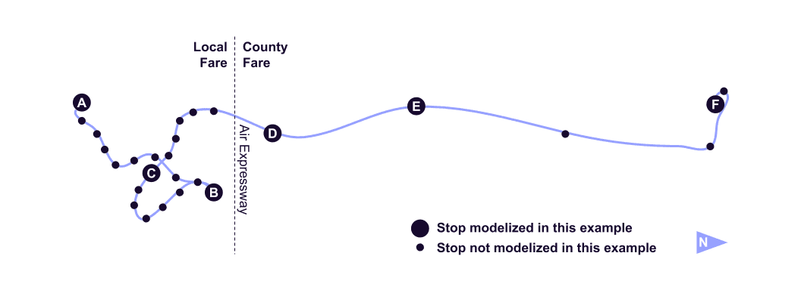

# Paradas continuas

## Recoger y dejar en todas partes 
 
 La agencia de transporte The Current (Rockingham, US-VT) aplica una política de paradas continuas en las rutas 2, 53 y 55. Se puede recoger a un pasajero subir y bajar entre paradas programadas a lo largo de la ruta, siempre que haya un lugar seguro para detener el autobús. 
 
 El archivo [routes.txt](../../reference/#routestxt) se utiliza para describir este servicio utilizando los campos `continuous_pickup` y `continuous_drop_off`. Los campos están configurados en "0" para indicar que se permiten recogidas y entregas continuas. 
 
 [** routes.txt**](../../reference/#routestxt) 
 
```
route_id,route_short_name,route_long_name,route_type,continuous_pickup,continuous_drop_off
2,2,Bellows Falls In-Town,3,0,0
53,53,Bellows Falls / Battleboro Commuter,3,0,0
55,55,Bellows Falls / Springfield Shuttle,3,0,0
```
 
<hr> 
 
## Recoger y dejar en una sección de la ruta 
 
 La agencia de tránsito Victor Valley Transit (Victorville, US-CA) aplica una política de paradas continuas solo en una parte de la ruta 22. Un pasajero puede subir y bajar del autobús en cualquier lugar seguro dentro de la zona de tarifas del condado únicamente. No es posible realizar recogidas y devoluciones continuas dentro de la zona de tarifa local. 
 
 La zona de tarifa local y la zona de tarifa del condado están separadas por Air Expressway como se muestra en la siguiente figura. La parada programada National Trails Highway- Air Expressway se encuentra ligeramente al norte de este límite. Para ser precisos, la agencia de tránsito puede agregar una parada en la intersección real de la ruta del autobús con el límite, desde donde está disponible el servicio continuo de recogida y bajada. Esta parada puede quedar no programada. 
 
  
 
 Esto se describe usando los archivos [stop.txt](../../reference/#stopstxt) y [stop_times.txt](../../reference/#stop_timestxt): 
 
 - El primer archivo define las paradas a lo largo de la ruta
 - El segundo archivo define la recogida y bajada continua reglas entre las paradas. 
 
 [**stop.txt**](../../reference/#stopstxt) 
 
```
stop_id,stop_name,stop_lat,stop_lon
A,Victoriaville Transfer Station,34.514356,-117.318323
B,Dante St & Venus Ave,34.564499,-117.287097
C,Victorville Transportation Center,34.538433,-117.294703
X,Local/County Fare Boundary,34.566224,-117.318357
D,National Trails Highway - Air Expressway,34.567536,-117.319716
E,Oro Grande Post Office,34.599292,-117.334452
F,Silver Lakes Market,34.744662,-117.335407
```
 
 En [stop_times.txt](../../reference/#stop_timestxt), para un viaje determinado: 
 
 - Un registro con `continuous_pickup=0` indica que se permiten recogidas continuas desde esa parada hasta la siguiente parada
 - Un registro con `continuous_pickup =1` indica que están prohibidos los arranques continuos desde esa parada hasta la siguiente parada 
 
 [** stop_times.txt**](../../reference/#stop_timestxt) 
 
```
trip_id,stop_id,stop_sequence,departure_time,arrival_time,continuous_pickup,continuous_drop_off,timepoint
22NB9AM,A,1,09:00:00,09:00:00,1,1,1
22NB9AM,B,2,09:14:00,09:14:00,1,1,1
22NB9AM,C,3,09:21:00,09:21:00,1,1,1
22NB9AM,X,4,,,0,0,0
22NB9AM,D,5,09:25:00,09:25:00,0,0,1
22NB9AM,E,6,09:31:00,09:31:00,0,0,1
22NB9AM,F,7,09:46:00,09:46:00,0,0,1
```
 
 La misma lógica se aplica para el campo `continuous_drop_off` pero para el caso de bajas. 
 
 En el ejemplo anterior, las paradas A, B, C tienen `continuous_pickup` y `continuous_drop_off` configuradas en `1`, lo que prohíbe subidas y bajadas continuas entre ellas. Las paradas `X`, `D`, `E` y `F` tienen los campos `continuous_pickup` y `continuous_drop_off` establecidos en `0`, lo que permite subidas y bajadas continuas entre ellas. 
 
 <sup>[Fuente de ejemplo](https://vvta.org/routes/route-22/)</sup>