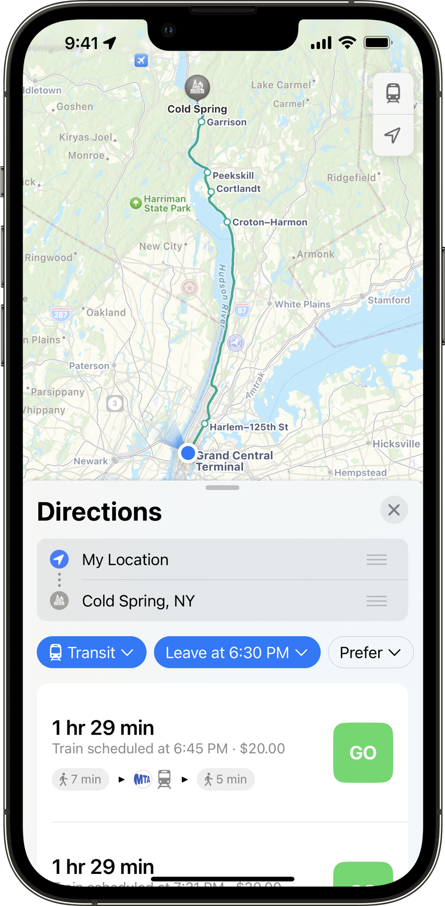
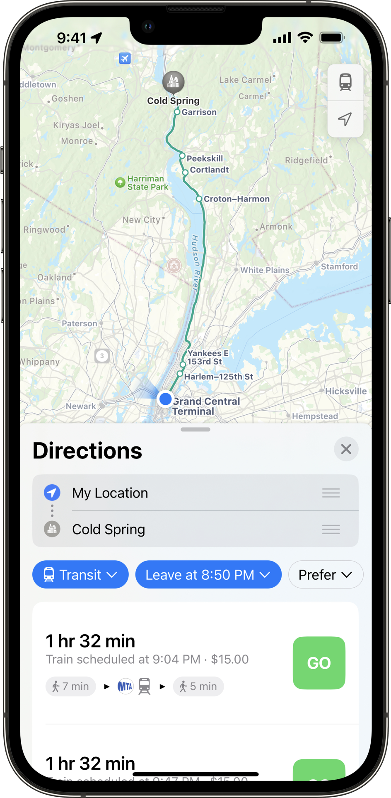

# Tarifas v2 

 Tarifas v2 es un proyecto de extensión GTFS que tiene como objetivo abordar las limitaciones de Tarifas v1. Este proyecto de extensión se está adoptando en iteraciones. Los siguientes ejemplos describen cómo modelar conceptos básicos, incluidos los productos tarifarios y cómo los pasajeros pueden usar su tarifa para realizar transferencias. Vea más información sobre [el proyecto de extensión Tarifas v2 aquí](../../../../community/extensions/fares-v2). 
 
 Mientras tanto, los productores pueden implementar Tarifas v2 junto con la implementación de Tarifas v1 en el mismo conjunto de datos, ya que no existe ningún conflicto técnico entre los dos. Los consumidores tendrán la opción de elegir qué implementación consumir independientemente de la otra. 
 Con la adopción y respaldo suficiente de Tarifas v2, Tarifas v1 puede quedar obsoleto en el futuro. 
 Mientras tanto, los productores pueden implementar Tarifas v2 junto con la implementación de Tarifas v1 en el mismo conjunto de datos, ya que no existe ningún conflicto técnico entre los dos. Los consumidores tendrán la opción de elegir qué implementación consumir independientemente de la otra. 
 
 Los siguientes ejemplos describen cómo modelar datos usando Tarifas v2 y se puede completar con las funciones experimentales descritas en el [documento de propuesta](https://share.mobilitydata.org/gtfs-fares-v2). 
 
## Capacitación y recursos gratuitos de Tarifas v2 
 
 Para comenzar con GTFS Fares-v2, puede ver estos cuatro videos tutoriales y seguir [este recurso escrito](https://share.mobilitydata.org/Fares-v2-write-resource-guide-for-videos). 
 
 - [Video 1](https://share.mobilitydata.org/faresv2-intro): GTFS Fares-v2: Introducción
 - [Video 2](https://share.mobilitydata.org/faresv2-setting-up-google-sheets): Tarifas GTFS v2: Configuración de Google Sheets
 - [Video 3](https://share.mobilitydata.org/faresv2-creating-and-maintaining-data): Tarifas GTFS v2: Creación y mantenimiento de datos
 - [Video 4](https://share.mobilitydata.org/faresv2-exporting-and-publishing): Exportación y publicación de Tarifas GTFS v2 
 
 Han sido creadas para agencias de transporte para comprender el propósito de GTFS-Fares v2, así como también cómo utilizar Google Sheets para crear, editar y cargar datos de GTFS-Fares v2. 
 
 Esta [plantilla de Tarifas v2](https://share.mobilitydata.org/faresv2-template) se puede utilizar para crear los archivos de tarifas necesarios desde cero. 
 
## Ejemplos de modelado de datos de Tarifas v2

### Definir una tarifa de tránsito 
 
 Hay varias formas de pagar tarifas para utilizar el sistema de la Administración de Tránsito de Maryland. <a href="https://www.mta.maryland.gov/regular-fares" target="_blank">Hay cuatro tipos de opciones de tarifa regular de precio completo:</a> 
 
 - Boleto de ida que cuesta $2.00 USD- Pase de un día que cuesta $4.60 USD- Pase semanal que cuesta $22 USD- Un pase mensual que cuesta $77 USD 
 
 Los boletos o tarifas de tránsito se denominan productos tarifarios en GTFS. Se pueden describir utilizando el archivo [fare_products.txt](../../reference/#fare_productstxt). Cada entrada corresponde a una tarifa específica. 
 
 [**fare_products.txt**](../../reference/#fare_productstxt) 
 
| fare_product_id  | fare_product_name  | amount  | currency  |
|------------------------|--------------------|---|---|
| core_local_oneway_fare | One Way Full Fare |  2.00 | USD  |
| core_local_1_day_fare  | 1-Day Pass - Core Service  | 4.60  | USD   |
| core_local_31_day_fare | 31-Day Pass - Core Service  | 77.00  | USD  |
| core_local_7_day_fare  | 7-Day Pass - Core Service |  22.00 | USD  |
 
 
 [Descargue el feed GTFS del autobús local de la Administración de Tránsito de Maryland](https://feeds.mta.maryland.gov/gtfs/local-bus) 
 

 
 
### Crear reglas para viajes de un solo tramo 
 
 En GTFS, un tramo de tarifa corresponde a un viaje que realiza un pasajero sin hacer transbordo entre diferentes modos, rutas, redes o agencias. En el feed de la Administración de Tránsito de Maryland, una tarifa única permite a los pasajeros viajar dentro de cualquier par de paradas y estaciones de metro dentro de la red "central" de autobuses BaltimoreLink, rutas Light RailLink y Metro SubwayLink. 
 
 Los grupos de tramos definen viajes dentro de una red desde un origen a un destino (o un conjunto de orígenes a un conjunto de destinos si los ID de área corresponden a paradas agrupadas). El siguiente archivo describe las reglas para viajar a cualquier lugar dentro de la red principal de la Administración de Tránsito de Maryland. Cada regla corresponde a uno de los productos de tarifa regular en [Definir un ejemplo de tarifa de tránsito](#definir-una-tarifa-de-transito). 
 
 [**fare_leg_rules.txt**](../../reference/#fare_leg_rulestxt) 
 
 |  leg_group_id |  network_id | fare_product_id  |
|---|---|---|
| core_local_one_way_trip | core  |  core_local_oneway_fare |
| core_local_one_way_trip | core  |  core_local_1_day_fare |
| core_local_one_way_trip | core  |  core_local_31_day_fare |
| core_local_one_way_trip | core  |  core_local_7_day_fare |
 
 [Descargue el feed GTFS del autobús local de la Administración de Tránsito de Maryland](https://feeds.mta.maryland.gov/gtfs/local-bus) 
 

 
 
### Crear reglas para transferencias 
 
 Hay una transferencia de 90 minutos para los pasajeros que compran una tarifa de ida para viajar en los autobuses locales BaltimoreLink, Metro SubwayLink o Light RailLink. Esto significa que pueden hacer transbordos un número ilimitado de veces entre los autobuses locales, el metro y el tren ligero en un plazo de 90 minutos. 
 
 [**fare_transfer_rules.txt**](../../reference/#fare_transfer_rulestxt) 
 
| from_leg_group_id       | to_leg_group_id  | duration_limit | duration_limit_type | fare_transfer_type | transfer_count |
|-------------------------|---|----------------|-------------------|---------------------|----------------|
| core_local_one_way_trip | core_local_one_way_trip  | 5400           | 1                 | 0                   | -1             |
 
 
 El archivo anterior representa esto en GTFS con los siguientes campos: 
 
 - Es posible realizar una transferencia hacia y desde tramos que son un viaje de ida (`core_local_one_way_trip`) 
 - El `transfer_count` es establecido en `-1` ya que no hay límite en el número de transferencias permitidas
 - El `duration_limit` está establecido en `5400` segundos, lo que equivale a 90 minutos
 - El `duration_limit_type` está establecido en `1` ya que el tiempo de transferencia comienza cuando el pasajero sale en cualquier ruta del tramo de tarifa `core_local_one_way_trip’ y finaliza cuando sale en un tramo de tarifa diferente. 
 - El `fare_transfer_type` se establece en `0` ya que los pasajeros solo pagan la primera tarifa. No hay tarifa de transferencia ni una segunda tarifa por realizar una transferencia dentro del período de 90 minutos. Por lo tanto, el costo puede modelarse como la suma de la primera tarifa y la suma de las tarifas de transferencia. 
 - El `transfer_count` se establece en `-1` ya que el ciclista puede transferir un número ilimitado de veces dentro de la ventana de `duration_limit` de 90 minutos. 
 
 Después de definir la tarifa, crear la `fare_leg_rule` apropiada y definir la `fare_transfer_rule`, puedes ver la `core_local_oneway_fare` de $2.00 USD aparecer en los planificadores de viajes. Aquí hay un ejemplo de Transit: 
 

    

 
 [Descargar el feed GTFS del autobús local de la Administración de Tránsito de Maryland](https://feeds.mta.maryland.gov/gtfs/local-bus) 
 
### Describir las ubicaciones de servicio en la misma zona tarifaria

 Algunas agencias de tránsito operan una estructura de tarifas basada en zonas. Las zonas tarifarias son áreas geográficas divididas asociadas con diferentes precios de tarifas. En el sistema BART del Área de la Bahía, las tarifas son diferentes según el origen y el destino <a href="https://www.bart.gov/sites/default/files/docs/BART%20Clipper%20Fares%20Triangle%20Chart%20July%202022.pdf" target="_blank">(diferencias de tarifas BART)</a>, y los pasajeros del transporte público necesitarán saber la tarifa correcta. Las áreas de tarifas se pueden describir usando el archivo [stops_areas.txt](../../reference/#stop_areastxt), que asigna paradas desde [stops.txt](../../reference/#stopstxt) a [areas.txt](../../reference/#areastxt). 
 
 Primero, identifique el área en [areas.txt](../../reference/#areastxt). Es aceptable dejar `area_name` en blanco si no hay ningún nombre de área. En la siguiente tabla, hay tres `area_id` : `ASHB`, `GLEN` y `OAKL`. 
 
 [**areas.txt**](../../reference/#areastxt) 
 
| area_id | area_name |
|---------|-----------|
| ASHB    |           |
| GLEN    |           | 
| OAKL    |           | 
 
 Luego, usando `stop_id` del archivo [stops.txt](../../reference/#stopstxt), agrupe las paradas en su respectiva área identificada (zona tarifaria). 
 
 A continuación, agrupe `stop_id` para cada `area_id`. En el ejemplo de BART, cada área contiene solo 1 `stop_id`. Por ejemplo, solo la parada "ASHB" (estación Ashby) está incluida en el área "ASHB". Sin embargo, si un área incluye varias paradas, se deben enumerar múltiples "`stop_id`". 
 
 [**stops_areas.txt**](../../reference/#stop_areastxt) 
 
 | area_id | stop_id |
|---------|---------|
| ASHB    | ASHB    |
| GLEN    | GLEN    | 
| OAKL    | OAKL    | 
 
 En `fare_leg_rules.txt`, se pueden identificar diferentes productos de tarifas en función de diferentes áreas de salida y llegada. Por ejemplo, la primera entrada muestra: 
 
 * El área de salida es `ASHB` 
 * El área de llegada es `GLEN` 
 * El producto de tarifa para el área de salida/llegada es `BA:matrix:ASHB-GLEN` 
 
 [**fare_leg_rules.txt**](../../reference/#fare_leg_rulestxt) 
 
 | leg_group_id | from_area_id|to_area_id|fare_product_id|
|--------------|-----------|------------|---------------|
|   BA    |  ASHB   | GLEN | BA:matrix:ASHB-GLEN |
|     BA         |  ASKB   | OAKL | BA:matrix:ASHB-OAKL |
 
 La tarifa está identificada en `fare_products.txt`. 
 
 [**fare_products.txt**](../../reference/#fare_productstxt) 
 
| fare_product_id     | fare_product_name| amount | currency |
|---------------------|-----------|--------|----------|
| BA:matrix:ASHB-GLEN |  generated  | 4.75   | USD      |
| BA:matrix:ASHB-OAKL  |  generated  | 9.45   | USD       |
 
 
 <a href="https://511.org/open-data/transit" target="_blank">Consulte el feed regional del Área de la Bahía de San Francisco</a> 
 

 
 
### Describa qué medios tarifarios se aceptan 
 
 Los pasajeros de San Francisco Muni pueden usar varios tipos diferentes de medios tarifarios para pagar su viaje y validar su tarifa: 
 
 - Usar una <a href="https://www.clippercard.com/ClipperWeb/" target="_blank">tarjeta Clipper</a>, la Tarjeta de tránsito del Área de la Bahía
 - Usar la <a href="https://www.sfmta.com/getting-around/muni/fares/munimobile" target="_blank">aplicación Munimobile</a> 
 - Pagar la tarifa en efectivo 
 
 Estos métodos de validación se denominan `fare_media` en GTFS-Fares v2 y se pueden describir usando `fare_media.txt`. 
 
 A continuación se muestra un fragmento de ejemplo del <a href="https://511.org/open-data/transit" target="_blank">canal regional del Área de la Bahía de San Francisco</a> al que se puede acceder con la API de 511 SF Bay. 
 
 `Clipper` se describe como una tarjeta de transporte física con `fare_media_type=2`. `SFMTA Munimobile` se describe como una aplicación móvil con `fare_media_type=2`. El `efectivo` no tiene ningún medio de pago, ya que se entrega directamente al conductor sin necesidad de billete. Como resultado, `Cash` es `fare_media_type=0`. 
 
 [**fare_media.txt**](../../reference/#fare_mediatxt) 
 
| fare_media_id | fare_media_name  | fare_media_type |
|---------------|------------------|-----------------|
| clipper       | Clipper          | 2               |
| munimobile    | SFMTA MuniMobile | 4               |
| cash           | Cash             | 0               |
 
 <a href="https://511.org/open-data/transit" target="_blank">Consulte el feed regional del Área de la Bahía de San Francisco</a> 
 
 Además, los productores que quieran describir un boleto físico como un medio de tarifa pueden usar `fare_media_type=1`. 
 
 La <a href="https://www.mbta.com" target="_blank">Autoridad de Transporte de la Bahía de Massachusetts (MBTA)</a> permite a los usuarios pagar viajes y pases utilizando un boleto físico llamado CharlieTicket. Para reflejar esto, hay un medio de tarifa "charlieticket" en el feed de MBTA con un "fare_media_type=1". 
 
 [**fare_media.txt**](../../reference/#fare_mediatxt) 
 
 | fare_media_id | fare_media_name  | fare_media_type |
|---------------|------------------|-----------------|
|cash           |Cash              |0                |
|charlieticket  |CharlieTicket     |1                |
|mticket        |m Ticket app      |4                |
 
 <a href="https://www.mbta.com/developers/gtfs" target="_blank">Ver el feed de la Autoridad de Transporte de la Bahía de Massachusetts</a> 
 
### Definir diferencias de precio según los medios tarifarios 
 
 El precio de la tarifa de Muni es diferente según los medios tarifarios que utiliza el usuario. Este ejemplo cubrirá cómo cambia el precio de la tarifa local para adultos cuando se usa efectivo o una tarjeta Clipper. Una tarifa local de adulto pagada en efectivo cuesta $3 USD y la misma tarifa pagada con la tarjeta Clipper cuesta $2.50, 50 centavos menos. 
 
 Cada entrada a continuación describe un medio de tarifa. 
 
 [**fare_media.txt**](../../reference/#fare_mediatxt) 
 
| fare_product_id | fare_product_name  | amount | currency | fare_media_id |
|---------------|------------------|-------|--- |---------------|
| SF:local:single | Muni single local fare | 3     | USD | cash |
| SF:local:single | Muni single local fare  | 2.5   |USD | clipper |
 
 El fragmento de archivo `fare_products.txt` a continuación muestra cómo el monto del producto `Muni single local fare` varía según el medio de tarifa que utiliza el pasajero. 
 
 [**fare_products.txt**](../../reference/#fare_productstxt) 
 
| fare_product_id | fare_product_name  | amount | currency | fare_media_id |
|---------------|------------------|-------|--- |---------------|
| SF:local:single | Muni single local fare | 3     | USD | cash |
| SF:local:single | Muni single local fare  | 2.5   |USD | clipper |
 
 En Apple Maps, los pasajeros pueden ver cómo cambia el precio de su tarifa. Puede comparar los precios de las tarifas bajo la instrucción "Board the Muni J Church train" (Aborde el tren Muni J Church): 
 

    
    

 
 <a href="https://511.org/open-data/transit" target="_blank">Ver el feed regional del Área de la Bahía de San Francisco</a> 
 
 
### Describir una opción de medios de tarifa sin contacto 
 
 <a href="https://vimeo.com/539436401" target="_blank">Clean Air Express en el norte del condado de Santa Bárbara acepta pagos sin contacto</a> con tarjeta de crédito, Google Pay y Pago de Apple. 
 
 En el feed de Clean Air Express, hay un medio de tarifa `tap_to_ride` con un `fare_media_type=3`, ya que es una opción cEMV (Europay, Mastercard y Visa sin contacto). 

| fare_media_id | fare_media_name | fare_media_type |
|---------------|-----------------|-----------------|
| tap_to_ride   | Tap to Ride   | 3  |
 
 El producto de tarifa de viaje único que se muestra a continuación tiene opciones de medios de tarifa "efectivo" y "tap-to-ride". Cuando el viaje sencillo se paga con la tarifa "tap-to-ride", es un dólar más barato. 
 
 [**fare_products.txt**](../../reference/#fare_productstxt) 
 
| fare_product_id | fare_product_name  | fare_media_id | amount | currency |
|---------------|------------------|---------------|--------|----------|
| single-ride | Single Ride | tap_to_ride       | 6      | USD      |
| single-ride | Single Ride |       | 7      | USD      |
 
 <a href="https://gtfs.calitp.org/production/CleanAirExpressFaresv2.zip" target="_blank">Descargar el feed de Clean Air Express</a> 
 
 
### Definir diferencias de precios según la hora y el día del viaje 
 
 Ciertas agencias de transporte varían sus tarifas según la hora y/o el día de la semana. Esto significa que las tarifas están asociadas a un período de tiempo en el que se realiza el viaje, como horas pico, valle o fines de semana. 
 
 Las tarifas de Metrorail de Washington DC varían según múltiples factores, incluido el día y la hora del viaje. Las tarifas de tiempo variable en GTFS se pueden definir usando `timeframes.txt, en el cual es posible designar períodos de tiempo específicos que luego se pueden asociar en `fare_leg_rules.txt` para asignar el producto tarifario aplicable que corresponde al momento en que se realiza el viaje.está hecho. El siguiente es un ejemplo ficticio, basado en las tarifas de WMATA a partir de la primavera de 2023. 
 
 Primero, los días de servicio se definen utilizando `calendar.txt`. 
 
 [**calendar.txt**](../../reference/#calendartxt) 
 
| service_id       | monday | tuesday | wednesday | thursday | friday | saturday | sunday | start_date | end_date |
|------------------|--------|---------|-----------|----------|--------|----------|--------|------------|----------|
| weekday_service  | 1      | 1       | 1         | 1        | 1      | 0        | 0      | 20220708   | 20221231 |
| saturday_service | 0      | 0       | 0         | 0        | 0      | 1        | 0      | 20220708   | 20221231 |
| sunday_service   | 0      | 0       | 0         | 0        | 0      | 0        | 1      | 20220708   | 20221231 |
 
 
 Luego, los plazos deseados se definen en `timeframes.txt`, proporcionando una identificación, los días aplicables mediante una referencia a `calendar.service_id` y, si corresponde, la hora de inicio y finalización de cada horario.período. 
 
 [**timeframes.txt**](../../reference/#timeframestxt) 
 
| timeframe_group_id | start_time | end_time | service_id       |
|--------------------|------------|----------|------------------|
| weekday_peak       | 5:00:00    | 9:30:00  | weekday_service  |
| weekday_offpeak    | 9:30:00    | 15:00:00 | weekday_service  |
| weekday_peak       | 15:00:00   | 19:00:00 | weekday_service  |
| weekday_offpeak    | 19:00:00   | 21:30:00 | weekday_service  |
| weekday_late_night | 21:30:00   | 24:00:00 | weekday_service  |
| weekday_late_night | 00:00:00   | 5:00:00  | weekday_service  |
| weekend            |            |          | saturday_service |
| weekend            |            |          | sunday_service   |
 
 A continuación, se crean las tarifas específicas de hora correspondiente en `fare_products.txt` (por ejemplo, tarifa pico) 
 
 [**fare_products.txt**](../../reference/#fare_productstxt) 

| fare_product_id | fare_product_name                             | amount | currency |
|-----------------|-----------------------------------------------|--------|----------|
| peak_fare       | Peak fare                                     | 5      | USD      |
| regular_fare    | Off-peak fare                                 | 3      | USD      |
| weekend_fare    | Weekend Metrorail one-way fare                | 2      | USD      |
| late_night_fare | Late Night flat fare (Mon - Fri after 9:30pm) | 2      | USD      |
 
 Por último, los plazos se asocian con productos tarifarios en `fare_leg_rules.txt` utilizando los campos `from_timeframe_group_id` y `to_timeframe_group_id`. Estos campos determinan si una tarifa se aplica únicamente al inicio del tramo o tanto al inicio como al final del tramo. 
 Para este ejemplo, según las tarifas WMATA, la tarifa depende únicamente del horario de salida del tramo, por lo que `to_timeframe_group_id` se deja en blanco. 
 
 [**fare_leg_rules.txt**](../../reference/#fare_leg_rulestxt) 
 
| network_id | fare_product_id | from_timeframe_group_id | to_timeframe_group_id |
|------------|-----------------|-------------------------|-----------------------|
| 1          | weekend_fare    | weekend                 |                       |
| 1          | late_night_fare | weekday_late_night      |                       |
| 1          | peak_fare       | weekday_peak            |                       |
| 1          | regular_fare    | weekday_offpeak         |                       |
 
 Tenga en cuenta que `network_id` hace referencia al ID extranjero `networks.network_id` o `routes.network_id`, y que la selección del producto de tarifa correcto para cada viaje será una combinación de las horas de llegada y salida de `stop_times.txt` junto con los tiempos definidos en `timeframes.txt. 
 
 En este caso, un usuario que pague un viaje que sale a las 7:30 AM tendría que pagar 5.00 USD (tarifa pico) mientras que otro usuario que sale a las 11:30 AM solo tendría que pagar una tarifa de 3.00 USD ( Tarifa valle). 
 
 
### Definir tarifas variables en el tiempo junto con tarifas basadas en zonas 
 
 En la red ferroviaria MTA Metro-North de Nueva York, las tarifas varían según la hora del día del viaje, así como las zonas de origen y destino del viaje. El siguiente ejemplo ilustra las reglas de tarifas aplicables a un viaje desde Grand Central Station a Cold Spring (NY, EE. UU.). 
 
 Este ejemplo se basa en un <a href="https://docs.google.com/spreadsheets/d/1-cD-R2OH5xAQAbNWNlrXD7WOw594lVdW-bomuLo6bI8/edit?usp=sharing" target="_blank">conjunto de datos</a> producido por <a href="https://www.itoworld.com/" target="_blank">ITO World</a>, que presenta un viaje que utiliza diez paradas distribuidas en seis áreas diferentes. 
 
 [**stops.txt**](../../reference/#stopstxt) 
 
| stop_id | stop_name           | stop_lat  | stop_lon   |
|---------|---------------------|-----------|------------|
| ITO1669 | Peekskill           | 41.285103 | -73.930916 |
| ITO1777 | Beacon              | 41.505814 | -73.984474 |
| ITO1789 | New Hamburg         |  41.58691 | -73.947624 |
| ITO1804 | Croton-Harmon       | 41.190002 | -73.882393 |
| ITO1824 | Cortlandt           | 41.246258 | -73.921783 |
| ITO1856 | Garrison            | 41.381126 | -73.947334 |
| ITO1887 | Harlem-125th Street | 40.805256 | -73.939148 |
| ITO1897 | Cold Spring         | 41.415382 | -73.958092 |
| ITO2096 | Poughkeepsie        | 41.707058 |  -73.93792 |
| ITO2383 | Grand Central       | 40.752823 | -73.977196 |
 
 
 [**stop_areas.txt**](../../reference/#stop_areastxt) 
 
| area_id   | stop_id |
|-----------|---------|
| mnr_1     | ITO1887 |
| mnr_1     | ITO2383 |
| mnr_HUD-5 | ITO1804 |
| mnr_HUD-6 | ITO1669 |
| mnr_HUD-6 | ITO1824 |
| mnr_HUD-7 | ITO1856 |
| mnr_HUD-7 | ITO1897 |
| mnr_HUD-8 | ITO1777 |
| mnr_HUD-8 | ITO1789 |
| mnr_HUD-9 | ITO2096 |
 
 
 [**route_networks.txt**](../../reference/#route_networkstxt) 
 
| network_id | route_id |
|------------|----------|
| mnr_hudson | 669      |
 
 
 [**networks.txt**](../../reference/#networkstxt) 
 
| network_id | network_name    |
|------------|-----------------|
| mnr_hudson | MNR Hudson Line |
 
 Los días de servicio para los servicios de tren 3 y 13 se definen mediante `calendar.txt`. En particular, se definen otros registros con días genéricos (es decir, entre semana, fines de semana y cualquier día) que no están asociados con ningún viaje, y estos se asociarán con períodos de tiempo para modelar "tarifas variables en el tiempo". 
 
 [**calendar.txt**](../../reference/#calendartxt) 
 
| service_id | monday | tuesday | wednesday | thursday | friday | saturday | sunday | start_date | end_date |
|------------|--------|---------|-----------|----------|--------|----------|--------|------------|----------|
| 13         | 1      | 1       | 1         | 1        | 1      | 0        | 0      | 20230612   | 20231006 |
| 3          | 1      | 1       | 1         | 1        | 1      | 0        | 0      | 20230609   | 20231006 |
| weekdays   | 1      | 1       | 1         | 1        | 1      | 0        | 0      | 20220101   | 20240101 |
| weekends   | 0      | 0       | 0         | 0        | 0      | 1        | 1      | 20220101   | 20240101 |
| anyday     | 1      | 1       | 1         | 1        | 1      | 1        | 1      | 20220101   | 20240101 |
 
 
 Los registros se crean en `timeframes.txt`, incluidos los casos en los que la hora cubre el período de rango de 24 horas (`anytime`, `weekdays` y `weekends`), y los períodos pico y valle: 
 
 * Pico AM: de 6 am a 10 am entre semana 
 * Pico AM2PM: de 6 am a 9 am y de 4 pm a 8 pm entre semana 
 * Pico No AM: horario entre semana no incluido en AM Pico 
 * No Pico AM2PM: horario de los días laborables no incluido en Pico AM2PM 
 
 [**timeframes.txt**](../../reference/#timeframestxt) 
 
| timeframe_group_id | start_time | end_time | service_id |
|:------------------:|:----------:|:--------:|:----------:|
|       anytime      |  00:00:00  | 24:00:00 |   anyday   |
|      weekdays      |  00:00:00  | 24:00:00 |  weekdays  |
|      weekends      |  00:00:00  | 24:00:00 |  weekends  |
|     mnr_ampeak     |  06:00:00  | 10:00:00 |  weekdays  |
|    mnr_notampeak   |  00:00:00  | 06:00:00 |  weekdays  |
|    mnr_notampeak   |  10:00:00  | 24:00:00 |  weekdays  |
|    mnr_am2pmpeak   |  06:00:00  | 09:00:00 |  weekdays  |
|    mnr_am2pmpeak   |  16:00:00  | 20:00:00 |  weekdays  |
|  mnr_notam2pmpeak  |  00:00:00  | 06:00:00 |  weekdays  |
| mnr_notam2pmpeak   | 09:00:00   | 16:00:00 | weekdays   |
| mnr_notam2pmpeak   | 20:00:00   | 24:00:00 | weekdays   |
 
 
 Cada producto de tarifa individual se define en `fare_products.txt`. Dado que Cold Spring está ubicado en la zona 7, este ejemplo solo enumera viajes entre las zonas 1 y 7. El conjunto de datos completo incluiría un registro para cada precio definido por una combinación de hora y zona. Además, el ejemplo solo muestra un medio de tarifa ("papel"), pero se podrían crear combinaciones adicionales si los precios también variaran según el medio de tarifa. 
 
 [**fare_products.txt**](../../reference/#fare_productstxt) 
 
| fare_product_id        | fare_product_name                  | fare_media_id | amount | currency |
|------------------------|------------------------------------|---------------|--------|----------|
| mnr_1:HUD-7_adult_peak | Outbound Adult Peak Zonal Fare     | paper         | 20.00  | USD      |
| mnr_1:HUD-7_adult      | Outbound Adult Off Peak Zonal Fare | paper         | 15.00  | USD      |
| mnr_HUD-7:1_adult_peak | Inbound Adult Peak Zonal Fare      | paper         | 20.00  | USD      |
| mnr_HUD-7:1_adult      | Inbound Adult Off Peak Zonal Fare  | paper         | 15.00  | USD      |
 
 
 Por último, las combinaciones de zonas de origen y destino, junto con sus respectivos horarios, se asocian al producto tarifario correspondiente en `fare_leg_rules.txt`. Aquí, los viajes que comienzan o llegan a la Zona 1 (es decir, `area_id=mnr_1`) durante las horas pico están sujetos a una tarifa pico específica correspondiente a las zonas de llegada y salida del viaje (es decir, `fare_product_id=mnr_1:HUD-7_adult_peak`). 
 
 [**fare_leg_rules.txt**](../../reference/#fare_leg_rulestxt) 
 
| network_id | from_area_id | to_area_id | fare_product_id        | from_timeframe_group_id | to_timeframe_group_id |
|------------|--------------|------------|------------------------|-------------------------|-----------------------|
| mnr_hudson | mnr_1        | mnr_HUD-7  | mnr_1:HUD-7_adult      | mnr_notam2pmpeak        | anytime               |
| mnr_hudson | mnr_1        | mnr_HUD-7  | mnr_1:HUD-7_adult      | weekends                | anytime               |
| mnr_hudson | mnr_1        | mnr_HUD-7  | mnr_1:HUD-7_adult_peak | mnr_am2pmpeak           | anytime               |
| mnr_hudson | mnr_HUD-7    | mnr_1      | mnr_HUD-7:1_adult      | weekdays                | mnr_notampeak         |
| mnr_hudson | mnr_HUD-7    | mnr_1      | mnr_HUD-7:1_adult      | weekends                | anytime               |
| mnr_hudson | mnr_HUD-7    | mnr_1      | mnr_HUD-7:1_adult_peak | weekdays                | mnr_ampeak            |
 
 
 Usando este conjunto de datos, un usuario que aborda el tren#869 (`service_id=3`) programado para salir de Grand Central (zona `mnr_1`) a las 6:45 pm tendría que pagar una tarifa zonal pico de ida para adultos de 20.00 USD, ya que el viaje se origina en el periodo `mnr_am2pmpeak` y desde la `a` mnr_1`. 
 
 Alternativamente, un usuario que viaje en el tren#883 (`service_id=13`) pagaría una tarifa zonal de ida para adultos fuera de horas pico de solo 15,00 USD, ya que este tren está programado para salir de Grand Central (zona `mnr_1`) a las 21:04. 
 
 En <a href="https://apple.com/maps" target="_blank">Apple Maps</a>, los pasajeros pueden ver cómo cambia el precio de su tarifa y comparar los precios de las tarifas junto a la salida programada del tren: 
 

 
  
  

 
