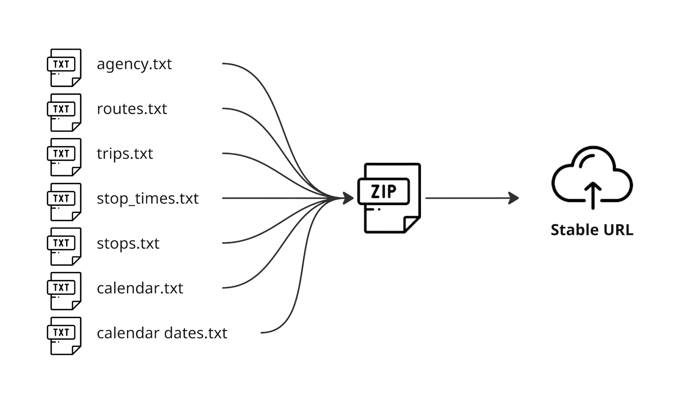
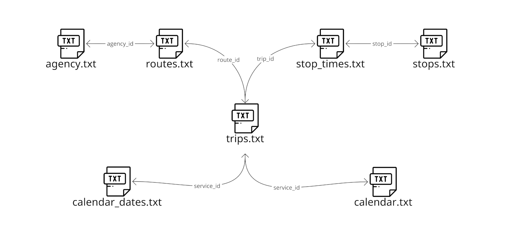

# Crear un conjunto de datos GTFS

## Descripción general de un feed GTFS 
 Todos los feeds GTFS comienzan con un conjunto de datos en el formato de referencia GTFS, que es una serie de archivos CSV guardados con una extensión de archivo.txt [^1]. En su implementación más básica, un conjunto de datos GTFS generalmente comienza con siete archivos base, combinados en un archivo.zip alojado en una URL pública y estable: este es el feed GTFS. 
 
 
 
 Cada archivo consta de una lista de múltiples registros (líneas de datos) con varios campos de información. Por ejemplo, cada línea enumerada en [routes.txt](../../documentation/schedule/reference/#routestxt) representa una ruta de transporte público y sus campos describen múltiples elementos de esa ruta, como su nombre, descripción, operación agencia, etc. 
 
 
 
 Los archivos base para un conjunto de datos GTFS se pueden describir de la siguiente manera: Un conjunto de datos de programación GTFS tiene una o más rutas ([routes.txt](../../documentation/schedule/reference/#routestxt)), cada ruta tiene uno o más viajes ([trips.txt](../../documentation/schedule/reference/#tripstxt)), cada viaje visita una serie de paradas ([stops.txt](../../documentation/schedule/reference/#stopstxt)) en momentos específicos ([stop_times.txt](../../documentation/schedule/reference/#stop_timestxt)). Los Viajes y las horarios de parada solo contienen información sobre la hora del día; el calendario se utiliza para determinar en qué días se realiza un viaje determinado ([calendar.txt](../../documentation/schedule/reference/#calendartxt) y [calendar_dates.txt](../../documentation/schedule/reference/#calendar_datestxt)). Además, varias agencias ([agency.txt](../../documentation/schedule/reference/#agencytxt)) pueden operar múltiples rutas. Estos archivos están vinculados entre sí con campos que tienen referencias cruzadas entre ellos. 
 
 
 
 Una vez que estos archivos se hayan configurado para crear un conjunto de datos GTFS básico, se pueden agregar archivos adicionales (opcionales) para habilitar otras funcionalidades o necesidades específicas entre agencias de tránsito y proveedores. Algunos ejemplos de estos archivos incluyen: 
 
 - [shapes.txt](../../documentation/schedule/reference/#shapestxt) que permite representar gráficamente la ruta de un viaje, 
 - [pathways.txt](../../documentation/schedule/reference/#pathwaystxt) que proporciona información que permite generar direcciones para ayudar a los usuarios a navegar por las estaciones, 
 - [frequencies.txt](../../documentation/schedule/reference/#frequenciestxt) que proporciona una forma alternativa de especificar horarios de parada. 
 
 Para obtener más información sobre todas las funcionalidades de GTFS que se pueden habilitar, consulte la sección [“¿Qué puede hacer GTFS?”](../features/overview/). 
 
 Un conjunto de datos de programación GTFS se puede complementar con información en tiempo real, como posiciones de vehículos y actualizaciones de servicios. Para hacer esto, se debe crear un feed GTFS Realtime por separado del conjunto de datos GTFS Schedule existente. 
 
 Un feed GTFS Realtime consiste en un archivo binario normal servido a través de HTTP y actualizado con frecuencia; cualquier tipo de servidor web puede alojar y servir el archivo. El formato de intercambio de datos GTFS Realtime se basa en [Protocol Buffers](https://developers.google.com/protocol-buffers/), un mecanismo neutral en cuanto a idioma y plataforma para serializar datos estructurados. GTFS Realtime puede proporcionar tres tipos de información: actualizaciones de viaje, alertas de servicio y posiciones del vehículo, estas se pueden combinar según la información de servicio que deba comunicarse. 
 
 Dado que GTFS Realtime permite presentar el estado real de una flota, el feed debe actualizarse periódicamente, preferiblemente cada vez que lleguen nuevos datos del sistema de localización automática de vehículos del servicio. Combinados, el conjunto de datos GTFS Schedule y un feed GTFS Realtime permiten que las aplicaciones de consumo proporcionen información precisa y actualizada a los pasajeros. Para más información consultar la Documentación Técnica. 
 
## ¿Estás produciendo tu primer feed GTFS? 
 
 Si eres una agencia que busca producir tu primer feed GTFS, lo primero que debes hacer es leer la documentación existente. 
 
 Comience explorando las capacidades de GTFS en la sección ["¿Qué puede hacer GTFS?"](../features/overview/) y determinando las diferentes funciones de su servicio de tránsito que desea representar utilizando el formato GTFS. Para una exploración más profunda, la documentación de referencia oficial para [GTFS Schedule](../../documentation/schedule/reference) y [GTFS Realtime](../../documentation/realtime/reference) ofrece información detallada.orientación sobre cómo modelar estas funciones y garantizar el cumplimiento. 
 
 A continuación, recopile todos los datos necesarios de su sistema. Esto incluye información de todas las paradas, rutas, horarios, tarifas, etc., ya que muchos de estos detalles serán las entradas que completarán el conjunto de datos GTFS. 
 
 Dependiendo del tamaño y la complejidad de su sistema, tiene la opción de crear los datos internamente o contratar un proveedor GTFS externo para transformar los datos al formato GTFS. 
 
 En algunos casos, las agencias pequeñas con un puñado de rutas crean ellos mismos los datos utilizando software comúnmente disponible, como hojas de cálculo y editores de texto. 
 
 Cuando se trata de un alcance de sistema más amplio, la mayoría de las agencias adquieren software de gestión GTFS especializado de proveedores especializados, pero algunas pueden optar por desarrollar sus propias herramientas internas. Finalmente, cuando las características del sistema resultan difíciles para las agencias a la hora de escribir conjuntos de datos por su cuenta, la producción de GTFS se puede subcontratar por completo a empresas especializadas en la producción de datos GTFS. 
 
 <a href="https://www.flaticon.com/authors/freepik" title="Iconos de Freepik">Iconos creados por Freepik- Flaticon</a> 
 
 [^1]: Además de los archivos de texto, el formato [GeoJSON](https://geojson.org/) ahora también es compatible con GTFS para representar ciertos elementos de servicios que respondan a la demanda. 
