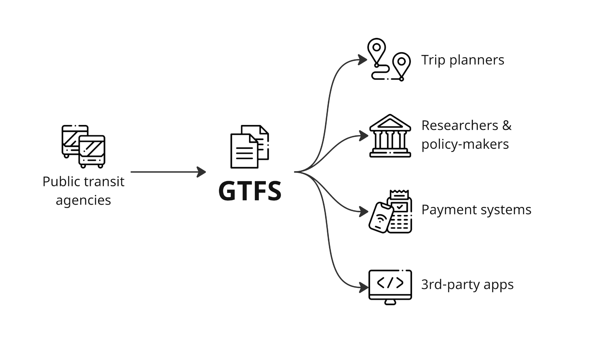
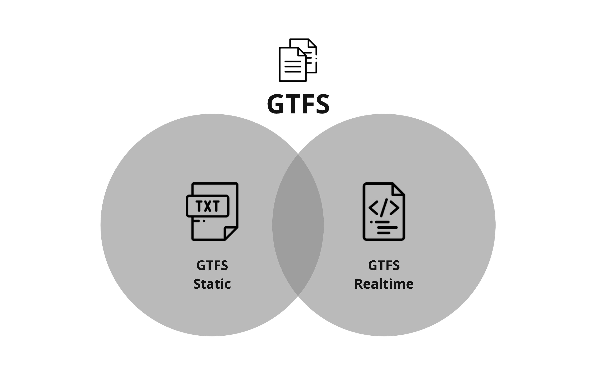

# GTFS: Hacer que los datos del transporte público sean universalmente accesibles

## Un estándar de datos abiertos para la información de los pasajeros en transporte público 
 
 La General Transit Feed Specification Público, también conocida como GTFS, es un formato de datos estandarizado que proporciona una estructura para el agencias de transporte público para describir los detalles de sus servicios como horarios, paradas, tarifas, etc. 
 
 Permite a las agencias de transporte público publicar sus datos de tránsito en un formato que puede ser consumido por una amplia variedad de aplicaciones de software, más comúnmente planificadores de viajes. Esto significa que los usuarios pueden obtener fácilmente información de viaje para acceder a los servicios de transporte público utilizando sus teléfonos inteligentes o dispositivos similares. 
 
 
 
 Hoy en día, GTFS es el [Estándar abierto](https://www.interoperablemobility.org/definitions/#open_standard) para miles de proveedores de transporte público en todo el mundo. Algunas agencias producen estos datos por sí mismas, mientras que otras emplean a un proveedor para crear y mantener datos para ellos. 
 
## Soporte para datos estáticos y dinámicos 
 
 GTFS consta de dos partes principales: [GTFS Schedule](../../documentation/schedule/reference) y [GTFS Realtime](../../documentation/realtime/reference). 
 
 
 
 GTFS Schedule contiene información sobre rutas, horarios, tarifas y detalles de tránsito geográfico, entre muchas otras funciones, y se presenta en archivos de texto simples[^1]. Este formato sencillo permite una fácil creación y mantenimiento sin depender de software complejo o propietario. 
 
 GTFS Realtime contiene actualizaciones de viajes, posiciones de vehículos y alertas de servicio, utilizando el formato [Protocol Buffers](https://developers.google.com/protocol-buffers/). Esta parte de GTFS funciona en conjunto con el Horario GTFS para informar a los pasajeros sobre interrupciones en el servicio y horarios de llegada actualizados. 
 
 La documentación de referencia GTFS Schedule y GTFS Realtime está disponible en la [sección Documentación técnica](../../documentation/overview). 
 
<iframe class="center" width="560" height="315" src="https://www.youtube-nocookie.com/embed/SDz2460AjNo?si=wFsaN4_Hr3ypxWdp" title="reproductor de vídeos de youtube" frameborder="0" allow="accelerometer; autoplay; clipboard-write; encrypted-media; gyroscope; picture-in-picture; web-share" allowfullscreen></iframe> 
 
<a href="https://www.flaticon.com/authors/freepik" title="Iconos de Freepik">Iconos creados por Freepik- Flaticon</a> 
 
[^1]: Además de los archivos de texto, el formato [GeoJSON](https://geojson.org/) ahora también es compatible con GTFS para representar ciertos elementos de servicios que respondan a la demanda. 
