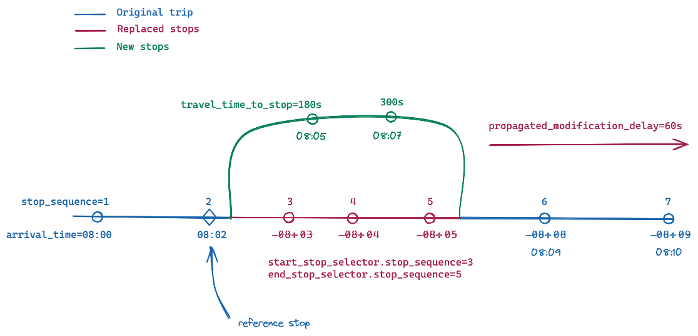
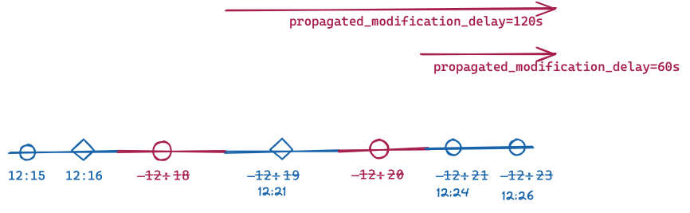
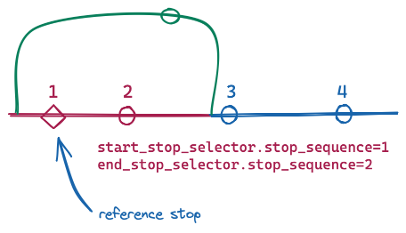

# GTFS Realtime Reference 
 
 Un flux GTFS Realtime permet aux agences de transport de fournir aux consommateurs des informations en temps réel sur les perturbations de leur service (gares fermées, lignes hors service, retards importants, etc.), la localisation de leurs véhicules et les heures d’arrivée prévues. 
 
 La version 2.0 de la spécification du flux est discutée et documentée sur ce site. Les versions valides sont "2.0", "1.0". 
 
## Définitions des termes

### Requis 
 
 Dans GTFS-realtime v2.0 et versions ultérieures, la colonne * Requis* décrit les champs qui doivent être fournis par un producteur pour que les données de transit pour être valide et avoir un sens pour une application consommatrice. 
 
 Les valeurs suivantes sont utilisées dans le champ * Requis* : 
 
 * **Requis** : Ce champ doit être fourni par un producteur de flux GTFS Realtime. 
 * **Requis sous condition** : Ce champ est obligatoire sous certaines conditions, qui sont décrites dans le champ *Description*. En dehors de ces conditions, le champ est facultatif. 
 * **Optionnel** : Ce champ est facultatif et n’a pas besoin d’être implémenté par les producteurs. Cependant, si les données sont disponibles dans les systèmes de localisation automatique des véhicules sous-jacents (par exemple, VehiclePosition `timestamp`), il est recommandé aux producteurs de fournir ces champs facultatifs lorsque cela est possible. 
 
 *Notez que les exigences sémantiques n’ont pas été définies dans la version 1.0 de GTFS-realtime, et par conséquent les flux avec `gtfs_realtime_version` de `1` peuvent ne pas répondre à ces exigences (voir [la proposition d’exigences sémantiques](https://github.com/google/transit/pull/64) pour plus de détails).* 
 
### Cardinalité 
 
 *Cardinalité* représente le nombre d’éléments pouvant être fournis pour un champ particulier, avec les valeurs suivantes : 
 
 * **Un** - Un seul élément peut être fourni pour ce champ. Cela correspond aux [cardinalités du tampon de protocole *obligatoire* et *facultatif*](https://developers.google.com/protocol-buffers/docs/proto#simple). 
 * **Plusieurs** - Plusieurs éléments (0, 1 ou plus) peuvent être fournis pour ce champ. Cela correspond à la [cardinalité *répétée* du tampon de protocole](https://developers.google.com/protocol-buffers/docs/proto#simple). 
 
 Faites toujours référence aux champs * Requis* et *Description* pour voir quand un champ est obligatoire, obligatoire sous condition ou facultatif. Veuillez faire référence à [`gtfs-realtime.proto`](https://github.com/google/transit/blob/master/gtfs-realtime/proto/gtfs-realtime.proto) pour la cardinalité du tampon de protocole. 
 
### Types de données du tampon de protocole 
 
 Les types de données du tampon de protocole suivants sont utilisés pour décrire les éléments de flux : 
 
 * **message** : type complexe 
 * **enum** : Liste des valeurs fixes
 
### Champs expérimentaux 
 
 Les champs étiquetés comme **expérimentaux** sont sujets à changement et ne sont pas encore formellement adoptés dans la spécification. Un champ **expérimental** pourrait être formellement adopté à l’avenir. 
 
## Index des éléments 
 
 * [FeedMessage](#message-feedmessage) 
    * [FeedHeader](#message-feedheader) 
        * [Incrementality](#enum-incrementality) 
    * [FeedEntity](#message-feedentity) 
        * [TripUpdate](#message-tripupdate) 
            * [TripDescriptor](#message-tripdescriptor) 
                * [ScheduleRelationship](#enum-schedulerelationship_1) 
            * [VehicleDescriptor](#message-vehicledescriptor) 
                * [WheelchairAccessible](#enum-wheelchairaccessible) 
            * [StopTimeUpdate](#message-stoptimeupdate) 
                * [StopTimeEvent](#message-stoptimeevent) 
                * [ScheduleRelationship](#enum-schedulerelationship) 
                * [StopTimeProperties](#message-stoptimeproperties) 
            * [TripProperties](#message-tripproperties) 
        * [VehiclePosition](#message-vehicleposition) 
            * [TripDescriptor](#message-tripdescriptor) 
                * [ScheduleRelationship](#enum-schedulerelationship_1) 
            * [VehicleDescriptor](#message-vehicledescriptor) 
                * [WheelchairAccessible](#enum-wheelchairaccessible) 
            * [Position](#message-position) 
            * [VehicleStopStatus](#enum-vehiclestopstatus) 
            * [CongestionLevel](#enum-congestionlevel) 
            * [OccupancyStatus](#enum-occupancystatus) 
            * [CarriageDetails](#message-carriagedetails) 
        * [Alert](#message-alert) 
            * [TimeRange](#message-timerange) 
            * [EntitySelector](#message-entityselector) 
                * [TripDescriptor](#message-tripdescriptor) 
                    * [ScheduleRelationship](#enum-schedulerelationship_1) 
        * [Cause](#enum-cause) 
        * [Effect](#enum-effect) 
        * [TranslatedString](#message-translatedstring) 
            * [Translation](#message-translation) 
        * [SeverityLevel](#enum-severitylevel) 
    * [Shape](#message-shape) 
    * [Stop](#message-stop) 
        * [WheelchairBoarding](#enum-wheelchairboarding) 
    * [TripModifications](#message-tripmodifications) 
        * [Modification](#message-modification) 
        * [ReplacementStop](#message-replacementstop) 
 
 
## Elements

### _message_ FeedMessage 
 
 Le contenu d’un message de flux. Chaque message du flux est obtenu en réponse à une requête HTTP GET appropriée. Un flux en temps réel est toujours défini par rapport à un flux GTFS existant. Tous les identifiants d’entité sont résolus par rapport au flux GTFS. 
 
 **Champs** 
 
 | _**Nom du champ**_ | _**Tapez**_ | _**Requis**_ | _**Cardinalité**_ | _**Description**_ | 
 |--------|------------|----------------|----------------------------------|-------------------| 
 | **header** | [FeedHeader](#message-feedheader) | Requis | Un | Métadonnées sur ce flux et message de flux. | 
 | **entity** | [FeedEntity](#message-feedentity) | Requis sous condition | Plusieurs | Contenu du flux. Si des informations en temps réel sont disponibles pour le système de transport en commun, ce champ doit être renseigné. Si ce champ est vide, les consommateurs doivent supposer qu’aucune information en temps réel n’est disponible pour le système. | 
 
### _message_ FeedHeader 
 
 Métadonnées sur un flux, incluses dans les messages du flux. 
 
 **Champs** 
 
 | _**Nom du champ**_ | _**Tapez**_ | _**Requis**_ | _**Cardinalité**_ | _**Description**_ | 
 |--------|------------|----------------|----------------------------------|-------------------| 
 | **gtfs_realtime_version** | [string](https://protobuf.dev/programming-guides/proto2/#scalar) | Requis | Un | Version de la spécification du flux. La version actuelle est la 2.0. | 
 | **incrementality** | [Incrementality](#enum-incrementality) | Requis | Un | 
 | **timestamp** | [uint64](https://protobuf.dev/programming-guides/proto2/#scalar) | Requis | Un | Cet horodatage identifie le moment où le contenu de ce flux a été créé (en heure du serveur). En temps POSIX (c’est-à-dire nombre de secondes depuis le 1er janvier 1970 00:00:00 UTC). Pour éviter les décalages horaires entre les systèmes produisant et consommant des informations en temps réel, il est fortement conseillé de dériver l’horodatage d’un serveur de temps. Il est tout à fait acceptable d’utiliser des serveurs de strate 3 ou même inférieure, car des différences horaires allant jusqu’à quelques secondes sont tolérables. | 
 
### _enum_ Incrementality 
 
 Détermine si la récupération actuelle est incrémentielle. 
 
 * **FULL_DATASET**: cette mise à jour du flux écrasera toutes les informations précédentes en temps réel pour le flux. Ainsi, cette mise à jour devrait fournir un instantané complet de toutes les informations connues en temps réel. 
 * **DIFFERENTIAL**: actuellement, ce mode est **non pris en charge** et le comportement est **non spécifié** pour les flux qui utilisent ce mode. Il y a des discussions sur la [liste de diffusion GTFS Realtime](http://groups.google.com/group/gtfs-realtime) autour de la spécification complète du comportement du mode DIFFÉRENTIEL et la documentation sera mise à jour lorsque ces discussions seront finalisées. 
 
 **Valeurs** 
 
 | _**Valeur**_ | 
 |-------------| 
 | **FULL_DATASET** | 
 | **DIFFERENTIAL** | 
 
### _message_ FeedEntity 
 
 Une définition (ou mise à jour) d’une entité dans le flux de transit. Si l’entité n’est pas supprimée, exactement l’un des champs « trip_update », « véhicule », « alerte » et « forme » doit être renseigné. 
 
 **Champs** 
 
 | _**Nom du champ**_ | _**Tapez**_ | _**Requis**_ | _**Cardinalité**_ | _**Description**_ | 
 |--------|------------|----------------|----------------------------------|-------------------| 
 | **id** | [string](https://protobuf.dev/programming-guides/proto2/#scalar) | Requis | Un | Identifiant unique du flux pour cette entité. Les identifiants sont utilisés uniquement pour fournir une prise en charge de l’incrémentalité. Les entités réelles référencées par le flux doivent être spécifiées par des sélecteurs explicites (voir EntitySelector ci-dessous pour plus d’informations). | 
 | **is_deleted** | [bool](https://protobuf.dev/programming-guides/proto2/#scalar) | Optionnel | Un | Si cette entité doit être supprimée. Doit être fourni uniquement pour les flux avec une Incrementality de DIFFERENTIAL ; ce champ ne doit PAS être fourni pour les flux avec une Incrementality de FULL_DATASET. | 
 | **trip_update** | [TripUpdate](#message-tripupdate) | Requis sous condition | Un | Données sur les retards de départ en temps réel d’un voyage. Au moins un des champs trip_update, véhicule, alerte ou forme doit être fourni- tous ces champs ne peuvent pas être vides. | 
 | **vehicle** | [VehiclePosition](#message-vehicleposition) | Requis sous condition | Un | Données sur la position en temps réel d’un véhicule. Au moins un des champs trip_update, véhicule, alerte ou forme doit être fourni- tous ces champs ne peuvent pas être vides. | 
 | **alert** | [Alerte](#message-alert) | Requis sous condition | Un | Données sur l’alerte en temps réel. Au moins un des champs trip_update, véhicule, alerte ou forme doit être fourni- tous ces champs ne peuvent pas être vides. | 
 | **shape** | [Forme](#message-shape) | Requis sous condition | Un | Données sur les formes ajoutées en temps réel, par exemple pour un détour. Au moins un des champs trip_update, véhicule, alerte ou forme doit être fourni- tous ces champs ne peuvent pas être vides.   **Attention :**ce champ est encore **expérimental** et est susceptible de changer. Il pourrait être formellement adopté à l’avenir. | 
 
 
### _message_ TripUpdate 
 
 Mise à jour en temps réel sur la progression d’un véhicule tout au long d’un trajet. Veuillez également vous référer à la discussion générale sur les [entités de mises à jour de voyage](../../../documentation/realtime/feed_entities/trip-updates). 
 upd 
 En fonction de la valeur de ScheduleRelationship, un TripUpdate peut spécifier : 
 
 * Un voyage qui se déroule selon le planning. 
 * Un voyage qui s’effectue le long d’un itinéraire mais n’a pas d’horaire fixe. 
 * Un trajet qui a été ajouté ou supprimé par rapport à l’horaire. 
 * Un nouveau voyage qui est une copie d’un voyage existant en GTFS statique. Il s’exécutera à la date et à l’heure de service spécifiées dans TripProperties. 
 
 Les mises à jour peuvent concerner des événements d’arrivée/départ futurs et prévus, ou des événements passés déjà survenus. Dans la plupart des cas, les informations sur les événements passés sont une valeur mesurée, il est donc recommandé que sa valeur d’incertitude soit 0\. Bien qu’il puisse y avoir des cas où cela ne soit pas le cas, il est donc permis d’avoir une valeur d’incertitude différente de 0 pour les événements passés. Si l’incertitude d’une mise à jour n’est pas 0, soit la mise à jour est une prédiction approximative pour un voyage qui n’est pas terminé, soit la mesure n’est pas précise, soit la mise à jour est une prédiction pour le passé qui n’a pas été vérifiée après que l’événement s’est produit. 
 
 Si un véhicule effectue plusieurs trajets dans le même bloc (pour plus d’informations sur les trajets et les blocs, veuillez vous référer à [GTFS trips.txt](../../schedule/reference/#tripstxt)) :

 * le flux doit inclure une TripUpdate pour le trajet actuellement effectué par le véhicule. Les producteurs sont encouragés à inclure des TripUpdates pour un ou plusieurs voyages après le voyage en cours dans le bloc de ce véhicule s’ils sont confiants dans la qualité des prévisions pour ces futurs voyages. L’inclusion de plusieurs TripUpdates pour le même véhicule évite les « pop-in » de prédiction pour les usagers lorsque le véhicule passe d’un trajet à un autre et donne également aux usagers un préavis des retards qui ont un impact sur les trajets en aval (par exemple, lorsque le retard connu dépasse les temps d’escale prévus entre les trajets). 
 * Il n’est pas nécessaire que les entités TripUpdate respectives soient ajoutées au flux dans le même ordre dans lequel elles sont planifiées dans le bloc. Par exemple, s’il y a des trajets avec les `trip_ids` 1, 2 et 3 qui appartiennent tous à un seul bloc, et que le véhicule effectue le trajet 1, puis le trajet 2, puis le trajet 3, les entités `trip_update` peuvent apparaître dans n’importe quel ordre. - par exemple, ajouter le trajet 2, puis le trajet 1, puis le trajet 3 est autorisé. 
 
 A noter que la mise à jour peut décrire un trajet déjà effectué. Pour cela, il suffit de fournir une mise à jour pour la dernière étape du trajet. Si l’heure d’arrivée au dernier arrêt est dans le passé, le client conclura que tout le voyage est dans le passé (il est possible, bien que sans conséquence, de fournir également des mises à jour pour les arrêts précédents). Cette option est plus pertinente pour un voyage qui s’est terminé plus tôt que prévu, mais selon le calendrier, le voyage est toujours en cours à l’heure actuelle. La suppression des mises à jour pour ce voyage pourrait faire supposer au client que le voyage est toujours en cours. Notez que le fournisseur de flux est autorisé, mais pas obligé, à purger les mises à jour passées- c’est un cas où cela serait utile en pratique. 
 
 **Champs** 
 
 | _**Nom du champ**_ | _**Tapez**_ | _**Requis**_ | _**Cardinalité**_ | _**Description**_ | 
 |--------|------------|----------------|----------------------------------|-------------------| 
 | **trip** | [TripDescriptor](#message-tripdescriptor) | Requis | Un | Le voyage auquel ce message s’applique. Il peut y avoir au plus une entité TripUpdate pour chaque instance de voyage réelle. S’il n’y en a pas, cela signifie qu’aucune information de prédiction n’est disponible. Cela ne signifie *pas* que le voyage se déroule comme prévu. | 
 | **vehicle** | [VehicleDescriptor](#message-vehicledescriptor) | Optionnel | Un | Informations complémentaires sur le véhicule qui assure ce trajet. | 
 | **stop_time_update** | [StopTimeUpdate](#message-stoptimeupdate) | Requis sous condition | Plusieurs | Mises à jour des StopTimes pour le voyage (à la fois futures, c’est-à-dire les prévisions, et dans certains cas, passées, c’est-à-dire celles qui se sont déjà produites). Les mises à jour doivent être triées par stop_sequence et s’appliquer à tous les arrêts suivants du trajet jusqu’au prochain stop_time_update spécifié. Au moins un stop_time_update doit être fourni pour le voyage, sauf si trip.schedule_relationship est CANCELED, DELETED ou DUPLICATED. Si le voyage est annulé ou supprimé, aucun stop_time_updates ne doit être fourni. Si des stop_time_updates sont fournis pour un voyage annulé ou supprimé, alors trip.schedule_relationship a priorité sur tous les stop_time_updates et leur planning_relationship associé. Si le trajet est dupliqué, stop_time_updates peut être fourni pour indiquer des informations en temps réel pour le nouveau trajet. | 
 | **timestamp** | [uint64](https://protobuf.dev/programming-guides/proto2/#scalar) | Optionnel | Un | Moment le plus récent auquel la progression en temps réel du véhicule a été mesurée pour estimer les StopTimes dans le futur. Lorsque des StopTimes passés sont fournis, les heures d’arrivée/départ peuvent être antérieures à cette valeur. En temps POSIX (c’est-à-dire le nombre de secondes depuis le 1er janvier 1970 00:00:00 UTC). | 
 | **delay** | [int32](https://protobuf.dev/programming-guides/proto2/#scalar) | Optionnel | Un | L’écart d’horaire actuel pour le voyage. Le délai ne doit être spécifié que lorsque la prédiction est donnée par rapport à un calendrier existant dans GTFS.  Le retard (en secondes) peut être positif (ce qui signifie que le véhicule est en retard) ou négatif (ce qui signifie que le véhicule est en avance sur l’horaire prévu). Un retard de 0 signifie que le véhicule est exactement à l’heure.  Les informations de retard dans StopTimeUpdates ont priorité sur les informations de retard au niveau du déclenchement, de sorte que le retard au niveau du déclenchement se propage uniquement jusqu’au prochain arrêt du trajet avec une valeur de délai StopTimeUpdate spécifiée.  Les fournisseurs de flux sont fortement encouragés à fournir une valeur TripUpdate.timestamp indiquant la dernière fois que la valeur du délai a été mise à jour, afin d’évaluer la fraîcheur des données.   **Attention :**ce champ est encore **expérimental** et est susceptible de changer. Il pourrait être formellement adopté à l’avenir.| 
 | **trip_properties** | [TripProperties](#message-tripproperties) | Optionnel | Un | Fournit les propriétés mises à jour pour le voyage.   **Attention :**ce message est encore **expérimental** et est susceptible de changer. Il pourrait être formellement adopté à l’avenir. | 
 
### _message_ StopTimeEvent 
 
 Informations de synchronisation pour un seul événement prédit (arrivée ou départ). Le timing comprend le retard et/ou le temps estimé et l’incertitude. 
 
 * le délai doit être utilisé lorsque la prédiction est donnée par rapport à un calendrier existant dans GTFS. 
 * L’heure doit être indiquée, qu’il y ait un horaire prévu ou non. Si l’heure et le retard sont spécifiés, l’heure aura la priorité (bien que normalement, l’heure, si elle est donnée pour un trajet programmé, doit être égale à l’heure programmée en GTFS + délai). 
 
 L’incertitude s’applique également au temps et au retard. L’incertitude spécifie approximativement l’erreur attendue dans le délai réel (mais notez que nous ne définissons pas encore sa signification statistique précise). Il est possible que l’incertitude soit de 0, par exemple pour les trains circulant sous contrôle de synchronisation informatique. 
 
 **Champs** 
 
 | _**Nom du champ**_ | _**Tapez**_ | _**Requis**_ | _**Cardinalité**_ | _**Description**_ | 
 |--------|------------|----------------|----------------------------------|-------------------| 
 | **delay** | [int32](https://protobuf.dev/programming-guides/proto2/#scalar) | Requis sous condition | Un | Le retard (en secondes) peut être positif (ce qui signifie que le véhicule est en retard) ou négatif (ce qui signifie que le véhicule est en avance sur l’horaire prévu). Un retard de 0 signifie que le véhicule est exactement à l’heure. Soit le délai, soit l’heure doivent être fournis dans un StopTimeEvent- les deux champs ne peuvent pas être vides. | 
 | **time** | [int64](https://protobuf.dev/programming-guides/proto2/#scalar) | Requis sous condition | Un | Événement en temps absolu. En temps POSIX (c’est-à-dire nombre de secondes depuis le 1er janvier 1970 00:00:00 UTC). Soit le délai, soit l’heure doivent être fournis dans un StopTimeEvent- les deux champs ne peuvent pas être vides. | 
 | **uncertainty** | [int32](https://protobuf.dev/programming-guides/proto2/#scalar) | Optionnel | Un | Si l’incertitude est omise, elle est interprétée comme inconnue. Pour spécifier une prédiction totalement certaine, définissez son incertitude sur 0. | 
 
### _message_ StopTimeUpdate 
 
 Mise à jour en temps réel des événements d’arrivée et/ou de départ pour un arrêt donné d’un voyage. Veuillez également vous référer à la discussion générale sur les mises à jour des horaires d'arrêt dans la documentation [TripDescriptor](#message-tripdescriptor) et [trip mises à jour entités](../../../documentation/realtime/feed_entities/trip-updates). 
 
 Des mises à jour peuvent être fournies pour les événements passés et futurs. Le producteur est autorisé, bien que cela ne soit pas obligatoire, à abandonner les événements passés. 
 La mise à jour est liée à un arrêt spécifique soit via stop_sequence soit stop_id, donc l’un de ces champs doit obligatoirement être renseigné. Si le même stop_id est visité plus d’une fois au cours d’un trajet, alors stop_sequence doit être fourni dans toutes les StopTimeUpdates pour ce stop_id lors de ce trajet. 
 
 **Champs** 
 
 | _**Nom du champ**_ | _**Tapez**_ | _**Requis**_ | _**Cardinalité**_ | _**Description**_ | 
 |--------|------------|----------------|----------------------------------|-------------------| 
 | **stop_sequence** | [uint32](https://protobuf.dev/programming-guides/proto2/#scalar) | Requis sous condition | Un | Doit être le même que dans stop_times.txt dans le flux GTFS correspondant.stop_sequence ou stop_id doivent être fournis dans un StopTimeUpdate- les deux champs ne peuvent pas être vides.stop_sequence est requis pour les trajets qui visitent le même stop_id plus d’une fois (par exemple, une boucle) pour lever l’ambiguïté à quel arrêt la prédiction est destinée. Si `StopTimeProperties.assigned_stop_id` est renseigné, alors `stop_sequence` doit être renseigné. | 
 | **stop_id** | [string](https://protobuf.dev/programming-guides/proto2/#scalar) | Requis sous condition | Un | Doit être le même que dans le fichier stops.txt du flux GTFS correspondant.stop_sequence ou stop_id doivent être fournis dans un StopTimeUpdate- les deux champs ne peuvent pas être vides. Si `StopTimeProperties.assigned_stop_id` est renseigné, il est préférable d’omettre `stop_id` et d’utiliser uniquement `stop_sequence`. Si `StopTimeProperties.assigned_stop_id` et `stop_id` sont renseignés, `stop_id` doit correspondre à `assigned_stop_id`. | 
 | **arrival** | [StopTimeEvent](#message-stoptimeevent) | Requis sous condition | Un | Si Schedule_relationship est vide ou SCHEDULED, l’arrivée ou le départ doivent être fournis dans un StopTimeUpdate- les deux champs ne peuvent pas être vides. L’arrivée et le départ peuvent tous deux être vides lorsque Schedule_relationship est SKIPPED. Si Schedule_relationship est NO_DATA, l’arrivée et le départ doivent être vides. | 
 | **departure** | [StopTimeEvent](#message-stoptimeevent) | Requis sous condition | Un | Si Schedule_relationship est vide ou SCHEDULED, l’arrivée ou le départ doivent être fournis dans un StopTimeUpdate- les deux champs ne peuvent pas être vides. L’arrivée et le départ peuvent tous deux être vides lorsque Schedule_relationship est SKIPPED. Si Schedule_relationship est NO_DATA, l’arrivée et le départ doivent être vides. | 
 | **departure_occupancy_status** | [OccupancyStatus](#enum-occupancystatus) | Optionnel | Un | L’état prévu d’occupation des passagers pour le véhicule immédiatement après le départ de l’arrêt donné. S’il est fourni, stop_sequence doit être fourni. Pour fournir exit_occupancy_status sans fournir de prévisions d’arrivée ou de départ en temps réel, remplissez ce champ et définissez StopTimeUpdate.schedule_relationship = NO_DATA.   **Attention :**ce champ est encore **expérimental** et est susceptible de changer. Il pourrait être formellement adopté à l’avenir. | 
 | **schedule_relationship** | [ScheduleRelationship](#enum-schedulerelationship) | Optionnel | Un | La relation par défaut est PLANIFIÉE. | 
 | **stop_time_properties** | [StopTimeProperties](#message-stoptimeproperties) | Optionnel | Un | Mises à jour en temps réel pour certaines propriétés définies dans GTFS stop_times.txt   **Attention :**ce champ est encore **expérimental** et est susceptible de changer. Il pourrait être formellement adopté à l’avenir. | 
 
### _enum_ ScheduleRelationship 
 
 La relation entre ce StopTime et le planning statique. 
 
 **Valeurs** 
 
 | _**Valeur**_ | _**Commentaire**_ | 
 |-------------|--------------------| 
 | **SCHEDULED** | Le véhicule avance conformément à son horaire d’arrêts statique, mais pas nécessairement selon les horaires de l’horaire. Ceci est le comportement par défaut. Au moins un d’arrivée et de départ doit être fourni. Les trajets basés sur la fréquence (GTFS frequencies.txt avec exact_times = 0) ne doivent pas avoir de valeur SCHEDULED et doivent plutôt utiliser UNSCHEDULED. | 
 | **SKIPPED** | L’arrêt est sauté, c’est-à-dire que le véhicule ne s’arrêtera pas à cet arrêt. L’arrivée et le départ sont facultatifs. Lorsqu’il est défini, `SKIPPED` n’est pas propagé aux arrêts suivants du même trajet (c’est-à-dire que le véhicule s’arrêtera aux arrêts suivants du trajet à moins que ces arrêts n’aient également un `stop_time_update` avec `schedule_relationship: SKIPPED`). Le retard par rapport à un arrêt précédent du trajet *se* se propage à l’arrêt « `SKIPPED` ». En d’autres termes, si un `stop_time_update` avec une prédiction `arrival` ou `departure` n’est pas défini pour un arrêt après l’arrêt `SKIPPED`, la prédiction en amont de l’arrêt `SKIPPED` sera propagée à l’arrêt après le ` Arrêt `SKIPPED` et arrêts suivants dans le trajet jusqu’à ce qu’un `stop_time_update` pour un arrêt ultérieur soit fourni. | 
 | **NO_DATA** | Aucune donnée n’est fournie pour cet arrêt. Cela indique qu’aucune information de synchronisation en temps réel n’est disponible. Lorsque NO_DATA est défini, il se propage aux arrêts suivants. C’est donc la méthode recommandée pour spécifier à partir de quel arrêt vous n’avez pas d’informations de synchronisation en temps réel. Lorsque NO_DATA est défini, ni l’arrivée ni le départ ne doivent être fournis. | 
 | **UNSCHEDULED** | Le véhicule effectue un trajet basé sur la fréquence (GTFS frequencies.txt avec exact_times = 0). Cette valeur ne doit pas être utilisée pour les trajets qui ne sont pas définis dans GTFS frequencies.txt, ou pour les trajets dans GTFS frequencies.txt avec exact_times = 1. Les trajets contenant `stop_time_updates` avec `schedule_relationship: UNSCHEDULED` doivent également définir le TripDescriptor `schedule_relationship: UNSCHEDULED`   **Attention :**ce champ est encore **expérimental** et est susceptible de changer. Il pourrait être formellement adopté à l’avenir. 
 
### _message_ StopTimeProperties 
 
 Mise à jour en temps réel de certaines propriétés définies dans GTFS stop_times.txt. 
 
 **Attention :**ce message est encore **expérimental** et sujet à changement. Il pourrait être formellement adopté à l’avenir.  
 
 **Champs** 
 
 | _**Nom du champ**_ | _**Tapez**_ | _**Requis**_ | _**Cardinalité**_ | _**Description**_ | 
 |--------|------------|----------------|----------------------------------|-------------------| 
 | **assigned_stop_id** | [string](https://protobuf.dev/programming-guides/proto2/#scalar) | Optionnel | Un | Prend en charge les affectations d’arrêt en temps réel. Fait référence à un `stop_id` défini dans le GTFS `stops.txt`.  Le nouveau « `assigned_stop_id` » ne devrait pas entraîner une expérience de voyage significativement différente pour l'utilisateur final que le « `stop_id` » défini dans GTFS « `stop_times.txt` ». En d’autres termes, l'utilisateur final ne doit pas considérer ce nouveau « `stop_id` » comme un « changement inhabituel » si le nouvel arrêt a été présenté dans une application sans aucun contexte supplémentaire. Par exemple, ce champ est destiné à être utilisé pour les affectations de quai en utilisant un `stop_id` qui appartient à la même station que l’arrêt initialement défini dans GTFS `stop_times.txt`.  Pour attribuer un arrêt sans fournir de prévisions d’arrivée ou de départ en temps réel, remplissez ce champ et définissez `StopTimeUpdate.schedule_relationship = NO_DATA`.  Si ce champ est renseigné, `StopTimeUpdate.stop_sequence` doit être renseigné et `StopTimeUpdate.stop_id` ne doit pas être renseigné. Les affectations d’arrêt doivent également être reflétées dans d’autres champs GTFS Realtime (par exemple, `VehiclePosition.stop_id`).   **Attention :**ce champ est encore **expérimental** et est susceptible de changer. Il pourrait être formellement adopté à l’avenir. | 
 
### _message_ TripProperties 
 
 Définit les propriétés mises à jour du voyage 
 
 **Attention :** ce message est encore **expérimental** et est susceptible de changer. Il pourrait être formellement adopté à l’avenir. . 
 
 **Champs** 
 
 | _**Nom du champ**_ | _**Tapez**_ | _**Requis**_ | _**Cardinalité**_ | _**Description**_ | 
 |--------|------------|----------------|----------------------------------|-------------------| 
 | **trip_id** | [string](https://protobuf.dev/programming-guides/proto2/#scalar) | Requis sous condition | Un | Définit l’identifiant d’un nouveau voyage qui est un doublon d’un voyage existant défini dans (CSV) GTFS trips.txt mais qui commencera à une date et/ou une heure de service différente (définie à l’aide de `TripProperties.start_date` et `TripProperties.start_time`). Voir la définition de `trips.trip_id` dans (CSV) GTFS. Sa valeur doit être différente de celles utilisées dans le (CSV) GTFS. Ce champ est obligatoire si `schedule_relationship` est `DUPLICATED`, sinon ce champ ne doit pas être renseigné et sera ignoré par les consommateurs.   **Attention :**ce champ est encore **expérimental** et est susceptible de changer. Il pourrait être formellement adopté à l’avenir. | 
 | **start_date** | [string](https://protobuf.dev/programming-guides/proto2/#scalar) | Requis sous condition | Un | date de prestation à laquelle le trajet dupliqué sera effectué. Doit être fourni au format AAAAMMJJ. Ce champ est obligatoire si `schedule_relationship` est `DUPLICATED`, sinon ce champ ne doit pas être renseigné et sera ignoré par les consommateurs.   **Attention :**ce champ est encore **expérimental** et est susceptible de changer. Il pourrait être formellement adopté à l’avenir. | 
 | **start_time** | [string](https://protobuf.dev/programming-guides/proto2/#scalar) | Requis sous condition | Un | Définit l’heure de début de départ du trajet lorsqu’il est dupliqué. Voir la définition de `stop_times.departure_time` dans (CSV) GTFS. Les heures d’arrivée et de départ prévues pour le voyage dupliqué sont calculées en fonction du décalage entre le voyage d’origine `departure_time` et ce champ. Par exemple, si un trajet GTFS a l’arrêt A avec une `departure_time` de `10:00:00` et l’arrêt B avec une `departure_time` de `10:01:00`, et que ce champ est renseigné avec la valeur `10:30:00`, l’arrêt B du trajet dupliqué aura une `departure_time` programmée de `10:31:00`. Des valeurs de `delay` de prédiction en temps réel sont appliquées à cette heure programmée calculée pour déterminer l’heure prédite. Par exemple, si un `delay` de départ de `30` est prévu pour l’arrêt B, alors l’heure de départ prévue est `10:31:30`. Les valeurs `time` ​​de prédiction en temps réel ne sont soumises à aucun décalage et indiquent l’heure prédite telle que fournie. Par exemple, si une `time` de départ représentant 10:31:30 est fournie pour l’arrêt B, alors l’heure de départ prévue est `10:31:30`. Ce champ est obligatoire si `schedule_relationship` est `DUPLICATED`, sinon ce champ est obligatoire. Le champ ne doit pas être renseigné et sera ignoré par les consommateurs.   **Attention :** son domaine est encore **expérimental** et sujet à changement. Il pourrait être formellement adopté à l’avenir. | 
 | **shape_id** | [string](https://protobuf.dev/programming-guides/proto2/#scalar) | Optionnel | Un | Spécifie la forme du trajet du véhicule pour ce trajet lorsqu’il diffère de l’original. Fait référence à une forme définie dans le GTFS (CSV) ou à une nouvelle entité de forme dans un flux en temps réel. Voir la définition de `trips.shape_id` dans (CSV) GTFS.   **Attention :** ce champ est encore **expérimental** et est susceptible de changer. Il pourrait être formellement adopté à l’avenir. | 
 
### _message_ VehiclePosition 
 
 Informations de positionnement en temps réel pour un véhicule donné. 
 
 **Champs** 
 
 | _**Nom du champ**_ | _**Tapez**_ | _**Requis**_ | _**Cardinalité**_ | _**Description**_ | 
 |--------|------------|----------------|----------------------------------|-------------------| 
 | **trip** | [TripDescriptor](#message-tripdescriptor) | Optionnel | Un | Le voyage que ce véhicule dessert. Peut être vide ou partiel si le véhicule ne peut pas être identifié avec une instance de trajet donnée. | 
 | **vehicle** | [VehicleDescriptor](#message-vehicledescriptor) | Optionnel | Un | Informations complémentaires sur le véhicule qui assure ce trajet. Chaque entrée doit avoir un identifiant de véhicule **unique**. | 
 | **position** | [Position](#message-position) | Optionnel | Un | Position actuelle de ce véhicule. | 
 | **current_stop_sequence** | [uint32](https://protobuf.dev/programming-guides/proto2/#scalar) | Optionnel | Un | L’index de séquence d’arrêt de l’arrêt actuel. La signification de current_stop_sequence (c’est-à-dire l’arrêt auquel elle fait référence) est déterminée par current_status. Si current_status est manquant, IN_TRANSIT_TO est supposé. | 
 | **stop_id** | [string](https://protobuf.dev/programming-guides/proto2/#scalar) | Optionnel | Un | Identifie l’arrêt actuel. La valeur doit être la même que dans le fichier stops.txt du flux GTFS correspondant. Si `StopTimeProperties.assigned_stop_id` est utilisé pour attribuer un `stop_id`, ce champ doit également refléter le changement dans `stop_id`. | 
 | **current_status** | [VehicleStopStatus](#enum-vehiclestopstatus) | Optionnel | Un | L’état exact du véhicule par rapport à l’arrêt en cours. Ignoré si current_stop_sequence est manquant. | 
 | **timestamp** | [uint64](https://protobuf.dev/programming-guides/proto2/#scalar) | Optionnel | Un | Moment auquel la position du véhicule a été mesurée. En temps POSIX (c’est-à-dire nombre de secondes depuis le 1er janvier 1970 00:00:00 UTC). | 
 | **congestion_level** | [CongestionLevel](#enum-congestionlevel) | Optionnel | Un | 
 | **occupancy_status** | [OccupancyStatus](#enum-occupancystatus) | _Facultatif_ | Un | L’état d’occupation des passagers du véhicule ou du transport. Si multi_carriage_details est renseigné avec OccupancyStatus par voiture, alors ce champ doit décrire l’ensemble du véhicule avec toutes les voitures acceptant des passagers prises en compte.   **Attention :**ce champ est encore **expérimental** et est susceptible de changer. Il pourrait être formellement adopté à l’avenir.| 
 | **occupancy_percentage** | [uint32](https://protobuf.dev/programming-guides/proto2/#scalar) | Optionnel | Un | Une valeur en pourcentage indiquant le degré d’occupation des passagers dans le véhicule. La valeur 100 doit représenter l’occupation maximale totale pour laquelle le véhicule a été conçu, y compris le nombre de places assises et debout, et les réglementations d’exploitation en vigueur le permettent. La valeur peut dépasser 100 s’il y a plus de passagers que la capacité maximale prévue. La précision de occupancy_percentage doit être suffisamment faible pour que les passagers individuels ne puissent pas être suivis à l’embarquement ou à la descente du véhicule. Si multi_carriage_details est renseigné avec occupancy_percentage par voiture, alors ce champ doit décrire l’ensemble du véhicule avec toutes les voitures acceptant des passagers prises en compte.   **Attention :**ce champ est encore **expérimental** et est susceptible de changer. Il pourrait être formellement adopté à l’avenir. | 
 | **multi_carriage_details** | [CarriageDetails](#message-carriagedetails) | Optionnel | Plusieurs | Détails des multiples wagons de ce véhicule donné. La première occurrence représente le premier transport du véhicule, **étant donné le sens de déplacement actuel**. Le nombre d’occurrences du champ multi_carriage_details représente le nombre de wagons du véhicule. Cela inclut également les wagons non embarquables, comme les moteurs, les wagons de maintenance, etc… car ils fournissent des informations précieuses aux passagers sur l’endroit où se tenir sur une plate-forme.   **Attention :**ce champ est encore **expérimental** et est susceptible de changer. Il pourrait être formellement adopté à l’avenir. | 
 
 
### _enum_ VehicleStopStatus 
 
 **Valeurs** 
 
 | _**Valeur**_ | _**Commentaire**_ | 
 |-------------|--------------------| 
 | **INCOMING_AT** | Le véhicule est sur le point d’arriver à l’arrêt (sur un affichage d’arrêt, le symbole du véhicule clignote généralement). | 
 | **STOPPED_AT** | Le véhicule est à l’arrêt. | 
 | **IN_TRANSIT_TO** | Le véhicule a quitté l’arrêt précédent et est en transit. | 
 
### _enum_ CongestionLevel 
 
 Niveau de congestion qui affecte ce véhicule. 
 
 **Valeurs** 
 
 | _**Valeur**_ | 
 |-------------| 
 | **UNKNOWN_CONGESTION_LEVEL** | 
 | **RUNNING_SMOOTHLY** | 
 | **STOP_AND_GO** | 
 | **CONGESTION** | 
 | **SEVERE_CONGESTION** | 
 
### _enum OccupancyStatus_ 
 
 L’état d’occupation des passagers du véhicule ou du transport. 
 
 Les producteurs individuels ne peuvent pas publier toutes les valeurs OccupancyStatus. Par conséquent, les consommateurs ne doivent pas supposer que les valeurs OccupancyStatus suivent une échelle linéaire. Les consommateurs doivent représenter les valeurs OccupancyStatus comme l’état indiqué et prévu par le producteur. De même, les producteurs doivent utiliser des valeurs OccupancyStatus qui correspondent aux états d’occupation réels des véhicules. 
 
 Pour décrire les niveaux d’occupation des passagers sur une échelle linéaire, voir `occupancy_percentage`. 
 
 **Attention :** ce champ est encore **expérimental** et sujet à changement. Il pourrait être formellement adopté à l’avenir. 
 
 ***Valeurs*** 
 
 | _**Valeur**_ | _**Commentaire**_ | 
 |-------------|--------------------| 
 | _**EMPTY**_ | _Le véhicule est considéré comme vide par la plupart des mesures et a peu ou pas de passagers à bord, mais accepte toujours des passagers._ | 
 | _**MANY_SEATS_AVAILABLE**_ | _Le véhicule ou la voiture dispose d’un grand nombre de places disponibles. Le nombre de places gratuites sur le total des places disponibles pour être considéré comme suffisamment important pour entrer dans cette catégorie est déterminé à la discrétion du producteur._ | 
 | _**FEW_SEATS_AVAILABLE**_ | _Le véhicule ou la voiture dispose d’un petit nombre de places disponibles. Le nombre de places gratuites sur le total des places disponibles pour être considéré comme suffisamment petit pour entrer dans cette catégorie est déterminé à la discrétion du producteur._ | 
 | _**STANDING_ROOM_ONLY**_ | _Le véhicule ou la voiture ne peut actuellement accueillir que des passagers debout._ | 
 | _**CRUSHED_STANDING_ROOM_ONLY**_ | _Le véhicule ou la voiture ne peut actuellement accueillir que des passagers debout et dispose d’un espace limité pour eux._ | 
 | _**FULL**_ | _Le véhicule est considéré comme plein selon la plupart des mesures, mais il se peut qu’il permette toujours aux passagers de monter à bord._ | 
 | _**NOT_ACCEPTING_PASSENGERS**_ | _Le véhicule ou la voiture n’accepte pas de passagers. Le véhicule ou la voiture accepte généralement des passagers pour l’embarquement._ | 
 | _**NO_DATA_AVAILABLE**_ | _Le véhicule ou la voiture ne dispose d’aucune donnée d’occupation disponible à ce moment-là._ | 
 | _**NOT_BOARDABLE**_ | _Le véhicule ou la calèche n’est pas embarquable et n’accepte jamais de passagers. Utile pour les véhicules ou chariots spéciaux (moteur, chariot de maintenance, etc…)._ | 
 
 
### _message_ CarriageDetails 
 
 Détails spécifiques au chariot, utilisés pour les véhicules composés de plusieurs wagons. 
 
 **Attention :** ce message est encore **expérimental** et sujet à changement. Il pourrait être formellement adopté à l’avenir. 
 
 **Champs** 
 
 | _**Nom du champ**_ | _**Tapez**_ | _**Requis**_ | _**Cardinalité**_ | _**Description**_ | 
 |--------|------------|----------------|----------------------------------|-------------------| 
 | **id** | [string](https://protobuf.dev/programming-guides/proto2/#scalar) | Optionnel | Un | Identification du chariot. Doit être unique par véhicule.   **Attention :** ce champ est encore **expérimental** et est susceptible de changer. Il pourrait être formellement adopté à l’avenir. | 
 | **label** | [string](https://protobuf.dev/programming-guides/proto2/#scalar) | Optionnel | Un | Étiquette visible par l’utilisateur qui peut être montrée au passager pour aider à identifier le transport. Exemple : "7712", "Voiture ABC-32", etc...  **Attention :** ce champ est encore **expérimental** et est susceptible de changer. Il pourrait être formellement adopté à l’avenir. | 
 | **occupancy_status** | [OccupancyStatus](#enum-occupancystatus) | Optionnel | Un | Statut d’occupation pour ce transport donné, dans ce véhicule. La valeur par défaut est `NO_DATA_AVAILABLE`.   **Attention :** ce champ est encore **expérimental** et est susceptible de changer. Il pourrait être formellement adopté à l’avenir.| 
 | **occupancy_percentage** | [int32](https://protobuf.dev/programming-guides/proto2/#scalar) | Optionnel | Un | Pourcentage d’occupation pour ce transport donné, dans ce véhicule. Suit les mêmes règles que "VehiclePosition.occupancy_percentage". Utilisez-1 au cas où les données ne seraient pas disponibles pour ce transport donné.   **Attention :** ce champ est encore **expérimental** et est susceptible de changer. Il pourrait être formellement adopté à l’avenir. | 
 | **carriage_sequence** | [uint32](https://protobuf.dev/programming-guides/proto2/#scalar) | Requis | Un | Identifie l’ordre de ce transport par rapport aux autres wagons dans la liste CarriageStatus du véhicule. Le premier chariot dans le sens de déplacement doit avoir la valeur 1. La deuxième valeur correspond au deuxième chariot dans le sens de déplacement et doit avoir la valeur 2, et ainsi de suite. Par exemple, le premier chariot dans le sens du déplacement a une valeur de 1. Si le deuxième chariot dans le sens du déplacement a une valeur de 3, les consommateurs ignoreront les données de tous les chariots (c’est-à-dire le champ multi_carriage_details). Les chariots sans données doivent être représentés avec un numéro de séquence de transport valide et les champs sans données doivent être omis (alternativement, ces champs pourraient également être inclus et définis sur les valeurs « pas de données »).   **Attention :** ce champ est encore **expérimental** et est susceptible de changer. Il pourrait être formellement adopté à l’avenir. | 
 
### _message_ Alert 
 
 Une alerte, indiquant une sorte d’incident dans le réseau de transport en commun. 
 
 **Champs** 
 
 | _**Nom du champ**_ | _**Tapez**_ | _**Requis**_ | _**Cardinalité**_ | _**Description**_ | 
 |--------|------------|----------------|----------------------------------|-------------------| 
 | **active_period** | [TimeRange](#message-timerange) | Optionnel | Plusieurs | Heure à laquelle l’alerte doit être affichée à l'utilisateur. En cas d’absence, l’alerte sera affichée tant qu’elle apparaîtra dans le flux. Si plusieurs plages sont données, l’alerte sera affichée pendant chacune d’elles. | 
 | **informed_entity** | [EntitySelector](#message-entityselector) | Requis | Plusieurs | Entités dont nous devons informer les utilisateurs de cette alerte. Au moins une entité informée doit être fournie. | 
 | **cause** | [Cause](#enum-cause) | Requis sous condition | Un | Si cause_detail est inclus, alors Cause doit également être inclus. 
 | **cause_detail** | [TranslatedString](#message-translatedstring) | Optionnel | Un | Description de la cause de l’alerte qui permet d’utiliser un langage spécifique à l’agence ; plus spécifique que la Cause. Si cause_detail est inclus, alors Cause doit également être inclus.   **Attention :** ce champ est encore **expérimental** et est susceptible de changer. Il pourrait être formellement adopté à l’avenir. 
 | **effect** | [Effect](#enum-effect) | Requis sous condition | Un | Si effect_detail est inclus, alors Effect doit également être inclus. 
 | **effect_detail** | [TranslatedString](#message-translatedstring) | Optionnel | Un | Description de l’effet de l’alerte qui permet d’utiliser un langage spécifique à l’agence ; plus spécifique que l’effet. Si effect_detail est inclus, alors Effect doit également être inclus.   **Attention :** ce champ est encore **expérimental** et est susceptible de changer. Il pourrait être formellement adopté à l’avenir. 
 | **url** | [TranslatedString](#message-translatedstring) | Optionnel | Un | L’URL qui fournit des informations supplémentaires sur l’alerte. | 
 | **header_text** | [TranslatedString](#message-translatedstring) | Requis | Un | En-tête de l’alerte. Cette string de texte brut sera mise en évidence, par exemple en gras. | 
 | **description_text** | [TranslatedString](#message-translatedstring) | Requis | Un | Description de l’alerte. Cette string de texte brut sera formatée comme le corps de l’alerte (ou affichée sur une demande "d’expansion" explicite de l'utilisateur). Les informations contenues dans la description doivent s’ajouter aux informations de l’en-tête. | 
 | **tts_header_text** | [TranslatedString](#message-translatedstring) | Optionnel | Un | Text contenant l’en-tête de l’alerte à utiliser pour les implémentations de synthèse vocale. Ce champ est la version synthèse vocale de header_text. Il doit contenir les mêmes informations que header_text mais formaté de manière à pouvoir être lu sous forme de synthèse vocale (par exemple, les abréviations supprimées, les chiffres épelés, etc.) | 
 | **tts_description_text** | [TranslatedString](#message-translatedstring) | Optionnel | Un | Text contenant une description de l’alerte à utiliser pour les implémentations de synthèse vocale. Ce champ est la version synthèse vocale de description_text. Il doit contenir les mêmes informations que description_text mais formaté de manière à pouvoir être lu sous forme de synthèse vocale (par exemple, les abréviations supprimées, les chiffres épelés, etc.) | 
 | **severity_level** | [SeverityLevel](#enum-severitylevel) | Optionnel | Un | Gravité de l’alerte. | 
 | **image** | [TranslatedImage](#message-translatedimage) | Optionnel | Un | TranslatedImage à afficher avec le texte de l’alerte. Utilisé pour expliquer visuellement l’effet d’alerte d’un détour, d’une fermeture de gare, etc. L’image doit améliorer la compréhension de l’alerte et ne doit pas être le seul emplacement d’informations essentielles. Les types d’images suivants sont déconseillés : image contenant principalement du texte, images marketing ou de marque n’ajoutant aucune information supplémentaire.   **Attention :** ce champ est encore **expérimental** et est susceptible de changer. Il pourrait être formellement adopté à l’avenir. | 
 | **image_alternative_text** | [TranslatedString](#message-translatedstring) | Optionnel | Un | Text décrivant l’apparence de l’image liée dans le champ « `image` » (par exemple, dans le cas où l’image ne peut pas être affichée ou si l'utilisateur ne peut pas voir l’image pour des raisons d’accessibilité). Voir le HTML [spécification pour le texte de l’image alternative](https://html.spec.whatwg.org/#alt).   **Attention :** ce champ est encore **expérimental** et est susceptible de changer. Il pourrait être formellement adopté à l’avenir. | 
 
 
### _enum_ Cause 
 
 Cause de cette alerte. 
 
 **Valeurs** 
 
 | _**Valeur**_ | 
 |-------------| 
 | **UNKNOWN_CAUSE** | 
 | **OTHER_CAUSE** | 
 | **TECHNICAL_PROBLEM** | 
 | **STRIKE** | 
 | **DEMONSTRATION** | 
 | **ACCIDENT** | 
 | **HOLIDAY** | 
 | **WEATHER** | 
 | **MAINTENANCE** | 
 | **CONSTRUCTION** | 
 | **POLICE_ACTIVITY** | 
 | **MEDICAL_EMERGENCY** | 
 
### _enum_ Effect 
 
 L’effet de ce problème sur l’entité affectée. 
 
 **Valeurs** 
 
 | _**Valeur**_ | 
 |-------------| 
 | **NO_SERVICE** | 
 | **REDUCED_SERVICE** | 
 | **SIGNIFICANT_DELAYS** | 
 | **DETOUR** | 
 | **ADDITIONAL_SERVICE** | 
 | **MODIFIED_SERVICE** | 
 | **OTHER_EFFECT** | 
 | **UNKNOWN_EFFECT** | 
 | **STOP_MOVED** | 
 | **NO_EFFECT** | 
 | **ACCESSIBILITY_ISSUE** | 
 
### _enum_ SeverityLevel 
 
 La gravité de l’alerte. 
 
 **Attention :** ce champ est encore **expérimental** et sujet à changement. Il pourrait être formellement adopté à l’avenir. 
 
 **Valeurs** 
 
 | _**Valeur**_ | 
 |-------------| 
 | **UNKNOWN_SEVERITY** | 
 | **INFO** | 
 | **WARNING** | 
 | **SEVERE** | 
 
### _message_ TimeRange 
 
 Un intervalle de temps. L’intervalle est considéré comme actif à l’instant `t` si `t` est supérieur ou égal à l’heure de début et inférieur à l’heure de fin. 
 
 **Champs** 
 
 | _**Nom du champ**_ | _**Tapez**_ | _**Requis**_ | _**Cardinalité**_ | _**Description**_ | 
 |--------|------------|----------------|----------------------------------|-------------------| 
 | **start** | [uint64](https://protobuf.dev/programming-guides/proto2/#scalar) | Requis sous condition | Un | Heure de début, en heure POSIX (c’est-à-dire nombre de secondes depuis le 1er janvier 1970 00:00:00 UTC). S’il est manquant, l’intervalle commence à moins l’infini. Si un TimeRange est fourni, le début ou la fin doivent être fournis- les deux champs ne peuvent pas être vides. | 
 | **end** | [uint64](https://protobuf.dev/programming-guides/proto2/#scalar) | Requis sous condition | Un | Heure de fin, en heure POSIX (c’est-à-dire nombre de secondes depuis le 1er janvier 1970 00:00:00 UTC). S’il est manquant, l’intervalle se termine à plus l’infini. Si un TimeRange est fourni, le début ou la fin doivent être fournis- les deux champs ne peuvent pas être vides. | 
 
### _message_ Position 
 
 Une position géographique d’un véhicule. 
 
 **Champs** 
 
 | _**Nom du champ**_ | _**Tapez**_ | _**Requis**_ | _**Cardinalité**_ | _**Description**_ | 
 |--------|------------|----------------|----------------------------------|-------------------| 
 | **latitude** | [float](https://protobuf.dev/programming-guides/proto2/#scalar) | Requis | Un | Degrés Nord, dans le système de coordonnées WGS-84. | 
 | **longitude** | [float](https://protobuf.dev/programming-guides/proto2/#scalar) | Requis | Un | Degrés Est, dans le système de coordonnées WGS-84. | 
 | **bearing** | [float](https://protobuf.dev/programming-guides/proto2/#scalar) | Optionnel | Un | Orientation, en degrés, dans le sens des aiguilles d’une montre à partir du nord géographique, c’est-à-dire que 0 correspond au nord et 90 à l’est. Il peut s’agir du relèvement de la boussole ou de la direction vers le prochain arrêt ou emplacement intermédiaire. Cela ne doit pas être déduit de la séquence des positions précédentes, que les clients peuvent calculer à partir des données précédentes. | 
 | **odometer** | [double](https://protobuf.dev/programming-guides/proto2/#scalar) | Optionnel | Un | Valeur du compteur kilométrique, en mètres. | 
 | **speed** | [float](https://protobuf.dev/programming-guides/proto2/#scalar) | Optionnel | Un | Vitesse momentanée mesurée par le véhicule, en mètres par seconde. | 
 
### _message_ TripDescriptor 
 
 Un descripteur qui identifie une instance unique d’un voyage GTFS. 
 
 Pour spécifier une seule instance de voyage, dans de nombreux cas, un `trip_id` à lui seul suffit. Cependant, les cas suivants nécessitent des informations supplémentaires pour être résolus en une seule instance de voyage : 
 
 * Pour les voyages définis dans le frequencies.txt, `start_date` et `start_time` sont requis en plus de `trip_id` 
 * Si le voyage dure plus de 24 heures, ou est retardé de telle sorte qu’il entre en collision avec un voyage prévu le jour suivant, alors `start_date` est requis en plus de `trip_id` 
 * Si le champ `trip_id` ne peut pas être fourni, alors `route_id`, `direction_id`, `start_date` et `start_time` doivent tous être fournis 
 
 Dans tous les cas, si `route_id` est fourni en plus de `trip_id`, alors `route_id` doit être le même `route_id` que celui attribué au voyage donné dans GTFS trips.txt. 
 
 Le champ `trip_id` ne peut pas, seul ou en combinaison avec d’autres champs TripDescriptor, être utilisé pour identifier plusieurs instances de voyage. Par exemple, un TripDescriptor ne doit jamais spécifier trip_id par lui-même pour les trajets GTFS frequencies.txt exact_times=0, car start_time est également requis pour résoudre une seule instance de trajet commençant à une heure spécifique de la journée. Si le TripDescriptor ne se résout pas en une seule instance de voyage (c’est-à-dire s’il se résout en zéro ou en plusieurs instances de voyage), cela est considéré comme une erreur et l’entité contenant le TripDescriptor erroné peut être rejetée par les consommateurs. 
 
 Notez que si le trip_id n’est pas connu, alors les identifiants de séquence de stations dans TripUpdate ne sont pas suffisants et les stop_ids doivent également être fournis. De plus, les heures absolues d’arrivée/départ doivent être fournies. 
 
 TripDescriptor.route_id ne peut pas être utilisé dans un Alert EntitySelector pour spécifier une alerte à l’échelle de l’itinéraire qui affecte tous les trajets d’un itinéraire- utilisez EntitySelector.route_id à la place. 
 
 **Champs** 
 
 | _**Nom du champ**_ | _**Tapez**_ | _**Requis**_ | _**Cardinalité**_ | _**Description**_ | 
 |--------|------------|----------------|----------------------------------|-------------------| 
 | **trip_id** | [string](https://protobuf.dev/programming-guides/proto2/#scalar) | Requis sous condition | Un | Le trip_id du flux GTFS auquel ce sélecteur fait référence. Pour les déplacements non basés sur la fréquence (trajets non définis dans GTFS frequencies.txt), ce champ suffit à identifier de manière unique le déplacement. Pour les trajets basés sur la fréquence définis dans GTFS frequencies.txt, trip_id, start_time et start_date sont tous requis. Pour les trajets planifiés (trajets non définis dans GTFS frequencies.txt), trip_id ne peut être omis que si le trajet peut être identifié de manière unique par une combinaison de route_id, direction_id, start_time et start_date, et que tous ces champs sont fournis. Lorsque Schedule_relationship est DUPLICATED dans un TripUpdate, le trip_id identifie le voyage à partir du GTFS statique à dupliquer. Lorsque Schedule_relationship est DUPLICATED dans un VehiclePosition, le trip_id identifie le nouveau voyage en double et doit contenir la valeur du TripUpdate correspondant. TripProperties.trip_id. | 
 | **route_id** | [string](https://protobuf.dev/programming-guides/proto2/#scalar) | Requis sous condition | Un | Le route_id du GTFS auquel ce sélecteur fait référence. Si trip_id est omis, route_id, direction_id, start_time et planning_relationship=SCHEDULED doivent tous être définis pour identifier une instance de voyage. TripDescriptor.route_id ne doit pas être utilisé dans un Alert EntitySelector pour spécifier une alerte à l’échelle de l’itinéraire qui affecte tous les trajets d’un itinéraire- utilisez EntitySelector.route_id à la place. | 
 | **direction_id** | [uint32](https://protobuf.dev/programming-guides/proto2/#scalar) | Requis sous condition | Un | Le direction_id du fichier trips.txt du flux GTFS, indiquant la direction du déplacement pour les trajets auxquels ce sélecteur fait référence. Si trip_id est omis, direction_id doit être fourni.   **Attention :** ce champ est encore **expérimental** et est susceptible de changer. Il pourrait être formellement adopté à l’avenir.  | 
 | **start_time** | [string](https://protobuf.dev/programming-guides/proto2/#scalar) | Requis sous condition | Un | Heure de début initialement prévue de cette instance de voyage. Lorsque le trip_id correspond à un voyage non basé sur la fréquence, ce champ doit être omis ou être égal à la valeur du flux GTFS. Lorsque le trip_id correspond à un trajet basé sur la fréquence défini dans GTFS frequencies.txt, start_time est requis et doit être spécifié pour les mises à jour du trajet et les positions des véhicules. Si le trajet correspond à l’enregistrement GTFS exact_times=1, alors start_time doit être un multiple (y compris zéro) de headway_secs après frequencies.txt start_time pour la période correspondante. Si le trajet correspond à exact_times=0, alors son heure de début peut être arbitraire et devrait initialement être le premier départ du voyage. Une fois établi, le start_time de ce trajet exact_times=0 basé sur la fréquence doit être considéré comme immuable, même si la première heure de départ change- ce changement d’heure peut plutôt être reflété dans un StopTimeUpdate. Si trip_id est omis, start_time doit être fourni. Le format et la sémantique du champ sont les mêmes que ceux de GTFS/frequencies.txt/start_time, par exemple 11:15:35 ou 25:15:35. | 
 | **start_date** | [string](https://protobuf.dev/programming-guides/proto2/#scalar) | Requis sous condition | Un | La date de début de cette instance de voyage au format AAAAMMJJ. Pour les trajets programmés (trajets non définis dans GTFS frequencies.txt), ce champ doit être fourni pour lever l’ambiguïté des trajets qui sont si tardifs qu’ils entrent en collision avec un trajet programmé le jour suivant. Par exemple, pour un train qui part à 8h00 et à 20h00 tous les jours et qui a 12 heures de retard, il y aurait deux trajets distincts à la même heure. Ce champ peut être fourni mais n’est pas obligatoire pour les horaires dans lesquels de telles collisions sont impossibles- par exemple, un service fonctionnant selon un horaire horaire où un véhicule en retard d’une heure n’est plus considéré comme étant lié à l’horaire. Ce champ est obligatoire pour les trajets basés sur la fréquence définis dans GTFS frequencies.txt. Si trip_id est omis, start_date doit être fourni. | 
 | **schedule_relationship** | [ScheduleRelationship](#enum-schedulerelationship_1) | Optionnel | Un | La relation entre ce déplacement et l’horaire statique. Si TripDescriptor est fourni dans une alerte `EntitySelector`, le champ `schedule_relationship` est ignoré par les consommateurs lors de l’identification de l’instance de voyage correspondante. 
 
### _enum_ ScheduleRelationship 
 
 La relation entre ce trajet et l’horaire statique. Si un voyage est effectué conformément à un horaire temporaire, non reflété dans GTFS, il ne doit pas être marqué comme PLANIFIÉ, mais comme AJOUTÉ. 
 
 **Valeurs** 
 
 | _**Valeur**_ | _**Commentaire**_ | 
 |-------------|--------------------| 
 | **SCHEDULED** | Voyage qui se déroule conformément à son horaire GTFS ou qui est suffisamment proche du voyage planifié pour y être associé. | 
 | **ADDED** | Un trajet supplémentaire qui a été ajouté en plus d’un horaire de course, par exemple pour remplacer un véhicule en panne ou pour répondre à un afflux soudain de passagers. *REMARQUE : actuellement, le comportement n’est pas spécifié pour les flux qui utilisent ce mode. Il y a des discussions sur le GTFS GitHub [(1)](https://github.com/google/transit/issues/106) [(2)](https://github.com/google/transit/pull/221 ) [(3)](https://github.com/google/transit/pull/219) autour de la spécification complète ou de la dépréciation des voyages AJOUTÉS et la documentation sera mise à jour lorsque ces discussions seront finalisées.* | 
 | **UNSCHEDULED** | Un voyage en cours sans horaire associé - cette valeur est utilisée pour identifier les voyages définis dans GTFS frequencies.txt avec exact_times = 0. Elle ne doit pas être utilisée pour décrire des voyages non définis dans GTFS frequencies.txt ou des voyages dans GTFS. frequencies.txt avec exact_times = 1. Les trajets avec `schedule_relationship: UNSCHEDULED` doivent également définir toutes les StopTimeUpdates `schedule_relationship: UNSCHEDULED`| 
 | **CANCELED** | Un voyage qui existait dans le planning mais qui a été supprimé. | 
 | **DUPLICATED** | Un nouveau trajet identique à un trajet programmé existant, à l’exception de la date et de l’heure de début du service. Utilisé avec `TripUpdate.TripProperties.trip_id`, `TripUpdate.TripProperties.start_date` et `TripUpdate.TripProperties.start_time` pour copier un voyage existant à partir de GTFS statique mais commencer à une date et/ou une heure de service différente. La duplication d’un voyage est autorisée si le service lié au voyage d’origine au format (CSV) GTFS (dans `calendar.txt` ou `calendar_dates.txt`) fonctionne dans les 30 prochains jours. Le voyage à dupliquer est identifié via `TripUpdate.TripDescriptor.trip_id`.   Cette énumération ne modifie pas le voyage existant référencé par `TripUpdate.TripDescriptor.trip_id` - si un producteur souhaite annuler le voyage d’origine, il doit publier un `TripUpdate` séparé avec la valeur CANCELED. Les trajets définis dans GTFS `frequencies.txt` avec `exact_times` vide ou égal à `0` ne peuvent pas être dupliqués. Le `VehiclePosition.TripDescriptor.trip_id` pour le nouveau voyage doit contenir la valeur correspondante de `TripUpdate.TripProperties.trip_id` et `VehiclePosition.TripDescriptor.ScheduleRelationship` doit également être défini sur `DUPLICATED`.   *Les producteurs et consommateurs existants qui utilisaient l’énumération ADDED pour représenter les voyages en double doivent suivre le [guide de migration](../../realtime/examples//migration-duplicated) pour passer à l’énumération DUPLICATED.* | 
 | **DELETED** | Un trajet qui existait dans le planning mais qui a été supprimé et qui ne doit pas être montré aux utilisateurs.   DELETED doit être utilisé au lieu de CANCELED pour indiquer qu’un fournisseur de transport souhaite supprimer entièrement les informations sur le trajet correspondant des applications consommatrices, afin que le trajet ne soit pas affiché comme annulé aux usagers, par exemple un trajet qui est entièrement remplacé par un autre trajet. Cette désignation devient particulièrement importante si plusieurs voyages sont annulés et remplacés par un service de substitution. Si les consommateurs devaient afficher des informations explicites sur les annulations, cela les détournerait des prévisions en temps réel les plus importantes.   **Attention :** ce champ est encore **expérimental** et est susceptible de changer. Il pourrait être formellement adopté à l’avenir. | 
 
### _message_ VehicleDescriptor 
 
 Informations d’identification du véhicule effectuant le trajet. 
 
 **Champs** 
 
 | _**Nom du champ**_ | _**Tapez**_ | _**Requis**_ | _**Cardinalité**_ | _**Description**_ | 
 |--------|------------|----------------|----------------------------------|-------------------| 
 | **id** | [string](https://protobuf.dev/programming-guides/proto2/#scalaire) | Optionnel | Un | Identification du système interne du véhicule. Doit être **unique** par véhicule et est utilisé pour suivre le véhicule à mesure qu’il progresse dans le système. Cet identifiant ne doit pas être rendu visible à l’utilisateur final ; utilisez pour cela le champ **label** | 
 | **label** | [string](https://protobuf.dev/programming-guides/proto2/#scalar) | Optionnel | Un | Étiquette visible par l’utilisateur, c’est-à-dire quelque chose qui doit être montré au passager pour l’aider à identifier le bon véhicule. | 
 | **license_plate** | [string](https://protobuf.dev/programming-guides/proto2/#scalar) | Optionnel | Un | La plaque d’immatriculation du véhicule. | 
 | **wheelchair_accessible** | [WheelchairAccessible](#enum-wheelchairaccessible) | Optionnel | Un | Si fourni, peut écraser la valeur *wheelchair_accessible* du GTFS statique. | 
 
### _enum_ WheelchairAccessible 
 
 Si un trajet particulier est accessible aux fauteuils roulants. Lorsqu’elle est disponible, cette valeur doit remplacer la valeur _wheelchair_accessible_ du GTFS statique. 
 
##### Valeurs 
 
 | _**Valeur**_ | _**Commentaire**_ | 
 |-------------|--------------------| 
 | **NO_VALUE** | Le voyage ne contient aucune information sur l’accessibilité en fauteuil roulant. Ceci est le comportement par défaut. Si le GTFS statique contient une valeur _wheelchair_accessible_, elle ne sera pas écrasée. | 
 | **UNKNOWN** | Le voyage n’a aucune valeur d’accessibilité présente. Cette valeur écrasera la valeur du GTFS. | 
 | **FAUTEUIL ROULANT_ACCESSIBLE** | Le voyage est accessible aux fauteuils roulants. Cette valeur écrasera la valeur du GTFS. | 
 | **WHEELCHAIR_INACCESSIBLE** | Le voyage n’est **pas** accessible aux fauteuils roulants. Cette valeur écrasera la valeur du GTFS. | 
 
### _message_ EntitySelector 
 
 Un sélecteur pour une entité dans un flux GTFS. Les valeurs des champs doivent correspondre aux champs appropriés dans le flux GTFS. Au moins un spécificateur doit être indiqué. Si plusieurs sont donnés, ils doivent être interprétés comme étant joints par l’opérateur logique « ET ». De plus, la combinaison de spécificateurs doit correspondre aux informations correspondantes dans le flux GTFS. En d’autres termes, pour qu’une alerte s’applique à une entité dans GTFS, elle doit correspondre à tous les champs EntitySelector fournis. Par exemple, un EntitySelector qui inclut les champs `route_id: "5"` et `route_type: "3"` s’applique uniquement au bus `route_id: "5"` - il ne s’applique à aucune autre route de `route_type: "3"`. Si un producteur souhaite qu’une alerte s’applique à `route_id: "5"` ainsi qu’à `route_type: "3"`, il doit fournir deux EntitySelectors distincts, l’un faisant référence à `route_id: "5"` et l’autre faisant référence à `route_type: "3"`"’. 
 
 Au moins un spécificateur doit être donné - tous les champs d’un EntitySelector ne peuvent pas être vides. 
 
 **Champs** 
 
 | _**Nom du champ**_ | _**Tapez**_ | _**Requis**_ | _**Cardinalité**_ | _**Description**_ | 
 |--------|------------|----------------|----------------------------------|-------------------| 
 | **agency_id** | [string](https://protobuf.dev/programming-guides/proto2/#scalar) | Requis sous condition | Un | L’id_agence du flux GTFS auquel ce sélecteur fait référence. 
 | **route_id** | [string](https://protobuf.dev/programming-guides/proto2/#scalar) | Requis sous condition | Un | Le route_id du GTFS auquel ce sélecteur fait référence. Si direction_id est fourni, route_id doit également être fourni. 
 | **route_type** | [int32](https://protobuf.dev/programming-guides/proto2/#scalar) | Requis sous condition | Un | Le route_type du GTFS auquel ce sélecteur fait référence. 
 | **direction_id** | [uint32](https://protobuf.dev/programming-guides/proto2/#scalar) | Requis sous condition | Un | Le direction_id du fichier trips.txt du flux GTFS, utilisé pour sélectionner tous les trajets dans une direction pour un itinéraire, spécifié par route_id. Si direction_id est fourni, route_id doit également être fourni.   **Attention :**ce champ est encore **expérimental** et est susceptible de changer. Il pourrait être formellement adopté à l’avenir.  | 
 | **trip** | [TripDescriptor](#message-tripdescriptor) | Requis sous condition | Un | Instance de voyage du GTFS à laquelle ce sélecteur fait référence. Ce TripDescriptor doit se résoudre à une seule instance de voyage dans les données GTFS (par exemple, un producteur ne peut pas fournir uniquement un trip_id pour exact_times=0 voyages). Si le champ ScheduleRelationship est renseigné dans ce TripDescriptor, il sera ignoré par les consommateurs lorsqu’ils tenteront d’identifier le voyage GTFS. 
 | **stop_id** | [string](https://protobuf.dev/programming-guides/proto2/#scalar) | Requis sous condition | Un | Le stop_id du flux GTFS auquel ce sélecteur fait référence. 
 
### _message_ TranslatedString 
 
 Un message internationalisé contenant des versions par langue d’un extrait de texte ou d’une URL. L’une des chaînes d’un message sera récupérée. La résolution se déroule comme suit : Si la langue de l’interface utilisateur correspond au code de langue d’une traduction, la première traduction correspondante est sélectionnée. Si une langue par défaut de l’interface utilisateur (par exemple l’anglais) correspond au code de langue d’une traduction, la première traduction correspondante est sélectionnée. Si une traduction a un code de langue non spécifié, cette traduction est sélectionnée. 
 
 **Champs** 
 
 | _**Nom du champ**_ | _**Tapez**_ | _**Requis**_ | _**Cardinalité**_ | _**Description**_ | 
 |--------|------------|----------------|----------------------------------|-------------------| 
 | **translation** | [Traduction](#message-translation) | Requis | Plusieurs | Au moins une traduction doit être fournie. | 
 
### _message_ Translation 
 
 Une string localisée mappée à une langue. 
 
 | _**Nom du champ**_ | _**Tapez**_ | _**Requis**_ | _**Cardinalité**_ | _**Description**_ | 
 |--------|------------|----------------|----------------------------------|-------------------| 
 | **text** | [string](https://protobuf.dev/programming-guides/proto2/#scalar) | Requis | Un | Une string UTF-8 contenant le message. | 
 | **language** | [string](https://protobuf.dev/programming-guides/proto2/#scalar) | Requis sous condition | Un | Code de langue BCP-47. Peut être omis si la langue est inconnue ou si aucune internationalisation n’est effectuée pour le flux. Au plus une traduction peut avoir une balise de langue non spécifiée- s’il y a plus d’une traduction, la langue doit être fournie. | 
 
### _message_ TranslatedImage 
 
 Un message internationalisé contenant des versions par langue d’une image. L’une des images d’un message sera récupérée. La résolution se déroule comme suit : Si la langue de l’interface utilisateur correspond au code de langue d’une traduction, la première traduction correspondante est sélectionnée. Si une langue par défaut de l’interface utilisateur (par exemple l’anglais) correspond au code de langue d’une traduction, la première traduction correspondante est sélectionnée. Si une traduction a un code de langue non spécifié, cette traduction est sélectionnée. 
 
 **Attention :** ce message est encore **expérimental** et sujet à changement. Il pourrait être formellement adopté à l’avenir. 
 
 **Champs** 
 
 | _**Nom du champ**_ | _**Tapez**_ | _**Requis**_ | _**Cardinalité**_ | _**Description**_ | 
 |--------|------------|----------------|----------------------------------|-------------------| 
 | **localized_image** | [LocalizedImage](#message-localizedimage) | Requis | Plusieurs | Au moins une image localisée doit être fournie. | 
 
### _message_ LocalizedImage 
 
 Une URL d’image localisée mappée à une langue. 
 
 | _**Nom du champ**_ | _**Tapez**_ | _**Requis**_ | _**Cardinalité**_ | _**Description**_ | 
 |--------|------------|----------------|----------------------------------|-------------------| 
 | **url** | [string](https://protobuf.dev/programming-guides/proto2/#scalar) | Requis | Un | Chaîne contenant une URL renvoyant vers une image. L’image liée doit faire moins de 2 Mo. Si une image change de manière suffisamment significative pour qu’une mise à jour soit nécessaire du côté du application réutilisatrice, le producteur doit mettre à jour l’URL vers une nouvelle.   L’URL doit être une URL complète incluant http://ou https://, et tous les caractères spéciaux de l’URL doivent être correctement échappés. Consultez le site http://www.w3.org/Addressing/URL/4_URI_Recommentations.html suivant pour une description de la façon de créer des valeurs d’URL complètes. | 
 | **media_type** | [string](https://protobuf.dev/programming-guides/proto2/#scalar) | Requis | Un | Type de média IANA pour spécifier le type d’image à afficher. Le type doit commencer par "image/" | 
 | **language** | [string](https://protobuf.dev/programming-guides/proto2/#scalar) | Requis sous condition | Un | Code de langue BCP-47. Peut être omis si la langue est inconnue ou si aucune internationalisation n’est effectuée pour le flux. Au plus une traduction peut avoir une balise de langue non spécifiée- s’il y a plus d’une traduction, la langue doit être fournie. | 
 
### _message_ Shape 
 
 Décrit le chemin physique qu’emprunte un véhicule lorsque la forme ne fait pas partie du GTFS (CSV), comme pour un détour ad hoc. Les Tracé des lignes appartiennent à trajets et consistent en une polyligne codée pour une transmission plus efficace. Les Tracé des lignes n’ont pas besoin d’intercepter exactement l’emplacement des arrêts, mais tous les arrêts d’un trajet doivent se trouver à une petite distance de la forme pour ce trajet, c’est-à-dire à proximité des segments de ligne droite reliant les points de la forme. 

   **Attention :** ce message est encore **expérimental** et est susceptible de changer. Il pourrait être formellement adopté à l’avenir. 
 
 **Champs** 
 
 | _**Nom du champ**_ | _**Tapez**_ | _**Requis**_ | _**Cardinalité**_ | _**Description**_ | 
 |--------|------------|----------------|----------------------------------|-------------------| 
 | **shape_id** | [string](https://protobuf.dev/programming-guides/proto2/#scalar) | Requis | Un | Identificateur de la forme. Doit être différent de tout « `shape_id` » défini dans le GTFS (CSV).   **Attention :**ce champ est encore **expérimental** et est susceptible de changer. Il pourrait être formellement adopté à l’avenir. | 
 | **encoded_polyline** | [string](https://protobuf.dev/programming-guides/proto2/#scalar) | Requis | Un | Représentation polyligne codée de la forme. Cette polyligne doit contenir au moins deux points. Pour plus d’informations sur les polylignes codées, consultez https://developers.google.com/maps/documentation/utilities/polylinealgorithm   **Attention :**ce champ est encore **expérimental** et est susceptible de changer. Il pourrait être formellement adopté à l’avenir. | 
 
### _message_ Stop 
 
 Représente un nouveau Stop ajouté dynamiquement au flux. Tous les champs sont tels que décrits dans la spécification (CSV) GTFS. Le type d’emplacement du nouvel arrêt est « 0 » (arrêt routable). 

   **Attention :** ce champ est encore **expérimental** et est susceptible de changer. Il pourrait être formellement adopté à l’avenir. 
 
 **Champs** 
 
 | _**Nom du champ**_ | _**Tapez**_ | _**Requis**_ | _**Cardinalité**_ | _**Description**_ | 
 |--------|------------|----------------|----------------------------------|-------------------| 
 | **stop_id** | [string](https://protobuf.dev/programming-guides/proto2/#scalar) | Requis | Un | Identifiant de l’arrêt. Doit être différent de tout « `stop_id` » défini dans le GTFS (CSV). | 
 | **stop_code** | [TranslatedString](#message-translatedstring) | Optionnel | Un | Voir la définition de [stops.stop_code](https://github.com/google/transit/blob/master/gtfs/spec/en/reference.md#stopstxt) dans (CSV) GTFS. | 
 | **stop_name** | [TranslatedString](#message-translatedstring) | Requis | Un | Voir la définition de [stops.stop_name](https://github.com/google/transit/blob/master/gtfs/spec/en/reference.md#stopstxt) dans (CSV) GTFS. | 
 | **tts_stop_name** | [TranslatedString](#message-translatedstring) | Optionnel | Un | Voir la définition de [stops.tts_stop_name](https://github.com/google/transit/blob/master/gtfs/spec/en/reference.md#stopstxt) dans (CSV) GTFS. | 
 | **stop_desc** | [TranslatedString](#message-translatedstring) | Optionnel | Un | Voir la définition de [stops.stop_desc](https://github.com/google/transit/blob/master/gtfs/spec/en/reference.md#stopstxt) dans (CSV) GTFS. | 
 | **stop_lat** | [float](https://protobuf.dev/programming-guides/proto2/#scalar) | Requis | Un | Voir la définition de [stops.stop_lat](https://github.com/google/transit/blob/master/gtfs/spec/en/reference.md#stopstxt) dans (CSV) GTFS. | 
 | **stop_lon** | [float](https://protobuf.dev/programming-guides/proto2/#scalar) | Requis | Un | Voir la définition de [stops.stop_lon](https://github.com/google/transit/blob/master/gtfs/spec/en/reference.md#stopstxt) dans (CSV) GTFS. | 
 | **zone_id** | [string](https://protobuf.dev/programming-guides/proto2/#scalar) | Optionnel | Un | Voir la définition de [stops.zone_id](https://github.com/google/transit/blob/master/gtfs/spec/en/reference.md#stopstxt) dans (CSV) GTFS. | 
 | **stop_url** | [TranslatedString](#message-translatedstring) | Optionnel | Un | Voir la définition de [stops.stop_url](https://github.com/google/transit/blob/master/gtfs/spec/en/reference.md#stopstxt) dans (CSV) GTFS. | 
 | **parent_station** | [string](https://protobuf.dev/programming-guides/proto2/#scalar) | Optionnel | Un | Voir la définition de [stops.parent_station](https://github.com/google/transit/blob/master/gtfs/spec/en/reference.md#stopstxt) dans (CSV) GTFS. | 
 | **stop_timezone** | [string](https://protobuf.dev/programming-guides/proto2/#scalar) | Optionnel | Un | Voir la définition de [stops.stop_timezone](https://github.com/google/transit/blob/master/gtfs/spec/en/reference.md#stopstxt) dans (CSV) GTFS. | 
 | **wheelchair_boarding** | [WheelchairBoarding](#enum-wheelchairboarding) | Optionnel | Un | Voir la définition de [stops.wheelchair_boarding](https://github.com/google/transit/blob/master/gtfs/spec/en/reference.md#stopstxt) dans (CSV) GTFS. | 
 | **level_id** | [string](https://protobuf.dev/programming-guides/proto2/#scalar) | Optionnel | Un | Voir la définition de [stops.level_id](https://github.com/google/transit/blob/master/gtfs/spec/en/reference.md#stopstxt) dans (CSV) GTFS. | 
 | **platform_code** | [TranslatedString](#message-translatedstring) | Optionnel | Un | Voir la définition de [stops.platform_code](https://github.com/google/transit/blob/master/gtfs/spec/en/reference.md#stopstxt) dans (CSV) GTFS. | 
 
### _enum_ WheelchairBoarding 
 
 **Valeurs** 
 
 | _**Valeur**_ | _**Commentaire**_ | 
 |-------------|--------------------| 
 | **UNKNOWN** | Aucune information d’accessibilité pour l’arrêt. | 
 | **AVAILABLE** | Certains véhicules à cet arrêt peuvent être embarqués par un passager en fauteuil roulant. | 
 | **NOT_AVAILABLE** | L’embarquement en fauteuil roulant n’est pas possible à cet arrêt. | 
 
### _message_ TripModifications 
 
 Un message `TripModifications` identifie une liste de trajets similaires qui sont tous concernés par des modifications particulières, comme un détour. 

   **Attention :** ce champ est encore **expérimental** et est susceptible de changer. Il pourrait être formellement adopté à l’avenir. 
 
 [En savoir plus sur les modifications de voyage...](../../../documentation/realtime/feed_entities/trip-modifications) 
 
 **Champs** 
 
 | _**Nom du champ**_ | _**Tapez**_ | _**Requis**_ | _**Cardinalité**_ | _**Description**_ | 
 |--------|------------|----------------|----------------------------------|-------------------| 
 | **selected_trips** | [SelectedTrips](#message-selectedtrips) | Requis | Plusieurs | Une liste des voyages sélectionnés affectés par ce TripModifications. Doit contenir au moins un «SelectedTrips». Si la valeur `start_times` est définie, un maximum d’un `SelectedTrips` avec un trip_id peut être répertorié. | 
 | **start_times** | [string](https://protobuf.dev/programming-guides/proto2/#scalar) | Optionnel | Plusieurs | Une liste des heures de début dans le descripteur de trajet en temps réel pour le trip_id défini dans trip_ids. Utile pour cibler plusieurs départs d’un trip_id dans un voyage basé sur la fréquence. | 
 | **service_dates** | [string](https://protobuf.dev/programming-guides/proto2/#scalar) | Requis | Plusieurs | Dates auxquelles intervient la modification, au format AAAAMMJJ. Un trip_id ne sera modifié que s’il fonctionne à une date de service donnée ; le voyage N’EST PAS tenu d’avoir lieu à toutes les dates de service. Les producteurs DEVRAIT transmettre uniquement les détours ayant lieu au cours de la semaine suivante. Les dates fournies ne doivent pas être utilisées comme informations destinées à l’utilisateur. Si une date de début et de fin destinée à l’utilisateur doit être fournie, elles peuvent être fournies dans l’alerte de service liée avec `service_alert_id` | 
 | **modifications** | [Modification](#message-modification) | Requis | Plusieurs | Une liste des modifications à appliquer aux voyages concernés. | 
 
### _message_ Modification 
 
 Un message ` Modification ` décrit les modifications apportées à chaque trajet affecté à partir de `start_stop_selector`. 

   **Attention :**ce champ est encore **expérimental** et est susceptible de changer. Il pourrait être formellement adopté à l’avenir. 

 
 
 _Un exemple montrant l’effet d’une modification sur un voyage particulier. Cette modification pourra également s’appliquer à plusieurs autres déplacements._ 
 
 
 
 _Les délais de détour propagés affectent tous les arrêts suivant la fin d’une modification. Si un trajet comporte plusieurs modifications, les retards se cumulent._ 
 
 
 **Champs** 
 
 | _**Nom du champ**_ | _**Tapez**_ | _**Requis**_ | _**Cardinalité**_ | _**Description**_ | 
 |--------|------------|----------------|----------------------------------|-------------------| 
 | **start_stop_selector** | [StopSelector](#message-stopselector) | Requis | Un | Le sélecteur d’arrêt du premier arrêt du trajet d’origine qui doit être affecté par cette modification. Utilisé en conjonction avec `end_stop_selector`. `start_stop_selector` est requis et est utilisé pour définir l’arrêt de référence utilisé avec `travel_time_to_stop`. Voir [`travel_time_to_stop`](#message-replacementstop) pour plus de détails | 
 | **end_stop_selector** | [StopSelector](#message-stopselector) | Requis sous condition | Un | Le sélecteur d’arrêt du dernier arrêt du trajet d’origine qui doit être affecté par cette modification. La sélection est inclusive, donc si un seul stop_time est remplacé par cette modification, `start_stop_selector` et `end_stop_selector` doivent être équivalents. Si aucun stop_time n’est remplacé, `end_stop_selector` ne doit pas être fourni. C’est par ailleurs obligatoire. | 
 | **propagated_modification_delay** | [int32](https://protobuf.dev/programming-guides/proto2/#scalar) | Optionnel | Un | Le nombre de secondes de retard à ajouter à toutes les heures de départ et d’arrivée postérieures au dernier arrêt inséré par une modification. Si une modification affecte uniquement la forme (c’est-à-dire que ni `end_stop_selector` ni `replacement_stops` ne sont fournis), alors la propagation du retard commence à l’arrêt suivant après `start_stop_selector`. Peut être un nombre positif ou négatif. Si plusieurs modifications s’appliquent à un même voyage, les retards s’accumulent au fur et à mesure que le voyage avance.   Si la valeur n’est pas fournie, les consommateurs PEUT interpoler ou déduire le « propagated_modification_delay » sur la base d’autres données. | 
 | **replacement_stops** | [ReplacementStop](#message-replacementstop) | Optionnel | Plusieurs | Une liste d’arrêts de remplacement, remplaçant ceux du voyage d’origine. La durée des nouveaux horaires d’arrêts peut être inférieure, identique ou supérieure au nombre de horaires d’arrêts remplacés. | 
 | **service_alert_id** | [string](https://protobuf.dev/programming-guides/proto2/#scalar) | Optionnel | Un | Une valeur « `id` » du message « `FeedEntity` » qui contient l ’« `Alert` » décrivant cette Modification pour la communication destinée à l’utilisateur. | 
 | **last_modified_time** | [uint64](https://protobuf.dev/programming-guides/proto2/#scalar) | Optionnel | Un | Cet horodatage identifie le moment où la modification a été modifiée pour la dernière fois. En temps POSIX (c’est-à-dire nombre de secondes depuis le 1er janvier 1970 00:00:00 UTC). | 
 
### _message_ StopSelector 
 
 Sélecteur d’un arrêt. Soit par `stop_id` ou `stop_sequence`. Au moins une des deux valeurs doit être fournie. 

   **Attention :**ce champ est encore **expérimental** et est susceptible de changer. Il pourrait être formellement adopté à l’avenir. 
 
 **Champs** 
 
 | _**Nom du champ**_ | _**Tapez**_ | _**Requis**_ | _**Cardinalité**_ | _**Description**_ | 
 |--------|------------|----------------|----------------------------------|-------------------| 
 | **stop_sequence** | [uint32](https://protobuf.dev/programming-guides/proto2/#scalar) | Requis sous condition | Un | Doit être le même que dans stop_times.txt dans le flux GTFS correspondant. Soit `stop_sequence` ou `stop_id` doivent être fournis dans un `StopSelector` - les deux champs ne peuvent pas être vides. `stop_sequence` est requis pour les trajets qui visitent le même stop_id plus d’une fois (par exemple, une boucle) pour lever l’ambiguïté à quel arrêt la prédiction est destinée. | 
 | **stop_id** | [string](https://protobuf.dev/programming-guides/proto2/#scalar) | Requis sous condition | Un | Doit être le même que dans le fichier stops.txt du flux GTFS correspondant. Soit `stop_sequence` ou `stop_id` doivent être fournis dans un `StopSelector` - les deux champs ne peuvent pas être vides. | 
 
### _message_ SelectedTrips 
 
 Liste des trajets sélectionnés avec une forme associée. 

   **Attention :**ce champ est encore **expérimental** et est susceptible de changer. Il pourrait être formellement adopté à l’avenir. 
 
 **Champs** 
 
 | _**Nom du champ**_ | _**Tapez**_ | _**Requis**_ | _**Cardinalité**_ | _**Description**_ | 
 |--------|------------|----------------|----------------------------------|-------------------| 
 | **trip_ids** | [uint32](https://protobuf.dev/programming-guides/proto2/#scalar) | Plusieurs | Un | Une liste des trip_id du GTFS d’origine (CSV) qui sont affectés par le remplacement contenant. Doit contenir au moins un trip_id. | 
 | **shape_id** | [string](https://protobuf.dev/programming-guides/proto2/#scalar) | Requis | Un | ID de la nouvelle forme pour les trajets modifiés dans ce SelectedTrips. Peut faire référence à une nouvelle forme ajoutée à l’aide d’un message GTFS-RT Shape ou à une forme existante définie dans le fichier shapes.txt du flux GTFS-Static. | 
 
### _message_ ReplacementStop 
 
 Chaque message `ReplacementStop` définit un arrêt qui sera désormais visité par le voyage, et spécifie éventuellement le temps de trajet estimé jusqu’à l’arrêt. 

   **Attention :**ce champ est encore **expérimental** et est susceptible de changer. Il pourrait être formellement adopté à l’avenir. 

 
 
 _Si une modification affecte le premier arrêt du trajet, cet arrêt sert également d’arrêt de référence de la modification._ 
 
 
 **Champs** 
 
 | _**Nom du champ**_ | _**Tapez**_ | _**Requis**_ | _**Cardinalité**_ | _**Description**_ | 
 |--------|------------|----------------|----------------------------------|-------------------| 
 | **stop_id** | [string](https://protobuf.dev/programming-guides/proto2/#scalar) | Requis | Un | L’identifiant de l’arrêt de remplacement qui sera désormais visité par le voyage. Peut faire référence à un nouvel arrêt ajouté à l’aide d’un message`Stop` GTFS-RT, ou à un arrêt existant défini dans le `stops.txt` du flux GTFS (CSV). L’arrêt DOIT avoir `location_type=0` (arrêts routables). | 
 | **travel_time_to_stop** | [int32](https://protobuf.dev/programming-guides/proto2/#scalar) | Optionnel | Un | La différence en secondes entre l’heure d’arrivée à cet arrêt et l’heure d’arrivée à l’arrêt de référence. L’arrêt de référence est l’arrêt précédant `start_stop_selector`. Si la modification commence au premier arrêt du trajet, alors le premier arrêt du trajet est l’arrêt de référence.   Cette valeur DOIT être croissante de manière monotone et ne peut être qu’un nombre négatif si le premier arrêt du trajet d’origine est l’arrêt de référence.   Si la valeur n’est pas fournie, les consommateurs PEUT interpoler ou déduire le « travel_time_to_stop » sur la base d’autres données. | 
 