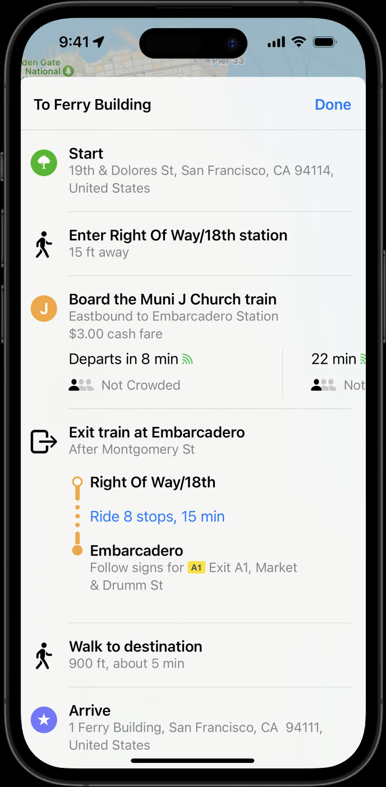
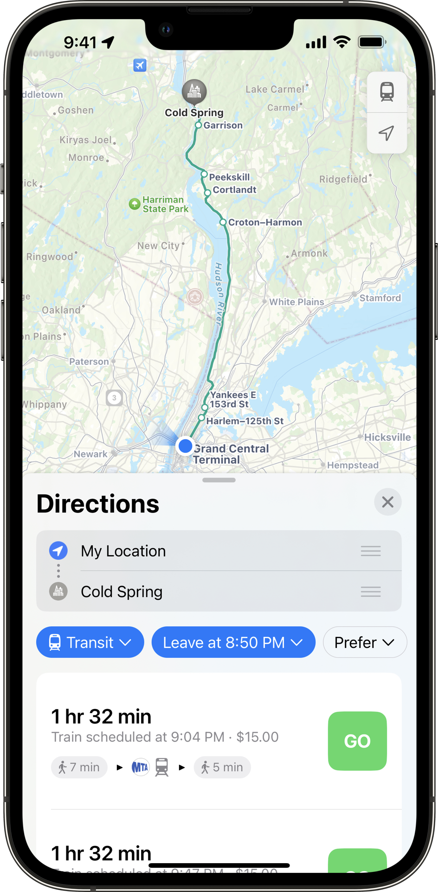

# Fares v2 
 
 Fares v2 est un projet d’extension GTFS qui vise à remédier aux limitations de Fares v1. Ce projet d’extension est adopté par itérations. Les exemples ci-dessous expliquent comment modéliser les concepts de base, y compris les produits tarifaires et comment les passagers peuvent utiliser leur tarif pour les transferts. Voir plus d’informations sur [le projet d’extension Fares v2 ici](../../../../community/extensions/fares-v2). 
 
 Entre-temps, les producteurs peuvent mettre en œuvre Fares v2 parallèlement à la mise en œuvre de Fares v1 dans le même ensemble de données, car il n’y a pas de conflit technique entre les deux. Les consommateurs auront le choix de l’implémentation à consommer indépendamment de l’autre. 
 Avec l’adoption et l’approbation suffisante de Fares v2, Fares v1 pourrait être obsolète à l’avenir. 
 En attendant, les producteurs peuvent implémenter Fares v2 parallèlement à l’implémentation de Fares v1 dans le même ensemble de données car il n’existe aucun conflit technique entre les deux. Les consommateurs auront le choix de l’implémentation à consommer indépendamment de l’autre. 
 
 Les exemples ci-dessous décrivent comment modéliser les données à l’aide de Fares v2 et peuvent être complétés par des fonctionnalités expérimentales décrites dans le [document de proposition](https://share.mobilitydata.org/gtfs-fares-v2). 
 
## Formation Fares v2 et ressources gratuites 
 
 Pour démarrer avec GTFS-Fares v2, vous pouvez regarder ces quatre didacticiels vidéo et suivre [cette ressource écrite](https://share.mobilitydata.org/Fares-v2-written-resource-guide-for-videos). 
 
 - [Vidéo 1](https://share.mobilitydata.org/faresv2-intro) : GTFS-Fares v2 : Une introduction
 - [Vidéo 2](https://share.mobilitydata.org/faresv2-setting-up-google-sheets) : GTFS-Fares v2 : Configuration de Google Sheets
 - [Vidéo 3](https://share.mobilitydata.org/faresv2-creating-and-maintaining-data) : GTFS-Fares v2 : Création et maintenance des données
 - [Vidéo 4](https://share.mobilitydata.org/faresv2-exporting-and-publishing) : Exportation et publication des GTFS-Fares v2 
 
 Ils ont été créés pour les agences de transport en commun pour comprendre l’objectif de GTFS-Fares v2, ainsi que comment utiliser Google Sheets pour créer, modifier et télécharger des données GTFS-Fares v2. 
 
 Ce [modèle Fares v2](https://share.mobilitydata.org/faresv2-template) peut être utilisé pour créer les fichiers de tarifs nécessaires à partir de zéro. 
 
## Exemples de modélisation de données Fares v2

### Définir un titre de transport 
 
 Il existe plusieurs façons de payer les tarifs pour utiliser le système Maryland Transit Administration. <a href="https://www.mta.maryland.gov/regular-fares" target="_blank">Il existe quatre types d’options au tarif régulier plein tarif :</a> 
 
 - Billet aller simple qui coûte 2,00 USD
 - Pass journalier qui coûte 4,60 USD
 - Pass hebdomadaire qui coûte 22 USD
 - Un laissez-passer mensuel qui coûte 77 $ USD 
 
 Les billets ou tarifs de transport en commun sont appelés produits tarifaires dans GTFS. Ils peuvent être décrits à l’aide du fichier [fare_products.txt](../../reference/#fare_productstxt). Chaque entrée correspond à un tarif spécifique. 
 
 [** fare_products.txt**](../../reference/#fare_productstxt) 
 
| fare_product_id  | fare_product_name  | amount  | currency  |
|------------------------|--------------------|---|---|
| core_local_oneway_fare | One Way Full Fare |  2.00 | USD  |
| core_local_1_day_fare  | 1-Day Pass - Core Service  | 4.60  | USD   |
| core_local_31_day_fare | 31-Day Pass - Core Service  | 77.00  | USD  |
| core_local_7_day_fare  | 7-Day Pass - Core Service |  22.00 | USD  | 
 
 
 [Téléchargez le flux GTFS du bus local de la Maryland Transit Administration](https://feeds.mta.maryland.gov/gtfs/local-bus) 
 

 
 
### Créer des règles pour les trajets aller simple 
 
 Dans GTFS, un trajet tarifaire correspond à un trajet effectué par un passager sans transfert entre différents modes, itinéraires, réseaux ou agences. Dans le flux de la Maryland Transit Administration, un tarif unique permet aux usagers de voyager entre n’importe quels arrêts et stations de métro au sein du réseau «principal» des bus BaltimoreLink, des itinéraires Light RailLink et Metro SubwayLink. 
 
 Les groupes de trajets tarifaires définissent des trajets au sein d’un réseau depuis une origine vers une destination (ou un ensemble d’origines vers un ensemble de destinations si les identifiants de zone correspondent à des arrêts groupés). Le fichier ci-dessous décrit les règles pour voyager n’importe où au sein du réseau central de la Maryland Transit Administration. Chaque règle correspond à l’un des produits tarifaires réguliers dans [Définir un exemple de tarif de transport](/#definir-un-titre-de-transport). 
 
 [** fare_leg_rules.txt**](../../reference/#fare_leg_rulestxt) 
 
|  leg_group_id |  network_id | fare_product_id  |
|---|---|---|
| core_local_one_way_trip | core  |  core_local_oneway_fare |
| core_local_one_way_trip | core  |  core_local_1_day_fare |
| core_local_one_way_trip | core  |  core_local_31_day_fare |
| core_local_one_way_trip | core  |  core_local_7_day_fare |
 
 [Téléchargez le flux GTFS du bus local de la Maryland Transit Administration](https://feeds.mta.maryland.gov/gtfs/local-bus) 
 

 
 
### Créer des règles pour les transferts 
 
 Il existe un transfert de 90 minutes pour les passagers qui achètent un aller simple pour emprunter les bus locaux BaltimoreLink, Metro SubwayLink ou Light RailLink. Cela signifie qu’ils peuvent transférer un nombre illimité de fois entre les bus locaux, le métro et le train léger sur rail dans un délai de 90 minutes. 
 
 [** fare_transfer_rules.txt**](../../reference/#fare_transfer_rulestxt) 
 
| from_leg_group_id       | to_leg_group_id  | duration_limit | duration_limit_type | fare_transfer_type | transfer_count |
|-------------------------|---|----------------|-------------------|---------------------|----------------|
| core_local_one_way_trip | core_local_one_way_trip  | 5400           | 1                 | 0                   | -1             |
 
 
 Le fichier ci-dessus représente cela en GTFS avec les champs suivants : 
 
 - Un transfert est possible vers et depuis des trajets qui sont un aller simple (`core_local_one_way_trip`) 
 - Le `transfer_count` est réglé à `-1` car il n’y a pas de limite sur le nombre de transferts autorisés
 - La `duration_limit` est fixée à `5400` secondes, ce qui équivaut à 90 minutes
 - La `duration_limit_type` est fixée à `1` puisque le temps de transfert commence lorsque le passager débarque de n’importe quel itinéraire dans le segment tarifaire `core_local_one_way_trip` et se termine lorsqu’il débarque d'un segment tarifaire différent. 
 - Le `fare_transfer_type` est défini sur `0` puisque les passagers ne paient que le premier tarif. Il n’y a pas de frais de transfert ni de deuxième tarif pour un transfert dans la fenêtre de 90 minutes. Par conséquent, le coût peut être modélisé comme la somme du premier tarif et la somme des frais de transfert. 
 - Le `transfer_count` est réglé sur `-1` car le passager peut transférer un nombre illimité de fois dans la fenêtre `duration_limit` de 90 minutes. 
 
 Après avoir défini le tarif, créé le `fare_leg_rule` approprié et défini le `fare_transfer_rule`, vous pouvez voir le `core_local_oneway_fare` de 2,00 $ USD apparaître dans les planificateurs de voyage. Voici un exemple de Transit : 
 

 
 

 
 
 [Télécharger le flux GTFS du bus local de la Maryland Transit Administration](https://feeds.mta.maryland.gov/gtfs/local-bus) 
 
### Décrire les emplacements de service dans la même zone tarifaire

 Certaines agences de transport en commun exploitent une structure tarifaire basée sur la zone. Les zones tarifaires sont des zones géographiques divisées associées à différents prix tarifaires. Dans le système BART de Bay Area, les tarifs sont différents selon l’origine et la destination <a href="https://www.bart.gov/sites/default/files/docs/BART%20Clipper%20Fares%20Triangle%20Chart%20July%202022.pdf" target="_blank">(différences tarifaires BART)</a>, et les usagers des transports en commun devront connaître le bon tarif. Les zones tarifaires peuvent être décrites à l’aide du fichier [stops_areas.txt](../../reference/#stop_areastxt), qui attribue les arrêts de [stops.txt](../../reference/#stopstxt) aux [areas.txt](../../reference/#areastxt). 
 
 Tout d’abord, identifiez la zone dans [areas.txt](../../reference/#areastxt). Il est acceptable de laisser « `area_name` » vide s’il n’y a pas de nom de zone. Dans le tableau ci-dessous, il y a trois `area_id` - `ASHB`, `GLEN` et `OAKL`. 
 
 [** areas.txt**](../../reference/#areastxt) 
 
| area_id | area_name |
|---------|-----------|
| ASHB    |           |
| GLEN    |           | 
| OAKL    |           | 
 
 Ensuite, en utilisant `stop_id` du fichier [stops.txt](../../reference/#stopstxt), regroupez les arrêts dans leur zone identifiée respective (zone tarifaire). 
 
 Ensuite, regroupez `stop_id` dans chaque `area_id`. Dans l’exemple BART, chaque zone ne contient qu’un seul `stop_id`. Par exemple, seul l’arrêt « ASHB » (Ashby Station) est inclus dans la zone « ASHB ». Cependant, si une zone comprend plusieurs arrêts, plusieurs `stop_id` doivent être répertoriés. 
 
 [**stops_areas.txt**](../../reference/#stop_areastxt) 
 
| area_id | stop_id |
|---------|---------|
| ASHB    | ASHB    |
| GLEN    | GLEN    | 
| OAKL    | OAKL    | 
 
 Dans `fare_leg_rules.txt`, différents produits tarifaires peuvent être identifiés en fonction de différentes zones de départ et d’arrivée. Par exemple, la première entrée affiche : 
 
 * La zone de départ est `ASHB` 
 * La zone d’arrivée est `GLEN` 
 * Le produit tarifaire pour la zone de départ/arrivée est `BA:matrix:ASHB-GLEN` 
 
 [** fare_leg_rules.txt**](../../reference/#fare_leg_rulestxt) 
 
| leg_group_id | from_area_id|to_area_id|fare_product_id|
|--------------|-----------|------------|---------------|
|   BA    |  ASHB   | GLEN | BA:matrix:ASHB-GLEN |
|     BA         |  ASKB   | OAKL | BA:matrix:ASHB-OAKL |
 
 Le tarif est identifié dans `fare_products.txt`. 
 
 [** fare_products.txt**](../../reference/#fare_productstxt) 
 
| fare_product_id     | fare_product_name| amount | currency |
|---------------------|-----------|--------|----------|
| BA:matrix:ASHB-GLEN |  generated  | 4.75   | USD      |
| BA:matrix:ASHB-OAKL  |  generated  | 9.45   | USD       |
 
 
 <a href="https://511.org/open-data/transit" target="_blank">Voir le flux régional de la région de la baie de San Francisco</a> 
 

 
 
### Décrire les supports tarifaires acceptés 
 
 Les passagers du San Francisco Muni peuvent utiliser plusieurs types de supports tarifaires différents pour payer leur trajet et valider leur tarif : 
 
 - Utiliser une <a href="https://www.clippercard.com/ClipperWeb/" target="_blank">carte Clipper</a>, le Carte de transport de Bay Area
 - Utilisez l’ <a href="https://www.sfmta.com/getting-around/muni/fares/munimobile" target="_blank">application Munimobile</a> 
 - Payez le tarif en espèces 
 
 Ces méthodes de validation sont appelées `fare_media` dans GTFS-Fares v2 et peuvent être décrites à l’aide de `fare_media.txt`. 
 
 Vous trouverez ci-dessous un exemple d’extrait du <a href="https://511.org/open-data/transit" target="_blank">flux régional de la région de la baie de San Francisco</a> accessible avec l’API 511 SF Bay. 
 
 `Clipper` est décrit comme une carte de transport physique avec `fare_media_type=2`. `SFMTA Munimobile` est décrit comme une application mobile avec `fare_media_type=2`. Le paiement en espèces n’a pas de support tarifaire, puisqu’il est remis directement au conducteur sans ticket. Par conséquent, `Cash` vaut `fare_media_type=0`. 
 
 [** fare_media.txt**](../../reference/#fare_mediatxt) 
 
| fare_media_id | fare_media_name  | fare_media_type |
|---------------|------------------|-----------------|
| clipper       | Clipper          | 2               |
| munimobile    | SFMTA MuniMobile | 4               |
| cash           | Cash             | 0               |
 
 <a href="https://511.org/open-data/transit" target="_blank">Voir le flux régional de la région de la baie de San Francisco</a> 
 
 De plus, les producteurs qui souhaitent décrire un billet physique comme support tarifaire peuvent utiliser `fare_media_type=1`. 
 
 La <a href="https://www.mbta.com" target="_blank">Massachusetts Bay Transportation Authority (MBTA)</a> permet aux utilisateurs de payer leurs déplacements et leurs pass à l’aide d’un billet papier physique appelé CharlieTicket. Pour refléter cela, il existe un média tarifaire `charlieticket` dans le flux de MBTA avec un `fare_media_type=1`. 
 
 [** fare_media.txt**](../../reference/#fare_mediatxt) 
 
| fare_media_id | fare_media_name  | fare_media_type |
|---------------|------------------|-----------------|
|cash           |Cash              |0                |
|charlieticket  |CharlieTicket     |1                |
|mticket        |m Ticket app      |4                |
 
 <a href="https://www.mbta.com/developers/gtfs" target="_blank">Voir le flux de la Massachusetts Bay Transportation Authority</a> 
 
### Définir les différences de prix en fonction du support tarifaire 
 
 Le prix du tarif de Muni est différent en fonction du support tarifaire utilisé par le passager. Cet exemple expliquera comment le prix du tarif local pour adultes change lors de l’utilisation d’espèces ou d’une carte Clipper. Un tarif local pour adulte payé en espèces coûte 3 $ US et le même tarif payé avec la carte Clipper coûte 2,50 $, soit 50 cents de moins. 
 
 Chaque entrée ci-dessous décrit un support tarifaire. 
 
 [** fare_media.txt**](../../reference/#fare_mediatxt) 
 
| fare_media_id | fare_media_name  | fare_media_type |
|---------------|------------------|-----------------|
| clipper       | Clipper          | 2               |
| cash           | Cash             | 0               |
 
 L’extrait de fichier `fare_products.txt` ci-dessous montre comment le montant du produit `Muni single local fare` varie en fonction du support tarifaire utilisé par le passager. 
 
 [** fare_products.txt**](../../reference/#fare_productstxt) 
 
| fare_product_id | fare_product_name  | amount | currency | fare_media_id |
|---------------|------------------|-------|--- |---------------|
| SF:local:single | Muni single local fare | 3     | USD | cash |
| SF:local:single | Muni single local fare  | 2.5   |USD | clipper |
 
 Dans Apple Maps, les passagers peuvent voir l’évolution du prix de leur billet. Vous pouvez comparer les prix des billets sous l’instruction « Board the Muni J Church train » : 
 

 
 
 

 
 
 <a href="https://511.org/open-data/transit" target="_blank">Voir le flux régional de la région de la baie de San Francisco</a> 
 
 
### Décrire une option de support tarifaire sans contact 
 
 <a href="https://vimeo.com/539436401" target="_blank">Le Clean Air Express dans le nord du comté de Santa Barbara accepte les paiements sans contact</a> par carte de crédit, Google Pay et Apple Pay. 
 
 Dans le flux Clean Air Express, il existe un média tarifaire `tap_to_ride` avec un `fare_media_type=3`, puisqu’il s’agit d’une option cEMV (Europay, Mastercard et Visa sans contact). 
 
| fare_media_id | fare_media_name | fare_media_type |
|---------------|-----------------|-----------------|
| tap_to_ride   | Tap to Ride   | 3  |
 
 Le produit tarifaire aller simple présenté ci-dessous propose à la fois des options de support tarifaire `cash` et `tap-to-ride`. Lorsque le trajet simple est payé avec le tarif `tap-to-ride`, il coûte un dollar de moins. 
 
 [** fare_products.txt**](../../reference/#fare_productstxt) 
 
| fare_product_id | fare_product_name  | fare_media_id | amount | currency |
|---------------|------------------|---------------|--------|----------|
| single-ride | Single Ride | tap_to_ride       | 6      | USD      |
| single-ride | Single Ride |       | 7      | USD      |
 
 <a href="https://gtfs.calitp.org/production/CleanAirExpressFaresv2.zip" target="_blank">Télécharger le flux Clean Air Express</a> 
 
 
### Définir des différences de prix en fonction de l’heure et du jour du trajet 
 
 Certaines agences de transport varient leurs tarifs en fonction de l’heure et/ou du jour de la semaine. Cela signifie que les tarifs sont associés à une période de temps pendant laquelle le voyage est effectué, comme les heures de pointe, les heures creuses ou le week-end. 
 
 Les tarifs Metrorail de Washington DC varient en fonction de plusieurs facteurs, notamment le jour et l’heure du voyage. Les tarifs à durée variable dans GTFS peuvent être définis à l’aide de `timeframes.txt`, dans lequel il est possible de désigner des périodes de temps spécifiques qui peuvent ensuite être associées dans `fare_leg_rules.txt` pour attribuer le produit tarifaire applicable qui correspond à l’heure à laquelle le voyage est fait. Ce qui suit est un exemple fictif, basé sur les tarifs WMATA au printemps 2023. 
 
 Premièrement, les jours de service sont définis à l’aide de `calendar.txt`. 
 
 [** calendar.txt**](../../reference/#calendartxt) 
 
| service_id       | monday | tuesday | wednesday | thursday | friday | saturday | sunday | start_date | end_date |
|------------------|--------|---------|-----------|----------|--------|----------|--------|------------|----------|
| weekday_service  | 1      | 1       | 1         | 1        | 1      | 0        | 0      | 20220708   | 20221231 |
| saturday_service | 0      | 0       | 0         | 0        | 0      | 1        | 0      | 20220708   | 20221231 |
| sunday_service   | 0      | 0       | 0         | 0        | 0      | 0        | 1      | 20220708   | 20221231 |
 
 
 Ensuite, les périodes horaires souhaitées sont définies dans `timeframes.txt`, en fournissant un identifiant, les jours applicables via une référence à `calendar.service_id`, et le cas échéant, l’heure de début et l’heure de fin pour chaque période horaire. 
 
 [** timeframes.txt**](../../reference/#timeframestxt) 
 
| timeframe_group_id | start_time | end_time | service_id       |
|--------------------|------------|----------|------------------|
| weekday_peak       | 5:00:00    | 9:30:00  | weekday_service  |
| weekday_offpeak    | 9:30:00    | 15:00:00 | weekday_service  |
| weekday_peak       | 15:00:00   | 19:00:00 | weekday_service  |
| weekday_offpeak    | 19:00:00   | 21:30:00 | weekday_service  |
| weekday_late_night | 21:30:00   | 24:00:00 | weekday_service  |
| weekday_late_night | 00:00:00   | 5:00:00  | weekday_service  |
| weekend            |            |          | saturday_service |
| weekend            |            |          | sunday_service   |
 
 Ensuite, les tarifs spécifiques à une heure correspondants dans `fare_products.txt` sont créés (par exemple, tarif Peak) 
 
 [** fare_products.txt**](../../reference/#fare_productstxt)

| fare_product_id | fare_product_name                             | amount | currency |
|-----------------|-----------------------------------------------|--------|----------|
| peak_fare       | Peak fare                                     | 5      | USD      |
| regular_fare    | Off-peak fare                                 | 3      | USD      |
| weekend_fare    | Weekend Metrorail one-way fare                | 2      | USD      |
| late_night_fare | Late Night flat fare (Mon - Fri after 9:30pm) | 2      | USD      |
 
 Enfin, les périodes horaires sont associées aux produits tarifaires dans `fare_leg_rules.txt` à l’aide des champs `from_timeframe_group_id` et `to_timeframe_group_id`. Ces champs déterminent si un tarif s’applique uniquement au début du trajet ou à la fois au début et à la fin du trajet. 
 Pour cet exemple, basé sur les tarifs WMATA, le tarif dépend uniquement de l’heure de départ du trajet, donc `to_timeframe_group_id` est laissé vide. 
 
 [** fare_leg_rules.txt**](../../reference/#fare_leg_rulestxt) 
 
| network_id | fare_product_id | from_timeframe_group_id | to_timeframe_group_id |
|------------|-----------------|-------------------------|-----------------------|
| 1          | weekend_fare    | weekend                 |                       |
| 1          | late_night_fare | weekday_late_night      |                       |
| 1          | peak_fare       | weekday_peak            |                       |
| 1          | regular_fare    | weekday_offpeak         |                       |
 
 Notez que `network_id` fait référence à la clé étrangère `networks.network_id` ou `routes.network_id`, et que la sélection du produit tarifaire correct pour chaque voyage sera une combinaison d’heures d’arrivée et de départ de `stop_times.txt` ainsi que les heures définies dans `timeframes.txt`. 
 
 Dans ce cas, un utilisateur payant pour un trajet partant à 7h30 devrait payer 5,00 USD (tarif pointe) tandis qu’un autre utilisateur partant à 11h30 ne devrait payer qu’un tarif de 3,00 USD ( Tarif heures creuses). 
 
 
### Définir des tarifs variables dans le temps ainsi que des tarifs basés sur la zone 
 
 Dans le réseau ferroviaire MTA Metro-North de New York, les tarifs varient en fonction à la fois de l’heure du jour du voyage, ainsi que de les zones d’origine et de destination du voyage. L’exemple suivant illustre les règles tarifaires applicables à un trajet de la gare Grand Central à Cold Spring (NY, États-Unis). 
 
 Cet exemple est basé sur un <a href="https://docs.google.com/spreadsheets/d/1-cD-R2OH5xAQAbNWNlrXD7WOw594lVdW-bomuLo6bI8/edit?usp=sharing" target="_blank">ensemble de données</a> produit par <a href="https://www.itoworld.com/" target="_blank">ITO World</a>, présentant un voyage qui utilise dix arrêts répartis dans six zones différentes. 
 
 [** stops.txt**](../../reference/#stopstxt) 
 
| stop_id | stop_name           | stop_lat  | stop_lon   |
|---------|---------------------|-----------|------------|
| ITO1669 | Peekskill           | 41.285103 | -73.930916 |
| ITO1777 | Beacon              | 41.505814 | -73.984474 |
| ITO1789 | New Hamburg         |  41.58691 | -73.947624 |
| ITO1804 | Croton-Harmon       | 41.190002 | -73.882393 |
| ITO1824 | Cortlandt           | 41.246258 | -73.921783 |
| ITO1856 | Garrison            | 41.381126 | -73.947334 |
| ITO1887 | Harlem-125th Street | 40.805256 | -73.939148 |
| ITO1897 | Cold Spring         | 41.415382 | -73.958092 |
| ITO2096 | Poughkeepsie        | 41.707058 |  -73.93792 |
| ITO2383 | Grand Central       | 40.752823 | -73.977196 |
 
 
 [** stop_areas.txt**](../../reference/#stop_areastxt) 
 
| area_id   | stop_id |
|-----------|---------|
| mnr_1     | ITO1887 |
| mnr_1     | ITO2383 |
| mnr_HUD-5 | ITO1804 |
| mnr_HUD-6 | ITO1669 |
| mnr_HUD-6 | ITO1824 |
| mnr_HUD-7 | ITO1856 |
| mnr_HUD-7 | ITO1897 |
| mnr_HUD-8 | ITO1777 |
| mnr_HUD-8 | ITO1789 |
| mnr_HUD-9 | ITO2096 |
 
 
 [** route_networks.txt**](../../reference/#route_networkstxt) 
 
| network_id | route_id |
|------------|----------|
| mnr_hudson | 669      |
 
 
 [** networks.txt**](../../reference/#networkstxt) 
 
| network_id | network_name    |
|------------|-----------------|
| mnr_hudson | MNR Hudson Line |
 
 Les jours de service pour les trains 3 et 13 sont définis à l’aide de `calendar.txt`. Notamment, d’autres entrées avec des jours génériques (c’est-à-dire les jours de la semaine, le week-end et n’importe quel jour) qui ne sont associées à aucun voyage sont définies, et celles-ci seront associées à des périodes horaires afin de modéliser des `time-variable fares`. 
 
 [** calendar.txt**](../../reference/#calendartxt) 
 
| service_id | monday | tuesday | wednesday | thursday | friday | saturday | sunday | start_date | end_date |
|------------|--------|---------|-----------|----------|--------|----------|--------|------------|----------|
| 13         | 1      | 1       | 1         | 1        | 1      | 0        | 0      | 20230612   | 20231006 |
| 3          | 1      | 1       | 1         | 1        | 1      | 0        | 0      | 20230609   | 20231006 |
| weekdays   | 1      | 1       | 1         | 1        | 1      | 0        | 0      | 20220101   | 20240101 |
| weekends   | 0      | 0       | 0         | 0        | 0      | 1        | 1      | 20220101   | 20240101 |
| anyday     | 1      | 1       | 1         | 1        | 1      | 1        | 1      | 20220101   | 20240101 |
 
 
 Les entrées sont créés dans `timeframes.txt`, y compris les cas où l’heure couvre la période de 24 heures (« à tout moment », « jours de la semaine » et « week-end ») et les périodes de pointe et hors pointe : 
 
 * AM Peak : de 6h à 10h en semaine 
 * AM2PM Peak : de 6h à 9h et de 16h à 20h en semaine 
 * Not AM Peak : horaire de la semaine non inclus en AM Peak 
 * Pas AM2PM Peak : heure de la semaine non incluse dans AM2PM Peak 
 
 [** timeframes.txt**](../../reference/#timeframestxt) 
 
| timeframe_group_id | start_time | end_time | service_id |
|:------------------:|:----------:|:--------:|:----------:|
|       anytime      |  00:00:00  | 24:00:00 |   anyday   |
|      weekdays      |  00:00:00  | 24:00:00 |  weekdays  |
|      weekends      |  00:00:00  | 24:00:00 |  weekends  |
|     mnr_ampeak     |  06:00:00  | 10:00:00 |  weekdays  |
|    mnr_notampeak   |  00:00:00  | 06:00:00 |  weekdays  |
|    mnr_notampeak   |  10:00:00  | 24:00:00 |  weekdays  |
|    mnr_am2pmpeak   |  06:00:00  | 09:00:00 |  weekdays  |
|    mnr_am2pmpeak   |  16:00:00  | 20:00:00 |  weekdays  |
|  mnr_notam2pmpeak  |  00:00:00  | 06:00:00 |  weekdays  |
| mnr_notam2pmpeak   | 09:00:00   | 16:00:00 | weekdays   |
| mnr_notam2pmpeak   | 20:00:00   | 24:00:00 | weekdays   |
 
 
 Chaque produit tarifaire individuel est défini dans `fare_products.txt`. Étant donné que Cold Spring est situé dans la zone 7, cet exemple répertorie uniquement les trajets entre les zones 1 et 7. Le jeu de données complet comprendrait un enregistrement pour chaque prix défini par une combinaison d’heure et de zone. De plus, l’exemple n’affiche qu’un seul support tarifaire (`paper`), mais des combinaisons supplémentaires pourraient être créées si les prix variaient également en fonction du support tarifaire. 
 
 [** fare_products.txt**](../../reference/#fare_productstxt) 
 
| fare_product_id        | fare_product_name                  | fare_media_id | amount | currency |
|------------------------|------------------------------------|---------------|--------|----------|
| mnr_1:HUD-7_adult_peak | Outbound Adult Peak Zonal Fare     | paper         | 20.00  | USD      |
| mnr_1:HUD-7_adult      | Outbound Adult Off Peak Zonal Fare | paper         | 15.00  | USD      |
| mnr_HUD-7:1_adult_peak | Inbound Adult Peak Zonal Fare      | paper         | 20.00  | USD      |
| mnr_HUD-7:1_adult      | Inbound Adult Off Peak Zonal Fare  | paper         | 15.00  | USD      |
 
 Enfin, les combinaisons de zones d’origine et de destination, ainsi que leurs périodes horaires respectives sont associées au produit tarifaire correspondant dans `fare_leg_rules.txt`. Ici, les voyages commençant ou arrivant dans la zone 1 (c’est-à-dire `area_id=mnr_1`) pendant les heures de pointe sont soumis à un tarif de pointe spécifique correspondant aux zones d’arrivée et de départ du voyage (c’est-à-dire `fare_product_id=mnr_1:HUD-7_adult_peak`). 
 
 [** fare_leg_rules.txt**](../../reference/#fare_leg_rulestxt) 
 
| network_id | from_area_id | to_area_id | fare_product_id        | from_timeframe_group_id | to_timeframe_group_id |
|------------|--------------|------------|------------------------|-------------------------|-----------------------|
| mnr_hudson | mnr_1        | mnr_HUD-7  | mnr_1:HUD-7_adult      | mnr_notam2pmpeak        | anytime               |
| mnr_hudson | mnr_1        | mnr_HUD-7  | mnr_1:HUD-7_adult      | weekends                | anytime               |
| mnr_hudson | mnr_1        | mnr_HUD-7  | mnr_1:HUD-7_adult_peak | mnr_am2pmpeak           | anytime               |
| mnr_hudson | mnr_HUD-7    | mnr_1      | mnr_HUD-7:1_adult      | weekdays                | mnr_notampeak         |
| mnr_hudson | mnr_HUD-7    | mnr_1      | mnr_HUD-7:1_adult      | weekends                | anytime               |
| mnr_hudson | mnr_HUD-7    | mnr_1      | mnr_HUD-7:1_adult_peak | weekdays                | mnr_ampeak            |
 
 
 En utilisant cet ensemble de données, un utilisateur embarquant dans le train#869 (`service_id=3`) dont le départ est prévu de Grand Central (zone `mnr_1`) à 18h45 devrait payer un tarif "Outbound Adult Peak Zonal Fare" de 20,00 USD, puisque le voyage est originaire de la période `mnr_am2pmpeak` et de la `zone mnr_1`. 
 
 Alternativement, un utilisateur voyageant dans le train n° 883 (`service_id= 13`) paierait un tarif "Outbound Adult Off Peak Zonal Fare" de seulement 15,00 USD, car ce train doit partir de Grand Central (zone `mnr_1`) à 21h04. 
 
 Dans <a href="https://apple.com/maps" target="_blank">Apple Maps</a>, les passagers peuvent voir l’évolution du prix de leur billet et comparer les prix en fonction du départ prévu du train : 
 

 
  
  

 
