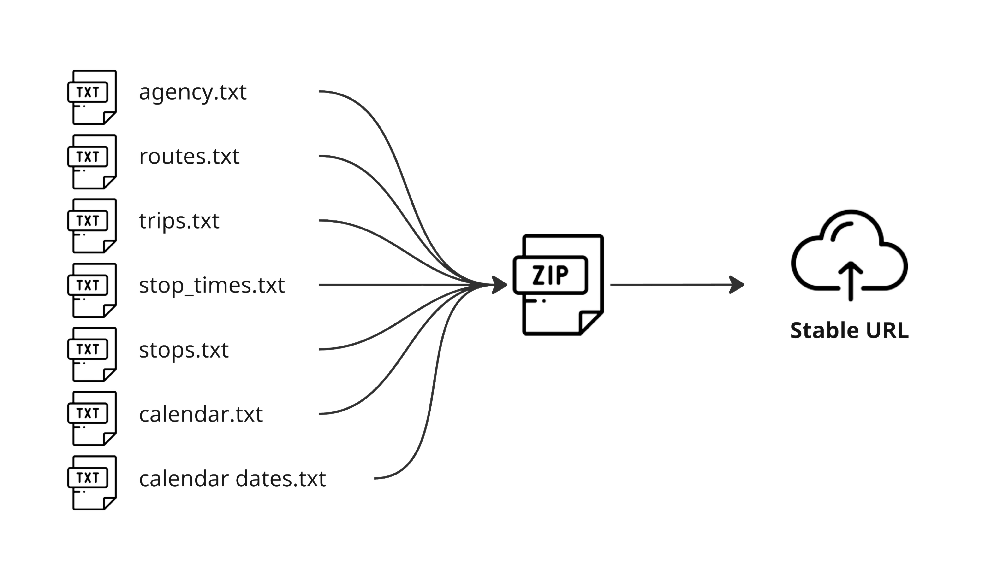
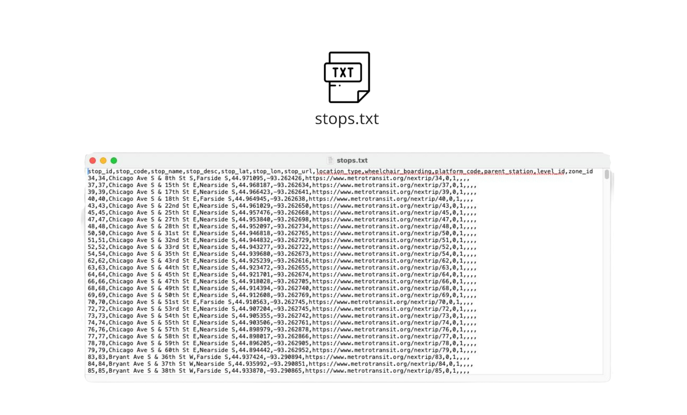
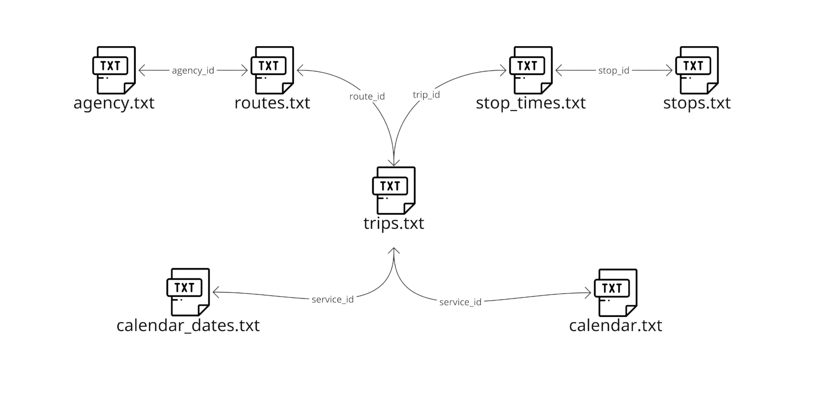

# Création d’un ensemble de données GTFS

## Présentation d’un flux GTFS 
 Tous les flux GTFS commencent par un ensemble de données au format GTFS Reference, qui est une série de fichiers CSV enregistrés avec une extension de fichier.txt [^1]. Dans sa mise en œuvre la plus basique, un ensemble de données GTFS commence généralement avec sept fichiers de base, combinés dans un fichier.zip hébergé sur une URL stable et publique : il s’agit du flux GTFS. 

 
 
 Chaque fichier est constitué d’une liste de plusieurs enregistrements (lignes de données) avec plusieurs champs d’information. Par exemple, chaque ligne répertoriée dans [routes.txt](../../documentation/schedule/reference/#routestxt) représente un itinéraire de transport public et ses champs décrivent plusieurs éléments de cet itinéraire, comme son nom, sa description, son mode d’exploitation.agence, etc. 
 
 
 
 Les fichiers de base d’un jeu de données GTFS peuvent être décrits comme suit : Un jeu de données de planification GTFS comporte une ou plusieurs routes ([routes.txt](../../documentation/schedule/reference/#routestxt)), chaque itinéraire comporte un ou plusieurs trajets ([trips.txt](../../documentation/schedule/reference/#tripstxt)), chaque trajet visite une série d’arrêts ([stops.txt](../../documentation/schedule/reference/#stopstxt)) à des heures spécifiées ([stop_times.txt](../../documentation/schedule/reference/#stop_timestxt)). Les Trajets et les horaires d’arrêts contiennent uniquement des informations sur l’heure de la journée ; le calendrier est utilisé pour déterminer les jours auxquels un voyage donné a lieu ([calendar.txt](../../documentation/schedule/reference/#calendartxt) et [calendar_dates.txt](../../documentation/planning/reference/#calendar_datestxt)). De plus, plusieurs agences ([agency.txt](../../documentation/schedule/reference/#agencytxt)) peuvent exploiter plusieurs itinéraires. Ces fichiers sont liés les uns aux autres avec des champs qui font l’objet de références croisées entre eux. 

 
 
 Une fois ces fichiers configurés pour créer un ensemble de données GTFS de base, des fichiers supplémentaires (facultatifs) peuvent être ajoutés pour activer d’autres fonctionnalités ou des besoins spécifiques entre les agences de transport en commun et les fournisseurs. Quelques exemples de ces fichiers incluent : 
 
 - [shapes.txt](../../documentation/schedule/reference/#shapestxt) qui permet de représenter graphiquement le chemin d’un voyage, 
 - [pathways.txt](../../documentation/schedule/reference/#pathwaystxt) qui fournit des informations permettant de générer des itinéraires pour aider les utilisateurs à naviguer dans les stations, 
 - [frequencies.txt](../../documentation/schedule/reference/#frequenciestxt) qui fournit une autre façon de spécifier les horaires d’arrêts. 
 
 Pour plus d’informations sur toutes les fonctionnalités GTFS pouvant être activées, consultez la section [« Que peut faire GTFS ? »](../features/overview/). 
 
 Un ensemble de données GTFS Schedule peut être complété par des informations en temps réel telles que la position des véhicules et les mises à jour de service. Pour ce faire, un flux GTFS Realtime doit être créé séparément de l’ensemble de données GTFS Schedule existant. 
 
 Un flux GTFS Realtime consiste en un fichier binaire régulier servi via HTTP et mis à jour fréquemment, tout type de serveur Web peut héberger et servir le fichier. Le format d’échange de données GTFS Realtime est basé sur [Protocol Buffers](https:), un mécanisme indépendant du langage et de la plate-forme pour la sérialisation des données structurées. GTFS Realtime peut fournir trois types d’informations : mises à jour de trajet, alertes de service et positions du véhicule, celles-ci peuvent être combinées en fonction des informations de service qui doivent être communiquées. 
 
 Étant donné que GTFS Realtime permet de présenter l’état réel d’une flotte, le flux doit être mis à jour régulièrement- de préférence chaque fois que de nouvelles données proviennent du système de localisation automatique des véhicules du service. Combinés, l’ensemble de données GTFS Schedule et un flux GTFS Realtime permettent aux applications consommatrices de fournir des informations précises et à jour aux passagers. Pour plus d’informations, consultez la documentation technique. 
 
## Vous produisez votre premier flux GTFS ? 
 
 Si vous êtes une agence souhaitant produire votre premier flux GTFS, la première chose à faire est de lire la documentation existante. 
 
 Commencez par explorer les capacités de GTFS dans la section ["Que peut faire GTFS ?"](../features/overview) et déterminez les différentes fonctionnalités de votre service de transport en commun que vous souhaitez représenter à l’aide du format GTFS. Pour une exploration plus approfondie, la documentation de référence officielle de [GTFS Schedule](../../documentation/schedule/reference) et [GTFS Realtime](../../documentation/realtime/reference) propose des des conseils sur la modélisation de ces fonctionnalités et la garantie de leur conformité. 
 
 Ensuite, collectez toutes les données requises de votre système. Cela inclut des informations sur tous les arrêts, itinéraires, horaires, tarifs, etc., car bon nombre de ces détails constitueront les entrées qui alimenteront l’ensemble de données GTFS. 
 
 En fonction de la taille et de la complexité de votre système, vous avez la possibilité de créer les données en interne ou de faire appel à un fournisseur GTFS externe pour transformer les données au format GTFS. 
 
 Dans certains cas, les petites agences disposant d’une poignée d’itinéraires créent elles-mêmes les données à l’aide de logiciels couramment disponibles tels que des feuilles de calcul et des éditeurs de texte. 
 
 Lorsqu’elles traitent un système plus vaste, la plupart des agences acquièrent un logiciel de gestion GTFS spécialisé auprès de fournisseurs spécialisés, mais certaines peuvent opter pour le développement de leurs propres outils internes. Enfin, lorsque les caractéristiques du système s’avèrent difficiles pour les agences qui souhaitent rédiger elles-mêmes des ensembles de données, la production GTFS peut être entièrement sous-traitée à des sociétés spécialisées dans la production de données GTFS. 
 
 <a href="https://www.flaticon.com/authors/freepik" title="Icônes par Freepik">Icônes créées par Freepik- Flaticon</a> 
 
 [^1]: En plus des fichiers texte, le format [GeoJSON](https://geojson.org/) est désormais également supporté en GTFS pour représenter certains éléments de services à la demande. 
