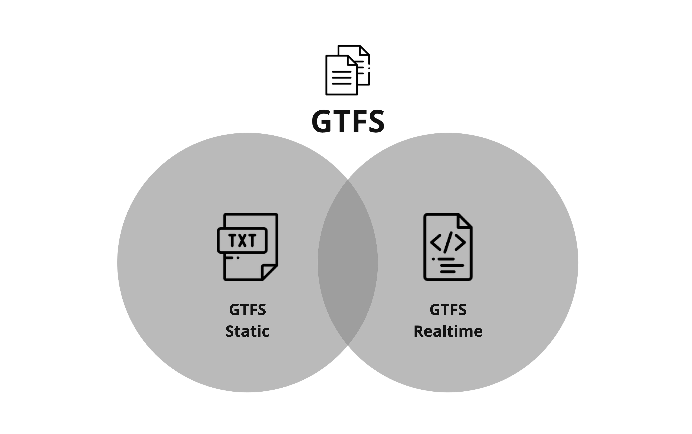

# GTFS : Rendre les données sur les transports en commun universellement accessibles

## Une norme de données ouverte pour les informations sur les passagers en transport en commun 
 
 La General Transit Feed Specification, également connue sous le nom de GTFS, est un format de données standardisé qui fournit une structure pour que les __agences de transport en commun__ décrive les informations de leurs services tels que les horaires, les arrêts, les tarifs, etc. 
 
 Il permet aux __agences de transport en commun__ de publier leurs données de transport en commun dans un format qui peut être utilisé par une grande variété d’applications logicielles, le plus souvent des planificateurs d'itinéraire. Cela signifie que les utilisateurs peuvent facilement obtenir des informations d'itinéraire pour accéder aux services de transport en commun en utilisant leur smartphone ou un appareil similaire. 

 
 
 Aujourd’hui, GTFS est l'[Open Standard](https://www.interoperablemobility.org/definitions/#open_standard) incontournable pour des milliers de fournisseurs de transports publics dans le monde. Certaines agences produisent elles-mêmes ces données, tandis que d’autres font appel à un fournisseur pour créer et gérer leurs données. 
 
## Prise en charge des données statiques et dynamiques 
 
 GTFS se compose de deux parties principales : [GTFS Schedule](../../documentation/schedule/reference) et [GTFS Realtime](../../documentation/realtime/reference). 

 

 GTFS Schedule contient des informations sur les itinéraires, les horaires, les tarifs et les arrêts, parmi de nombreuses autres fonctionnalités, et il est présenté dans des fichiers texte simples[^1]. Ce format simple permet une création et une maintenance faciles sans recourir à des logiciels complexes ou propriétaires. 
 
GTFS Realtime contient des mises à jour de trajet, la position des véhicules et des alertes de service, en utilisant le format [Protocol Buffers](https://developers.google.com/protocol-buffers/). Cette partie de GTFS fonctionne en conjonction avec GTFS Schedule afin d’informer les passagers des perturbations de service et des heures d’arrivée en temps réel. 
 
La documentation de référence GTFS Schedule et GTFS Realtime est disponible dans la [Section Documentation Technique](../../documentation/overview). 

<iframe class="center" width="560" height="315" src="https://www.youtube-nocookie.com/embed/SDz2460AjNo?si=wFsaN4_Hr3ypxWdp" title="YouTube video player" frameborder="0" allow="accelerometer; autoplay; clipboard-write; encrypted-media; gyroscope; picture-in-picture; web-share" allowfullscreen></iframe>

<a href="https://www.flaticon.com/authors/freepik" title="Icônes par Freepik">Icônes créées par Freepik- Flaticon</a> 
 
[^1]: En plus des fichiers texte, le format [GeoJSON](https://geojson.org/) est désormais également supporté en GTFS pour représenter certains éléments de services à la demande. 
