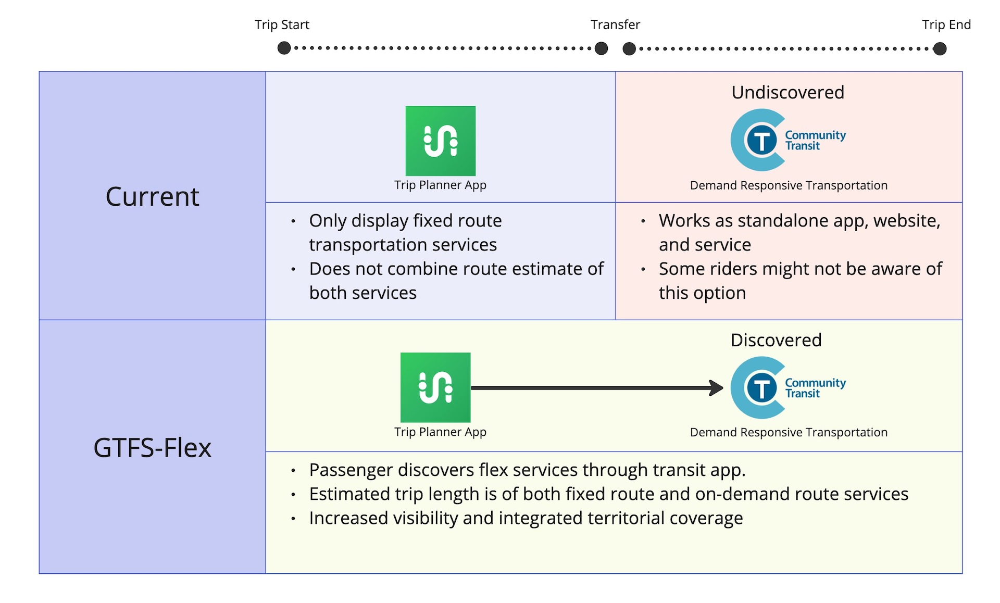

# GTFS-Flex {: #gtfs-flex}

GTFS-Flex は、デマンド型交通サービスの発見可能性を高めることを目的とした GTFS Schedule の拡張プロジェクトです。  

その大部分は 2024年3月に GTFS に採用されました。公式に採用された GTFS-Flex の一部を使用してどのようなモデル化が可能かについては、[このページ](../../../documentation/schedule/examples/flex) にいくつかの例があります。  

🤔 ダイヤル式乗合サービスのようなサービスは、乗客に見過ごされることが多く、存在すら知られていない場合があります。このアクセス性の欠如は、交通事業者、経路検索アプリ、乗客にとって問題です。例えば、観光客のグループがあなたの地域の空港に到着し、オンデマンドバスサービスしか提供されていない農村地域に行きたいとします。観光客はお気に入りの経路検索アプリを確認しますが、利用可能な公共交通手段が見つかりません。結局、彼らは車を借りることになります。観光客であるため、廊下に掲示されたオンデマンドサービスを告知する紙のチラシも見逃してしまいます。結果として、あなたのサービスは十分に利用されず、現在および将来の乗客需要に応えるための発見可能性を欠いてしまいます。ここで GTFS-Flex が役立ちます。GTFS-Flex は乗客があなたのサービスを発見できるようにし、あなたが一生懸命に普及させようとしたサービスを楽しんでもらえるようにします。  

🔮 MobilityData は、GTFS-Flex がデマンド型交通のさらなる標準化への扉を開くことを期待しています。これには、GTFS-OnDemand を用いた取引やリアルタイム要素への拡張も含まれます。私たちは、この分野における交通手段の増加と概念の複雑化に最適に対応するための推奨戦略を準備しています。  

[完全な提案を見る](https://github.com/MobilityData/gtfs-flex){ .md-button .md-button--primary }  

## 最新のプルリクエスト {: #latest-pull-request}

この拡張は、時刻表に従って運行するサービスを記述しますが、以下のような1つ以上の柔軟な機能も含みます:

- **ダイヤル式乗合サービス (Dial-a-ride service)**: 車両は特定の運行時間内に乗降が許可されているゾーンを運行します。
- **ルート偏差サービス (Route deviation services)**: 車両は固定ルートと順序付けられた停留所等(stop)を運行しますが、停留所等(stop)間で乗客を乗降させるために迂回することができます。
- **地点からゾーンへのサービス (Point-to-zone service)**: 乗客は鉄道駅のような固定された停留所等(stop)から乗車し、エリア内の任意の場所で降車することができ、またはその逆も可能です。一部の場所からの出発は、他のサービスと時刻が調整されている場合があります。
- **地点偏差またはチェックポイントサービス (Point deviation or checkpoint service)**: 乗客は固定された停留所等(stop)から乗車し、順序付けられていない停留所等(stop)のリストの中から任意の場所で降車することができ、またはその逆も可能です。運転手はリクエストがあった停留所等(stop)のみを運行します。

詳細については、[original proposal](https://github.com/MobilityData/gtfs-flex/blob/master/spec/reference.md) および [issue#382](https://github.com/google/transit/issues/382)（スコープ変更によりクローズ済み）をご覧ください。

6月28日の作業会議において、グループコミュニティは、現在生成および利用されているすべてのフィールドをカバーするイテレーションを進めることで合意しました。したがって、[adoption tracker](#adoption-tracker) に「**in discussion**」として表示されているすべてのフィールドがこのPRに含まれています。

このPRでの変更点は以下の通りです:

- ファイルの修正:
    - `stop_areas.txt` を修正し、GeoJSONロケーションおよび/または停留所等(stop)のグループ化を可能にし、これらの機能の事前定義されたグループを `stop_times.txt` の個別の行で指定できるようにします。
    - `stop_times.txt` を修正し、追加および拡張されたファイルやフィールドをデータ利用者がどのように解釈すべきかを明確にするために、現行仕様の要素を明示します。
- ファイルの拡張:
    - `stop_times.txt` に `start_pickup_drop_off_window` および `end_pickup_drop_off_window` を追加し、GeoJSONロケーション、停留所エリア、または停留所等(stop)においてデマンド型交通サービスが利用可能になる/終了する時間を定義します。
    - `stop_times.txt` に `pickup_booking_rule_id` および `drop_off_booking_rule_id` を追加し、予約ルールへのリンクを定義します。
- 新しいファイルの追加:
    - `locations.geojson`: 乗客が乗車または降車をリクエストできるゾーン（`Polygon` または `Multipolygon`）を定義します。
    - `booking_rules.txt`: 乗客にサービスのリクエスト方法を知らせる予約ルールを定義します。

こちらは、ドイツのアンガーミュンデおよびガルツァーにおける [RufBus](https://uvg-online.com/rufbus-angermuende/) の [データ例](https://docs.google.com/spreadsheets/d/1w5EHuHfxvejqApJFHA1Z0K2KytD9zahwbf8zyRlP_Ls/edit#gid=1451132209) です。以下の画像は、旅程プランナーでデータがどのように表示されるかを示す例です:

プルリクエストのページにアクセスして、全文を読み、議論に参加してください。 

[プルリクエストを見る](https://github.com/google/transit/pull/388){ .md-button .md-button--primary }

[Slack の #gtfs-flex に参加する](https://share.mobilitydata.org/slack){ .md-button .md-button--primary }

## 初期実装例 {: #early-implementations}

以下は GTFS-Flex の初期実装例です。現在の実装については [Mobility Database](https://mobilitydatabase.org/) をご覧ください。

- [MNDoT Flex パイロットプロジェクト: Trillium, IBI, Transit, MNDoT, Cambridge Systematics, および Token Transit](https://blog.transitapp.com/case-study/mndot-gtfs-flex-bringing-rural-riders-into-the-fold/) 
- [Open Trip Planner](https://www.opentripplanner.org/)
- [バーモント州の Mobility on Demand Sandbox](https://www.connectingcommuters.org/)
- [Tulare County Area Transit](https://gotcrta.org/)
- [Northwest Oregon Transit Alliance (NW Connector)](https://nwconnector.org/other-services/)
- [Vamos Mobility App](https://vamosmobileapp.com/)
- [RTD Denver Flexride](https://www.rtd-denver.com/services/flexride)
- [ネブラスカ州公共交通 DRT OTP プロジェクト: Trillium, Olsson, Cambridge Systematics, および TransitPlus](https://trips.nebraskatransit.com/#/)
- [One-Call/One-Click プロジェクト: Find a Ride の旅程プランナー](https://www.findaride.org/tripplanner)

このページにあなたの GTFS-Flex 実装を追加するにはご連絡ください。

<a class="md-button md-button--primary" href=mailto:specification@mobilitydata.org >お問い合わせ</a>

## 採用状況トラッカー {: #adoption-tracker}

### 現在 {: #current}

<iframe class="airtable-embed" src="https://airtable.com/embed/appopXWyO2ne6THIw/shrUPyCZWOWrvO2mX?backgroundColor=purple" frameborder="0" onmousewheel="" width="100%" height="533" style="background: transparent; border: 1px solid #ccc;"></iframe>

[変更をリクエスト](https://airtable.com/shrcac1fXUrMxfoDV){ .md-button .md-button--primary }  
[組織を追加（利用者向け）](https://airtable.com/shrgnVR5Su9tkHvUv){ .md-button .md-button--primary }  
[組織を追加（提供者向け）](https://airtable.com/shrsU4idBtcLuRuwZ){ .md-button .md-button--primary }  

## 歴史 {: #history}

- **2013年**: Brian Ferris (Google) によって最初の提案が作成される
- **2016年**: <a href="https://github.com/MobilityData/gtfs-flex/tree/master" target="_blank">GTFS-Flex GitHub 議論が開始</a>
- **2017年**: <a href="https://www.oregon.gov/odot/RPTD/RPTD%20Document%20Library/GTFS-Flex-N-CATT.pdf" target="_blank">Mobility on Demand (MOD) サンドボックスプログラム (FTA, Vermont DOT, OTP)</a>
- **2018年**: MobilityData が GTFS-Flex の管理者となり、GTFS-Flex v2 を提案
- **2020年11月**: リポジトリが最新の GTFS-Flex に更新され、OTP2 が GTFS-Flex v2 データを取り込む
- **2022年5月**: MnDoT パイロット開始 (Cambridge Systematics, MNDoT, Token Transit, Transit, Trillium (OptiBus))  
- **2023年5月**: <a href="https://github.com/google/transit/issues/382" target="_blank">GTFS-Flex に関する作業: サービスディスカバリー開始</a>
- **2023年6月**: <a href="https://mobilitydata.org/recap-mobilitydata-working-meeting-gtfs-flex-service-discovery/" target="_blank">GTFS-Flex に関する概念的ワーキングミーティングを開催</a>
- **2023年7月**: <a href="https://github.com/google/transit/pull/388" target="_blank">Pull Request #388 を公開</a>
- **2023年8月および9月**: <a href="https://github.com/google/transit/pull/388" target="_blank">「GeoJSON を GTFS に？」に関する議論を開催</a>
- **2024年3月**: <a href="https://github.com/google/transit/pull/433" target="_blank">GTFS Flex が正式に採用</a>
