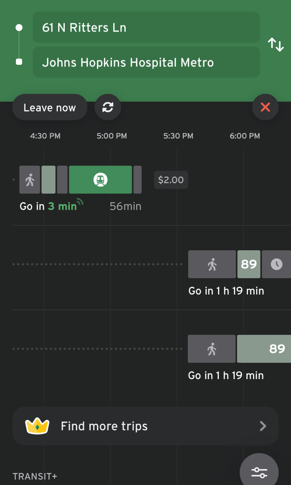
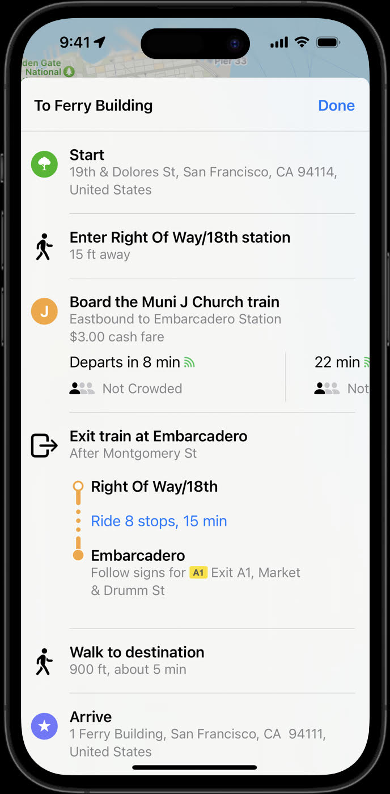
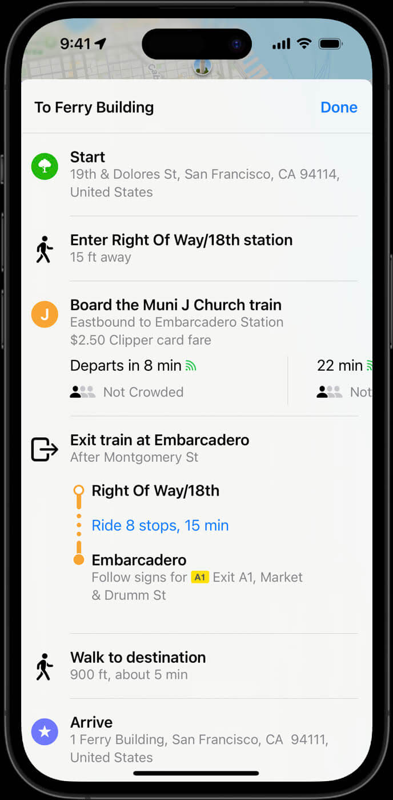

# 運賃 (v2) {: #fares-v2}

!!! info

    このページの例は古い可能性があります。このページはまもなく廃止されます。最新の例については、新しい [運賃の例のセクション](../intro) を参照してください。

運賃 (Fares v2 とも呼ばれます) は、[GTFS Schedule の機能](../../../../../getting-started/features/overview/) の1つであり、乗客向けの運賃情報を標準化することで、各交通システムおよびその接続における運賃体系や条件に基づいたチケットや料金オプションを利用者が把握できるようにします。

運賃 (v2) の主な機能には、チケット商品、チケットメディア、ルートベースの運賃、ゾーンベースの運賃、時間ベースの運賃、乗り換えルールが含まれます。

GTFS 運賃 (v2) は、[GTFS-Fares v2](../../../../../community/extensions/fares-v2) という作業名のもと、コミュニティ主導のプロジェクトとして進化を続けています。実験的な機能のモデリングに関するガイダンスについては、[完全な提案文書](https://share.mobilitydata.org/gtfs-fares-v2) を参照してください。

## 運賃に関するトレーニングと無料リソース {: #fares-training-and-free-resources}

GTFS Fares (v2) を始めるには、以下の4つのビデオチュートリアルを視聴し、[この文書リソース](https://share.mobilitydata.org/Fares-v2-written-resource-guide-for-videos)に沿って進めることができます。

- [ビデオ 1](https://share.mobilitydata.org/faresv2-intro): GTFS Fares (v2): 入門
- [ビデオ 2](https://share.mobilitydata.org/faresv2-setting-up-google-sheets): GTFS Fares (v2): Google Sheets の設定
- [ビデオ 3](https://share.mobilitydata.org/faresv2-creating-and-maintaining-data): GTFS Fares (v2): データの作成と管理
- [ビデオ 4](https://share.mobilitydata.org/faresv2-exporting-and-publishing): GTFS Fares (v2) のエクスポートと公開

これらのビデオは、事業者が Fares (v2) の目的を理解し、Google Sheets を使って GTFS Fares (v2) データを作成、編集、アップロードする方法を学ぶために作成されています。  

この [Fares (v2) テンプレート](https://share.mobilitydata.org/faresv2-template) を使用して、必要な運賃ファイルをゼロから作成することができます。

## 運賃データモデリングの例 {: #fares-data-modelling-examples}

### 交通運賃の定義 {: #define-a-transit-fare}

メリーランド交通局システムを利用するための運賃の支払い方法はいくつかあります。<a href="https://www.mta.maryland.gov/regular-fares" target="_blank">通常の正規運賃には4種類のオプションがあります:</a>

- 片道乗車券（$2.00 USD）
- 1日乗車券（$4.60 USD）
- 1週間乗車券（$22 USD）
- 1か月乗車券（$77 USD）

GTFS では、交通チケットや運賃はチケット商品(fare product)と呼ばれます。これらは [fare_products.txt](../../../reference/#fare_productstxt) ファイルを使って記述することができます。各エントリは特定の運賃に対応します。

[**fare_products.txt**](../../../reference/#fare_productstxt)

| fare_product_id  | fare_product_name  | amount  | currency  |
|------------------------|--------------------|---|---|
| core_local_oneway_fare | One Way Full Fare |  2.00 | USD  |
| core_local_1_day_fare  | 1-Day Pass - Core Service  | 4.60  | USD   |
| core_local_31_day_fare | 31-Day Pass - Core Service  | 77.00  | USD  |
| core_local_7_day_fare  | 7-Day Pass - Core Service |  22.00 | USD  |

[メリーランド交通局ローカルバス GTFS フィードをダウンロード](https://feeds.mta.maryland.gov/gtfs/local-bus)

### 単一乗車区間(leg)の旅程(journey)に対するルールの作成 {: #create-rules-for-single-leg-journeys}

GTFSにおいて、運賃区間(fare leg)は、乗客が異なる交通モード、ルート・路線系統(route)、ネットワーク、または事業者間で乗り換えを行わずに利用する便(trip)に対応します。メリーランド州交通局(Maryland Transit Administration)のフィードでは、1回の運賃で、ボルチモアリンク(BaltimoreLink)バス、ライトレールリンク(Light RailLink)、メトロサブウェイリンク(Metro SubwayLink)の `core` ネットワーク内にある任意の停留所等(stop)や地下鉄駅の間を移動することができます。

乗車区間グループ(leg group)は、ネットワーク内での出発地から目的地までの便(trip)を定義します（エリアIDが停留所等(stop)のグループに対応する場合は、出発地の集合から目的地の集合までを定義します）。以下のファイルは、メリーランド州交通局のコアネットワーク内を移動するためのルールを記述しています。各ルールは、[運賃を定義する例](#define-a-transit-fare)における通常のチケット商品の1つに対応します。

[**fare_leg_rules.txt**](../../../reference/#fare_leg_rulestxt)

|  leg_group_id |  network_id | fare_product_id  |
|---|---|---|
| core_local_one_way_trip | core  |  core_local_oneway_fare |
| core_local_one_way_trip | core  |  core_local_1_day_fare |
| core_local_one_way_trip | core  |  core_local_31_day_fare |
| core_local_one_way_trip | core  |  core_local_7_day_fare |

[メリーランド州交通局ローカルバスのGTFSフィードをダウンロード](https://feeds.mta.maryland.gov/gtfs/local-bus)

### 乗り換えルールの作成 {: #create-rules-for-transfers}

BaltimoreLink のローカルバス、Metro SubwayLink、Light RailLink に片道運賃を購入した乗客には、90分間の乗り換えが提供されます。これは、90分の時間枠内でローカルバス、地下鉄、ライトレールの間を無制限に乗り換えることができることを意味します。

[**fare_transfer_rules.txt**](../../../reference/#fare_transfer_rulestxt)

| from_leg_group_id       | to_leg_group_id  | duration_limit | duration_limit_type | fare_transfer_type | transfer_count |
|-------------------------|---|----------------|-------------------|---------------------|----------------|
| core_local_one_way_trip | core_local_one_way_trip  | 5400           | 1                 | 0                   | -1             |

上記のファイルは、GTFS において以下のフィールドでこのルールを表現しています。

- 乗り換えは、片道便(`core_local_one_way_trip`)の乗車区間(leg)間で可能です
- `transfer_count` は `-1` に設定されており、許可される乗り換え回数に制限がないことを示しています
- `duration_limit` は `5400` 秒に設定されており、これは90分に相当します
- `duration_limit_type` は `1` に設定されており、乗客が `core_local_one_way_trip` 運賃区間でいずれかのルートに乗車した時点から乗り換え時間が開始し、別の運賃区間に乗車した時点で終了することを意味します
- `fare_transfer_type` は `0` に設定されており、乗客は最初の運賃のみを支払います。90分の時間枠内での乗り換えには追加の乗り換え料金や2回目の運賃は発生しません。したがって、費用は最初の運賃と乗り換え料金の合計としてモデル化することができます
- `transfer_count` は `-1` に設定されており、乗客は90分の `duration_limit` 内で無制限に乗り換えることができます

運賃を定義し、適切な `fare_leg_rule` を作成し、`fare_transfer_rule` を定義した後、$2.00 USD の `core_local_oneway_fare` が経路検索アプリに表示されるようになります。以下は Transit アプリでの例です:

    

[Maryland Transit Administration ローカルバス GTFS フィードをダウンロード](https://feeds.mta.maryland.gov/gtfs/local-bus)

### 同一運賃ゾーン内のサービスロケーションの記述 {: #describe-service-locations-in-the-same-fare-zone}

一部の交通事業者はゾーン制の運賃体系を運用しています。運賃ゾーンは地理的に区分されたエリアであり、それぞれ異なる運賃が設定されています。サンフランシスコ・ベイエリアのBARTシステムでは、出発地と到着地によって運賃が異なり <a href="https://www.bart.gov/sites/default/files/docs/BART%20Clipper%20Fares%20Triangle%20Chart%20July%202022.pdf" target="_blank">(BART運賃の違い)</a>、乗客は正しい運賃を知る必要があります。運賃エリアは [stops_areas.txt](../../../reference/#stop_areastxt) ファイルを使用して記述することができ、このファイルでは [stops.txt](../../../reference/#stopstxt) の停留所等(stop)を [areas.txt](../../../reference/#areastxt) のエリアに割り当てます。

まず、[areas.txt](../../../reference/#areastxt) でエリアを特定します。エリア名が存在しない場合、`area_name` を空欄にしても構いません。以下の表では、3つの `area_id` - `ASHB`、`GLEN`、`OAKL` が存在します。

[**areas.txt**](../../../reference/#areastxt) 

| area_id | area_name |
|---------|-----------|
| ASHB    |           |
| GLEN    |           | 
| OAKL    |           | 

次に、[stops.txt](../../../reference/#stopstxt) の `stop_id` を使用して、停留所等(stop)をそれぞれのエリア（運賃ゾーン）にグループ化します。  

BARTの例では、各エリアには1つの `stop_id` のみが含まれています。例えば、エリア `ASHB` には停留所等(stop) `ASHB`（Ashby駅）のみが含まれます。ただし、1つのエリアに複数の停留所等(stop)が含まれる場合は、複数の `stop_id` を列挙する必要があります。

[**stops_areas.txt**](../../../reference/#stop_areastxt)

| area_id | stop_id |
|---------|---------|
| ASHB    | ASHB    |
| GLEN    | GLEN    | 
| OAKL    | OAKL    | 

`fare_leg_rules.txt` では、出発エリアと到着エリアの組み合わせに基づいて異なるチケット商品を特定することができます。例えば、最初のエントリは以下を示しています:

* 出発エリアは `ASHB`  
* 到着エリアは `GLEN`  
* 出発/到着エリアに対応するチケット商品は `BA:matrix:ASHB-GLEN`  

[**fare_leg_rules.txt**](../../../reference/#fare_leg_rulestxt)

| leg_group_id | from_area_id|to_area_id|fare_product_id|
|--------------|-----------|------------|---------------|
|   BA    |  ASHB   | GLEN | BA:matrix:ASHB-GLEN |
|     BA         |  ASKB   | OAKL | BA:matrix:ASHB-OAKL |

運賃は `fare_products.txt` で定義されます。  

[**fare_products.txt**](../../../reference/#fare_productstxt)

| fare_product_id     | fare_product_name| amount | currency |
|---------------------|-----------|--------|----------|
| BA:matrix:ASHB-GLEN |  generated  | 4.75   | USD      |
| BA:matrix:ASHB-OAKL  |  generated  | 9.45   | USD       |

<a href="https://511.org/open-data/transit" target="_blank">サンフランシスコ・ベイエリア地域フィードを参照</a>

### どのチケットメディア(fare media)が利用可能かを記述する {: #describe-what-fare-media-is-accepted}

サンフランシスコ Muni の乗客は、便(trip)の運賃を支払い、運賃を認証するために、いくつかの異なる種類のチケットメディア(fare media)を利用することができます。

- ベイエリアの交通系ICカードである <a href="https://www.clippercard.com/ClipperWeb/" target="_blank">Clipper card</a> を利用する
- <a href="https://www.sfmta.com/getting-around/muni/fares/munimobile" target="_blank">Munimobile アプリ</a> を利用する
- 現金で運賃を支払う

これらの認証方法は、GTFS Fares (v2) では `fare_media` と呼ばれ、`fare_media.txt` を用いて記述することができます。

以下は、511 SF Bay API でアクセス可能な <a href="https://511.org/open-data/transit" target="_blank">サンフランシスコ・ベイエリア地域フィード</a> からの例です。

`Clipper` は `fare_media_type=2` の物理的な交通カードとして記述されています。`SFMTA Munimobile` は `fare_media_type=4` のモバイルアプリとして記述されています。`Cash` はチケットを介さずに直接運転手に渡されるため、チケットメディアは存在せず、`fare_media_type=0` となります。

[**fare_media.txt**](../../../reference/#fare_mediatxt)

| fare_media_id | fare_media_name  | fare_media_type |
|---------------|------------------|-----------------|
| clipper       | Clipper          | 2               |
| munimobile    | SFMTA MuniMobile | 4               |
| cash          | Cash             | 0               |

<a href="https://511.org/open-data/transit" target="_blank">サンフランシスコ・ベイエリア地域フィードを参照</a>

さらに、物理的な紙のチケットをチケットメディアとして記述したい事業者は、`fare_media_type=1` を使用することができます。

<a href="https://www.mbta.com" target="_blank">マサチューセッツ湾交通局 (MBTA)</a> では、CharlieTicket と呼ばれる物理的な紙のチケットを使用して便や定期券の支払いが可能です。これを反映するために、MBTA のフィードには `charlieticket` というチケットメディアがあり、`fare_media_type=1` として記述されています。

[**fare_media.txt**](../../../reference/#fare_mediatxt)

| fare_media_id | fare_media_name  | fare_media_type |
|---------------|------------------|-----------------|
| cash          | Cash             | 0               |
| charlieticket | CharlieTicket    | 1               |
| mticket       | m Ticket app     | 4               |

<a href="https://www.mbta.com/developers/gtfs" target="_blank">マサチューセッツ湾交通局フィードを参照</a>

### チケットメディアに基づく運賃差の定義 {: #define-price-differences-based-on-fare-media}

Muni の運賃は、乗客が使用するチケットメディアによって異なります。この例では、大人のローカル運賃が現金または Clipper カードを使用した場合にどのように変わるかを説明します。現金で支払う大人のローカル運賃は 3 USD であり、同じ運賃を Clipper カードで支払うと 2.50 USD となり、50 セント安くなります。

以下の各エントリはチケットメディアを表しています。

[**fare_media.txt**](../../../reference/#fare_mediatxt)

| fare_media_id | fare_media_name  | fare_media_type |
|---------------|------------------|-----------------|
| clipper       | Clipper          | 2               |
| cash           | Cash             | 0               |

以下の `fare_products.txt` ファイルの抜粋は、乗客が使用するチケットメディアによって `Muni single local fare` 商品の金額がどのように変わるかを示しています。

[**fare_products.txt**](../../../reference/#fare_productstxt)

| fare_product_id | fare_product_name  | amount | currency | fare_media_id |
|---------------|------------------|-------|--- |---------------|
| SF:local:single | Muni single local fare | 3     | USD | cash |
| SF:local:single | Muni single local fare  | 2.5   |USD | clipper |

Apple Maps では、乗客は運賃がどのように変わるかを確認することができます。「Muni J Church 列車に乗車」という案内の下で運賃を比較することができます。

    
    

<a href="https://511.org/open-data/transit" target="_blank">サンフランシスコ・ベイエリア地域フィードを見る</a>

### 非接触型チケットメディアオプションの記述 {: #describe-a-contactless-fare-media-option}

<a href="https://vimeo.com/539436401" target="_blank">サンタバーバラ郡北部の Clean Air Express は、クレジットカード、Google Pay、Apple Pay による非接触型決済を受け付けています</a>。

Clean Air Express のフィードでは、`tap_to_ride` というチケットメディアがあり、これは cEMV（contactless Europay, Mastercard and Visa）オプションであるため、`fare_media_type=3` となっています。

| fare_media_id | fare_media_name | fare_media_type |
|---------------|-----------------|-----------------|
| tap_to_ride   | Tap to Ride   | 3  |

以下に示す片道運賃のチケット商品には、`cash` と `tap-to-ride` の両方のチケットメディアオプションがあります。片道運賃を `tap-to-ride` チケットメディアで支払うと、1米ドル安くなります。

[**fare_products.txt**](../../../reference/#fare_productstxt)

| fare_product_id | fare_product_name  | fare_media_id | amount | currency |
|---------------|------------------|---------------|--------|----------|
| single-ride | Single Ride | tap_to_ride       | 6      | USD      |
| single-ride | Single Ride |       | 7      | USD      |

<a href="https://gtfs.calitp.org/production/CleanAirExpressFaresv2.zip" target="_blank">Clean Air Express フィードをダウンロード</a>

### 便の時間帯や曜日に基づく運賃差の定義 {: #define-price-differences-based-on-time-and-day-of-trip}

一部の交通事業者は、時間帯や曜日に基づいて運賃を変動させています。これは、運賃が便の利用時間帯（ピーク時、オフピーク時、週末など）に関連付けられることを意味します。

ワシントンDCのMetrorailの運賃は、便の曜日や時間帯を含む複数の要素に基づいて変動します。GTFSにおける時間帯別運賃は `timeframes.txt` を使用して定義することができ、特定の時間帯を指定し、それを `fare_leg_rules.txt` に関連付けることで、便の利用時間に応じた適用運賃商品を割り当てることができます。以下は、2023年春時点のWMATAの運賃に基づいた架空の例です。

まず、運行日(service day)を `calendar.txt` で定義します。

[**calendar.txt**](../../../reference/#calendartxt)

| service_id       | monday | tuesday | wednesday | thursday | friday | saturday | sunday | start_date | end_date |
|------------------|--------|---------|-----------|----------|--------|----------|--------|------------|----------|
| weekday_service  | 1      | 1       | 1         | 1        | 1      | 0        | 0      | 20220708   | 20221231 |
| saturday_service | 0      | 0       | 0         | 0        | 0      | 1        | 0      | 20220708   | 20221231 |
| sunday_service   | 0      | 0       | 0         | 0        | 0      | 0        | 1      | 20220708   | 20221231 |

次に、`timeframes.txt` で必要な時間帯を定義します。ここでは id、`calendar.service_id` を参照した適用日、必要に応じて各時間帯の開始時刻と終了時刻を指定します。

[**timeframes.txt**](../../../reference/#timeframestxt)

| timeframe_group_id | start_time | end_time | service_id       |
|--------------------|------------|----------|------------------|
| weekday_peak       | 5:00:00    | 9:30:00  | weekday_service  |
| weekday_offpeak    | 9:30:00    | 15:00:00 | weekday_service  |
| weekday_peak       | 15:00:00   | 19:00:00 | weekday_service  |
| weekday_offpeak    | 19:00:00   | 21:30:00 | weekday_service  |
| weekday_late_night | 21:30:00   | 24:00:00 | weekday_service  |
| weekday_late_night | 00:00:00   | 5:00:00  | weekday_service  |
| weekend            |            |          | saturday_service |
| weekend            |            |          | sunday_service   |

次に、時間帯ごとの運賃を `fare_products.txt` に作成します（例: Peak fare）。

[**fare_products.txt**](../../../reference/#fare_productstxt)

| fare_product_id | fare_product_name                             | amount | currency |
|-----------------|-----------------------------------------------|--------|----------|
| peak_fare       | Peak fare                                     | 5      | USD      |
| regular_fare    | Off-peak fare                                 | 3      | USD      |
| weekend_fare    | Weekend Metrorail one-way fare                | 2      | USD      |
| late_night_fare | Late Night flat fare (Mon - Fri after 9:30pm) | 2      | USD      |

最後に、`fare_leg_rules.txt` において、`from_timeframe_group_id` および `to_timeframe_group_id` フィールドを使用して時間帯と運賃商品を関連付けます。これらのフィールドは、運賃が乗車区間(leg)の開始時刻のみに適用されるのか、または開始と終了の両方に適用されるのかを決定します。  
この例では、WMATAの運賃に基づき、運賃は乗車区間(leg)の出発時間帯のみに依存するため、`to_timeframe_group_id` は空欄にしています。

[**fare_leg_rules.txt**](../../../reference/#fare_leg_rulestxt)

| network_id | fare_product_id | from_timeframe_group_id | to_timeframe_group_id |
|------------|-----------------|-------------------------|-----------------------|
| 1          | weekend_fare    | weekend                 |                       |
| 1          | late_night_fare | weekday_late_night      |                       |
| 1          | peak_fare       | weekday_peak            |                       |
| 1          | regular_fare    | weekday_offpeak         |                       |

なお、`network_id` は外部キーである `networks.network_id` または `routes.network_id` を参照しており、各便に対して正しい運賃商品を選択する際には、`stop_times.txt` の出発・到着時刻と `timeframes.txt` で定義された時間帯を組み合わせて判断します。

この場合、午前7時30分に出発する便に乗車する利用者は 5.00 USD（Peak fare）を支払わなければなりませんが、午前11時30分に出発する利用者は 3.00 USD（Off-peak fare）のみを支払えばよいことになります。

### 時間変動型運賃とゾーンベース運賃の定義 {: #define-time-variable-fares-along-with-zone-based-fares}

ニューヨークの MTA Metro-North 鉄道ネットワークでは、運賃は便(trip)の時間帯と出発地および到着地のエリアに基づいて変動します。以下の例は、グランドセントラル駅からコールドスプリング（NY, USA）までの便に適用される運賃ルールを示しています。

この例は、<a href="https://www.itoworld.com/" target="_blank">ITO World</a> によって作成された <a href="https://docs.google.com/spreadsheets/d/1-cD-R2OH5xAQAbNWNlrXD7WOw594lVdW-bomuLo6bI8/edit?usp=sharing" target="_blank">データセット</a> に基づいており、6つの異なるエリアに分布する10の停留所等(stop)を使用する便を特徴としています。

[**stops.txt**](../../../reference/#stopstxt)

| stop_id | stop_name           | stop_lat  | stop_lon   |
|---------|---------------------|-----------|------------|
| ITO1669 | Peekskill           | 41.285103 | -73.930916 |
| ITO1777 | Beacon              | 41.505814 | -73.984474 |
| ITO1789 | New Hamburg         |  41.58691 | -73.947624 |
| ITO1804 | Croton-Harmon       | 41.190002 | -73.882393 |
| ITO1824 | Cortlandt           | 41.246258 | -73.921783 |
| ITO1856 | Garrison            | 41.381126 | -73.947334 |
| ITO1887 | Harlem-125th Street | 40.805256 | -73.939148 |
| ITO1897 | Cold Spring         | 41.415382 | -73.958092 |
| ITO2096 | Poughkeepsie        | 41.707058 |  -73.93792 |
| ITO2383 | Grand Central       | 40.752823 | -73.977196 |

[**stop_areas.txt**](../../../reference/#stop_areastxt)

| area_id   | stop_id |
|-----------|---------|
| mnr_1     | ITO1887 |
| mnr_1     | ITO2383 |
| mnr_HUD-5 | ITO1804 |
| mnr_HUD-6 | ITO1669 |
| mnr_HUD-6 | ITO1824 |
| mnr_HUD-7 | ITO1856 |
| mnr_HUD-7 | ITO1897 |
| mnr_HUD-8 | ITO1777 |
| mnr_HUD-8 | ITO1789 |
| mnr_HUD-9 | ITO2096 |

[**route_networks.txt**](../../../reference/#route_networkstxt)

| network_id | route_id |
|------------|----------|
| mnr_hudson | 669      |

[**networks.txt**](../../../reference/#networkstxt)

| network_id | network_name    |
|------------|-----------------|
| mnr_hudson | MNR Hudson Line |

列車サービス 3 および 13 の運行日(service day)は `calendar.txt` を使用して定義されています。特に、便に関連付けられていない汎用的な日（平日、週末、任意の日）に関するレコードも定義されており、これらは `time-variable fares` をモデル化するために時間枠に関連付けられます。

[**calendar.txt**](../../../reference/#calendartxt)

| service_id | monday | tuesday | wednesday | thursday | friday | saturday | sunday | start_date | end_date |
|------------|--------|---------|-----------|----------|--------|----------|--------|------------|----------|
| 13         | 1      | 1       | 1         | 1        | 1      | 0        | 0      | 20230612   | 20231006 |
| 3          | 1      | 1       | 1         | 1        | 1      | 0        | 0      | 20230609   | 20231006 |
| weekdays   | 1      | 1       | 1         | 1        | 1      | 0        | 0      | 20220101   | 20240101 |
| weekends   | 0      | 0       | 0         | 0        | 0      | 1        | 1      | 20220101   | 20240101 |
| anyday     | 1      | 1       | 1         | 1        | 1      | 1        | 1      | 20220101   | 20240101 |

`timeframes.txt` には、24時間をカバーするケース（`anytime`、`weekdays`、`weekends`）や、ピーク・オフピークの時間帯を含むレコードが作成されます。

* AM Peak: 平日午前6時から午前10時まで
* AM2PM Peak: 平日午前6時から午前9時、および午後4時から午後8時まで
* Not AM Peak: 平日の AM Peak に含まれない時間
* Not AM2PM Peak: 平日の AM2PM Peak に含まれない時間

[**timeframes.txt**](../../../reference/#timeframestxt)

| timeframe_group_id | start_time | end_time | service_id |
|:------------------:|:----------:|:--------:|:----------:|
|       anytime      |  00:00:00  | 24:00:00 |   anyday   |
|      weekdays      |  00:00:00  | 24:00:00 |  weekdays  |
|      weekends      |  00:00:00  | 24:00:00 |  weekends  |
|     mnr_ampeak     |  06:00:00  | 10:00:00 |  weekdays  |
|    mnr_notampeak   |  00:00:00  | 06:00:00 |  weekdays  |
|    mnr_notampeak   |  10:00:00  | 24:00:00 |  weekdays  |
|    mnr_am2pmpeak   |  06:00:00  | 09:00:00 |  weekdays  |
|    mnr_am2pmpeak   |  16:00:00  | 20:00:00 |  weekdays  |
|  mnr_notam2pmpeak  |  00:00:00  | 06:00:00 |  weekdays  |
| mnr_notam2pmpeak   | 09:00:00   | 16:00:00 | weekdays   |
| mnr_notam2pmpeak   | 20:00:00   | 24:00:00 | weekdays   |

各チケット商品(fare product)は `fare_products.txt` で定義されます。Cold Spring はゾーン7に位置するため、この例ではゾーン1から7の間の便のみを記載しています。完全なデータセットでは、時間とゾーンの組み合わせごとに価格を定義するレコードが含まれます。さらに、この例ではチケットメディア(fare media)として `paper` のみを表示していますが、チケットメディアによって価格が変動する場合は追加の組み合わせを作成することができます。

[**fare_products.txt**](../../../reference/#fare_productstxt)

| fare_product_id        | fare_product_name                  | fare_media_id | amount | currency |
|------------------------|------------------------------------|---------------|--------|----------|
| mnr_1:HUD-7_adult_peak | Outbound Adult Peak Zonal Fare     | paper         | 20.00  | USD      |
| mnr_1:HUD-7_adult      | Outbound Adult Off Peak Zonal Fare | paper         | 15.00  | USD      |
| mnr_HUD-7:1_adult_peak | Inbound Adult Peak Zonal Fare      | paper         | 20.00  | USD      |
| mnr_HUD-7:1_adult      | Inbound Adult Off Peak Zonal Fare  | paper         | 15.00  | USD      |

最後に、出発地と到着地のエリアの組み合わせと、それぞれの時間枠が `fare_leg_rules.txt` で対応するチケット商品に関連付けられます。ここでは、ゾーン1（`area_id=mnr_1`）で始まる、または到着する便がピーク時間帯にある場合、その便の出発・到着ゾーンに対応する特定のピーク運賃（例: `fare_product_id=mnr_1:HUD-7_adult_peak`）が適用されます。

[**fare_leg_rules.txt**](../../../reference/#fare_leg_rulestxt)

| network_id | from_area_id | to_area_id | fare_product_id        | from_timeframe_group_id | to_timeframe_group_id |
|------------|--------------|------------|------------------------|-------------------------|-----------------------|
| mnr_hudson | mnr_1        | mnr_HUD-7  | mnr_1:HUD-7_adult      | mnr_notam2pmpeak        | anytime               |
| mnr_hudson | mnr_1        | mnr_HUD-7  | mnr_1:HUD-7_adult      | weekends                | anytime               |
| mnr_hudson | mnr_1        | mnr_HUD-7  | mnr_1:HUD-7_adult_peak | mnr_am2pmpeak           | anytime               |
| mnr_hudson | mnr_HUD-7    | mnr_1      | mnr_HUD-7:1_adult      | weekdays                | mnr_notampeak         |
| mnr_hudson | mnr_HUD-7    | mnr_1      | mnr_HUD-7:1_adult      | weekends                | anytime               |
| mnr_hudson | mnr_HUD-7    | mnr_1      | mnr_HUD-7:1_adult_peak | weekdays                | mnr_ampeak            |

このデータセットを使用すると、グランドセントラル（ゾーン `mnr_1`）を午後6時45分に出発する予定の列車 #869（`service_id=3`）に乗車する利用者は、`mnr_am2pmpeak` の時間帯かつ `zone mnr_1` から出発するため、20.00 USD の Outbound Adult Peak Zonal Fare を支払う必要があります。

一方、列車 #883（`service_id=13`）に乗車する利用者は、午後9時04分にグランドセントラル（ゾーン `mnr_1`）を出発するため、15.00 USD の Outbound Adult Off Peak Zonal Fare のみを支払います。

<a href="https://apple.com/maps" target="_blank">Apple Maps</a> では、乗客は運賃がどのように変化するかを確認でき、列車の出発予定時刻の横で運賃を比較することができます。

    
    

