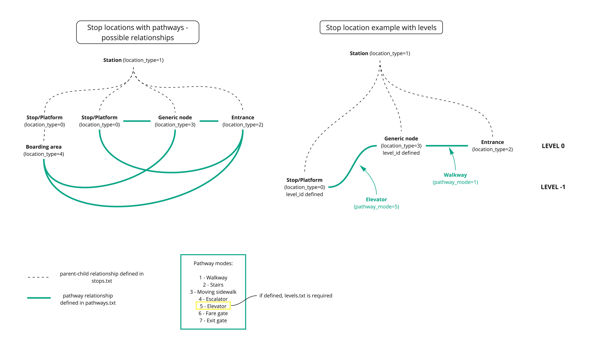
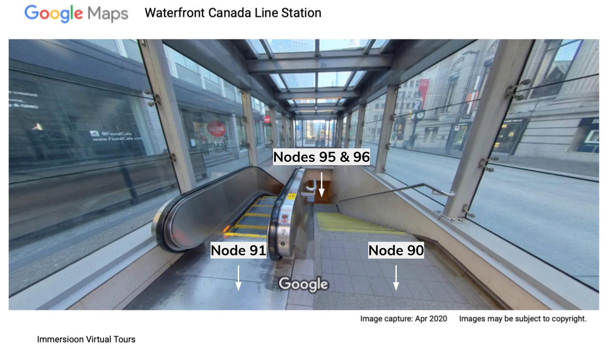
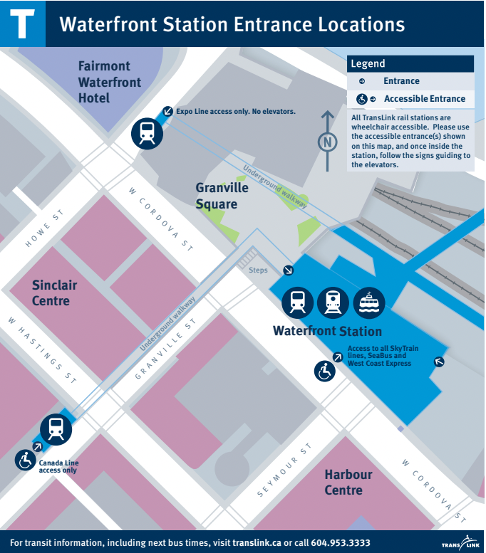
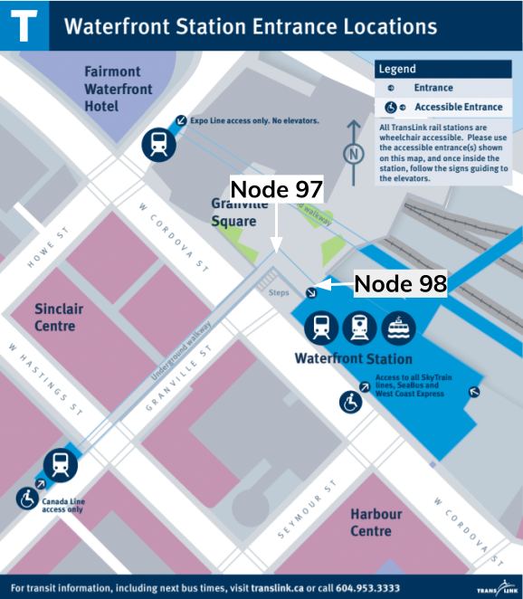

# 構内通路(pathways)と物理的なアクセシビリティ {: #pathways-and-physical-accessibility}

## なぜアクセシビリティ情報を表示するのか？ {: #why-display-accessibility-information}


**人口の大きな割合に影響を与えるため:** 世界保健機関（WHO）は、[世界人口の16%が障害を持っている](https://www.who.int/news-room/fact-sheets/detail/disability-and-health)と推定しており、障害のある人々は「交通機関が利用できない、または高額であることにより、障害のない人々に比べて15倍も移動が困難である」としています。障害のある人々はまた、[新たな健康状態を獲得する割合が高い](https://www.who.int/publications/i/item/9789240063600)ことも報告されており、その一因は医療やサービスへのアクセスが制限されているためです。

**彼らにとって重要であるため:** 乗客は、自分の移動手段に関する最新かつ正確な情報を必要としています。多くの事業者はすでに General Transit Feed Specification (GTFS) を使用して、便(trip)の計画や選択肢の理解に不可欠なルート(route)、時刻表(schedule)、停留所等(stop)の位置情報を提供しています。アクセシビリティを必要とする乗客にとっては、停留所や車両のアクセシビリティを知ることは、その場所を知ることと同じくらい重要です。これらの乗客は、旅程(journey)のすべての部分について把握しておく必要があり、途中で立ち往生したり、最終的な停留所に到達できないことに遅れて気づくことがないようにしなければなりません。

**法律で定められている可能性があるため:** 地域によっては、障害のある人々に平等なアクセスと機会を提供することが、地域または国家の法律で義務付けられている場合があります。以下は考慮すべき情報源の一部です:

* **アメリカ合衆国:** [Americans and Disabilities Act (ADA)](https://www.ada.gov/topics/intro-to-ada/#public-transit) および 1973年リハビリテーション法の [Section 504](https://www.dol.gov/agencies/oasam/centers-offices/civil-rights-center/statutes/section-504-rehabilitation-act-of-1973)
* **日本:** 国土交通省 高齢者・障害者等の円滑な移動等の促進に関する法律（「[バリアフリー法](https://www.mlit.go.jp/sogoseisaku/barrierfree/index.html)」）
* **欧州連合:** [Employment, Social Affairs & Inclusion](https://ec.europa.eu/social/main.jsp?catId=1485&langId=en)

## アクセシビリティ チェックリスト {: #accessibility-checklist}

以下は、データにアクセシビリティ情報を追加するために必要な手順です。次のセクションでは、それぞれの手順について詳しく説明します。

* ステップ 1: `stops.txt` に車椅子対応情報を追加する  
* ステップ 2: `trips.txt` に車椅子対応情報を追加する  
* ステップ 3: `stops.txt` に音声ナビゲーション情報を追加する  
* ステップ 4: GTFS Pathways を使用して交通駅の物理的アクセシビリティ情報を追加する  

## GTFS における車椅子対応の追加 {: #adding-wheelchair-accessibility-in-gtfs}

GTFS の構造を .txt ファイルの一連の集合としてすでにご存知かもしれません。車椅子対応は、`stops.txt` の `wheelchair_boarding` フィールドと、`trips.txt` の `wheelchair_accessible` フィールドを更新することで表示することができます。

**stops.txt における車椅子対応**  
`stops.txt` の `wheelchair_boarding` フィールドを使用すると、指定された場所から車椅子での乗降が可能かどうかを示すことができます。

[参照: stops.txt](../../reference/#stopstxt)

このフィールドが空のままの場合、アクセシビリティに関する情報は表示されません。これでは乗客は車椅子での乗降が実際に不可能なのか、単に情報が欠けているのかを判断できません。たとえ車椅子での乗降が不可能であっても、その情報を入力しておくことが望ましく、乗客に明確に伝えることで正確な情報に基づいた旅程の計画が可能になります。

**trips.txt における車椅子対応**  
`trips.txt` の `wheelchair_accessible` フィールドを使用すると、特定の便(trip)で使用される車両が車椅子に対応しているかどうかを示すことができます。

[参照: trips.txt](../../reference/#tripstxt)

`wheelchair_boarding` と同様に、このフィールドが空のままの場合、アクセシビリティに関する情報は表示されません。たとえ車両が車椅子に対応していなくても、その情報を入力しておくことが望ましく、乗客に明確に伝えることで正確な情報に基づいた旅程の計画が可能になります。

## 音声ナビゲーション支援の追加 {: #adding-audio-navigation-aids}

読み上げ用フィールド(text-to-speech)は、GTFS のアクセシビリティを向上させるもう1つの方法です。正確な読み上げ用情報を提供することで、支援技術を利用してテキストを音声で読み上げる乗客が正しい情報を得られるようになります。この情報は、`stops.txt` 内の `tts_stop_name` を各 `stop_name` に対応させて更新することで GTFS に含めることができます。GTFS 内の各停留所等(stop)には、正しく発音されるように、停留所名を音声的に表記した読み上げ用の区別情報を持たせるべきです。  

[例: Text-to-Speech](../../examples/text-to-speech)

現在、GTFS 仕様で正式に採用されている読み上げ用フィールドは `tts_stop_name` のみですが、他のフィールドについても議論されており、追加される可能性があります。これには、`tts_agency_name`、`tts_route_short_name`、`tts_route_long_name`、`tts_trip_headsign`、`tts_trip_short_name`、`tts_stop_headsign` が含まれます。

乗客がこの情報を活用するためには、読み上げ機能をサポートするアプリを使用する必要があります。[NaviLensGo](https://www.navilens.com/en/) のような一部のアプリは、視覚障害のある乗客が駅を移動し、正しい車両を見つけるのを支援するために特別に設計されています。

## 駅の物理的なバリアフリー情報の追加 {: #adding-physical-accessibility-information-about-a-station}

GTFS-Pathways は、GTFS の構成要素の1つで、交通駅の詳細を表現します。これにより、乗客は交通駅で必要な乗り換えが可能かどうかを理解することができます。  

GTFS-Pathways では、`pathways.txt` と `levels.txt` のファイルが追加され、さらに `stops.txt` に `location_type` フィールドが追加されます。これにより、`pathways.txt` に記述された情報を相互に関連付けることができます。  

  

### 駅の出入口の位置を記述する {: #describe-the-location-of-station-entrances-and-exits}

GTFS を用いることで、出入口や駅構内の情報を使って駅を正確に記述することができます。以下の例では、バンクーバー中心部にある Waterfront Station の構成を記述しています。この駅は市のスカイトレインネットワークの一部であり、Canada Line、Expo Line、SeaBus、West Coast Express が乗り入れています。地上には3か所の出入口があり、乗客はそこから駅に出入りできます。駅の残りの部分は地下にあり、改札階と、その下にプラットフォーム階があります。  

まず、駅とその出入口の位置を [stops.txt](../../reference/#stopstxt) で定義します。

[**stops.txt**](../../reference/#stopstxt)

```
stop_id,stop_name,stop_lat,stop_lon,location_type,parent_station,wheelchair_boarding
12034,Waterfront Station,49.285687,-123.111773,1,,
90,Waterfront Station Stairs Entrance on Granville,49.285054,-123.114375,2,12034,2
91,Waterfront Station Escalator Entrance on Granville,49.285061,-123.114395,2,12034,2
92,Waterfront Station Elevator Entrance on Granville,49.285257,-123.114163,2,12034,1
93,Waterfront Station Entrance on Cordova,49.285607,-123.111993,2,12034,1
94,Waterfront Station Entrance on Howe,49.286898,-123.113367,2,12034,2
```

上記のファイルでは、最初のレコードが駅の位置を表しているため、`location_type` は `1` に設定されています。残りの5つのレコードは駅の出入口を表しています（Granville 側の出入口は階段、エスカレーター、エレベーターの3つに分かれているため、5つのレコードが必要です）。これら5つのレコードは `location_type` が `2` に設定されているため、出入口として定義されています。  

さらに、出入口を駅に関連付けるために、Waterfront Station の `stop_id` が `parent_station` に指定されています。バリアフリー対応の出入口は `wheelchair_boarding` が `1` に設定され、非対応の出入口は `2` に設定されています。  

### 階段とエスカレーターの記述 {: #describe-stairs-and-escalators}


Granville Street にある Waterfront Station の入口には、エレベーター、エスカレーター、階段があります。これらの入口は [stops.txt](../../reference/#stopstxt) においてノードとして定義されています。駅の内部区画と入口を接続するためには、Waterfront Station の `parent_station` の下に追加のノードを [stops.txt](../../reference/#stopstxt) に作成する必要があります。以下の [stops.txt](../../reference/#stopstxt) ファイルでは、階段とエスカレーターの下部に対応する汎用ノード（`location_type 3`）が定義されています。

[**stops.txt**](../../reference/#stopstxt)

```
stop_id,stop_name,stop_lat,stop_lon,location_type,parent_station,wheelchair_boarding
...
95,Waterfront Station Granville Stair Landing, 49.285169,-123.114198,3,12034,
96,Waterfront Station Granville Escalator Landing,49.285183,-123.114222,3,12034,
```



次に、[pathways.txt](../../reference/#pathwaystxt) ファイルを使用してノードを接続し、構内通路(pathway)を作成します。最初のレコードは階段の上下に対応するノードを接続しています。`pathway_mode` は階段を示す `2` に設定され、最後のフィールドでは乗客が階段を上下両方向に移動できることを示しています。 

同様に、2つ目のレコードはエスカレーターを記述しています（`pathway_mode` は `4` に設定）。エスカレーターは一方向にしか動かないため、`is_bidirectional` フィールドは `0` に設定されます。したがって、このエスカレーターはノード `96` から `91` へ（上方向に）移動します。

[**pathways.txt**](../../reference/#pathwaystxt)

```
pathway_id,from_stop_id,to_stop_id_pathway_mode,is_bidirectional
stairsA,90,95,2,1
escalatorA,96,91,4,0
```

### エレベーターと構内通路(pathway)の記述 {: #describe-elevators-and-pathways}

Granville street のエレベーターは、エスカレーターと階段の終点であるコンコース階の構内通路(pathway)に乗客を運びます。地上階のエレベーターは、すでに上記で駅入口 (`stop_id` `92`) として定義されています。したがって、コンコース階のエレベータードアも定義する必要があります。  

さらに、下図に示すように、Granville street の階段、エスカレーター、エレベーターの下部を駅本館に接続する地下通路があります。そのため、通路区間を定義するために追加で2つのノードが作成されます。  



[**stops.txt**](../../reference/#stopstxt)

```
stop_id,stop_name,stop_lat,stop_lon,location_type,parent_station,wheelchair_boarding
…
97,Underground walkway turn,49.286253,-123.112660,3,12034,
98,Underground walkway end,49.286106,-123.112428,3,12034,
99,Elevator_concourse,49.285257,-123.114163,3,12034,
```



最後に、ノード同士を接続して、下記の [pathways.txt](../../reference/#pathwaystxt) ファイルに示すように地下通路を定義します。  

[**pathways.txt**](../../reference/#pathwaystxt)

```
pathway_id,from_stop_id,to_stop_id_pathway_mode,is_bidirectional
underground_walkway1,99,96,1,1
underground_walkway2,96,95,1,1
underground_walkway3,95,97,1,1
underground_walkway4,97,98,1,1
```

## GTFS-Pathways への将来的な追加事項 {: #future-additions-to-gtfs-pathways}

GTFS-Pathways の基本仕様は完全に GTFS に統合されていますが、追加のアクセシビリティ情報をモデル化することで、乗客にとって有用になると認識されています。これには、読み上げ用フィールド(text-to-speech field)による案内、車椅子利用者への支援情報、設備故障の報告、計画的または予定された出入口の閉鎖、エレベーターやエスカレーターの運休情報などが含まれます。残りの部分については [この文書](http://bit.ly/gtfs-pathways) で確認することができます。
