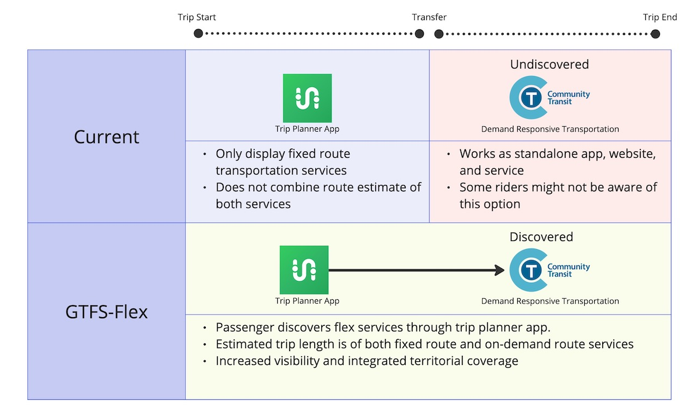

# GTFS-Flex

GTFS Flex は、デマンド レスポンシブ交通サービスの発見可能性を促進することを目的としたGTFS schedule拡張プロジェクトです。

大部分は、2024 年 GTFS で採用されています。[このページ](../../../documentation/schedule/examples/flex) には、GTFS Flex の公式に採用された部分を使用してモデル化できる内容を示す例がいくつかあります。

🤔 ダイアル ア ライドなどのサービスは、利用者によって無視されることが多く、その存在すら知らない利用者もいます。このアクセシビリティの欠如は、交通事業者、便計画者、利用者にとっての問題です。地元の空港に到着した観光客のグループが、オンデマンド バス サービスしか提供されていない田舎に行きたいと考えているところを想像してみてください。観光客は好みの便プランナー アプリをチェックしますが、実行可能な公共交通事業者の選択肢が見つかりません。結局、レンタカーを借りることになります。観光客である乗客は、オンデマンド サービスを宣伝する紙のチラシを廊下にすべて見落とします。サービスが十分に利用されていないだけでなく、現在および将来の乗客の需要を満たすための発見可能性も欠いています。ここで GTFS-Flex の出番です。GTFS-Flex は乗客がサービスを発見できるようにし、あなたが一生懸命宣伝したサービスを乗客が楽しめるようにします。

 

🔮 MobilityData は、GTFS-Flex が、GTFS-OnDemand を使用したトランザクションおよびリアルタイム コンポーネントへの拡張を含む、需要に応じた交通のより深い標準化への扉を開くと期待しています。私たちは、この分野における交通手段の増加と概念の複雑さに最も適切に対処するための提案戦略を準備しています。

[提案の全文を見る](https://github.com/MobilityData/gtfs-flex){ .md-button .md-button--primary }

## 最新のプルリクエスト
この拡張機能は、スケジュールに従って動作するサービスについて説明しますが、次のような1つ以上の柔軟な機能も備えています。

-**ダイアル・ア・ライド・サービス**: 車両は、特定のサービス時間内に乗車と降車が許可されているゾーンにサービスを提供します。
-**ルート逸脱サービス**: 車両は固定ルートと順序付けられた一連の停留所等にサービスを提供しますが、停留所等間で乗客を乗降させるために迂回するしてもよい。
-**ポイントツーゾーン・サービス**: 乗客は駅などの固定の停留所で乗車し、エリア内の任意の場所で下車できます。またはその逆も可能です。一部の場所からの出発は、他のサービスに合わせてスケジュールまたは時間調整されます。
-**ポイント逸脱またはチェックポイント サービス**: 乗客は固定の停留所で乗車し、順序付けられていない停留所等のリスト内の任意の場所で降車するか、その逆を行うことができます。運転手は、リクエストがあった停留所等でのみサービスを提供します。

詳細については、[元の提案](https://github.com/MobilityData/gtfs-flex/blob/master/spec/reference.md)および[問題#382](https://github.com/google/transit/issues/382)(スコープを変更したためクローズ)を参照してください。

6 月 28 日の作業会議では、グループ コミュニティ間で、現在生成および消費されているすべてのフィールドをカバーするイテレーションを行うことが合意されました。したがって、[採用トラッカー](#_3)で`**議論中**`と表示されるすべてのフィールドがこのPRに含まれています。

このPRの変更点は次のとおりです。

- ファイルの変更:
    - `stop_areas.txt`を変更して、GeoJSONの場所や停留所等をグループ化できるようにし、これらの機能の所定のグループを`stop_times.txt`の個々の行に指定できるようにします。
    - `stop_times.txt`を変更して、追加および拡張されたファイルとフィールドの解釈方法をデータコンシューマーに通知するために必要な現在の仕様の要素を明確にします。
- ファイルの拡張:
    - `stop_times.txt`を`start_pickup_drop_off_window`と`end_pickup_drop_off_window`で拡張して、GeoJSONの場所、停留所エリア、または停留所で需要に応じた輸送サービスが利用可能になる/終了する時間を定義します。
    - `stop_times.txt`を次のように拡張します。予約ルールへのリンクを定義するための`pickup_booking_rule_id`と`drop_off_booking_rule_id` 
- 新しいファイルを追加します:
    - `locations.geojson`、乗客がピックアップまたはドロップオフをリクエストできるゾーン (`Polygon`または`Multipolygon`) を定義します。
    - `booking_rules.txt`、乗客にサービスのリクエスト方法に関する情報を提供する予約ルールを定義します。

アンガーミュンデとアンガーミュンデの [RufBus](https://uvg-online.com/rufbus-angermuende/) の [データ例](https://docs.google.com/spreadsheets/d/1w5EHuHfxvejqApJFHA1Z0K2KytD9zahwbf8zyRlP_Ls/edit#gid=1451132209) を以下に示します。ガーツァー、ドイツ。下の画像は、便プランナーでデータがどのように表示されるかを示した例です。

  

投稿全体を読んだり、会話に参加したりするには、プルリクエストページにアクセスしてください。 

[プルリクエストを見る](https://github.com/google/transit/pull/388){ .md-button .md-button--primary}

[Slack で #gtfs-flex に参加する](https://share.mobilitydata.org/slack){ .md-button .md-button--primary}

## 初期実装

- [MNDoT Flex パイロット プロジェクト: Trillium、IBI、Transit、MNDoT、Cambridge Systematics、Token Transit](https://blog.transitapp.com/case-study/mndot-gtfs-flex-bringing-rural-riders-into-the-fold/) 
- [Open Trip Planner](https://www.opentripplanner.org/)
- [バーモント州のモビリティ オンデマンド サンドボックス](https://www.connectingcommuters.org/)
- Tulare County Area Transit
- Northwest Oregon Transit Alliance (NW Connector)
- [Vamos Mobility App](https://vamosmobileapp.com/)
- [RTD Denver Flexride](https://www.rtd-denver.com/services/flexride)
- [Nebraska Public Transit DRT OTP Project: Trillium、Olsson、Cambridge Systematics、および TransitPlus](https://便.nebraskatransit.com/#/)

このページに GTFS-Flex 実装を追加するには、お問い合わせください

<a class="md-button md-button--primary" href=mailto:specification@mobilitydata.org>お問い合わせ</a>

## 採用トラッカー
### 現在

<iframe class="airtable-embed" src="https://airtable.com/embed/appopXWyO2ne6THIw/shrUPyCZWOWrvO2mX?backgroundColor=purple" frameborder="0" onmousewheel="" width="100%" height="533" style="background: transparent; border: 1px solid #ccc;"></iframe>

[変更をリクエスト](https://airtable.com/shrcac1fXUrMxfoDV){ .md-button .md-button--primary}
[組織を追加(消費者)](https://airtable.com/shrgnVR5Su9tkHvUv){ .md-button .md-button--primary}
[組織を追加(プロデューサー)](https://airtable.com/shrsU4idBtcLuRuwZ){ .md-button .md-button--primary}

## 履歴

- **2013**: Brian Ferris (Google) が最初の提案を執筆
- **2016**: <a href="https://github.com/MobilityData/gtfs-flex/tree/master" target="_blank">GTFS-Flex GitHub ディスカッション開始</a>
- **2017**: <a href="https://www.oregon.gov/odot/RPTD/RPTD%20Document%20Library/GTFS-Flex-N-CATT.pdf" target="_blank">Mobility on Demand (MOD) サンドボックス プログラム (FTA、Vermont DOT、OTP)</a>
- **2018**: MobilityData が GTFS-Flex の管理者となり、GTFS-Flex v2 を提案
- **2020年11月**: GTFS-Flex と OTP2 の最新バージョンのリポジトリが GTFS-Flex v2 データを取り込む
- **2022年5月**: MnDoT パイロットの開始 (Cambridge Systematics、MNDoT、Token Transit、Transit、Trillium (OptiBus))。
- **2023年5月**: <a href="https://github.com/google/transit/issues/382" target="_blank">GTFS-Flexの作業:サービス検出の開始</a>
- **2023年6月**: <a href="https://mobilitydata.org/recap-mobilitydata-working-meeting-gtfs-flex-service-discovery/" target="_blank">GTFS-Flexの概念ワーキングミーティングを開催</a>
- **2023年7月**: <a href="https://github.com/google/transit/pull/388" target="_blank">プルリクエスト#388を公開</a>
- **2023年8月と9月**: <a href="https://github.com/google/transit/pull/388" target="_blank">「GTFSでGeoJSONを使用?」を開催議論</a>
- **2024年3月**: <a href="https://github.com/google/transit/pull/433" target="_blank">GTFS Flex が正式に採用されました</a>