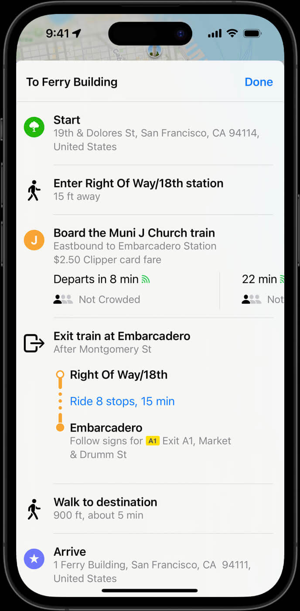

# Fares v2 

Fares v2 は、Fares v1 の制限に対処することを目的とした GTFS 拡張プロジェクトです。この拡張プロジェクトは、段階的に採用されています。以下の例では、チケット商品や乗客が運賃を乗り換えに使用する方法など、基本概念をモデル化する方法の概要を示します。[Fares v2 拡張プロジェクトの詳細については、こちら](../../../../community/extensions/fares-v2) を参照してください。

当面の間、プロデューサーは Fares v2 を Fares v1 の実装と並行して同じデータセットに実装できます。両者の間に技術的な競合はありません。消費者は、他の実装とは独立してどちらの実装を使用するかを選択できます。

Fares v2 が採用され、十分な支持が得られれば、将来的に Fares v1 は廃止される可能性があります。

当面の間、プロデューサーは Fares v2 を Fares v1 の実装と並行して同じデータセットに実装できます。両者の間に技術的な競合はありません。消費者は、他の実装とは独立してどちらの実装を使用するかを選択できます。

以下の例は、Fares v2 を使用してデータをモデル化する方法の概要を示しており、完全な [提案文書](https://share.mobilitydata.org/gtfs-fares-v2) に概説されている実験的な機能を使用して完了できます。

## Fares v2 のトレーニングと無料リソース

GTFS Fares-v2 を使い始めるには、これらの 4 つのビデオ チュートリアルを視聴し、[この書面によるリソース](https://share.mobilitydata.org/Fares-v2-written-resource-guide-for-videos) に従ってください。 

- [動画 1](https://share.mobilitydata.org/faresv2-intro): GTFS Fares-v2: 概要
- [動画 2](https://share.mobilitydata.org/faresv2-setting-up-google-sheets): GTFS Fares-v2: Google スプレッドシートの設定
- [動画 3](https://share.mobilitydata.org/faresv2-creating-and-maintaining-data): GTFS Fares-v2: データの作成と維持
- [動画 4](https://share.mobilitydata.org/faresv2-exporting-and-publishing): GTFS Fares-v2 のエクスポートと公開 

これらは、交通事業者が GTFS-Fares v2 の目的と、Google スプレッドシートを使用して GTFS-Fares v2 データを作成、編集、アップロードする方法を理解できるように作成されています。 

この [Fares v2 template](https://share.mobilitydata.org/faresv2-template) は、必要な運賃ファイルを最初から作成するために使用できます。

## Fares v2 データモデリングの例

### 交通運賃を定義する

メリーランド州交通局システムを利用するには、運賃を支払う方法がいくつかあります。<a href="https://www.mta.maryland.gov/regular-fares" target="_blank">通常の正規運賃オプションには次の 4 種類があります:</a>

- 片道チケット (2.00 米ドル)
- 1 日パス (4.60 米ドル)
- 1 週間パス (22 米ドル)
- 1 か月パス (77 米ドル)

交通チケットまたは運賃は、GTFS ではチケット商品と呼ばれます。これらは、[fare_products.txt](../../reference/#fare_productstxt) ファイルを使用して記述できます。各エントリは特定の運賃に対応します。

[**fare_products.txt**](../../reference/#fare_productstxt)

| fare_product_id  | fare_product_name  | amount  | currency  |
|------------------------|--------------------|---|---|
| core_local_oneway_fare | One Way Full Fare |  2.00 | USD  |
| core_local_1_day_fare  | 1-Day Pass - Core Service  | 4.60  | USD   |
| core_local_31_day_fare | 31-Day Pass - Core Service  | 77.00  | USD  |
| core_local_7_day_fare  | 7-Day Pass - Core Service |  22.00 | USD  |

[メリーランド州交通局のローカル バス GTFS フィードをダウンロード](https://feeds.mta.maryland.gov/gtfs/local-bus) 

 

### 単一区間の旅程のルールを作成する

GTFS では、運賃区間は、乗客が異なるモード、ルート・路線系統、ネットワーク、または事業者間で乗り換えを行わずに行う便に対応します。メリーランド州交通局のフィードでは、単一運賃で、乗客は BaltimoreLink バス、Light RailLink、および Metro SubwayLinkルート・路線系統の `core` ネットワーク内にある任意の停留所等と地下鉄駅のペア内を移動できます。

区間グループは、ネットワーク内の出発地から目的地 (または、エリア ID がグループ化された停留所等に対応している場合は、出発地のセットから目的地のセット) への便を定義します。以下のファイルには、メリーランド州交通局のコア ネットワーク内の任意の場所を移動するためのルールが記述されています。各ルールは、[交通事業者の運賃の定義例](#_1) の通常チケット商品の 1 つに対応します。

[**fare_leg_rules.txt**](../../reference/#fare_leg_rulestxt)

|  leg_group_id |  network_id | fare_product_id  |
|---|---|---|
| core_local_one_way_trip | core  |  core_local_oneway_fare |
| core_local_one_way_trip | core  |  core_local_1_day_fare |
| core_local_one_way_trip | core  |  core_local_31_day_fare |
| core_local_one_way_trip | core  |  core_local_7_day_fare |

[メリーランド州交通局のローカルバス GTFS フィードをダウンロードする](https://feeds.mta.maryland.gov/gtfs/local-bus) 

 

### 乗り換えのルールを作成する 

BaltimoreLink のローカル バス、Metro SubwayLink、または Light RailLink に乗車するために片道料金を購入した乗客には、90 分間の乗り換えがあります。つまり、90 分間にローカル バス、地下鉄、ライト レール間を無制限に乗り換えることができます。

[**fare_transfer_rules.txt**](../../reference/#fare_transfer_rulestxt)

| from_leg_group_id       | to_leg_group_id  | duration_limit | duration_limit_type | fare_transfer_type | transfer_count |
|-------------------------|---|----------------|-------------------|---------------------|----------------|
| core_local_one_way_trip | core_local_one_way_trip  | 5400           | 1                 | 0                   | -1             |

上記のファイルは、次のフィールドを使用して GTFS でこれを表しています:

- 片道便 (`core_local_one_way_trip`) の区間への乗り換えが可能です
- 許可される乗り換え回数に制限がないため、`transfer_count` は `-1` に設定されています
- `duration_limit` は `5400` 秒に設定されており、これは 90 分に相当します
- 乗り換え時間は、乗客が `core_local_one_way_trip` 運賃区間のいずれかのルートで出発したときに開始され、別の運賃区間で出発したときに終了するため、`duration_limit_type` は `1` に設定されています。
- 乗客は最初の運賃のみを支払うため、`fare_transfer_type` は `0` に設定されています。90 分の時間枠内での乗り換えには、乗り換え料金や 2 つ目の運賃はかかりません。したがって、コストは最初の運賃の合計と乗り換え料金の合計としてモデル化できます。
- 乗客は 90 分間の `duration_limit` ウィンドウ内で無制限に乗り換えることができるため、`transfer_count` は `-1` に設定されています。

料金を定義し、適切な `fare_leg_rule` を作成し、`fare_transfer_rule` を定義すると、2.00 USD の `core_local_oneway_fare` が便プランナーに表示されます。以下は Transit からの例です。

    

[メリーランド州交通局のローカルバス GTFS フィードをダウンロード](https://feeds.mta.maryland.gov/gtfs/local-bus) 

### 同じ運賃ゾーン内のサービス場所を説明する

一部の交通事業者は、ゾーンベースの運賃体系を運用しています。運賃ゾーンは、異なる運賃価格に関連付けられた地理的エリアに分割されています。ベイエリアの BART システムでは、出発地と目的地によって運賃が異なり <a href="https://www.bart.gov/sites/default/files/docs/BART%20Clipper%20Fares%20Triangle%20Chart%20July%202022.pdf" target="_blank">(BART 運賃の違い)</a>、交通事業者の利用者は正しい運賃を知る必要があります。運賃エリアは [stops_areas.txt](../../reference/#stop_areastxt) ファイルを使用して記述できます。このファイルでは、[stops.txt](../../reference/#stopstxt) から [areas.txt](../../reference/#areastxt) に停車駅が割り当てられます。

まず、[areas.txt](../../reference/#areastxt) でエリアを特定します。エリア名がない場合は、`area_name` を空白のままにしておくことができます。下の表には、`ASHB`、`GLEN`、`OAKL` の 3 つの `area_id` があります。

[**areas.txt**](../../reference/#areastxt) 

| area_id | area_name |
|---------|-----------|
| ASHB    |           |
| GLEN    |           | 
| OAKL    |           | 

その後、[stops.txt](../../reference/#stopstxt) ファイルの `stop_id` を使用して、停留所をそれぞれの識別されたエリア (料金ゾーン) にグループ化します。

次に、`stop_id` を各 `area_id` にグループ化します。BART の例では、各エリアには 1 つの `stop_id` のみが含まれます。たとえば、エリア `ASHB` には停留所 `ASHB` (Ashby Station) のみが含まれます。ただし、エリアに複数の停留所が含まれる場合は、複数の `stop_id` をリストする必要があります。

[**stops_areas.txt**](../../reference/#stop_areastxt)

| area_id | stop_id |
|---------|---------|
| ASHB    | ASHB    |
| GLEN    | GLEN    | 
| OAKL    | OAKL    | 

`fare_leg_rules.txt` では、出発地と到着地に応じて異なるチケット商品を識別できます。たとえば、最初のエントリは次のようになります:

* 出発地は `ASHB` です
* 到着地は `GLEN` です
* 出発/到着地のチケット商品は `BA:matrix:ASHB-GLEN` です

[**fare_leg_rules.txt**](../../reference/#fare_leg_rulestxt)

| leg_group_id | from_area_id|to_area_id|fare_product_id|
|--------------|-----------|------------|---------------|
|   BA    |  ASHB   | GLEN | BA:matrix:ASHB-GLEN |
|     BA         |  ASKB   | OAKL | BA:matrix:ASHB-OAKL |

運賃は `fare_products.txt` で識別されます。

[**fare_products.txt**](../../reference/#fare_productstxt)

| fare_product_id     | fare_product_name| amount | currency |
|---------------------|-----------|--------|----------|
| BA:matrix:ASHB-GLEN |  generated  | 4.75   | USD      |
| BA:matrix:ASHB-OAKL  |  generated  | 9.45   | USD       |

<a href="https://511.org/open-data/transit" target="_blank">サンフランシスコ ベイエリア地域フィードをご覧ください</a>

 

### 受け入れられる運賃媒体について説明します

サンフランシスコ Muni の乗客は、乗車料金の支払いと運賃の検証に、さまざまな種類の運賃媒体を使用できます。

- ベイエリアの交通カードである <a href="https://www.clippercard.com/ClipperWeb/" target="_blank">Clipper カード</a> を使用する
- <a href="https://www.sfmta.com/getting-around/muni/fares/munimobile" target="_blank">Munimobile アプリ</a> を使用する
- 現金で運賃を支払う

これらの検証方法は、GTFS-Fares v2 では `fare_media` と呼ばれ、`fare_media.txt` を使用して説明できます。

以下は、511 SF Bay API でアクセスできる <a href="https://511.org/open-data/transit" target="_blank">サンフランシスコ ベイエリア地域フィード</a> からの抜粋例です。

`Clipper` は、`fare_media_type=2` の物理的な交通カードとして説明されています。`SFMTA Munimobile` は、`fare_media_type=2` のモバイル アプリとして説明されています。`Cash` は、チケットなしで運転手に直接渡されるため、運賃メディアがありません。その結果、`Cash` は `fare_media_type=0` になります。

[**fare_media.txt**](../../reference/#fare_mediatxt)

| fare_media_id | fare_media_name  | fare_media_type |
|---------------|------------------|-----------------|
| clipper       | Clipper          | 2               |
| munimobile    | SFMTA MuniMobile | 4               |
| cash           | Cash             | 0               |

<a href="https://511.org/open-data/transit" target="_blank">サンフランシスコ ベイエリア地域フィードをご覧ください</a>

さらに、物理的なチケットを運賃メディアとして記述したいプロデューサーは、`fare_media_type=1` を使用できます。

<a href="https://www.mbta.com" target="_blank">マサチューセッツ湾交通局 (MBTA)</a>では、CharlieTicket と呼ばれる物理的な紙のチケットを使用して、ユーザーが便やパスの料金を支払うことを許可しています。これを反映するために、MBTA のフィードには `fare_media_type=1` の `charlieticket`運賃メディアがあります。

[**fare_media.txt**](../../reference/#fare_mediatxt)

| fare_media_id | fare_media_name  | fare_media_type |
|---------------|------------------|-----------------|
|cash           |Cash              |0                |
|charlieticket  |CharlieTicket     |1                |
|mticket        |m Ticket app      |4                |

<a href="https://www.mbta.com/developers/gtfs" target="_blank">マサチューセッツ湾交通局フィードを参照してください</a>

###運賃メディアに基づいて価格差を定義する 

Muni の運賃は、乗客が使用する運賃メディアによって異なります。この例では、現金または Clipper カードを使用した場合に大人のローカル運賃がどのように変わるかについて説明します。現金で支払う大人のローカル運賃は 3 米ドルですが、同じ運賃を Clipper カードで支払うと 50 セント安い 2.50 米ドルになります。

以下の各エントリは運賃メディアについて説明しています。

[**fare_media.txt**](../../reference/#fare_mediatxt)

| fare_media_id | fare_media_name | fare_media_type |
|--------------|------------------|-----------------|
| clipper       | Clipper          | 2               |
| cas​​h          | Cash          | 0               |

以下の`fare_products.txt`ル` スニペットは、乗客が使用する運賃メディアに応じて `i` シングル ローカル運賃` 商品の金額がどのように変化するかを示しています。

[**fare_products.txt**](../../reference/#fare_productstxt)

| fare_product_id | fare_product_name  | amount | currency | fare_media_id |
|---------------|------------------|-------|--- |---------------|
| SF:local:single | Muni single local fare | 3     | USD | cash |
| SF:local:single | Muni single local fare  | 2.5   |USD | clipper |

Apple マップでは、乗客は運賃がどのように変化するかを確認できます。`i` J Church 列車に乗る`という指示の下で運賃を比較できます。

    
    

<a href="https://511.org/open-data/transit" target="_blank">サンフランシスコ ベイエリア地域フィードを参照してください</a>

### 非接触型運賃メディアオプションについて説明します 

<a href="https://vimeo.com/539436401" target="_blank">サンタバーバラ郡北部の Clean Air Express では、</a>クレジットカード、Google Pay、 Apple Payによる非接触型支払いが受け付けられます。

Clean Air Express フィードには、cEMV (非接触型 Europay、Mastercard、Visa) オプションであるため、`fare_media_type=3` の `tap_to_ride`運賃メディアがあります。

| fare_media_id | fare_media_name | fare_media_type |
|---------------|-----------------|-----------------|
| tap_to_ride   | Tap to Ride     | 3               |

以下に示す 1 回の乗車チケット商品には、`cash` と `tap-to-ride` の両方の運賃メディアオプションがあります。 1 回の乗車料金を`タップして乗車`運賃メディアで支払うと、1 ドル安くなります。

[**fare_products.txt**](../../reference/#fare_productstxt)

| fare_product_id | fare_product_name  | fare_media_id | amount | currency |
|-----------------|--------------------|---------------|--------|----------|
| single-ride     | Single Ride        | tap_to_ride   | 6      | USD      |
| single-ride     | Single Ride        |               | 7      | USD      |

 <a href="https://gtfs.calitp.org/production/CleanAirExpressFaresv2.zip" target="_blank">Clean Air Express フィードをダウンロードする</a>

### 時間と便日に基づいて価格差を定義する

一部の交通事業者は、時間や曜日に基づいて運賃を変更します。つまり、運賃は、ピーク時、オフピーク時、週末など、便が行われる時間帯に関連付けられます。

ワシントン DC のメトロレールの運賃は、便の日時など、複数の要因によって異なります。GTFS の可変時間運賃は、`timeframes.txtを使用して定義できます。このファイルでは、特定の時間帯を指定して、それを`fare_leg_rules.txt`で関連付け、便が行われる時間に対応する適用可能なチケット商品を割り当てることができます。以下は、2023 年春現在の WMATA の運賃に基づいた架空の例です。

まず、サービス日は`calendar.txt`を使用して定義されます。

[**calendar.txt**](../../reference/#calendartxt)

| service_id       | monday | tuesday | wednesday | thursday | friday | saturday | sunday | start_date | end_date |
|------------------|--------|---------|-----------|----------|--------|----------|--------|------------|----------|
| weekday_service  | 1      | 1       | 1         | 1        | 1      | 0        | 0      | 20220708   | 20221231 |
| saturday_service | 0      | 0       | 0         | 0        | 0      | 1        | 0      | 20220708   | 20221231 |
| sunday_service   | 0      | 0       | 0         | 0        | 0      | 0        | 1      | 20220708   | 20221231 |

その後、必要な時間枠が `timeframes.txt` で定義され、 ID、 `calendar.service_id`への参照を介した適用可能な日、および該当する場合は各期間の開始時刻と終了時刻が提供されます。

[**timeframes.txt**](../../reference/#timeframestxt)

| timeframe_group_id | start_time | end_time | service_id       |
|--------------------|------------|----------|------------------|
| weekday_peak       | 5:00:00    | 9:30:00  | weekday_service  |
| weekday_offpeak    | 9:30:00    | 15:00:00 | weekday_service  |
| weekday_peak       | 15:00:00   | 19:00:00 | weekday_service  |
| weekday_offpeak    | 19:00:00   | 21:30:00 | weekday_service  |
| weekday_late_night | 21:30:00   | 24:00:00 | weekday_service  |
| weekday_late_night | 00:00:00   | 5:00:00  | weekday_service  |
| weekend            |            |          | saturday_service |
| weekend            |            |          | sunday_service   |

次に、 `fare_products.txt`内の対応する時間指定運賃が作成されます (例: Peak 運賃)

[**fare_products.txt**](../../reference/#fare_productstxt)

| fare_product_id | fare_product_name                             | amount | currency |
|-----------------|-----------------------------------------------|--------|----------|
| peak_fare       | Peak fare                                     | 5      | USD      |
| regular_fare    | Off-peak fare                                 | 3      | USD      |
| weekend_fare    | Weekend Metrorail one-way fare                | 2      | USD      |
| late_night_fare | Late Night flat fare (Mon - Fri after 9:30pm) | 2      | USD      |

最後に、時間枠は、 `from_timeframe_group_id`および`to_timeframe_group_id`フィールドを使用して`fare_leg_rules.txt`内のチケット商品に関連付けられます。これらのフィールドは、運賃が区間の開始のみに適用されるか、区間の開始と終了の両方に適用されるかを決定します。
この例では、WMATA運賃に基づいて、運賃は区間の出発時間枠のみに依存するため、 `to_timeframe_group_id`は空白のままになっています。

[**fare_leg_rules.txt**](../../reference/#fare_leg_rulestxt)

| network_id | fare_product_id | from_timeframe_group_id | to_timeframe_group_id |
|------------|-----------------|-------------------------|-----------------------|
| 1          | weekend_fare    | weekend                 |                       |
| 1          | late_night_fare | weekday_late_night      |                       |
| 1          | peak_fare       | weekday_peak            |                       |
| 1          | regular_fare    | weekday_offpeak         |                       |

`network_id` は外部 ID `networks.network_id` または `routes.network_id` を参照し、各便の正しいチケット商品の選択は、`stop_times.txt` の到着時間と出発時間と、`timeframes.txt` で定義された時間の組み合わせになることに注意してください。

この場合、午前 7:30 に出発する便の料金を支払うユーザーは 5.00 USD (ピーク料金) を支払う必要がありますが、午前 11:30 に出発する別のユーザーは 3.00 USD (オフピーク料金) のみを支払う必要があります。

### 時間変動運賃とゾーンベース運賃を定義する 

ニューヨークの MTA メトロノース鉄道網では、運賃は便の時間帯と出発地および目的地の両方に基づいて異なります。次の例は、グランド セントラル駅からコールド スプリング (米国ニューヨーク州) への便に適用される運賃規則を示しています。

この例は、<a href="https://docs.google.com/spreadsheets/d/1-cD-R2OH5xAQAbNWNlrXD7WOw594lVdW-bomuLo6bI8/edit?usp=sharing" target="_blank">ITO World</a> が作成した <a href="https://www.itoworld.com/" target="_blank">データセット</a> に基づいており、6 つの異なるエリアに分散した 10 の停留所を利用する便を取り上げています。

[**stops.txt**](../../reference/#stopstxt)

| stop_id | stop_name           | stop_lat  | stop_lon   |
|---------|---------------------|-----------|------------|
| ITO1669 | Peekskill           | 41.285103 | -73.930916 |
| ITO1777 | Beacon              | 41.505814 | -73.984474 |
| ITO1789 | New Hamburg         |  41.58691 | -73.947624 |
| ITO1804 | Croton-Harmon       | 41.190002 | -73.882393 |
| ITO1824 | Cortlandt           | 41.246258 | -73.921783 |
| ITO1856 | Garrison            | 41.381126 | -73.947334 |
| ITO1887 | Harlem-125th Street | 40.805256 | -73.939148 |
| ITO1897 | Cold Spring         | 41.415382 | -73.958092 |
| ITO2096 | Poughkeepsie        | 41.707058 |  -73.93792 |
| ITO2383 | Grand Central       | 40.752823 | -73.977196 |

[**stop_areas.txt**](../../reference/#stop_areastxt)

| area_id   | stop_id |
|-----------|---------|
| mnr_1     | ITO1887 |
| mnr_1     | ITO2383 |
| mnr_HUD-5 | ITO1804 |
| mnr_HUD-6 | ITO1669 |
| mnr_HUD-6 | ITO1824 |
| mnr_HUD-7 | ITO1856 |
| mnr_HUD-7 | ITO1897 |
| mnr_HUD-8 | ITO1777 |
| mnr_HUD-8 | ITO1789 |
| mnr_HUD-9 | ITO2096 |

[**route_networks.txt**](../../reference/#route_networkstxt)

| network_id | route_id |
|------------|----------|
| mnr_hudson | 669      |

[**networks.txt**](../../reference/#networkstxt)

| network_id | network_name    |
|------------|-----------------|
| mnr_hudson | MNR Hudson Line |

列車サービス 3 および 13 の運行日は`calendar.txt`を使用して定義されます。特に、どの便にも関連付けられていない一般的な日 (つまり、平日、週末、および任意の日) を持つ他のレコードが定義されており、これらは `時間変動運賃` をモデル化するために時間枠に関連付けられます。

[**calendar.txt**](../../reference/#calendartxt)

| service_id | monday | tuesday | wednesday | thursday | friday | saturday | sunday | start_date | end_date |
|------------|--------|---------|-----------|----------|--------|----------|--------|------------|----------|
| 13         | 1      | 1       | 1         | 1        | 1      | 0        | 0      | 20230612   | 20231006 |
| 3          | 1      | 1       | 1         | 1        | 1      | 0        | 0      | 20230609   | 20231006 |
| weekdays   | 1      | 1       | 1         | 1        | 1      | 0        | 0      | 20220101   | 20240101 |
| weekends   | 0      | 0       | 0         | 0        | 0      | 1        | 1      | 20220101   | 20240101 |
| anyday     | 1      | 1       | 1         | 1        | 1      | 1        | 1      | 20220101   | 20240101 |

レコードは `timeframes.txt` に作成されます。これには、時間が 24 時間の範囲の期間 (`anytime`、`weekdays`、および `weekends`) をカバーする場合、およびピーク期間とオフピーク期間が含まれます:

* AM ピーク: 平日の午前 6 時から午前 10 時まで
* AM2PM ピーク: 平日の午前 6 時から午前 9 時まで、および午後 4 時から午後 8 時まで
* AM ピーク以外: AM ピークに含まれない平日の時間帯
* AM2PM ピーク以外: AM2PM ピークに含まれない平日の時間帯

[**timeframes.txt**](../../reference/#timeframestxt)

| timeframe_group_id | start_time | end_time | service_id |
|:------------------:|:----------:|:--------:|:----------:|
|       anytime      |  00:00:00  | 24:00:00 |   anyday   |
|      weekdays      |  00:00:00  | 24:00:00 |  weekdays  |
|      weekends      |  00:00:00  | 24:00:00 |  weekends  |
|     mnr_ampeak     |  06:00:00  | 10:00:00 |  weekdays  |
|    mnr_notampeak   |  00:00:00  | 06:00:00 |  weekdays  |
|    mnr_notampeak   |  10:00:00  | 24:00:00 |  weekdays  |
|    mnr_am2pmpeak   |  06:00:00  | 09:00:00 |  weekdays  |
|    mnr_am2pmpeak   |  16:00:00  | 20:00:00 |  weekdays  |
|  mnr_notam2pmpeak  |  00:00:00  | 06:00:00 |  weekdays  |
| mnr_notam2pmpeak   | 09:00:00   | 16:00:00 | weekdays   |
| mnr_notam2pmpeak   | 20:00:00   | 24:00:00 | weekdays   |

各チケット商品は`fare_products.txt`で定義されています。Cold Spring はゾーン 7 にあるため、この例ではゾーン 1 と7. の間の便をリストしています。完全なデータセットには、時間とゾーンの組み合わせで定義された各価格のレコードが含まれます。また、この例では 1 つの運賃メディア(`paper`) のみが表示されていますが、運賃メディアによって価格も異なる場合は、追加の組み合わせを作成できます。.

[**fare_products.txt**](../../reference/#fare_productstxt)

| fare_product_id        | fare_product_name                  | fare_media_id | amount | currency |
|------------------------|------------------------------------|---------------|--------|----------|
| mnr_1:HUD-7_adult_peak | Outbound Adult Peak Zonal Fare     | paper         | 20.00  | USD      |
| mnr_1:HUD-7_adult      | Outbound Adult Off Peak Zonal Fare | paper         | 15.00  | USD      |
| mnr_HUD-7:1_adult_peak | Inbound Adult Peak Zonal Fare      | paper         | 20.00  | USD      |
| mnr_HUD-7:1_adult      | Inbound Adult Off Peak Zonal Fare  | paper         | 15.00  | USD      |

最後に、出発地と目的地のエリアの組み合わせとそれぞれの時間枠が、 `fare_leg_rules.txt`の対応するチケット商品に関連付けられます。ここで、ピーク時にゾーン 1 (つまり `area_id=mnr_1`) から出発または到着する便には、便の到着ゾーンと出発ゾーンに対応する特定のピーク料金 (つまり `fare_product_id=mnr_1:HUD-7_adult_peak`) が適用されます。

[**fare_leg_rules.txt**](../../reference/#fare_leg_rulestxt)

| network_id | from_area_id | to_area_id | fare_product_id        | from_timeframe_group_id | to_timeframe_group_id |
|------------|--------------|------------|------------------------|-------------------------|-----------------------|
| mnr_hudson | mnr_1        | mnr_HUD-7  | mnr_1:HUD-7_adult      | mnr_notam2pmpeak        | anytime               |
| mnr_hudson | mnr_1        | mnr_HUD-7  | mnr_1:HUD-7_adult      | weekends                | anytime               |
| mnr_hudson | mnr_1        | mnr_HUD-7  | mnr_1:HUD-7_adult_peak | mnr_am2pmpeak           | anytime               |
| mnr_hudson | mnr_HUD-7    | mnr_1      | mnr_HUD-7:1_adult      | weekdays                | mnr_notampeak         |
| mnr_hudson | mnr_HUD-7    | mnr_1      | mnr_HUD-7:1_adult      | weekends                | anytime               |
| mnr_hudson | mnr_HUD-7    | mnr_1      | mnr_HUD-7:1_adult_peak | weekdays                | mnr_ampeak            |

このデータセットを使用すると、グランド セントラル (ゾーン `mnr_1`) を午後 6:45 に出発する予定の列車 #869 (`service_id=3`) に乗車するユーザーは、便が `mnr_am2pmpeak` 期間に開始され、`zone mnr_1` から始まるため、アウトバウンド大人ピーク ゾーン料金 20.00 USD を支払う必要があります。

または、列車 #883 (`service_id=13`) で便するユーザーは、この列車がグランド セントラル (ゾーン `mnr_1`) を午後 9:04 に出発する予定であるため、アウトバウンド大人オフピーク ゾーン料金 15.00 USD のみを支払う必要があります。

<a href="https://apple.com/maps" target="_blank">Apple マップ</a> では、乗客は料金がどのように変化するかを確認し、列車の予定出発時刻の横にある料金を比較できます。

    
    

