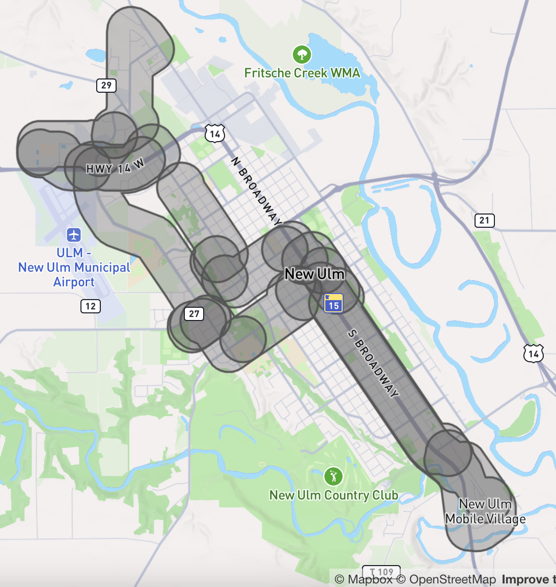

# デマンド レスポンシブ サービス

GTFS Flex は、2024 年 3 月に GTFS 仕様に正式に採用された GTFS 拡張プロジェクトであり、デマンド レスポンシブ交通 (DRT) サービスの検出を容易にすることを目的としています。
デマンド レスポンシブ サービスには、世界の地域に基づいて異なる用語が存在することに注意してください。詳細については、[用語集](#glossary) を参照してください。

次の例は、Flex を使用してさまざまなデマンド レスポンシブ サービスのユース ケースをモデル化する方法を示しています。**次の例は、必ずしも機関のサービスを正確にまたは完全に表しているわけではないことに注意してください。**

## 単一ゾーン内のオンデマンド サービス

デマンド レスポンシブ サービスは特定のゾーン内で運用できるため、乗客はゾーン内の任意のポイント A で乗車を予約し、同じゾーン内の任意のポイント B で降車を予約できます。一例として、米国ミネソタ州の [Heartland Express Transit](https:) サービスが挙げられます。

 <sup>[Heartland Express のサンプル データセットをダウンロード](../../../assets/on-demand_services_within_a_single_zone.zip)</sup> 

### 旅行の定義

Heartland Express のサービス時間は次のとおりです。

- 平日:
 - 午前 8:00 ～ 午後 5:00- 午前 6:15 ～ 午後 5:45 (ニュー アルム ゾーンのみ)
- 日曜日: 午前 8:00 ～ 正午 (ニュー アルム ゾーンのみ)

ニュー アルム市ゾーンはブラウン郡ゾーン内に含まれます。 ["ゾーン重複制約"](#zone-overlap-constraint) の問題を回避するために、Heartland Express は 4 つの旅行で定義できます。

- 平日の午前 6:15 から午前 8:00 までの New Ulm ゾーンでのサービス。
- 平日の午前 8:00 から午後 5:00 までの郡全体のサービス。
- 平日の午後 5:00 から午後 5:45 までの New Ulm ゾーンでのサービス。
- 日曜日の午前 8:00 から午後 12:00 までの New Ulm ゾーンでのサービス。
 
[** trips.txt**](../../reference/#tripstxt)

 route_id | service_id | trip_id
--|--|-- 
74362 | c_67295_b_77497_d_31 | t_5374945_b_77497_tn_0
74362 | c_67295_b_77497_d_31 | t_5374946_b_77497_tn_0
74362 | c_67295_b_77497_d_31 | t_5374944_b_77497_tn_0
74362 | c_67295_b_77497_d_64 | t_5374947_b_77497_tn_0

`service_id = c_67295_b_77497_d_31` は平日を指し、`service_id = c_67295_b_77497_d_64` は日曜日を指します。

### ゾーンの定義 (GeoJSON ロケーション)

[locations.geojson](../../reference/#locationsgeojson) を使用して Heartland Express サービスの運用ゾーンを定義する場合、Brown County と New Ulm City に個別のゾーンを定義する必要があります。以下は、ブラウン郡のゾーンを定義する簡略化された GeoJSON です:
```json
{
 "type": "FeatureCollection",
 "機能": [
    {
      "id": "area_708",
      "type": "Feature",
      "geometry": {
       "type": "Polygon",
     # 簡略化されており、ここでは 3 つの座標のみを示しています。
       "coordinates": [
          [
            [
             -94.7805702,
             44.4560958
           ],
            [
          -94.7805608,
             44.4559928
           ],
            [
          -94.7805218,
             44.4559649
           ]
        ]
     ]
      },
      "properties": {}
    }
]
```

### 予約ルールの定義

Heartland Express サービスすべてに適用される予約ルールは次のとおりです:

- 乗車リクエストは、平日の午前 8 時から午後 3 時の間に行う必要があります。
- 乗車は、乗車日の 1 営業日前までにリクエストする必要があります。
- 乗車リクエストは、最大 14 日前まで行うことができます。

`booking_type = 2` を使用すると、サービスには前日までの予約が必要であることを示します。 `prior_notice_last_day = 1` および `prior_notice_start_day = 14` は、このサービスを 14 日前から前日まで予約できることを示します。

[** booking_rules.txt**](../../reference/#booking_rulestxt)

booking_rule_id | booking_type | prior_notice_start_day | prior_notice_start_time | prior_notice_last_day | prior_notice_last_time | message | phone_number | info_url
--|--|--|--|--|--|--|--|--|--
booking_route_74362 | 2 | 14 | 8:00:00 | 1 | 15:00:00 | Brown County Heartland Express は、オンデマンドのドアツードアの交通手段を提供します。乗車をリクエストするには、旅行の少なくとも 1 営業日前の午後 3 時までに 1-507-359-2717 または 1-800-707-2717 に電話してください。 | (507) 359-2717 | https://www.co.brown.mn.us/heartland-express-transit###停車時刻の定義 

運行時間は、 `start_pickup_drop_off_window`フィールドと`end_pickup_drop_off_window`フィールドを使用して定義されます。同じゾーン内を移動するには、 stop_times.txtに同じ`location_id`つ` 2 つのレコードが必要です。

- `pickup_type = 2` および `drop_off_type = 1` の最初のレコードは、ゾーン内で予約のピックアップが許可されていることを示します。
- `pickup_type = 1` および `drop_off_type = 2` の 2 番目のレコードは、ゾーン内で予約のドロップオフが許可されていることを示します。
 
[** stop_times.txt**](../../reference/#stop_timestxt)

 trip_id | location_id | stop_sequence | start_pickup_drop_off_window | end_pickup_drop_off_window | pickup_type | drop_off_type | pickup_booking_rule_id | drop_off_booking_rule_id
--|--|--|--|--|--|--|--
t_5374944_b_77497_tn_0 | area_715 | 1 | 06:15:00 | 08:00:00 | 2 | 1 | booking_route_74362 | booking_route_74362
t_5374944_b_77497_tn_0 | area_715 | 2 | 06:15:00 | 08:00:00 | 1 | 2 | booking_route_74362 | booking_route_74362
t_5374945_b_77497_tn_0 | area_708 | 1 | 08:00:00 | 17:00:00 | 2 | 1 | booking_route_74362 | booking_route_74362
t_5374945_b_77497_tn_0 | area_708 | 2 | 08:00:00 | 17:00:00 | 1 | 2 | booking_route_74362 | booking_route_74362
t_5374946_b_77497_tn_0 | area_715 | 1 | 17:00:00 | 17:45:00 | 2 | 1 | booking_route_74362 | booking_route_74362
t_5374946_b_77497_tn_0 | area_715 | 2 | 17:00:00 | 17:45:00 | 1 | 2 | booking_route_74362 | booking_route_74362
t_5374947_b_77497_tn_0 | area_715 | 1 | 08:00:00 | 12:00:00 | 2 | 1 | booking_route_74362 | booking_route_74362
t_5374947_b_77497_tn_0 | area_715 | 2 | 08:00:00 | 12:45:00 | 1 | 2 | booking_route_74362 | booking_route_74362

`area_715` はニュー アルム シティ ゾーンを指し、`area_708` はブラウン カウンティ ゾーンを指します。 

## 複数のゾーンにまたがるオンデマンド サービス

一部のデマンド対応サービスは複数の異なるゾーンにまたがって運営されており、乗客は 1 つのエリア内の任意の場所 A で乗車を予約し、別のエリア内の任意の場所で降車を予約できます。たとえば、[Minnesota River Valley Transit](https:) は、Saint Peter 市と Kasota 市の間でオンデマンド サービスを提供しています。

 <sup>[River Valley Transit のサンプル データセットをダウンロード](../../../assets/on-demand_services_between_multiple_zones(r).zip)</sup> 

### 旅行の定義

前の例と同様に、サービス時間は日によって異なるため、平日と土曜日で旅行を個別に定義する必要があります。

[** trips.txt**](../../reference/#tripstxt)

 route_id | service_id | trip_id
--|--|-- 
74375 | 平日 | t_5298036_b_77503_tn_0 
74375 | 土曜日 | t_5298041_b_77503_tn_0 

(前の例と同じように、[booking_rules.txt](../../reference/#booking_rulestxt) と [locations.geojson](../../reference/#locationsgeojson) を使用して予約ルールとゾーンを定義します)

###停車時刻を定義します 

次のデータは、乗車は 1 つのゾーンでのみ許可され、降車は別のゾーンでのみ許可されていることを示しています。同じゾーンでの乗車と降車は許可されません。

[** stop_times.txt**](../../reference/#stop_timestxt)

 trip_id | location_id | stop_sequence | start_pickup_drop_off_window | end_pickup_drop_off_window | pickup_type | drop_off_type | pickup_booking_rule_id | drop_off_booking_rule_id
--|--|--|--|--|--|--|--|--
t_5298036_b_77503_tn_0 | area_713 | 1 | 06:30:00 | 20:00:00 | 2 | 1 | booking_route_74375 | booking_route_74375
t_5298036_b_77503_tn_0 | area_714 | 2 | 06:30:00 | 20:00:00 | 1 | 2 | booking_route_74375 | booking_route_74375
t_5298041_b_77503_tn_0 | area_713 | 1 | 09:00:00 | 19:00:00 | 2 | 1 | booking_route_74375 | booking_route_74375
t_5298041_b_77503_tn_0 | area_714 | 2 | 09:00:00 | 19:00:00 | 1 | 2 | booking_route_74375 | booking_route_74375## 特定の場所で乗客の乗降が必要なオンデマンド サービス

特定のデマンド対応サービスでは、乗客はゾーン内の任意の場所での乗降を指定できません。代わりに、乗客は特定の指定停留所 (集合場所/仮想停留所) での乗降のみを予約できます。一例として、ドイツのアンガーミュンデとガルツの [RufBus サービス](https:) が挙げられます。

### 旅行の定義

ルート 476 は、アンガーミュンデ地域の各停留所間でオンデマンド サービスを提供しています。2 つのサービス (平日用と週末用) を運行しており、それぞれに 1 つのtrip_idが関連付けられています。

[** trips.txt**](../../reference/#tripstxt)

 route_id | service_id | trip_id
--|--|-- 
476 | on_demand_weekdays | 476_weekdays 
476 | on_demand_weekends | 476_weekends### ロケーション グループを定義する

乗客は各停留所間でサービスを予約できるため、 stop_times.txtですべての停留所間の組み合わせを定義しなくても済むように、 location_groups.txtとlocation_group_stops.txtを使用してこれらの停留所をロケーション グループとして定義するのが適切な方法です。

[** location_groups.txt**](../../reference/#location_groupstxt)

 location_group_id | location_group_name
--|-- 
476_stops | RufBus 476 がエリア内を移動するときに使用します

[** location_group_stops.txt**](../../reference/#location_group_stopstxt)

 location_group_id | stop_id
--|-- 
476_stops | de:12073:900340004::1
476_stops | de:12073:900340004::2
476_stops | de:12073:900340004::3
476_stops | de:12073:900340004::4
476_stops | de:12073:900340100::1
476_stops | de:12073:900340100::2
476_stops |...

### 予約ルールを定義する

476 ルートのサービスでは、少なくとも 1 時間前までに予約する必要があります。`booking_type = 1` を使用すると、事前の通知により当日までの予約がサービスに必要になります。 `prior_notice_duration_min = 60` は、少なくとも 60 分前に予約する必要があることを意味します。

平日の予約と週末の予約には若干の違いがあるため、平日のサービスと休日のサービスに別々の予約ルールを定義できます。詳細は`message`フィールドに入力できます。情報と予約ページのリンクは`info_url`フィールドと`booking_url`フィールドに入力できます。

[** booking_rules.txt**](../../reference/#booking_rulestxt)

booking_rule_id | booking_type | prior_notice_duration_min | message | phone_number | info_url | booking_url
--|--|--|--|--|--|--|--
平日のバスの運行時間 | 1 | 60 | 登録してください。 60 分 vorher erforderlich、Anruf zwischen 08:00 と 24:00 möglich、オンラインでの注文 | +49 3332 442 755 | https://uvg-online.com/rufbus-angermuende/| https://uvg.tdimo.net/bapp/#/astBuchungenView
flächenrufbus_angermünde_weekends | 1 | 60 | 1€ Komfortzuschlag プロ人;アンメルドゥンの心。 60 分 vorher erforderlich、Anruf zwischen 08:00 と 24:00 möglich、オンラインでの注文 | +49 3332 442 755 | https://uvg-online.com/rufbus-angermuende/| https://uvg.tdimo.net/bapp/#/astBuchungenView###停車時刻の定義 

476 ルートは、平日は午後 5 時 30 分から午後 10 時まで、週末は午前 8 時から午後 10 時まで運行しています。運行時間は、`start_pickup_drop_off_window`フィールドと`end_pickup_drop_off_window`フィールドを使用して定義されます。同じ場所グループ内を移動するには、 stop_times.txtに同じ`location_group_id`つ` 2 つのレコードが必要です。

 - `pickup_type = 2 ` および `drop_off_type = 1` の最初のレコードは、場所グループで予約のピックアップが許可されていることを示します。
 - `pickup_type = 1` および `drop_off_type = 2 ` の 2 番目のレコードは、場所グループで予約のドロップオフが許可されていることを示します。

[** stop_times.txt**](../../reference/#stop_timestxt)

 trip_id | location_group_id | stop_sequence | start_pickup_drop_off_window | end_pickup_drop_off_window | pickup_type | drop_off_type | pickup_booking_rule_id | drop_off_booking_rule_id
--|--|--|--|--|--|--|--|--|--
476_weekdays | 476_stops | 1 | 17:30:00 | 22:00:00 | 2 | 1 | flächenrufbus_angermünde_weekdays | flächenrufbus_angermünde_weekdays
476_weekdays | 476_stops | 2 | 17:30:00 | 22:00:00 | 1 | 2 | flächenrufbus_angermünde_weekdays | flächenrufbus_angermünde_weekdays
476_weekends | 476_stops | 1 | 08:00:00 | 22:00:00 | 2 | 1 | flächenrufbus-angermünde_weekdays | flächenrufbus_angermünde_weekends
476_weekends | 476_stops | 2 | 08:00:00 | 22:00:00 | 1 | 2 | flächenrufbus-angermünde_weekdays | flächenrufbus-angermünde_weekends## ルート変更

`ルート変更`とは、車両が一定の停車順序で固定ルートをたどりますが、停車場所間で乗客を乗せたり降ろしたりするためにこのルートから変更できる柔軟性があるサービスを指します。通常、変更はサービスの定時性を維持するために制限されており、変更された乗車および降車には事前の予約が必要です。 

この例では、ニューウルム市の [Hermann Express](https://www.newulmmn.gov/553/Hermann-Express-City-Bus-Service) サービスにより、ユーザーは固定の停留所でのみ乗車でき、これらの停留所間の特定の逸脱エリア内の任意の地点で降車できます。

**以下の例は簡略化されています。詳細については、[Hermann Express サンプル データセット](../../../assets/deviated _drop-off _route.zip)をダウンロードしてください。**

### 旅行の定義

このタイプのサービスには、一連の固定の停留所と固定のスケジュールが含まれるため、旅行の定義は通常の固定ルートのバス サービスと同様です。関連するすべてのサービス期間を通じて各ルートで提供される旅行を定義する必要があります。

[** trips.txt**](../../reference/#tripstxt)

 route_id | service_id | trip_id | share_id
--|--|--|-- 
74513 | c_67295_b_77497_d_31 | t_5374704_b_77497_tn_0 | p_1426044
74513 | c_67295_b_77497_d_31 | t_5374699_b_77497_tn_0 | p_1426044
74513 | c_67295_b_77497_d_31 | t_5374698_b_77497_tn_0 | p_1426044
74513 | c_67295_b_77497_d_31 | t_5374697_b_77497_tn_0 | p_1426044
...|...|...|...

### ゾーンの定義 (GeoJSON ロケーション)

[locations.geojson](../../reference/#locationsgeojson) を使用して、ルートを逸脱するゾーンを定義します。通常、逸脱はサービスをスケジュールどおりに維持するために制限されます。したがって、車両が移動すると、各固定停留所間の逸脱エリアがそれに応じて変化する可能性があります。ルート逸脱のエリアは、次の画像のようになります:

<div class="flex-photos"> 
    
</div> 

###停車時刻を定義する 

固定の停車地の場合、通常のバス路線と同様の方法で、 `arrival_time`、 `departure_time`、 `stop_id`などのフィールドを定義します。固定の停車地間で、逸脱が許可されるゾーンを定義します。`pickup_type = 1` および `drop_off_type = 3` は、逸脱した乗車が許可されていないこと (乗車を固定の停車地のみに制限) を示し、逸脱ゾーンで降ろすには乗客が運転手と調整する必要があります。

[** stop_times.txt**](../../reference/#stop_timestxt)

 trip_id | arrive_time | department_id | stop_id | location_id | stop_sequence | start_pickup_drop_off_window | end_pickup_drop_off_window | pickup_type | drop_off_type | shape_dist_traveled | pickup_booking_rule_id | drop_off_booking_rule_id
--|--|--|--|--|--|--|--|--|--|--|--|--
t_5374696_b_77497_tn_0 | 08:00:00 | 08:00:00 | 4149546 | | 1 | | | | | 0 | | 
t_5374696_b_77497_tn_0 | | | | radius_300_s_4149546_s_4149547 | 2 | 08:00:00 | 8:02:22 | 1 | 3 | | booking_route_74513 | booking_route_74513
t_5374696_b_77497_tn_0 | 08:02:22 | 08:02:22 | 4149547 | | 3 | | | | | 1221.627114 | | 
t_5374696_b_77497_tn_0 | | | | radius_300_s_4149546_s_4149548 | 4 | 08:02:22 | 8:03:00 | 1 | 3 | | booking_route_74513 | booking_route_74513
t_5374696_b_77497_tn_0 | 08:03:22 | 08:03:22 | 4149548 | | 5 | | | | | 1548.216356 | | 
t_5374696_b_77497_tn_0 | | | | radius_300_s_4149546_s_4149549 | 6 | 08:03:22 | 8:05:00 | 1 | 3 | | booking_route_74513 | booking_route_74513
...|...|...|...|...|...|...|...|...|...|...|...|...
t_5374696_b_77497_tn_0 | 08:50:00 | 08:50:00 | 4210601 | | 35 | | | | | 23429.19558 | | 
t_5374696_b_77497_tn_0 | 08:56:00 | 08:56:00 | 4149564 | | 36 | | | | | 25320.8471 | | 

## ルーティング動作

### ピックアップ/ドロップオフ ウィンドウによる中間停車時刻レコードの無視

出発地と目的地の間のルーティングまたは移動時間を提供する場合、データ コンシューマーは、 `start_pickup_drop_off_window`および`end_pickup_drop_off_window`が定義されている中間stop_times.txtレコードを無視する必要があります。例:

 trip_id | location_id | stop_sequence | pickup_type | drop_off_type | start_pickup_drop_off_window | end_pickup_drop_off_window
--|--|--|--|--|--|--
tripA | Zone1 | 1 | 2 | 1 | 08:00:00 | 18:00:00
tripA | Zone2 | 2 | 1 | 2 | 08:00:00 | 14:00:00
tripA | Zone3 | 3 | 1 | 2 | 10:00:00 | 18:00:00

Zone1 から Zone3 への旅行のルートや移動時間を指定する場合、消費者は Zone2 を考慮に入れるべきではありません。

### ゾーン重複制約

同じ`trip_id`つ` 2 つ以上のstop_times.txtレコード間で、 locations.geojson `id`ジオメトリ、 `start/end_pickup_drop_off_window`時間、および`pickup_type`または`drop_off_type`が同時に重複することは禁止されています。

例:
(`northportland` は `portland` 内のゾーンを指します)

**禁止**

[** stop_times.txt**](../../reference/#stop_timestxt)

 trip_id | location_id | stop_sequence | pickup_type | drop_off_type | start_pickup_drop_off_window | end_pickup_drop_off_window
--|--|--|--|--|--|--
tripA | portland | 1 | 2 | 1 | 08:00:00 | 12:00:00
tripA | northportland | 2 | 2 | 1 | 10:00:00 | 14:00:00
tripA | vancouver | 3 | 1 | 2 | 10:00:00 | 14:00:00

**許可**

[** stop_times.txt**](../../reference/#stop_timestxt)

 trip_id | location_id | stop_sequence | pickup_type | drop_off_type | start_pickup_drop_off_window | end_pickup_drop_off_window
--|--|--|--|--|--|--
tripA | ポートランド | 1 | 2 | 1 | 08:00:00 | 12:00:00
tripA | ノースポートランド | 2 | 2 | 1 | 12:00:00 | 14:00:00
tripA | バンクーバー | 3 | 1 | 2 | 10:00:00 | 14:00:00

または

[** stop_times.txt**](../../reference/#stop_timestxt)

 trip_id | location_id | stop_sequence | pickup_type | drop_off_type | start_pickup_drop_off_window | end_pickup_drop_off_window
--|--|--|--|--|--|--|--
tripA | ポートランド | 1 | 2 | 1 | 08:00:00 | 12:00:00
tripA | northportland | 2 | 1 | 2 | 10:00:00 | 14:00:00
tripA | vancouver | 3 | 1 | 2 | 10:00:00 | 14:00:00

または

[** stop_times.txt**](../../reference/#stop_timestxt)

 trip_id | location_id | stop_sequence | pickup_type | drop_off_type | start_pickup_drop_off_window | end_pickup_drop_off_window
--|--|--|--|--|--|--
tripA | portland | 1 | 2 | 1 | 08:00:00 | 12:00:00
tripA | gresham | 2 | 2 | 1 | 10:00:00 | 14:00:00
tripA | vancouver | 3 | 1 | 2 | 10:00:00 | 14:00:00## 用語集

📲 Dial-a-ride は、ヨーロッパ全土で使用されている複数の用語のバリエーションです。

🇨🇭 スイスでは、Rufbus/On-call bus という用語に該当します。[PostAuto による PubliCar システム](https://www.postauto.ch/en/timetable-and-network/publicar) も利用できます。この提案では、PubliCar アプリとサービスは、ユーザーが好む旅行プランナー アプリで見つけられるようになります。 

🇦🇹 オーストリアでは、ダイヤル・ア・ライドは Rufbus とも呼ばれ、Bedarfsverkehr (Demand Responsive Transport) と Mikro-ÖV (Microtransit) のより大きな傘下にあります。
    
- [bedarfsverkehr.at](https://www.bedarfsverkehr.at/)
- [Wiener Linien](https://www.wienerlinien.at/documents/843721/4770179/Anleitung_Rufbus_359531.pdf/df430b95-9dd4-0d13-ffdf-bdace15932a8?t=1614165175643)
- Rufbus (英語: dial-a-bus、以前は Anruf-Sammel-Taxi または ASTAX call-collect-taxi)
-現在の GTFS 実装 [年間サービスアラートとして](https://www.google.com/maps/dir/S%C3%BC%C3%9Fenbrunner+Pl.,+1220+Wien,+Austria/2201+Gerasdorf,+Austria/@48.2867283,16.4429959,13z/am=t/data=!4m15!4m14!1m5!1m1!1s0x47 6d0393b15bc6d9:0x517f69839511fb31!2m2!1d16.4958186!2d48.2772635!1m5!1m1!1s0x476d0488292e6f61:0xeee80d3d2bb6b1f5!2m2!1d16.4690073!2d48.2962096!3e3!5i1?エントリ=ttu )

🇩🇰 デンマークでは、NT/midttrafik/sydtrafik/FYNBUS/movia (https://flextur.dk/)
    
- flextur (英語: flex trip)
- 以前は flextrafik (英語: flex transit)

🇫🇷 ⚠️ フランスでは、パラトランジット サービスに対して TDA (Transport à la Demande) および PMR (Personnes à Mobilité Réduite) という用語が使用されます

- [Reseau Mistral](https://www.reseaumistral.com/services/service-appel-bus) 
- Appel bus (英語: call bus)

🇩🇪 ドイツでは、On-Demand-Angebot、Flexible Fahrt、AST- [BVG](https://www.bvg.de/de/verbindungen/bvg-muva/flexible-fahrt)
- ブランド：Muva- On-Demand-Angebot（英語：on-demand-service）
- Flexible Fahrt（英語：flexible trip）
- その他の地域
- Anruf-sammel-taxi または AST（英語：call-collect-taxi）

🇬🇧 英国には、次のサービスがあります：

- [go2 Sevenoaks](https:)
- オンデマンド サービス

用語は国境によって異なりますが、一般的に、ダイヤル ア ライドは、乗客からオペレーターへの何らかの連絡を必要とする、需要に応じたサービスであると想定できます。 
<hr> 
