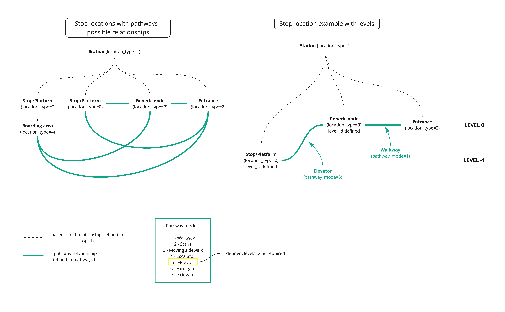
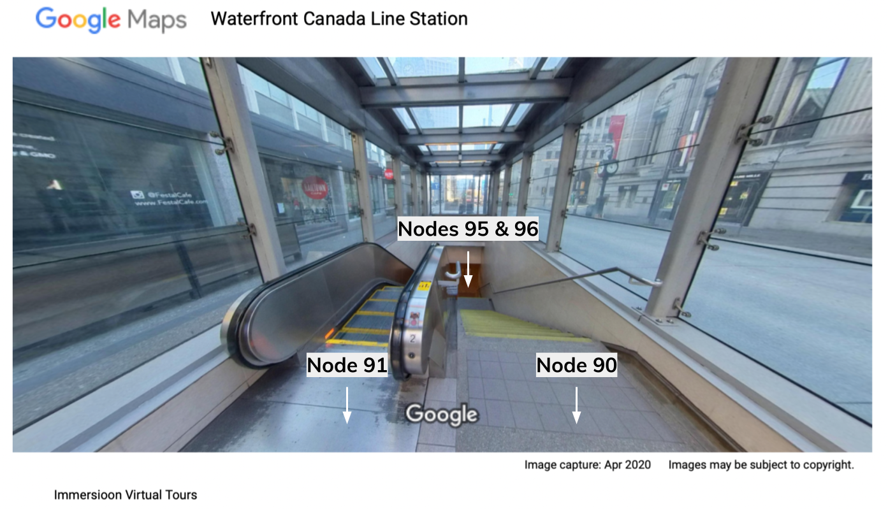

# 経路と物理的なアクセシビリティ

## アクセシビリティ情報を表示する理由

**人口の大部分に影響:** 世界保健機関は、[世界中の 16% の人が障害を抱えている](https://www.who.int/news-room/fact-sheets/detail/disability-and-health)と推定しており、障害のある人は「障害のない人よりもアクセスできない、または手頃でない交通手段を 15 倍も利用しにくい」としています。また、障害のある人は、医療やサービスへのアクセスが制限されることもあって、[新しい健康状態になる割合が高い](https://www.who.int/publications/i/item/9789240063600)です。

**障害者にとって重要:** 乗客は、交通手段の選択肢に関する最新かつ正確な情報を必要としています。多くの機関は、乗客が旅行を計画し、選択肢を理解する上で重要なルート、スケジュール、停留所の場所情報を表すために、すでに General Transit Feed Specific (GTFS) を使用しています。アクセシビリティを必要とする乗客にとって、停車地や車両のアクセシビリティを知ることは、場所を知ることと同じくらい重要です。これらの乗客は、どこかで立ち往生したり、最終停車地に到着できないことに気付くのが遅すぎたりしないように、旅行のあらゆる部分について知っておく必要があります。

**法律で定められている場合もあります:** 場所によっては、地方または国の法律で、障害のある人に平等なアクセスと機会を提供することが義務付けられている場合があります。以下に、検討したい情報源をいくつか示します。

* **米国:** [Americans and Disabilities Act (ADA)](https://www.ada.gov/topics/intro-to-ada/#public-transit) および 1973 年リハビリテーション法の [Section 504](https://www.dol.gov/agencies/oasam/centers-offices/civil-rights-center/statutes/section-504-rehabilitation-act-of-1973)
* **日本:** 国土交通省の高齢者や障害者の移動の容易さおよびアクセシビリティの促進に関する法律 (“[バリアフリー法](https://www.mlit.go.jp/sogoseisaku/barrierfree/index.html)”)
* **欧州連合:** [Employment, Social Affairs & Inclusion](https://ec.europa.eu/social/main.jsp?catId=1485&langId=en)

## アクセシビリティ チェックリスト

以下は、データにアクセシビリティ情報を追加するために必要な手順です。次のセクションでは、各手順についてさらに詳しく説明します。

* ステップ 1: `stops.txt`に車椅子のアクセシビリティ情報を追加する 
* ステップ 2: `trips.txt`に車椅子のアクセシビリティ情報を追加する 
* ステップ 3: `stops.txt`に音声ナビゲーション情報を追加する 
* ステップ 4: GTFS 構内通路を使用して交通機関の駅に関する物理的なアクセシビリティ情報を追加する 

## GTFS に車椅子のアクセシビリティを追加する

GTFS の構造は一連の .txt ファイルとして既によく知られているかもしれません。車椅子のアクセシビリティは、`stops.txt` の `wheelchair_boarding` と `trips.txt` の `wheelchair_accessible` の 2 つのフィールドを更新することで表示できます。

**stops.txt の車椅子のアクセシビリティ**
`stops.txt` の `wheelchair_boarding` フィールドを使用すると、指定した場所から車椅子で乗車できるかどうかを示すことができます。

[参照:stops.txt](../../reference/#stopstxt)

このフィールドが空のままの場合、アクセシビリティ情報は表示されません。これにより、乗客はアクセシビリティについて確信が持てず、車椅子で乗車できないのか、それとも情報が不足しているのか判断できなくなります。車椅子で乗車できない場合でも、その情報を入力して乗客に明確にし、正確な情報で旅行を計画できるようにするのが最善です。

**trips.txt の車椅子アクセシビリティ**
`trips.txt` のフィールド `wheelchair_accessible` を使用すると、特定の旅行に使用されている車両が車椅子に対応しているかどうかを示すことができます。

[参照: trips.txt](../../reference/#tripstxt)

`wheelchair_boarding` と同様に、このフィールドが空のままの場合、アクセシビリティ情報は表示されません。車両が車椅子に対応していない場合でも、乗客に明確に伝え、正確な情報で旅行を計画できるように、その情報を入力することをお勧めします。

## オーディオ ナビゲーション補助の追加

テキスト読み上げは、GTFS のアクセシビリティを向上させるもう 1 つの方法です。正確なテキスト読み上げ情報により、支援技術を使用してテキストを読み上げる乗客が正しい情報を得ることができます。この情報は、`stops.txt` の `tts_stop_name` を各 `stop_name` に対応するように更新することで、GTFS に含めることができます。 GTFS 内の各停留所には、停留所を音声で綴り、正しく発音できるようにするテキスト読み上げの曖昧さ回避機能が必要です。

[例: テキスト読み上げ](../../examples/text-to-speech)

`tts_stop_name` は現在、GTFS 仕様内で公式に採用されている唯一のテキスト読み上げフィールドですが、他のフィールドも議論されており、追加される可能性があります。これには、`tts_agency_name`、`tts_route_short_name`、`tts_route_long_name`、`tts_trip_headsign`、`tts_trip_short_name`、および `tts_stop_headsign` が含まれます。

乗客は、この情報を活用するために、テキスト読み上げ機能をサポートするアプリを使用する必要があります。 [NaviLensGo](https://www.navilens.com/en/) などの一部のアプリは、視覚障害のある乗客が駅をナビゲートして適切な車両を見つけられるように特別に設計されています。

## 駅に関する物理的なアクセシビリティ情報の追加

GTFS-Pathways は、交通機関の駅の詳細を表す GTFS のコンポーネントです。これにより、乗客は交通機関の駅で必要な乗り換えができるかどうかを把握できます。

GTFS-Pathways は、`pathways.txt` および `levels.txt` ファイルを追加するほか、`stops.txt` に `location_type` フィールドを追加して、`pathways.txt` で説明されている情報をリンクします。



### 駅の出入口の位置を記述する

GTFS を使用すると、出入口と駅内部の情報を使用して駅を正確に記述できます。この例では、バンクーバーのダウンタウンにあるウォーターフロント駅の一部について説明します。この駅は市内のスカイトレイン ネットワークの一部であり、カナダ ライン、エクスポ ライン、シーバス、ウェスト コースト エクスプレスが運行しています。乗客は地上階の 3 つの出入口から駅に出入りできます。駅の残りの部分は地下にあり、運賃確認用のコンコース階とプラットフォームのある下層階があります。 

まず、駅の位置と入口は [stops.txt](../../reference/#stopstxt) で定義されています:

[**stops.txt**](../../reference/#stopstxt)

```
stop_id,stop_name,stop_lat,stop_lon,location_type,parent_station,wheelchair_boarding
12034,Waterfront Station,49.285687,-123.111773,1,,
90,Waterfront Station Stairs Entrance on Granville,49.285054,-123.114375,2,12034,2
91,Waterfront Station Escalator Entrance on Granville,49.285061,-123.114395,2,12034,2
92,Waterfront Station Elevator Entrance on Granville,49.285257,-123.114163,2,12034,1
93,Waterfront Station Entrance on Cordova,49.285607,-123.111993,2,12034,1
94,Waterfront Station Entrance on Howe,49.286898,-123.113367,2,12034,2
```

上記のファイルでは、最初のレコードは駅の場所に関するものであるため、 `location_type` は `1` に設定されています。他の 5 つは、3 つの駅入口に関するものです (Granville 入口には、階段、エスカレーター、エレベーターの 3 つの入口があるため、5 つのレコードが必要です)。これらの 5 つのレコードは、 `location_type` が `2` に設定されているため、入口として定義されています。

さらに、ウォーターフロント駅の `stop_id` は、入口を駅に関連付けるために、入口の `parent_station` の下にリストされています。アクセス可能な入口の `wheelchair_boarding` は `1` に設定され、アクセス不可能な入口は `2` に設定されています。

### 階段とエスカレーターについて説明します

グランビル ストリートのウォーターフロント駅の入口にはエレベーター、エスカレーター、階段があり、入口は上記の [stops.txt](../../reference/#stopstxt) のノードとして定義されています。入口を駅の内部セクションに接続するには、[stops.txt](../../reference/#stopstxt) のウォーターフロント駅の `parent_station` の下に追加のノードを作成する必要があります。以下の [stops.txt](../../reference/#stopstxt) ファイルでは、階段とエスカレーターの下部に対応する汎用ノード (`location_type 3`) が定義されています。

[**stops.txt**](../../reference/#stopstxt)

```
stop_id,stop_name,stop_lat,stop_lon,location_type,parent_station,wheelchair_boarding
...
95,Waterfront Station Granville Stair Landing, 49.285169,-123.114198,3,12034,
96,Waterfront Station Granville Escalator Landing,49.285183,-123.114222,3,12034,
```

 

次に、ファイル [pathways.txt](../../reference/#pathwaystxt) を使用してノードをリンクし、構内通路を作成します。最初のレコードは、階段の上部と下部に関連するノードをリンクします。 `pathway_mode` は階段を示すために `2` に設定され、最後のフィールドは、乗客が階段を両方向 (上りと下り) に移動できることを記述します。 

同様に、2 番目のレコードはエスカレーターを記述します (`pathway_mode` は `4` に設定)。エスカレーターは一方向にしか移動できないため、フィールド `is_bidirectional` は `0` に設定され、したがってエスカレーターはノード `96` から `91` (上方向) への一方向に移動します。

[**pathways.txt**](../../reference/#pathwaystxt)

```
pathway_id,from_stop_id,to_stop_id_pathway_mode,is_bidirectional
stairsA,90,95,2,1
escalatorA,96,91,4,0
```

### エレベーターと構内通路について説明する 

Granville street のエレベーターは、エスカレーターと階段が終了するコンコース レベルの経路に乗客を運びます。地上レベルのエレベーターは、上記の駅の入口として既に定義されています (`stop_id` `92`)。したがって、コンコース レベルのエレベーターのドアも定義する必要があります。 

また、下図に示すように、グランビル ストリートの階段、エスカレーター、エレベーターの下部とメイン駅舎を結ぶ地下通路があります。そのため、通路セクションを定義するために 2 つの追加ノードが作成されます。

 

[**stops.txt**](../../reference/#stopstxt)

```
stop_id,stop_name,stop_lat,stop_lon,location_type,parent_station,wheelchair_boarding
…
97,Underground walkway turn,49.286253,-123.112660,3,12034,
98,Underground walkway end,49.286106,-123.112428,3,12034,
99,Elevator_concourse,49.285257,-123.114163,3,12034,
```

 

最後に、以下のファイル [pathways.txt](../../reference/#pathwaystxt) に示すように、ノードが接続されて地下通路が定義されます。

[**pathways.txt**](../../reference/#pathwaystxt)

```
pathway_id,from_stop_id,to_stop_id_pathway_mode,is_bidirectional
underground_walkway1,99,96,1,1
underground_walkway2,96,95,1,1
underground_walkway3,95,97,1,1
underground_walkway4,97,98,1,1
```

## GTFS-Pathways への今後の追加

GTFS-Pathways のコア仕様は GTFS に完全に統合されていますが、追加のアクセシビリティ情報をモデル化して乗客に役立つ可能性があると認識されています。これには、音声合成による指示、車椅子の支援情報、機器の故障報告、計画または予定されている入口または出口の閉鎖、エレベーターとエスカレーターの停止などの情報が含まれます。残りの部分の詳細については、[このドキュメント](http://bit.ly/gtfs-pathways) を参照してください。