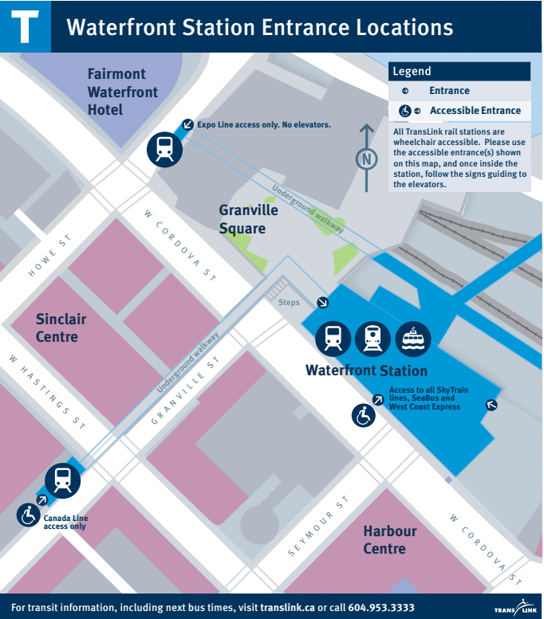
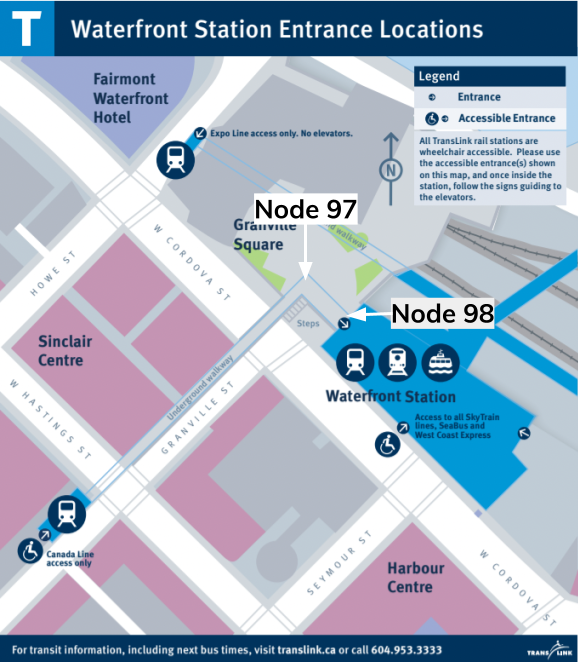

<a class="pencil-link" href="https://github.com/MobilityData/gtfs.org/edit/main/docs/schedule/examples/pathways.md" title="Edit this page" target="_blank">
    <svg class="pencil" xmlns="http://www.w3.org/2000/svg" viewBox="0 0 24 24"><path d="M10 20H6V4h7v5h5v3.1l2-2V8l-6-6H6c-1.1 0-2 .9-2 2v16c0 1.1.9 2 2 2h4v-2m10.2-7c.1 0 .3.1.4.2l1.3 1.3c.2.2.2.6 0 .8l-1 1-2.1-2.1 1-1c.1-.1.2-.2.4-.2m0 3.9L14.1 23H12v-2.1l6.1-6.1 2.1 2.1Z"></path></svg>
  </a>

# Pathways


<hr>

## Describe the location of station entrances and exits

With GTFS, it is possible to accurately describe stations using information on entrances and station interiors. This example describes sections of Waterfront station in downtown Vancouver. The station is part of the city’s Skytrain network and is served by the Canada Line, the Expo Line, the SeaBus, and the West Coast Express. Three street level entrances allow riders to enter and exit the station. The rest of the station is underground with a concourse level for fare validation and a lower level with platforms. 

First, the location of the station and its entrances are defined in [stops.txt](../../reference/#pathwaystxt):

[**stops.txt**](../../reference/#stopstxt)

```
stop_id,stop_name,stop_lat,stop_lon,location_type,parent_station,wheelchair_boarding
12034,Waterfront Station,49.285687,-123.111773,1,,
90,Waterfront Station Stairs Entrance on Granville,49.285054,-123.114375,2,12034,2
91,Waterfront Station Escalator Entrance on Granville,49.285061,-123.114395,2,12034,2
92,Waterfront Station Elevator Entrance on Granville,49.285257,-123.114163,2,12034,1
93,Waterfront Station Entrance on Cordova,49.285607,-123.111993,2,12034,1
94,Waterfront Station Entrance on Howe,49.286898,-123.113367,2,12034,2
```

In the file above, the first record pertains to the station location, hence, the `location_type` is set to `1`. The other five pertain to the three station entrances (five records are needed since the Granville entrance actually has three separate entrances, a stairway, an escalator, and an elevator). These five records are defined as entrances since the `location_type` is set to `2`.

Additionally, the `stop_id` for Waterfront Station is listed under `parent_station` for the entrances to associate them with the station. The accessible entrances have `wheelchair_boarding` set to `1` and the non-accessible ones are set to `2`. 

## Describe stairs and escalators

The entrance to Waterfront Station at Granville street has an elevator, an escalator, and stairs, the entrances are defined as nodes above in [stops.txt](../../reference/#stopstxt). To connect the entrances to inner sections of the station, additional nodes have to be created in [stops.txt](../../reference/#stopstxt) under the `parent_station` of Waterfront Station. In the [stops.txt](../../reference/#stopstxt) file below, generic nodes (`location_type 3`) that correspond to the bottom of the staircase and escalator are defined.

[**stops.txt**](../../reference/#stopstxt)

```
stop_id,stop_name,stop_lat,stop_lon,location_type,parent_station,wheelchair_boarding
...
95,Waterfront Station Granville Stair Landing, 49.285169,-123.114198,3,12034,
96,Waterfront Station Granville Escalator Landing,49.285183,-123.114222,3,12034,
```


Next, the file [pathways.txt](../../reference/#pathwaystxt) is used to link nodes to create pathways, where the first record links the nodes pertaining to the top and bottom of the stairs. The `pathway_mode` is set to `2` to indicate stairs, and the last field describes that passengers can go both ways (up and down) on the stairs. 

Similarly, the second record describes the escalator (`pathway_mode` set to `4`). Since escalators can only move in one direction, the field `is_bidirectional` is set to `0`, hence the escalator moves one way, from node `96` to `91` (upwards).

[**pathways.txt**](../../reference/#pathwaystxt)

```
pathway_id,from_stop_id,to_stop_id_pathway_mode,is_bidirectional
stairsA,90,95,2,1
escalatorA,96,91,4,0
```

## Describe elevators and pathways

The elevator at Granville street brings passengers to a pathway at the concourse level where the escalator and the stairs end. The elevator at the surface level is already defined as a station entrance above (`stop_id` `92`). Hence, the elevator door at the concourse level also needs to be defined. 

Additionally, as shown in the figure below, there is an underground walkway that connects the bottom of the stairs, escalator, and elevator at Granville street to the main station building. Therefore, two additional nodes are created to define the walkway sections.



[**stops.txt**](../../reference/#stopstxt)

```
stop_id,stop_name,stop_lat,stop_lon,location_type,parent_station,wheelchair_boarding
…
97,Underground walkway turn,49.286253,-123.112660,3,12034,
98,Underground walkway end,49.286106,-123.112428,3,12034,
99,Elevator_concourse,49.285257,-123.114163,3,12034,
```



Lastly, the nodes are connected together to define the underground pathway as shown in the file [pathways.txt](../../reference/#pathwaystxt) below:

[**pathways.txt**](../../reference/#pathwaystxt)

```
pathway_id,from_stop_id,to_stop_id_pathway_mode,is_bidirectional
underground_walkway1,99,96,1,1
underground_walkway2,96,95,1,1
underground_walkway3,95,97,1,1
underground_walkway4,97,98,1,1
```
